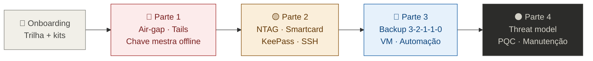

# Zero Trust Core Expert

[](https://github.com/VIPs-com/Zero-Trust-Core/releases/latest)
[](https://creativecommons.org/licenses/by-sa/4.0/)
[](https://github.com/VIPs-com/Zero-Trust-Core/commits/master)
[](https://github.com/VIPs-com/Zero-Trust-Core/issues)

Curso open-source em português para montar um ecossistema pessoal de segurança em camadas: **KeePassXC**, **VeraCrypt**, **NFC**, **OpenPGP em air-gap** e **SSH**, com backup **3-2-1-1-0** e operação disciplinada — sem depender de hardware proprietário caro, com controle total e responsabilidade sua.

## Jornada do curso



> Diagrama completo (fluxos A–E), cores e PDF: **[docs/DIAGRAMAS-VISUAIS.md](docs/DIAGRAMAS-VISUAIS.md)**

## Primeira vez aqui?

Leia o **[INICIE AQUI](docs/INICIE-AQUI.md)** — 8 minutos, mapa visual das trilhas, o que comprar e como começar sem se sobrecarregar.

Depois, o **[Manual de uso](docs/MANUAL-DE-USO.md)** — estrutura do repositório, trilha integrada com [OpenPGP-GPG do Zero ao Expert](https://github.com/VIPs-com/OpenPGP-GPG-do-Zero-ao-Expert#trilha-integrada-zero-trust-core-expert), o que cada parte do curso permite fazer e roteiro da primeira hora.

**Montar o ambiente (software + hardware + kits em R$)?** → **[docs/INVENTARIO-SOFTWARE-HARDWARE.md](docs/INVENTARIO-SOFTWARE-HARDWARE.md)**

**Ir além do curso (hardware alternativo, DIY, governança, automação)?** → **[docs/APOSTILA-GUIA-PRATICO.md](docs/APOSTILA-GUIA-PRATICO.md)** — guia prático em 9 capítulos + referência rápida por cenário (Capítulo 10)

**Instrutor — abertura de turma:** → **[docs/SLIDES-ABERTURA-TURMA.md](docs/SLIDES-ABERTURA-TURMA.md)** (VS Code, GitHub, Marp) · **[.marp.md](docs/SLIDES-ABERTURA-TURMA.marp.md)**

## Como estudar

Este repositório segue o mesmo modelo do curso [OpenPGP-GPG do Zero ao Expert](https://github.com/VIPs-com/OpenPGP-GPG-do-Zero-ao-Expert#trilha-integrada-zero-trust-core-expert): **um único arquivo Markdown** com todo o material didático.

Abra e estude:

**[🎓 Zero-Trust-Core-Expert - Versão 1.0.md](./🎓%20Zero-Trust-Core-Expert%20-%20Versão%201.0.md)** — no curso, use o **[índice clicável (§1)](./🎓%20Zero-Trust-Core-Expert%20-%20Versão%201.0.md#-índice-clicável-use-no-github--vs-code-preview)** para pular aos módulos.

Você pode clonar o repositório, baixar o ZIP ou copiar só esse `.md` — não é obrigatório usar Git para aprender.

**Auditoria v1.0.2:** [`docs/AUDITORIA-v1.0.1.md`](docs/AUDITORIA-v1.0.1.md) · **Sign-off 🔐:** [`docs/AUDITORIA-TECNICA-PRE-TURMA.md`](docs/AUDITORIA-TECNICA-PRE-TURMA.md) · **Equipe:** [`docs/CHECKLIST-PRE-TURMA-EQUIPE.md`](docs/CHECKLIST-PRE-TURMA-EQUIPE.md) · [issue #2](https://github.com/VIPs-com/Zero-Trust-Core/issues/2)

## Para quem é

- Quem já conhece ou está fazendo **[OpenPGP-GPG do Zero ao Expert](https://github.com/VIPs-com/OpenPGP-GPG-do-Zero-ao-Expert/blob/main/%F0%9F%8E%93%20OpenPGP-GPG%20do%20Zero%20ao%20Expert%20-%20Vers%C3%A3o%201.0.md#modulo-0-ztc)** e quer integrar cofres locais, tokens físicos, backup off-site e automação.
- Entusiastas de privacidade, desenvolvedores e administradores que buscam **soberania digital** com custo baixo e rigor operacional.

## O que você vai construir

Uma “fortaleza artesanal” em cinco camadas: cofre de senhas, fator físico (NTAG ou smartcard OpenPGP), identidade PGP com chave mestra offline, SSH via `gpg-agent` e resiliência com backups testados.

```
  [ Início · trilha Turbo ou Expert ]
              │
              ▼
  ┌───────────────────────┐
  │ Tails (air-gap)       │  ← master PGP offline
  │ master + subkeys      │
  └───────────┬───────────┘
              ▼
  ┌───────────────────────┐     ┌───────────────────────┐
  │ 2A Smartcard OpenPGP  │     │ 2B NTAG → keyfile     │
  │ PGP + SSH no token    │     │ KeePass (clonável)    │
  └───────────┬───────────┘     └───────────┬───────────┘
              └─────────────┬─────────────┘
                            ▼
              ┌───────────────────────┐
              │ KeePassXC + VeraCrypt │  ← cofre diário
              └───────────┬───────────┘
                            ▼
              ┌───────────────────────┐
              │ Backup 3-2-1-1-0      │  ← VM, HD, restore
              │ + scripts / health    │
              └───────────┬───────────┘
                            ▼
              ┌───────────────────────┐
              │ Uso diário + SSH      │
              └───────────┬───────────┘
                            ▼
              ┌───────────────────────┐
              │ Contingência          │  ← perda do cartão
              └───────────────────────┘
```

> **Aviso:** tags NFC simples (NTAG) não substituem um smartcard OpenPGP nem uma YubiKey. O curso explica quando usar cada um.

### Scripts: Turbo vs Expert

| Trilha | Pasta [`scripts/`](./scripts/) |
| --- | --- |
| **Turbo** (~R$ 50–265 · 8–12 h) | **Opcional** — cofre + NTAG com fluxo manual (COMANDOs 3.1.1 e 3.1.2). |
| **Expert** (~R$ 725–2.150 · 25–35 h) | **Parte do aprendizado** — instalar, rodar e **entender** `ztc-health.sh`, `ztc-rsync-offsite.sh` e `ztc-open-cofre.sh` nos Módulos **4.2** e **5**. |

Arquivos: [`ztc-health.sh`](./scripts/ztc-health.sh), [`ztc-rsync-offsite.sh`](./scripts/ztc-rsync-offsite.sh), [`ztc-open-cofre.sh`](./scripts/ztc-open-cofre.sh), [`ztc.conf.example`](./scripts/ztc.conf.example) · [`scripts/README.md`](./scripts/README.md)

## Metodologia

🔴 Obsoleto · 🟡 Funciona · 🟢 Padrão atual · 🔵 Expert · ⚫ Horizonte

**COMANDO** a comando, **checkpoints** entre partes, trilhas **Turbo** (2–3 semanas · ~8–12 h · kits ~R$ 50–265) e **Expert** (6–8 semanas · ~25–35 h · kits ~R$ 725–2.150).

## Status

✅ **Versão 1.0.2** — Curso completo + correções pós-auditoria (backup keyfile `age`, VeraCrypt CLI, mount NFC condicional). Pasta [`scripts/`](./scripts/) pública. Tags: `v1.0.1`, `v1.0.2` · link recíproco no [OpenPGP-GPG do Zero ao Expert](https://github.com/VIPs-com/OpenPGP-GPG-do-Zero-ao-Expert#trilha-integrada-zero-trust-core-expert).

**Adições pós-v1.0.2 (master):**
- **[Apêndice G](./🎓%20Zero-Trust-Core-Expert%20-%20Versão%201.0.md#apêndice-g--módulos-h-turbo-híbrido)** — Módulos H Turbo Híbrido (H1 QR · H2 metal · H3 Android · H4 iPhone · H5 servidor · H6 TOTP). Ative conforme o hardware que você já tem — custo extra R$0–50 por módulo.
- **[docs/APOSTILA-GUIA-PRATICO.md](docs/APOSTILA-GUIA-PRATICO.md)** — guia complementar estilo livro (9 capítulos): ranking Top 20 hardware keys, Frankenstein Key DIY (5 kits), protocolos avançados, cronograma manutenção, governança home lab, playbook de incidentes (5 cenários), cockpit Prometheus/Grafana + PowerShell/Rainmeter.

## Licença

Este projeto está licenciado sob **Creative Commons Attribution-ShareAlike 4.0 International** (**CC BY-SA 4.0**).

- Resumo humano: [creativecommons.org/licenses/by-sa/4.0](https://creativecommons.org/licenses/by-sa/4.0/)
- Texto legal completo: [creativecommons.org/licenses/by-sa/4.0/legalcode](https://creativecommons.org/licenses/by-sa/4.0/legalcode)
- Cópia no repositório: **[LICENSE](./LICENSE)** (Copyright © 2026 Projeto Colaborativo VIPs-com)

Você pode compartilhar e adaptar o material, inclusive comercialmente, desde que **credite a fonte** e **repasse a mesma licença** nas obras derivadas.

## Créditos

**VIPs-com** (Projeto Colaborativo)

**Pré-requisito recomendado (trilha Expert):** [OpenPGP-GPG do Zero ao Expert](https://github.com/VIPs-com/OpenPGP-GPG-do-Zero-ao-Expert#trilha-integrada-zero-trust-core-expert) — o README desse repositório aponta para este curso e para o [Manual de uso](./docs/MANUAL-DE-USO.md) na secção *Trilha integrada*.
