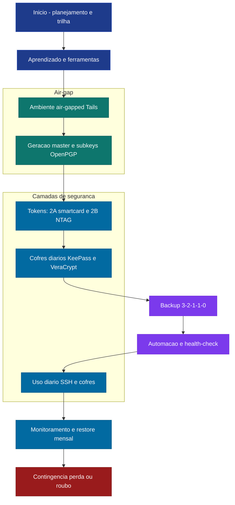
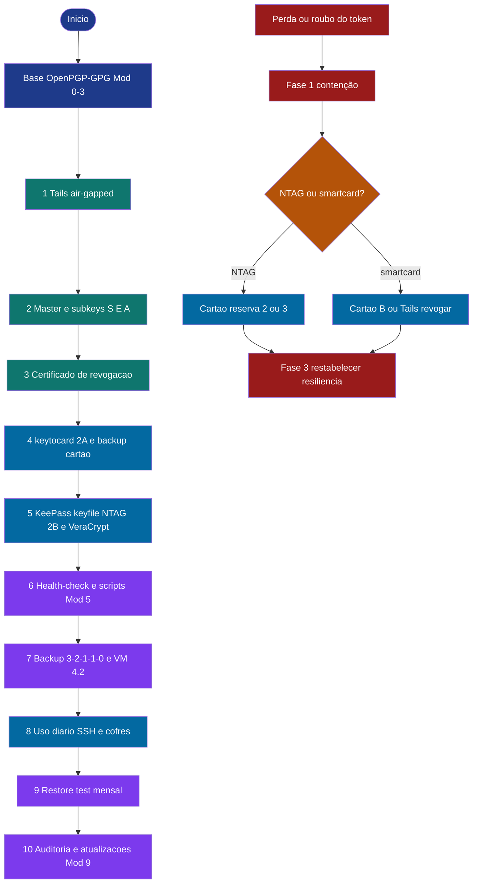
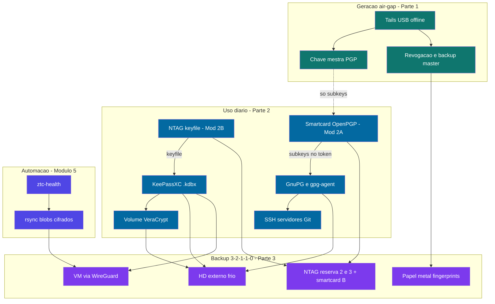
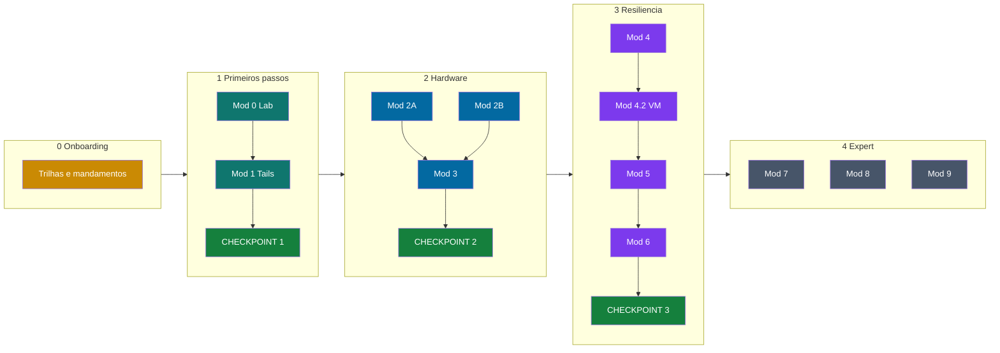
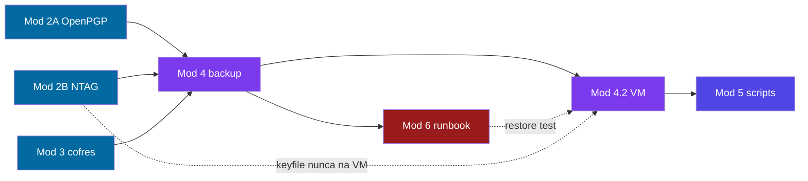
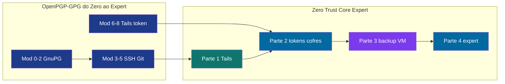

# 📊 Diagramas visuais — Zero Trust Core Expert

**Síntese para leitura, impressão ou PDF** · Maio/2026

Use este arquivo quando quiser **só os fluxos**, sem os COMANDOs. O conteúdo didático completo continua em [🎓 Zero-Trust-Core-Expert - Versão 1.0.md](../🎓%20Zero-Trust-Core-Expert%20-%20Versão%201.0.md).

**Como gerar PDF:** abra no GitHub → *Print* do navegador, ou cole cada bloco em [mermaid.live](https://mermaid.live) → *Export* PNG/SVG.

**Montagem do ambiente (software/hardware):** [INVENTARIO-SOFTWARE-HARDWARE.md](./INVENTARIO-SOFTWARE-HARDWARE.md).

* * *

## Legenda de cores (todos os diagramas)

| Cor | Hex (referência) | Significado |
| --- | --- | --- |
| Azul escuro | `#1e3a8a` | Início, planejamento, trilha |
| Verde-água | `#0f766e` | Air-gap — Tails, master, revogação |
| Azul | `#0369a1` | Uso diário — cofres, tokens, SSH |
| Roxo | `#7c3aed` | Backup 3-2-1-1-0, VM, automação |
| Índigo | `#4f46e5` | Scripts, health-check, rsync |
| Âmbar | `#b45309` / `#ca8a04` | Decisão / onboarding |
| Verde | `#15803d` | Checkpoints concluídos |
| Vermelho | `#991b1b` | Contingência, perda, roubo |
| Cinza | `#475569` | Parte 4 — expert e horizonte |

* * *

## A) Fluxograma geral da estratégia

Da decisão de montar o ecossistema até o plano de contingência.

* * *

## B) Jornada operacional (10 passos + contingência)

Trilha **Expert**. O ramo inferior é o fluxo de **emergência**, não o caminho feliz.

* * *

## C) Arquitetura — como as peças se conectam

* * *

## D) Partes do curso × checkpoints

* * *

## E) Parte 3 — módulos interligados

* * *

## Trilha integrada OpenPGP-GPG ↔ Zero Trust Core

* * *

## Índice rápido → módulo no curso

| Diagrama | Ir para no curso |
| --- | --- |
| A | Visão geral antes da Parte 1 |
| B | Durante Partes 1–3; revisar antes do Módulo 6 |
| C | Antes da Parte 2; revisar antes da Parte 3 |
| D | Sempre que mudar de Parte |
| E | Início da Parte 3 |
| OpenPGP ↔ ZTC | [Manual de uso](./MANUAL-DE-USO.md) §3 |

*Manual visual · [VIPs-com/Zero-Trust-Core](https://github.com/VIPs-com/Zero-Trust-Core)*
