# 📊 Diagramas visuais — Zero Trust Core Expert

**Síntese para leitura, impressão ou PDF** · Maio/2026

Use este arquivo quando quiser **só os fluxos**, sem os COMANDOs. O conteúdo didático completo continua em [🎓 Zero-Trust-Core-Expert - Versão 1.0.md](../🎓%20Zero-Trust-Core-Expert%20-%20Versão%201.0.md).

**Como gerar PDF:** abra no GitHub → *Print* do navegador, ou cole cada bloco em [mermaid.live](https://mermaid.live) → *Export* PNG/SVG.

**Montagem do ambiente (software/hardware):** [INVENTARIO-SOFTWARE-HARDWARE.md](./INVENTARIO-SOFTWARE-HARDWARE.md) · **Guia complementar (9 capítulos + ref. rápida):** [APOSTILA-GUIA-PRATICO.md](./APOSTILA-GUIA-PRATICO.md).

> **Diagramas A–E** — fluxo do curso (trilha Expert).  
> **Diagramas F–J** — modelos de setup, Módulos H Turbo Híbrido, playbook de incidentes, cockpit de automação e mapa da apostila. Use-os para **decidir qual caminho montar** antes de começar.  
> **Diagramas K–N** — sequências operacionais e comparação NTAG × Smartcard.  
> **Playbooks 01–10** — cada playbook tem um diagrama **"Visão geral do processo"** embutido no arquivo. Use-os enquanto executa. → [`playbooks/`](../playbooks/)

* * *

## Legenda de cores (todos os diagramas)

| Cor | Hex (referência) | Significado |
| --- | --- | --- |
| Azul escuro | `#1e3a8a` | Início, planejamento, trilha |
| Verde-água | `#0f766e` | Air-gap — Tails, master, revogação |
| Azul | `#0369a1` | Uso diário — cofres, tokens, SSH |
| Roxo | `#7c3aed` | Backup 3-2-1-1-0, VM, automação |
| Índigo | `#4f46e5` | Scripts, health-check, rsync |
| Âmbar | `#b45309` / `#ca8a04` | Decisão / onboarding |
| Verde | `#15803d` | Checkpoints concluídos |
| Vermelho | `#991b1b` | Contingência, perda, roubo |
| Cinza | `#475569` | Parte 4 — expert e horizonte |
| Laranja | `#c2410c` | Módulos H Turbo Híbrido (Apêndice G) |
| Esmeralda | `#047857` | DIY / Frankenstein Key (Apostila Cap 4) |
| Rosa | `#be185d` | Cockpit / automação avançada (Apostila Cap 9) |

* * *

## A) Roadmap geral — escolha seu caminho

Três trilhas, um destino: sistema de segurança pessoal completo e testado.

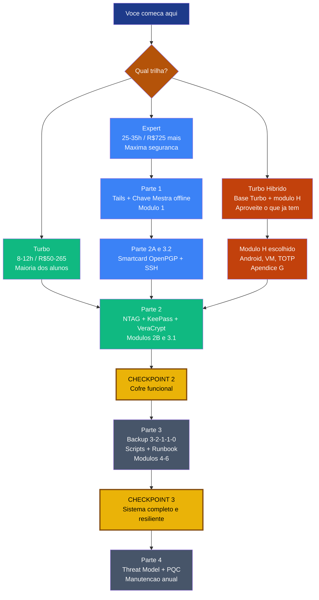

* * *

## B) Jornada operacional (10 passos + contingência)

Trilha **Expert**. O ramo inferior é o fluxo de **emergência**, não o caminho feliz.

* * *

## C) Arquitetura — como as peças se conectam

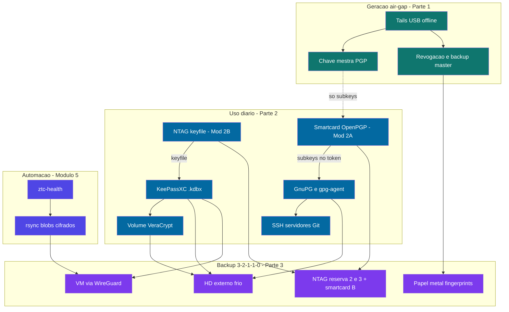

* * *

## D) Partes do curso × checkpoints

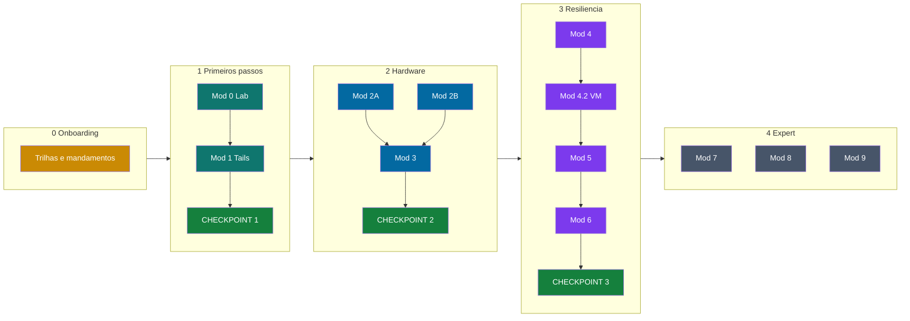

* * *

## E) Parte 3 — módulos interligados

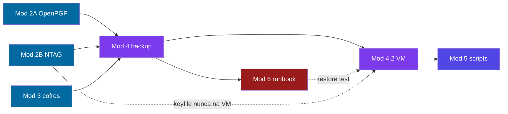

* * *

## Trilha integrada OpenPGP-GPG ↔ Zero Trust Core

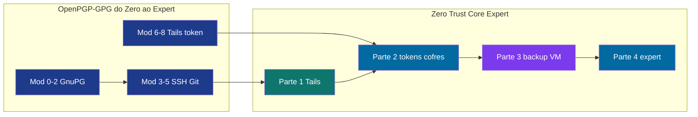

* * *

## F) Modelos de setup — escolha o seu

Antes de começar, escolha o modelo que reflete seu **orçamento e objetivo**. Cada modelo é válido — não existe errado.

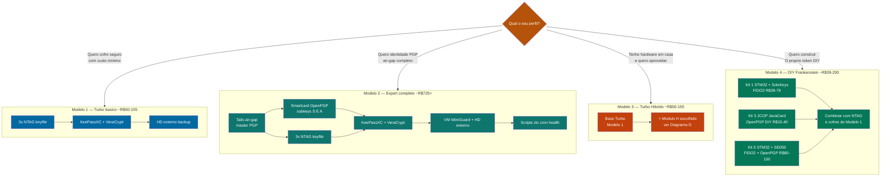

> Apostila com guia completo de cada modelo: **[APOSTILA-GUIA-PRATICO.md](./APOSTILA-GUIA-PRATICO.md)** · Cap 2 (tokens), Cap 4 (DIY), Cap 6 (manutenção).

* * *

## G) Módulos H Turbo Híbrido — o que tenho → o que faço

Cada H é independente. Ative só os que fazem sentido para o hardware que você **já possui**.

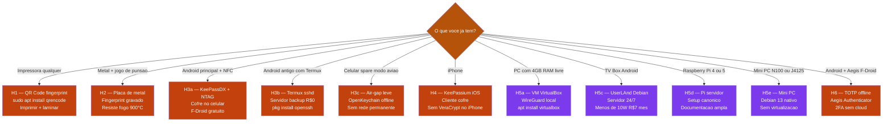

> Conteúdo completo dos módulos H: **[Apêndice G no curso](../🎓%20Zero-Trust-Core-Expert%20-%20Versão%201.0.md#apêndice-g--módulos-h-turbo-híbrido)** · comunicar na abertura de turma: [CHECKLIST-PRE-TURMA-EQUIPE.md §4](./CHECKLIST-PRE-TURMA-EQUIPE.md#4-módulos-h-disponíveis--apêndice-g-opcional).

* * *

## H) Playbook de incidentes — 5 cenários

O que aconteceu → qual cenário → runbook de 3 fases.

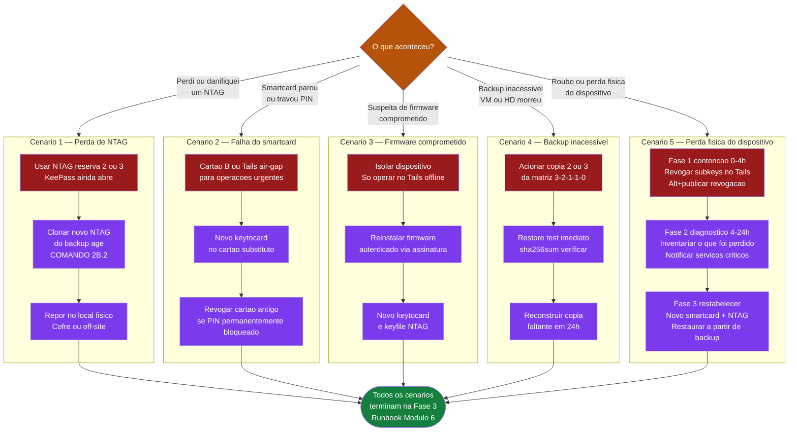

> Guia completo de cada cenário com comandos: **[Apostila Cap 8](./APOSTILA-GUIA-PRATICO.md#capítulo-8--lição-8-playbook-de-incidentes)** · Runbook no curso: **Módulo 6**.

* * *

## I) Arquitetura do cockpit de automação

Visão end-to-end: coleta de métricas → alertas → resposta automática → visualização.

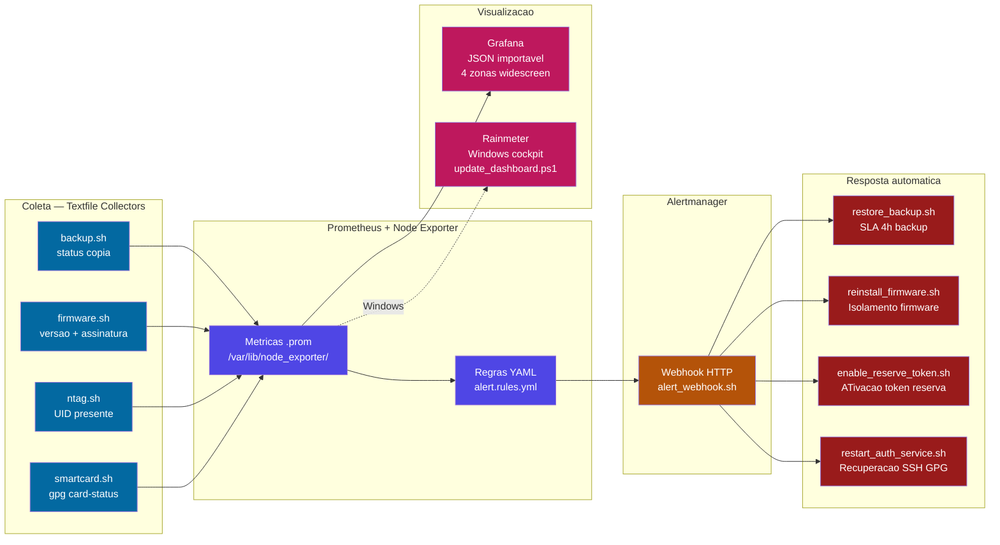

> Scripts completos (bash + PowerShell), Alertmanager YAML e Grafana JSON importável: **[Apostila Cap 9](./APOSTILA-GUIA-PRATICO.md#capítulo-9--lição-9-automação-do-cockpit)**.

* * *

## J) Mapa da Apostila — onde está cada tema

Use para navegar diretamente ao capítulo certo sem reler tudo.

```mermaid
flowchart TD
    AP["APOSTILA-GUIA-PRATICO.md"]

    subgraph P1["PARTE I — Fundamentos"]
        C1["Cap 1 — Campo de batalha\nOpenPGP vs FIDO2\nPor que este curso"]
        C2["Cap 2 — Escolha suas armas\nRanking Top 20 hardware keys\n4 que suportam OpenPGP\nProjetos chineses"]
        C3["Cap 3 — Construa o cofre\nKeePassXC 2FA\nNTAG como keyfile\nFluxo seguro passo a passo"]
    end

    subgraph P2["PARTE II — Setup avancado"]
        C4["Cap 4 — Frankenstein Key DIY\n5 Kits comparados\nMontagem + firmware\nOnde comprar BR e AliExpress"]
        C5["Cap 5 — Expanda os protocolos\nPKCS11 PIV OATH PQC\nServico a servico\nDIY vs comprar por uso"]
        C6["Cap 6 — Manutencao profissional\nINSIGHT CRITICO\nNTAG rotacao 6-12 meses\nSmartcard nao rota\nCronograma mes a mes"]
    end

    subgraph P3["PARTE III — Governanca Home Lab"]
        C7["Cap 7 — Governe como empresa\nPolitica de Seguranca 8 secoes\nRoles Admin DevOps Auditor Infra\nFluxo processos 6 fases"]
        C8["Cap 8 — Playbook de incidentes\n5 cenarios com comandos\nVer Diagrama H"]
        C9["Cap 9 — Automacao cockpit\nPrometheus Grafana Rainmeter\nScripts resposta automatica\nVer Diagrama I"]
    end

    C10["Cap 10 — Referencia rapida\n45 COMMANDs em 7 cenarios\nDeep links para ancoras do curso\nNavigacao por situacao"]

    AP --> P1 & P2 & P3 & C10
    C1 --> C2 --> C3
    C4 --> C5 --> C6
    C7 --> C8 --> C9

    classDef parte1 fill:#0f766e,color:#fff
    classDef parte2 fill:#0369a1,color:#fff
    classDef parte3 fill:#7c3aed,color:#fff
    classDef ref fill:#15803d,color:#fff
    classDef ap fill:#1e3a8a,color:#fff

    class C1,C2,C3 parte1
    class C4,C5,C6 parte2
    class C7,C8,C9 parte3
    class C10 ref
    class AP ap
```

> Acesse diretamente: **[APOSTILA-GUIA-PRATICO.md](./APOSTILA-GUIA-PRATICO.md)** — use o SUMÁRIO interno para pular ao capítulo.

* * *

## K) Abertura do cofre — fluxo completo (Sequence)

O fluxo mais importante do uso diário: NTAG presente → VeraCrypt monta → KeePassXC abre.

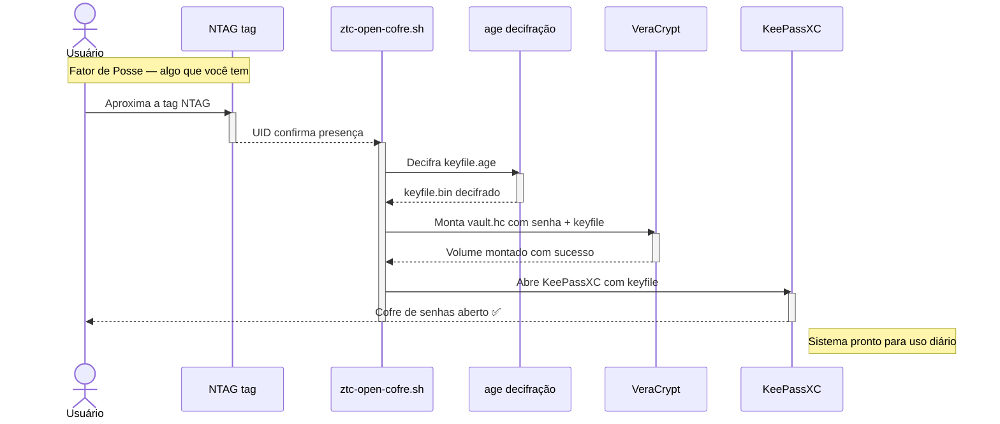

> [COMANDO 5.3](../🎓%20Zero-Trust-Core-Expert%20-%20Versão%201.0.md#-comando-53-keepass--veracrypt-condicional-nfc-opcional) no curso · script [`ztc-open-cofre.sh`](../scripts/debian/ztc-open-cofre.sh) · [Módulo 3.1](../🎓%20Zero-Trust-Core-Expert%20-%20Versão%201.0.md#-módulo-31-keepassxc--veracrypt) (VeraCrypt) + [Módulo 2B](../🎓%20Zero-Trust-Core-Expert%20-%20Versão%201.0.md#-módulo-2b-ntag--keyfile-keepassxc) (NTAG keyfile).

* * *

## L) SSH via gpg-agent — autenticação com hardware (Sequence)

Como a subchave [A] no smartcard autentica o SSH sem expor a chave privada ao sistema.

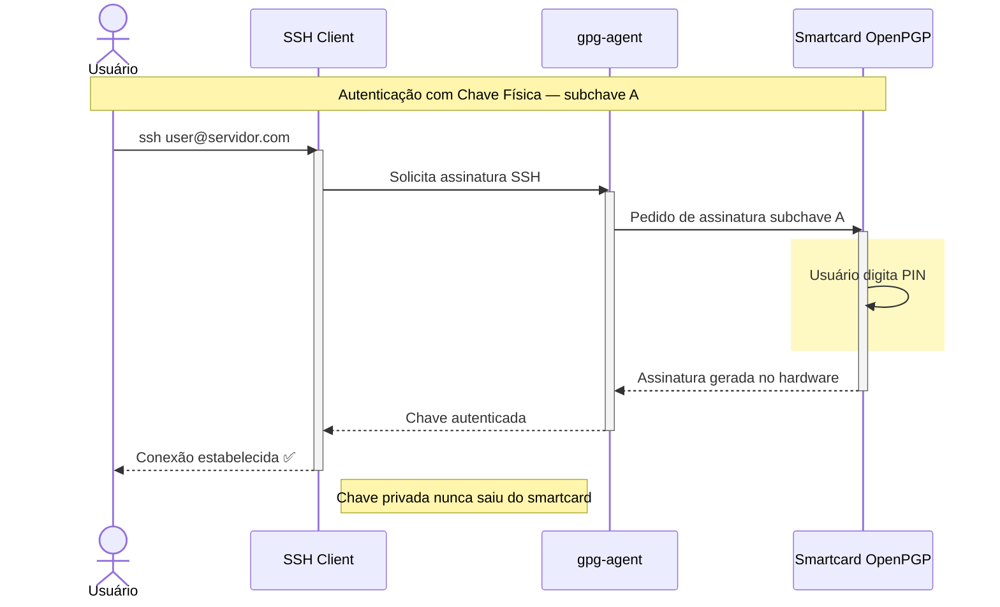

> [COMANDO 3.2.3](../🎓%20Zero-Trust-Core-Expert%20-%20Versão%201.0.md#-comando-323-chave-pública-ssh-e-testes) no curso · a master key permanece no Tails — o smartcard carrega apenas as subkeys.

* * *

## M) Contingência — perda ou roubo de token (Sequence)

Runbook de campo: o que fazer nas primeiras horas após perder um token.

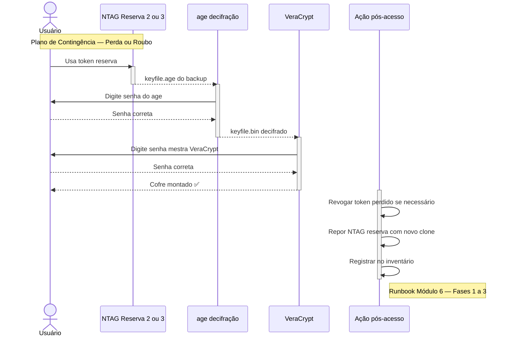

> Runbook completo: Módulo 6 do curso · Diagrama H (5 cenários) · [Apostila Cap 8](./APOSTILA-GUIA-PRATICO.md#capítulo-8--lição-8-playbook-de-incidentes).

* * *

## N) NTAG vs Smartcard OpenPGP — não são a mesma coisa

O erro mais comum de iniciantes. Duas tecnologias NFC com papéis completamente diferentes.

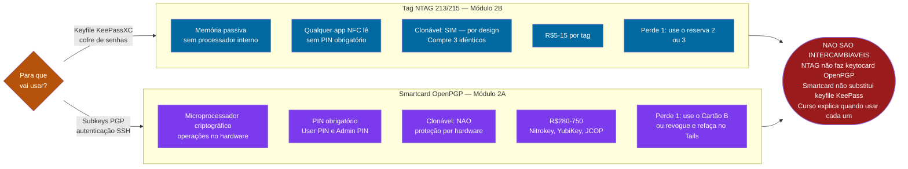

> Conceito crítico explicado no curso: Módulo 2A (smartcard), Módulo 2B (NTAG), [MANUAL-DE-USO.md §5](./MANUAL-DE-USO.md#5-conceito-chave-três-tokens-diferentes).

* * *

## Índice rápido → módulo no curso

| Diagrama | Quando usar | Ir para |
| --- | --- | --- |
| **A** | **Roadmap das 3 trilhas — começo** | Antes de qualquer módulo |
| **B** | Jornada Expert passo a passo + contingência | Partes 1–3; revisar antes do Módulo 6 |
| **C** | Arquitetura de peças conectadas | Antes da Parte 2; revisar antes da Parte 3 |
| **D** | Partes × CHECKPOINTs | Sempre que mudar de Parte |
| **E** | Módulos 4–6 interligados | Início da Parte 3 |
| **F** | Escolher o modelo de setup | Antes de comprar hardware |
| **G** | Módulos H Turbo Híbrido disponíveis | Apêndice G — turma + aluno avançado |
| **H** | Playbook de incidentes 5 cenários | Emergência; ensaio antes do Módulo 6 |
| **I** | Cockpit de automação (arquitetura) | Apostila Cap 9; Módulo 5 avançado |
| **J** | Mapa da Apostila | Ao usar a apostila pela 1ª vez |
| **K** | **Sequence: abertura do cofre** | Módulo 3.1 / 5.3 — fluxo diário |
| **L** | **Sequence: SSH via gpg-agent** | Módulo 3.2 — autenticação hardware |
| **M** | **Sequence: contingência / runbook** | Módulo 6 — perda de token |
| **N** | **NTAG vs Smartcard OpenPGP** | Antes do Módulo 2A ou 2B — erro nº 1 |
| **Playbooks 01–10** | Visão geral de cada procedimento | Dentro de cada arquivo [`playbooks/`](../playbooks/) — use enquanto executa |
| OpenPGP ↔ ZTC | Trilha integrada | [Manual de uso](./MANUAL-DE-USO.md) §3 |
| **Três Mundos (Debian/Tails/Whonix)** | Jornada + quando usar cada sistema | [Manual dos 3 mundos](./GUIA-DO-USUARIO-TRES-MUNDOS.md) · [Diagramas Whonix](../whonix/docs/DIAGRAMA-WHONIX.md) |

*Manual visual · [VIPs-com/Zero-Trust-Core](https://github.com/VIPs-com/Zero-Trust-Core)*
