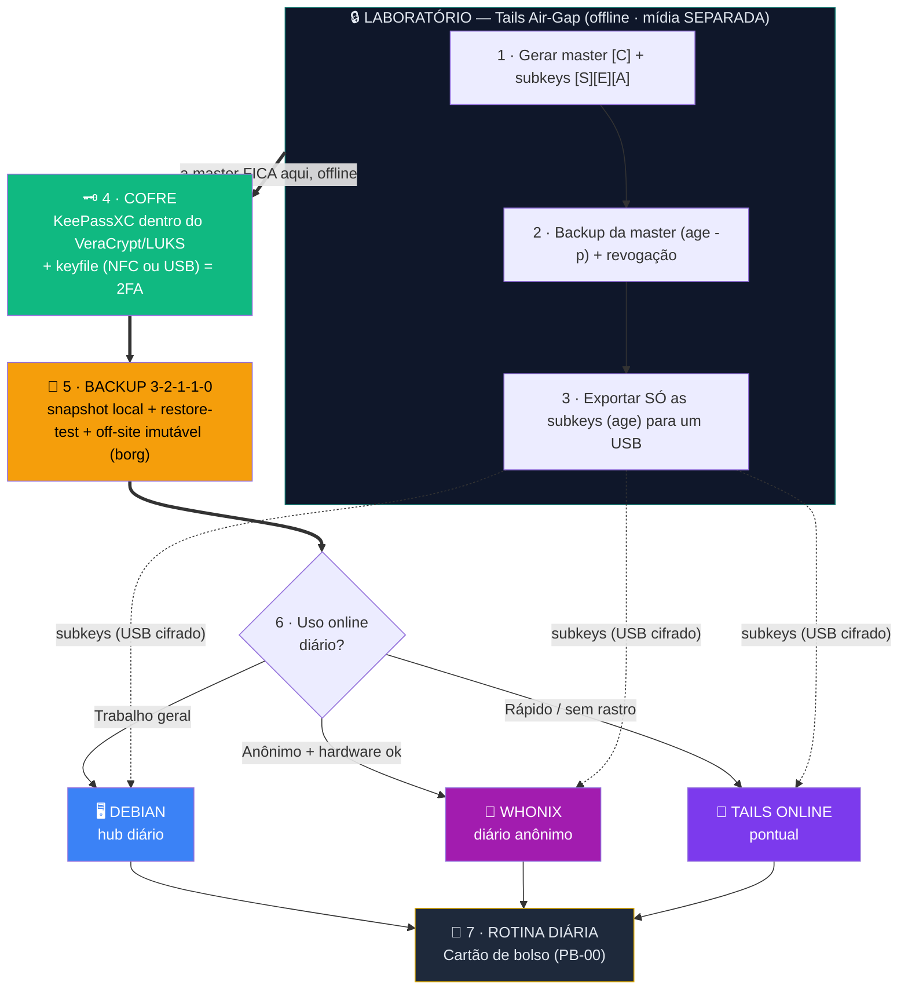

# 🧭 Manual do Usuário — Os Três Mundos + Como tornar SEU setup único

**Para o aluno que já entendeu as peças e quer saber: *em que ordem monto, quando uso cada sistema, e como não ficar idêntico ao curso.*** · [CC BY-SA 4.0](https://creativecommons.org/licenses/by-sa/4.0/)

> Este manual é **operacional**, não conceitual. Ele organiza a jornada para você **não se perder**:
> o que vem primeiro, quando ligar cada mundo, e onde personalizar para o seu setup não ser uma
> cópia carbono do curso.

---

## Sumário

- [1. Os três mundos — e quando usar cada um](#1-os-três-mundos--e-quando-usar-cada-um)
- [2. A linha de processos (a jornada, em ordem)](#2-a-linha-de-processos-a-jornada-em-ordem)
- [3. A mídia do laboratório (air-gap) — como criar](#3-a-mídia-do-laboratório-air-gap--como-criar)
- [4. Torne SEU setup único (OpSec) — mude os padrões do curso](#4-torne-seu-setup-único-opsec--mude-os-padrões-do-curso)
- [5. A mídia imutável (backup à prova de ransomware)](#5-a-mídia-imutável-backup-à-prova-de-ransomware)
- [6. As ferramentas (scripts) por mundo](#6-as-ferramentas-scripts-por-mundo)
- [7. O ecossistema em uma linha + a regra de ouro](#7-o-ecossistema-em-uma-linha--a-regra-de-ouro)

---

## 1. Os três mundos — e quando usar cada um

| Mundo | Papel | Quando ligar | Persistência |
|-------|-------|--------------|--------------|
| 🔒 **Tails Air-Gap** (laboratório) | Gerar/renovar a **master PGP** e a **seed**; assinar offline | Tarefas críticas e raras (setup, renovação anual, assinar PSBT) | **Nenhuma** (amnésico) |
| 🖥️ **Debian** (oficina / hub diário) | Cofre, NFC, SSH, automação, backup, trabalho **geral** | O dia a dia comum — a maior parte do tempo | Persistente |
| 🧅 **Whonix** (escritório anônimo) | Trabalho online **anônimo e contínuo** via Tor | Uso diário **se** você precisa de anonimato e tem hardware | Persistente (VM) |
| 🧅 **Tails Online** (visita rápida) | Sessão online anônima **sem deixar rastro** | Usos pontuais/rápidos; PC fraco | Nenhuma |

> 💬 **Minha leitura honesta da sua abordagem** ("Tails para usos rápidos, Whonix para o dia a dia"):
> está **certa para quem precisa de anonimato no dia a dia** (o perfil jornalista/ativista/trader do
> [Módulo 7](../🎓%20Zero-Trust-Core-Expert%20-%20Versão%201.0.md#-módulo-7-threat-modeling-e-opsec)).
> Mas com uma ressalva importante: se o seu uso diário é **trabalho comum** (não-sensível), o
> **Debian continua sendo o hub diário** — o Whonix entra só para a fatia anônima. Colocar o Whonix
> como diário "para tudo" sem essa necessidade contraria a própria regra que você citou:
> **"manter poucas camadas bem usadas com disciplina constante"**. Resumo:
> - **Diário geral → Debian.**
> - **Diário anônimo (e hardware ok) → Whonix.**
> - **Crítico/raro → Tails air-gap.** · **Rápido/sem rastro → Tails online.**

---

## 2. A linha de processos (a jornada, em ordem)

Monte **de cima para baixo**. Cada etapa depende da anterior. **Não pule o laboratório.**



| # | Etapa | Onde no curso |
|---|-------|---------------|
| 1–3 | **Laboratório air-gap** (master, subkeys, revogação, backup) | [Parte 1](../🎓%20Zero-Trust-Core-Expert%20-%20Versão%201.0.md#-2-parte-1-primeiros-passos-semana-1) · [Playbook 05](../playbooks/2-identidade-pgp/05-tails-master-pgp.md) / [Tails T01–T02](../tails/🐧%20Zero-Trust-Core-Tails.md) |
| 4 | **Cofre** (KeePassXC + VeraCrypt/LUKS + keyfile) | [Parte 2–3](../🎓%20Zero-Trust-Core-Expert%20-%20Versão%201.0.md) · [PB-00 a PB-04](../playbooks/1-cofre/) |
| 5 | **Backup 3-2-1-1-0** + restore-test + off-site imutável | [Parte 3](../🎓%20Zero-Trust-Core-Expert%20-%20Versão%201.0.md) · [`ztc-restore-test.sh`](../scripts/debian/ztc-restore-test.sh) · [`ztc-borg-offsite.sh`](../scripts/debian/ztc-borg-offsite.sh) |
| 6 | **Escolher o mundo online** (Debian / Whonix / Tails online) | [guia Whonix](../whonix/🧅%20Zero-Trust-Core-Whonix.md) · [guia Tails](../tails/🐧%20Zero-Trust-Core-Tails.md) |
| 7 | **Rotina diária** (abrir/fechar, disciplina) | [Playbook 00 — cartão de bolso](../playbooks/1-cofre/00-uso-diario.md) |

---

## 3. A mídia do laboratório (air-gap) — como criar

> 🚫 **A regra de ouro do laboratório:** a master e as subkeys ficam numa **mídia SEPARADA** do
> pendrive Tails. **Não habilite o Persistent Storage do Tails** para guardá-las — isso transforma o
> Tails num "Debian com Tor" pior, e **para isso você já tem o Debian e o Whonix**. O valor do Tails é
> ser amnésico; não estrague isso.

**O aluno consegue criar essa mídia?** Sim — é simples. A "mídia air-gap" é só **um segundo pendrive**
(separado do que dá boot no Tails) onde os segredos vão **já cifrados em arquivo**:

| Opção | Como | Bom para |
|-------|------|----------|
| **`age -p`** (recomendado p/ começar) | Exporta a chave e cifra com passphrase: o arquivo `master-secret.age` fica num pendrive comum (FAT/exFAT serve — o **arquivo** é que está cifrado) | Simplicidade; portável; já é o método do [COMANDO 1.4](../🎓%20Zero-Trust-Core-Expert%20-%20Versão%201.0.md) |
| **Volume LUKS** | Pendrive inteiro cifrado (GNOME Disks no Tails) | Quem quer o pendrive todo opaco |

**Recomendação prática (mídia air-gap do laboratório):**

1. **Dois pendrives pequenos** (não um) — a master também merece 3-2-1-1-0. Guarde em **locais físicos diferentes**.
2. Dentro: `master-secret.age` + `revogacao.asc` (+ opcional: a seed Bitcoin, se houver).
3. As **subkeys** vão num arquivo à parte (`subkeys.age`) — são elas que viajam para o Debian/Whonix; a master **nunca** sai.
4. **Backup em papel** da passphrase `age` e do fingerprint (envelope lacrado) — a passphrase perdida = backup inútil.
5. Esses pendrives **só** entram em máquina **offline** (Tails air-gap). Nunca num sistema online.

> 💡 É a aplicação do que você já citou: **poucas camadas bem usadas**. Não precisa de 7 mídias —
> precisa de 2 cópias da master, separadas, cifradas, e a disciplina de nunca conectá-las online.

---

## 4. Torne SEU setup único (OpSec) — mude os padrões do curso

O curso usa nomes e números **didáticos** (para você seguir). Num setup real, **mude-os** — não pela
matemática (a segurança vem da senha/cifra), mas para **não entregar o jogo** a quem dá uma olhada no
seu disco. É a camada de **disfarce** (obscuridade), um reforço fino — nunca a proteção principal.

> 📎 Aprofundamento: [Playbook 04 §10 — OpSec: disfarçar artefatos no disco](../playbooks/1-cofre/04-abrir-cofre-auto.md). Aqui ficam as **dicas rápidas de personalização**.

**a) Tamanho do keyfile — saia do "64 redondo" do curso.**
O curso gera 64 bytes. Qualquer tamanho **≥ 32 bytes** já é forte de sobra — então use um **número quebrado**, só seu:

```sh
# Curso (padrão didático):
head -c 64 /dev/urandom > keyfile.bin
# SEU setup — número quebrado, ainda forte (escolha o seu, ≥ 32):
head -c 57 /dev/urandom > "$HOME/.cache/thumbs-2021.dat"     # ex.: 57, 83, 119, 211...
```

**b) Nomes — troque os sugestivos por mundanos.**
"vault.hc", "lab-passwords.kdbx", "keepass-keyfile.ztc" gritam "aqui tem segredo". Use nomes chatos:

| Padrão do curso | Exemplo de disfarce (escolha o seu) |
|-----------------|-------------------------------------|
| `vault.hc` | `backup-fiscal-2019.bin` · `fotos-viagem.img` |
| `lab-passwords.kdbx` | `notas-receitas.kdbx` · `lista-compras.dat` |
| `keepass-keyfile.ztc` | `thumbs-2021.dat` · `config.cache` |
| `/media/veracrypt-ztc` | `/media/dados` · `/mnt/arquivo` |
| snapshot `vault-AAAAMMDD.hc` | `bkp-AAAAMMDD.bin` |

**c) Onde mudar (sem quebrar nada):** os scripts são **parametrizados** — você troca os nomes **só no
`ztc.conf`**, e tudo continua funcionando. As variáveis:

```sh
ZTC_VAULT_HC="/caminho/discreto/backup-fiscal-2019.bin"
ZTC_KDBX="/media/dados/notas-receitas.kdbx"
ZTC_KDBX_NAME="notas-receitas.kdbx"        # usado pelo restore-test
ZTC_KEYFILE="$HOME/.cache/thumbs-2021.dat"
ZTC_MOUNT_POINT="/media/dados"
ZTC_RESTORE_MOUNT="/media/teste-tmp"
```

> ⚠️ **Disfarce ≠ segurança.** Renomear é uma cortina, não uma fechadura — exatamente como uma tag
> NTAG (clonável) é uma camada, não a única. A senha e a cifra continuam fazendo o trabalho pesado.
> E **anote no seu threat model** os nomes reais (no próprio KeePassXC), senão você se disfarça de si mesmo.

---

## 5. A mídia imutável (backup à prova de ransomware)

A perna **"1 imutável"** do 3-2-1-1-0 é a que sobrevive quando tudo dá errado (ransomware cifra seus
arquivos e o backup junto). Duas camadas a cobrem:

1. **HD frio offline** (manual) — copiou, desconectou. Imune porque está **desligado**. ([COMANDO 4.2](../🎓%20Zero-Trust-Core-Expert%20-%20Versão%201.0.md))
2. **Off-site append-only com `borg`** (padrão-ouro) — [`ztc-borg-offsite.sh`](../scripts/debian/ztc-borg-offsite.sh):
   - O repositório na VM aceita **só adição**: nem o seu PC comprometido consegue **apagar ou sobrescrever** versões antigas.
   - Mantém **histórico de versões** (o `rsync-offsite` só espelha a última).
   - A VM continua vendo **só blobs já cifrados** (o `vault.hc`), agora com a cifra do borg por cima.

> Como ligar: veja o cabeçalho do [`ztc-borg-offsite.sh`](../scripts/debian/ztc-borg-offsite.sh) — setup
> append-only na VM (`command="borg serve --append-only ..."`), `borg init` uma vez, e a passphrase do
> repo guardada no KeePassXC. A **rotação** (liberar espaço) é um job no **servidor**, não no cliente —
> é isso que mantém a imutabilidade.
>
> 📘 **Passo a passo completo** — onde hospedar o off-site (HD frio / Raspberry Pi / VPS, com custo e
> energia comparados), o setup append-only no servidor, o **backup do Whonix** (bare-metal × VM) e o
> **Kit de Sobrevivência Digital**: [BACKUP-OFFSITE-E-KIT-SOBREVIVENCIA.md](BACKUP-OFFSITE-E-KIT-SOBREVIVENCIA.md).

---

## 6. As ferramentas (scripts) por mundo

| Mundo | Abrir/usar | Backup | Verificar | Saúde |
|-------|-----------|--------|-----------|-------|
| 🖥️ **Debian** | [`ztc-open-cofre`](../scripts/debian/ztc-open-cofre.sh) / [`ztc-close-cofre`](../scripts/debian/ztc-close-cofre.sh) | [`ztc-snapshot-vault`](../scripts/debian/ztc-snapshot-vault.sh) (local) · [`ztc-rsync-offsite`](../scripts/debian/ztc-rsync-offsite.sh) (espelho) · [`ztc-borg-offsite`](../scripts/debian/ztc-borg-offsite.sh) (**imutável**) | [`ztc-restore-test`](../scripts/debian/ztc-restore-test.sh) | [`ztc-health`](../scripts/debian/ztc-health.sh) (cron) |
| 🔒 **Tails** | manual (LUKS) | [`ztc-tails-backup`](../tails/scripts/debian/ztc-tails-backup.sh) (USB+age) | [`ztc-tails-restore-test`](../tails/scripts/debian/ztc-tails-restore-test.sh) | [`ztc-tails-health`](../tails/scripts/debian/ztc-tails-health.sh) · [`ztc-tails-manutencao`](../tails/scripts/debian/ztc-tails-manutencao.sh) |
| 🧅 **Whonix** | manual (Playbooks W) | snapshot da **VM no host** | (segredos vêm do Tails) | [`ztc-whonix-health`](../whonix/scripts/debian/ztc-whonix-health.sh) |

> Config de todos: **um** arquivo, [`ztc.conf`](../scripts/debian/ztc.conf.example) (lembre do `chmod 600`).

---

## 7. O ecossistema em uma linha + a regra de ouro

```
LUKS/VeraCrypt (cofre) + age (envelope) + GPG (carta) + KeePassXC (banco de chaves)
   + master offline & subkeys online + Electrum air-gap (Bitcoin)
   + 3-2-1-1-0 (com borg imutável + restore-test) + rotina diária do PB-00
```

> 💡 **A regra de ouro:** o segredo **não** é acumular camadas infinitas — é **manter poucas camadas
> bem usadas com disciplina constante**. Três mundos, cada um no seu papel; uma rotina de aço que você
> realmente segue. *Disciplina vence hardware.*

---

*Zero Trust Core — Manual do Usuário · VIPs-com · [CC BY-SA 4.0](https://creativecommons.org/licenses/by-sa/4.0/)*
