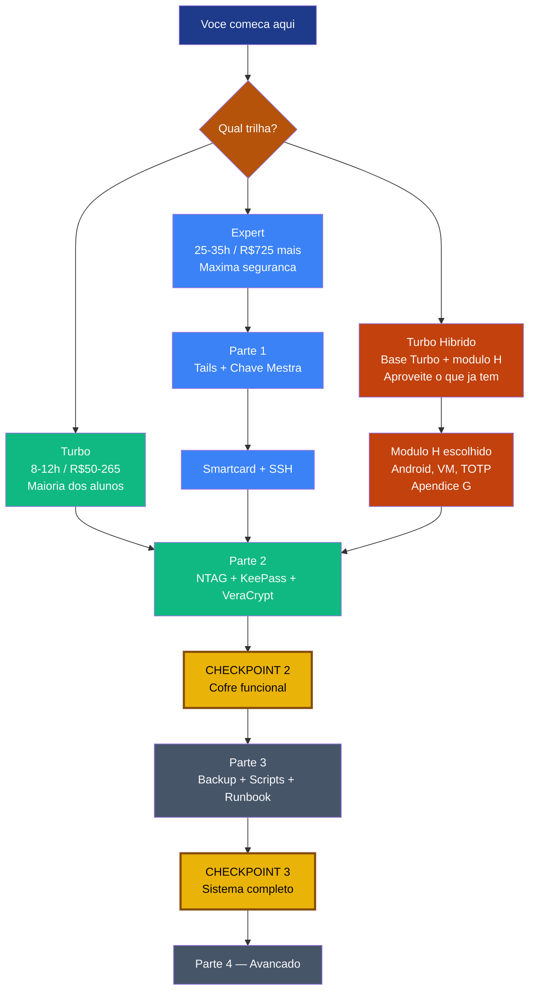

# 🚀 INICIE AQUI — Zero Trust Core Expert

**Bem-vindo ao curso!**
Este documento leva cerca de 8 minutos para ler e foi feito para que você **não se sinta perdido** nos primeiros dias.

Leia do início ao fim. Depois você saberá exatamente qual caminho seguir.

---

## 1. O que você vai construir

Um **ecossistema pessoal de segurança em camadas** — sem depender de grandes empresas, sem nuvem obrigatória, com controle total:

| Camada | Ferramenta | Para que serve |
| --- | --- | --- |
| Cofre de senhas | KeePassXC + VeraCrypt | Guardar senhas dentro de volume criptografado |
| Fator físico | NTAG (tag NFC) | "Algo que você tem" — abre o cofre |
| Identidade digital | Chave OpenPGP no Tails | Assinar arquivos, autenticar SSH, sem rastro online |
| Backup resiliente | 3-2-1-1-0 + scripts | Sobreviver a qualquer desastre |

**Você não precisa de tudo ao mesmo tempo.** A Trilha Turbo já entrega as camadas 1 e 2 em 8–12 horas e custa entre R$50 e R$265.

---

## 2. Mapa visual — escolha seu caminho

---

## 3. Qual trilha é para você?

| | **Turbo** | **Expert** | **Turbo Híbrido** |
| --- | :---: | :---: | :---: |
| Tempo | 8–12 h | 25–35 h | 8–12 h + 1–3 h/módulo H |
| Custo inicial | R$50–265 | R$725+ | R$50–315 |
| Tails air-gap | Não | Sim | Não |
| Smartcard OpenPGP | Não | Sim | Não |
| NTAG + KeePass + VeraCrypt | ✅ | ✅ | ✅ |
| Aproveita hardware que já tem | Parcial | Parcial | ✅ Sim (foco) |
| **Recomendado para** | Maioria dos alunos | Máxima segurança | Quem tem celular/PC antigo |

> **Recomendação forte:** comece pela **Trilha Turbo**. Você sempre pode avançar para Expert depois — os conhecimentos acumulam.

**Turbo Híbrido:** se você já tem um celular Android antigo, uma TV Box ou um PC com RAM sobrando, o Apêndice G do curso tem módulos opcionais (H1–H6) que aproveitam exatamente esse hardware, sem custo extra.

---

## 4. O que comprar primeiro

### Kit A — Turbo mínimo · R$50–105

| Item | Qtd | Faixa de preço | Onde encontrar |
| --- | :---: | --- | --- |
| Tags **NTAG215** (pacote) | 1 pacote ≥ 3 tags | R$25–55 | ML, Shopee, lojas Arduino |
| Pendrive 16–32 GB (backup) | 1 | R$25–50 | Qualquer loja |

- Celular Android com NFC: R$0 (use o seu) — para gravar as tags com o app **NFC Tools**
- Todo o software (KeePassXC, VeraCrypt, GnuPG, age, scripts) é **R$0 — open-source**

→ Lista completa com preços e kits B, C, D: **[INVENTARIO-SOFTWARE-HARDWARE.md](./INVENTARIO-SOFTWARE-HARDWARE.md)**

---

## 5. Ordem recomendada de estudo

1. ✅ Leia este arquivo (você está aqui)
2. Leia o **[Manual de uso](./MANUAL-DE-USO.md)** — 10 min, explica a estrutura do repositório
3. Monte o **Kit A** com as tags NTAG
4. Abra o curso e siga o **§0 ONBOARDING**
5. Faça o **Módulo 2B** (NTAG + KeePass) e o **Módulo 3.1** (VeraCrypt)
6. Complete o **CHECKPOINT 2** — você já tem um cofre funcional!
7. Continue para a Parte 3 (Backup) ou, se quiser ir mais fundo, para a Parte 1 (Tails + Master PGP)

---

## 6. Dicas para não se sobrecarregar

- **Não leia tudo de uma vez.** O curso tem 25–35 h de conteúdo — é um investimento, não uma sprint.
- **Foque na Trilha Turbo** nas primeiras semanas antes de comprar hardware extra.
- **Use os CHECKPOINTs como marcos de vitória** — cada um significa que algo está funcionando de verdade.
- **Dúvida técnica?** → **[FAQ-TROUBLESHOOTING.md](./FAQ-TROUBLESHOOTING.md)**
- **NTAG ≠ Smartcard OpenPGP** — são objetos diferentes com funções diferentes. O curso explica com calma. Não confunda agora.
- **Não tem Linux?** O Apêndice D do curso cobre Windows/WSL2 e macOS.

---

## 7. Documentação de apoio

| Documento | Para que serve | Quando usar |
| --- | --- | --- |
| **[Manual de uso](./MANUAL-DE-USO.md)** | Estrutura do repositório, trilhas, interligação com OpenPGP-GPG | Antes da 1ª aula |
| **[Inventário](./INVENTARIO-SOFTWARE-HARDWARE.md)** | Software + hardware + kits A–D em R$ | Antes de comprar qualquer coisa |
| **[Diagramas visuais](./DIAGRAMAS-VISUAIS.md)** | 14 diagramas Mermaid — roadmap, fluxos, sequências | Para entender o todo |
| **[FAQ](./FAQ-TROUBLESHOOTING.md)** | Erros comuns (VeraCrypt, NFC, GPG, SSH) | Quando travar |
| **[Apostila](./APOSTILA-GUIA-PRATICO.md)** | Hardware alternativo, DIY, governança, cockpit | Depois do CHECKPOINT 2 |
| **[Gabarito checkpoints](./GABARITO-CHECKPOINTS.md)** | Como provar que completou cada etapa | Antes de cada CHECKPOINT |

---

## 8. A diferença que este curso faz

No final do Turbo você terá:

- Um cofre de senhas que **só você consegue abrir** (senha + objeto físico)
- Um volume criptografado que **não abre sem o keyfile** da tag NFC
- Um backup testado que **você verificou funcionando**

No final do Expert, além disso:

- Uma chave de identidade digital cuja **master nunca tocou a internet**
- SSH em servidores usando **hardware físico como segundo fator**
- Um sistema que sobrevive à **perda de qualquer token**, porque você tem o runbook testado

---

## Próximo passo

Abra o curso e vá direto ao **§0 ONBOARDING**:

→ **[🎓 Zero-Trust-Core-Expert - Versão 1.0.md](../🎓%20Zero-Trust-Core-Expert%20-%20Versão%201.0.md)**

---

**Você não precisa dominar tudo hoje.**
Comece pequeno. Cada checkpoint é uma vitória real.

**Boa jornada — o controle da sua segurança digital começa aqui.**

---

*INICIE AQUI · Zero Trust Core Expert · VIPs-com · [CC BY-SA 4.0](https://creativecommons.org/licenses/by-sa/4.0/) · Maio/2026*
