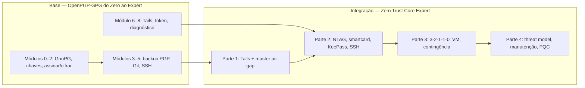

# 📖 Manual de uso — Zero Trust Core Expert

**Para quem acabou de chegar ao repositório** · Maio/2026 · [CC BY-SA 4.0](https://creativecommons.org/licenses/by-sa/4.0/)

Este manual **não substitui** o curso. Ele explica **como navegar o repositório**, **como este projeto se liga ao [OpenPGP-GPG do Zero ao Expert](https://github.com/VIPs-com/OpenPGP-GPG-do-Zero-ao-Expert)** e **o que você será capaz de fazer** ao concluir cada trilha.

* * *

## 1. O que é este projeto?

**Zero Trust Core Expert** é um curso open-source em **um arquivo Markdown** (+ scripts opcionais) para montar um **ecossistema pessoal de segurança** em camadas:

| Camada | Ferramenta | Papel no dia a dia |
| --- | --- | --- |
| 1 | **KeePassXC** + **VeraCrypt** | Cofre de senhas local, dentro de volume criptografado |
| 2 | **NTAG** (NFC) ou **smartcard OpenPGP** | Fator físico — **papéis diferentes** (ver §5) |
| 3 | **GnuPG / OpenPGP** | Identidade criptográfica (master offline, subkeys no token) |
| 4 | **SSH** via `gpg-agent` | Login em servidores/Git sem chave privada no disco |
| 5 | **Backup 3-2-1-1-0** + automação | Resiliência, VM off-site, contingência |

Não é um produto comercial nem uma YubiKey embutida no repositório: é **documentação + disciplina operacional** sua.

* * *

## 2. Estrutura do repositório (o que baixar)

Depois de `git clone` ou **Download ZIP** em [github.com/VIPs-com/Zero-Trust-Core](https://github.com/VIPs-com/Zero-Trust-Core):

```
Zero-Trust-Core/
├── README.md                          ← Porta de entrada (resumo)
├── LICENSE                            ← CC BY-SA 4.0
├── docs/
│   ├── README.md                      ← Índice desta pasta
│   └── MANUAL-DE-USO.md              ← Você está aqui
├── scripts/
│   ├── README.md
│   ├── ztc-health.sh                  ← Health-check (Módulo 5)
│   ├── ztc-rsync-offsite.sh           ← Backup VM (Módulo 4.2)
│   └── ztc.conf.example               ← Configuração (copiar para ~/ztc-backup/)
└── 🎓 Zero-Trust-Core-Expert - Versão 1.0.md   ← CURSO (estude aqui)
```

| Arquivo | Obrigatório? | Função |
| --- | :---: | --- |
| `🎓 Zero-Trust-Core-Expert - Versão 1.0.md` | **Sim** | Todo o conteúdo didático (Partes 1–4, apêndices, COMANDOs) |
| `docs/MANUAL-DE-USO.md` | Recomendado | Este guia de navegação |
| `scripts/` | Opcional | Automação depois dos Módulos 4–5 |
| `README.md` | 2 min | Visão geral + links |

> 💡 Pode estudar **só o `.md` do curso** num pendrive, sem Git. Os scripts exigem Linux (ou WSL com ressalvas — Apêndice D do curso).

* * *

## 3. Interligação com OpenPGP-GPG do Zero ao Expert

Os dois cursos da **VIPs-com** formam uma **trilha integrada** (link recíproco no README de ambos, desde maio/2026):



| Pergunta | Resposta |
| --- | --- |
| Preciso fazer os dois cursos? | **Trilha Expert:** sim, no mínimo OpenPGP Módulos **0–3** antes ou em paralelo com a Parte 1 deste curso. **Trilha Turbo:** pode começar só com KeePass + NTAG (Parte 2B + 3.1). |
| O que o OpenPGP-GPG ensina e este não repete? | Teoria de chaves, algoritmos, `gpg` básico, Git assinado, detalhe de Tails/COMANDO 6.1. |
| O que **só** o Zero Trust Core ensina? | KeePass + VeraCrypt + keyfile NTAG, matriz 3-2-1-1-0, VM + WireGuard + `rsync`, runbook de perda de cartão, scripts `ztc-*`. |
| Por onde começo no OpenPGP-GPG? | [Repositório OpenPGP-GPG](https://github.com/VIPs-com/OpenPGP-GPG-do-Zero-ao-Expert) → secção **Trilha integrada: Zero Trust Core Expert** no README. |

**Ordem recomendada (Expert):**

1. OpenPGP-GPG: Módulos **0 → 1 → 2** (ambiente e primeira chave no lab).  
2. Zero Trust Core: **Onboarding (§0)** + **Parte 1** (master no Tails).  
3. OpenPGP-GPG: **Módulo 5** (SSH) em paralelo ou antes da Parte 2 deste curso (Módulo 3.2).  
4. Zero Trust Core: **Partes 2 → 3 → 4** na ordem dos CHECKPOINTs.

* * *

## 4. O que você vai conseguir fazer (por trilha)

### Trilha 🟢 Turbo (~8–12 h)

| Capacidade | Sim / parcial |
| --- | :---: |
| Cofre KeePass com senha + keyfile em 3 NTAGs | ✅ |
| Volume VeraCrypt com `.kdbx` dentro | ✅ |
| Backup em HD externo + manifesto `sha256` | ✅ |
| Master PGP no Tails + SSH com smartcard | ❌ (pula Parte 1 / 2A / 3.2) |
| VM off-site + WireGuard | ❌ (opcional simplificado: só HD) |

### Trilha 🔵 Expert (~25–35 h) — curso na íntegra

| Capacidade | Sim |
| --- | :---: |
| Tudo da Turbo | ✅ |
| Master [C] só no Tails; subkeys [S][E][A] no smartcard | ✅ |
| SSH via `gpg-agent` (subchave [A]) | ✅ |
| Backup **3-2-1-1-0** com restore testado | ✅ |
| VM off-site (só blobs criptografados) | ✅ |
| Runbook de contingência + simulação COMANDO 6.1 | ✅ |
| Threat model + plano de manutenção anual | ✅ |

### Trilha 👀 Curioso (~3–5 h)

| Capacidade | Sim |
| --- | :---: |
| Entender arquitetura, mandamentos, mapa | ✅ |
| Executar COMANDOs e checkpoints | ❌ (sem obrigação) |

Detalhe dos **8 resultados** do curso: seção **0. RESULTADOS ESPERADOS** no arquivo canônico.

* * *

## 5. Conceito-chave: três “tokens” diferentes

Erro nº 1 dos iniciantes: chamar tudo de “NFC” ou “cartão”.

| Objeto | Tecnologia | Serve para | Não serve para |
| --- | --- | --- | --- |
| **Tag NTAG** | NFC simples (213/215) | **Keyfile** do KeePassXC | `keytocard` OpenPGP |
| **Smartcard OpenPGP** | Nitrokey, YubiKey OpenPGP, JCOP | Subkeys PGP + SSH | Substituir YubiKey FIDO2/OTP |
| **Tails USB** | SO live offline | Gerar e guardar **master** PGP | Uso diário com internet (não é o desenho) |

**KeePassXC** roda no seu **Windows/Linux/macOS** diário. No **Tails 7.6+** o app padrão de senhas é **GNOME Secrets** (abre `.kdbx`); no Tails você usa **GnuPG** para a master — não precisa de KeePassXC no pendrive.

* * *

## 6. Mapa de dependências (ordem de estudo)

Não pule CHECKPOINTs. Os **fluxogramas completos** (Mermaid A–E) estão na **seção 1** do [curso canônico](../🎓%20Zero-Trust-Core-Expert%20-%20Versão%201.0.md#-diagramas-visuais-fluxos-mermaid) — abra o preview Markdown no GitHub.

| Diagrama | O que mostra |
| --- | --- |
| **A** | Estratégia ponta a ponta (planejamento → contingência) |
| **B** | Dez passos Expert + ramo perda/roubo |
| **C** | Uso diário × air-gap × backup × automação |
| **D** | Partes 0–4 e checkpoints |
| **E** | Como Módulos 4, 4.2, 5 e 6 ligam a 2A/2B/3 |

Resumo em texto:

```
§0 → §1 (diagramas A–E) → Parte 1 → Parte 2 → Parte 3 → Parte 4 → Apêndices
```

| Se você pular… | Risco |
| --- | --- |
| Parte 1 (Tails) e for direto ao SSH | Master no PC online — **comprometimento irreversível** |
| 2B e usar NTAG no `keytocard` | Não funciona; frustração e falsa segurança |
| CHECKPOINT 3 (restore test) | Backup “de mentira” até o primeiro desastre |
| Módulo 6 antes de ter cartão #2 | Perda do NTAG = possível perda do cofre |

* * *

## 7. Primeira hora (roteiro prático)

### Passo A — Só leitura (30 min)

1. Abra [`🎓 Zero-Trust-Core-Expert - Versão 1.0.md`](../🎓%20Zero-Trust-Core-Expert%20-%20Versão%201.0.md).  
2. Leia: **Carta do Professor**, **20 Mandamentos**, **Escolha seu caminho**.  
3. Decida: **Turbo**, **Expert** ou **Curioso**.  
4. Se Expert: abra em outra aba o [OpenPGP-GPG do Zero ao Expert](https://github.com/VIPs-com/OpenPGP-GPG-do-Zero-ao-Expert) e confira o README (secção Zero Trust Core).

### Passo B — Laboratório mínimo (30 min)

1. Instale **KeePassXC 2.7.12+** no PC.  
2. Crie um banco **de laboratório** (senha fictícia).  
3. No curso, execute mentalmente o **COMANDO 0.1** (pasta `~/zero-trust-lab`).  
4. Se já tem Linux: `gpg --version` (espere **2.4.x**).

### Passo C — Hardware (quando for praticar Parte 2)

- 3× NTAG + celular com **NFC Tools**, **ou**  
- 1× smartcard OpenPGP + leitor USB + `pcscd`

* * *

## 8. Como ler o arquivo do curso

| Elemento | Significado | Ação |
| --- | --- | --- |
| **COMANDO X.Y** | Passo executável no terminal ou GUI | Copiar, adaptar caminhos, executar no **lab** |
| **CHECKPOINT N** | Lista `- [ ]` — critério de saída | Só avance quando **todos** marcados |
| 🔴 🟡 🟢 🔵 ⚫ | Legenda de maturidade | 🔴 = não faça; 🟢 = padrão 2026 |
| `> 📎` | Link ou pré-requisito externo | Abrir OpenPGP-GPG ou doc oficial |
| **§1 Mapa ASCII** | Índice visual | Consulta; **não** substitui Partes 2–6 |

**Busca no editor:** `COMANDO`, `CHECKPOINT`, `Módulo 2A`, `Apêndice A`.

**Âncoras:** títulos viram links no GitHub e no VS Code (clique no sumário do preview).

* * *

## 9. Scripts (`scripts/`)

Quando chegar à **Parte 3 (Módulo 5)**:

```sh
git clone https://github.com/VIPs-com/Zero-Trust-Core.git
cd Zero-Trust-Core/scripts
mkdir -p ~/bin ~/ztc-backup/manifest
cp ztc-health.sh ztc-rsync-offsite.sh ~/bin/
chmod +x ~/bin/ztc-*.sh
cp ztc.conf.example ~/ztc-backup/ztc.conf
nano ~/ztc-backup/ztc.conf   # caminhos reais + IP WireGuard
~/bin/ztc-health.sh
```

| Script | Antes de usar | Nunca coloque em `ztc.conf` |
| --- | --- | --- |
| `ztc-health.sh` | Smartcard ou ambiente lab | Senhas |
| `ztc-rsync-offsite.sh` | `vault.hc` fechado + VM configurada | Keyfile, master, PIN |

Documentação: [scripts/README.md](../scripts/README.md) · Apêndice B no curso.

* * *

## 10. Onde está cada tema no curso

| Tema | Seção no `.md` canônico |
| --- | --- |
| Instalar ferramentas | §0 Checklist + Módulo 0 |
| Tails + master offline | Parte 1, Módulo 1 |
| Smartcard `keytocard` | Parte 2, Módulo **2A** |
| NTAG + KeePass keyfile | Parte 2, Módulo **2B** |
| VeraCrypt + `.kdbx` | Parte 2, Módulo **3.1** |
| SSH `gpg-agent` | Parte 2, Módulo **3.2** |
| Backup 3-2-1-1-0 | Parte 3, Módulo **4** |
| VM + WireGuard + rsync | Parte 3, Módulo **4.2** |
| Cron + health | Parte 3, Módulo **5** |
| Perda de cartão | Parte 3, Módulo **6** |
| Threat model | Parte 4, Módulo **7** |
| PQC (horizonte) | Parte 4, Módulo **8** |
| 15 erros comuns | Apêndice **A** |
| Windows / WSL2 / macOS | Apêndice **D** |
| Hardware Brasil | Apêndice **C** |

* * *

## 11. FAQ — chegando agora

**Baixei só o ZIP. Por onde começo?**  
Abra `🎓 Zero-Trust-Core-Expert - Versão 1.0.md` e este `MANUAL-DE-USO.md`. Ignore pastas que não existirem no ZIP (se o GitHub omitir `docs/`, use o README da raiz).

**Preciso de duas YubiKeys?**  
Não. O curso usa **smartcard backup** ou **subkeys exportadas cifradas** + **3 NTAGs** para keyfile — filosofia parecida, custo menor, mais trabalho seu.

**Posso usar só o celular para NFC?**  
Sim para **gravar NTAG** (keyfile). Para **OpenPGP no cartão**, use leitor USB + `pcscd` no PC.

**A VM na nuvem vê minhas senhas?**  
Só se você enviar arquivos **em claro**. Regra: VM recebe **apenas** `vault.hc` fechado, manifestos, `.asc.gpg` — nunca keyfile, PIN ou master.

**Já sei GPG. Posso pular a Parte 1?**  
Só se sua **master nunca esteve** no PC online e você já tem revogação + backup offline. Caso contrário: faça a Parte 1 no Tails.

**Versões desatualizadas no PDF impresso?**  
Confira o cabeçalho do `.md`: Tails [tails.net/latest](https://tails.net/latest/), KeePassXC, VeraCrypt, GnuPG 2.4.4+.

* * *

## 12. Checklist “estou pronto para praticar”

- [ ] Li a Carta e os 20 Mandamentos  
- [ ] Escolhi Turbo, Expert ou Curioso  
- [ ] Se Expert: tenho plano para OpenPGP-GPG Módulos 0–3  
- [ ] Tenho máquina **lab** (ou VM) separada do PC principal  
- [ ] Entendo: NTAG ≠ smartcard OpenPGP  
- [ ] Baixei Tails **7.8+** do site oficial (se for Parte 1)  
- [ ] Abri o curso canônico e salvei nos favoritos  

* * *

## 13. Links rápidos

| Recurso | URL |
| --- | --- |
| Repositório | https://github.com/VIPs-com/Zero-Trust-Core |
| Curso (arquivo) | [🎓 Zero-Trust-Core-Expert - Versão 1.0.md](../🎓%20Zero-Trust-Core-Expert%20-%20Versão%201.0.md) |
| OpenPGP-GPG (base) | https://github.com/VIPs-com/OpenPGP-GPG-do-Zero-ao-Expert |
| Release v1.0.1 | https://github.com/VIPs-com/Zero-Trust-Core/releases |
| Tails | https://tails.net/latest/ |
| KeePassXC | https://keepassxc.org/ |

* * *

**Próximo passo:** abra o [curso canônico](../🎓%20Zero-Trust-Core-Expert%20-%20Versão%201.0.md) na seção **0. ONBOARDING** e siga a Parte 1 se estiver na trilha Expert.

*Manual de uso · Zero Trust Core Expert · VIPs-com · Maio/2026*
