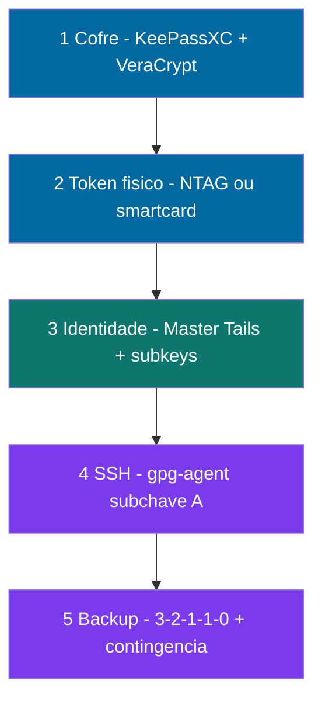

# 🎤 Abertura de turma — Zero Trust Core Expert

**4 slides** · Instrutor · Jul/2026 · v1.0.3 · [CC BY-SA 4.0](https://creativecommons.org/licenses/by-sa/4.0/)

Material para **primeira aula** (10–15 min antes do Módulo 0). Detalhes de compra: [INVENTARIO § Kits](./INVENTARIO-SOFTWARE-HARDWARE.md#-kit-mínimo-de-compra-brasil--referência-2026) · Fluxos: [DIAGRAMAS-VISUAIS.md](./DIAGRAMAS-VISUAIS.md).

**Roteiro na sala:** Slide 1 (custo) → Slide 2 (Kit A) → Slide 3 (5 camadas) → Slide 4 (NTAG ≠ smartcard) → [Módulo 0](../🎓%20Zero-Trust-Core-Expert%20-%20Versão%201.0.md) no curso.

* * *

## Como projetar (passo a passo)

Escolha **um** método. Para aula presencial, **Marp** ou **PDF** costumam ficar mais legíveis que scroll no preview.

### Opção A — VS Code / Cursor (rápido, sem instalar nada)

1. Abra este arquivo no editor: `docs/SLIDES-ABERTURA-TURMA.md`.
2. **Preview:** `Ctrl+Shift+V` (Windows) ou Command Palette → `Markdown: Open Preview`.
3. **Tela cheia no preview:** clique no ícone “Open Preview to the Side” e maximize o painel; ou instale a extensão **Markdown Preview Enhanced** e use `Ctrl+K V` (preview lado a lado).
4. **Apresentar:** role manualmente até cada título `## SLIDE 1` … `## SLIDE 4` (cada bloco termina no `* * *` antes do próximo slide).
5. **Diagrama do Slide 3:** no preview nativo o Mermaid pode não renderizar — use GitHub (opção B) ou Marp (opção C) para esse slide.

> **Dica:** oculte as linhas “Notas do instrutor” na projeção (só leia em voz); o aluno vê título + tabelas.

---

### Opção B — GitHub no navegador (projetor / link para alunos)

1. Abra: https://github.com/VIPs-com/Zero-Trust-Core/blob/main/docs/SLIDES-ABERTURA-TURMA.md  
2. O GitHub renderiza **tabelas e Mermaid** do Slide 3 automaticamente.  
3. **Tela cheia:** `F11` no navegador; aumente zoom (`Ctrl` + `+`) até ~125–150%.  
4. Role de `## SLIDE 1` até `## SLIDE 4` (10–15 min).  
5. **PDF pelo navegador:** `Ctrl+P` → Destino **Salvar como PDF** → em *Mais configurações* marque **Gráficos de fundo** (para tabelas) → Salvar.  
   - Quebra de página: o navegador pode cortar no meio de um slide; para PDF “um slide por página”, use a **Opção C (Marp)** ou o arquivo [SLIDES-ABERTURA-TURMA.marp.md](./SLIDES-ABERTURA-TURMA.marp.md).

---

### Opção C — Marp (recomendado para projetor + tema)

Arquivo pronto para apresentação: **[SLIDES-ABERTURA-TURMA.marp.md](./SLIDES-ABERTURA-TURMA.marp.md)** (4 slides, sem notas longas na tela).

**No VS Code / Cursor:**

1. Instale a extensão **[Marp for VS Code](https://marketplace.visualstudio.com/items?itemName=marp-team.marp-vscode)** (`marp-team.marp-vscode`).
2. Abra `docs/SLIDES-ABERTURA-TURMA.marp.md`.
3. Clique em **Open Preview** na barra do Marp (ícone de slide) ou Command Palette → `Marp: Open Preview`.
4. **Apresentar:** ícone **Start presentation** (slide show) — navegação com setas; `Esc` sai.

**Exportar PDF/PPTX:**

- Command Palette → `Marp: Export Slide Deck` → escolha **PDF** ou **PPTX**.
- Ou CLI (com [Node.js](https://nodejs.org/)):

```powershell
cd "e:\Zero Trust Core\docs"
npx @marp-team/marp-cli@latest SLIDES-ABERTURA-TURMA.marp.md --pdf -o SLIDES-ABERTURA-TURMA.pdf
```

Leve o PDF no pendrive se a sala não tiver internet.

---

### Opção D — Imprimir este `.md` como PDF (4 páginas)

1. Abra o preview (VS Code ou GitHub) → `Ctrl+P`.
2. Layout **Retrato**; margens **Padrão** ou **Mínima**.
3. Ative **Gráficos de fundo**.
4. Entre cada slide há uma quebra de página HTML (`<div class="slide-break">`) — confira no PDF se cada `SLIDE N` começa numa página nova; se não, use o `.marp.md` (Opção C).

---

### Fluxo sugerido na primeira aula (10–15 min)

| Min | Slide | O que falar |
| ---: | --- | --- |
| 2–3 | 1 | Custo YubiKey vs começar com ~R$ 50; software grátis |
| 3–4 | 2 | Kits A–D; “quem tem Android pode Kit A hoje” |
| 3–4 | 3 | As 5 camadas; Turbo vs Expert |
| 2–3 | 4 | NTAG ≠ smartcard; mandamento 2 |
| — | — | Abrir o **curso** no Módulo 0 |

**Depois:** [Manual de uso](./MANUAL-DE-USO.md) · compras em [Inventário § Kits](./INVENTARIO-SOFTWARE-HARDWARE.md#-kit-mínimo-de-compra-brasil--referência-2026).

* * *

<div class="slide-break"></div>

## SLIDE 1 — O problema que o curso resolve

### Duas YubiKeys não são o único caminho

| Abordagem típica | Custo (referência BR) | O que você leva |
| --- | --- | --- |
| **2× YubiKey** (FIDO + OpenPGP) | **~R$ 800 – 1.200** | Hardware fechado; pouca visibilidade das camadas |
| **Zero Trust Core Expert** | **~R$ 50 – 265** (Turbo) · **~R$ 725 – 2.150** (Expert completo) | Mesma **defesa em profundidade** — e você **entende cada camada** |

> **Mensagem para o aluno:** você não precisa gastar quatro dígitos **sem saber o que está comprando**. Pode **começar hoje** com um pacote de tags NFC e software gratuito.

**Software deste curso:** KeePassXC, VeraCrypt, GnuPG, Tails, scripts — **R$ 0** (open-source).

**Notas do instrutor (30 s):** validar expectativa — não é “anti-YubiKey”; é **soberania** e custo adaptável. Quem já tem token OpenPGP pode pular parte do Kit C.

<div class="slide-break"></div>

* * *

## SLIDE 2 — Os 4 kits (escolha antes de comprar)

> Valores **indicativos** · [tabela completa com itens](./INVENTARIO-SOFTWARE-HARDWARE.md#-kit-mínimo-de-compra-brasil--referência-2026)

| Kit | Trilha | Investimento inicial | Para quem |
| --- | --- | --- | --- |
| **A** | Turbo mínimo | **~R$ 50 – 105** | NTAG + KeePass + VeraCrypt; gravar tag no **Android** |
| **B** | Turbo confortável | **~R$ 130 – 265** | Kit A + **leitor NFC no PC** (Módulo 5.3) |
| **C** | Expert essencial | **~R$ 725 – 1.770** | + Tails, smartcard OpenPGP, HD backup |
| **D** | Expert completo | **~R$ 770 – 2.150** + VPS/mês | + VM off-site, runbook físico |

```
  Comece aqui ──►  A ──► B ──► C ──► D
                 R$50      +NFC    +PGP    +VM
```

**Notas do instrutor:** perguntar na sala quem já tem Android com NFC (Kit A sem leitor). Expert sem VM pode parar no C. Link no QR: repositório GitHub + inventário.

<div class="slide-break"></div>

* * *

## SLIDE 3 — O que você vai construir (5 camadas)



| Camada | Ferramenta | Trilha Turbo | Trilha Expert |
| ---: | --- | :---: | :---: |
| **1** | KeePassXC + VeraCrypt | 🟢 | 🟢 |
| **2** | NTAG (keyfile) **ou** smartcard (subkeys) | 🟢 NTAG | 🟢 ambos |
| **3** | GnuPG — master no **Tails** | — | 🟢 |
| **4** | SSH via `gpg-agent` | — | 🟢 |
| **5** | Backup 3-2-1-1-0 + runbook | parcial | 🟢 |

**Ao final:** cofre local, fator físico, identidade offline, Git/servidor sem chave no disco, plano se perder o cartão.

**Notas do instrutor:** Turbo = camadas 1–2 em 2–3 semanas. Expert = todas + checkpoints. Diagrama E em [DIAGRAMAS-VISUAIS.md](./DIAGRAMAS-VISUAIS.md).

<div class="slide-break"></div>

* * *

## SLIDE 4 — Regra de ouro antes de comprar

### NTAG ≠ Smartcard OpenPGP ≠ YubiKey “genérica”

| | **NTAG** (tag NFC) | **Smartcard OpenPGP** |
| --- | --- | --- |
| **Serve para** | **Keyfile** do KeePassXC | Subkeys **[S][E][A]** — assinar, cifrar, **SSH** |
| **`keytocard`?** | 🔴 **Não** | 🟢 Sim |
| **Clonável?** | 🟡 Sim (acesso físico) | 🟢 Subkeys não exportáveis |
| **Exemplo** | NTAG213, adesivo ~R$ 5/un. | Nitrokey, YubiKey **modo OpenPGP** |
| **Módulo do curso** | **2B** | **2A** |

```
  ERRADO:  comprar só NTAG e esperar SSH/OpenPGP no token
  CERTO:   NTAG = cofre de senhas  |  Smartcard = identidade PGP/SSH
```

**Mandamento 2 do curso:** não confunda os rótulos “NFC”.

**Próximo passo:** escolher kit (Slide 2) → abrir [Manual de uso](./MANUAL-DE-USO.md) → Módulo 0 no [curso](../🎓%20Zero-Trust-Core-Expert%20-%20Versão%201.0.md).

**Notas do instrutor:** 2 min de perguntas. Quem trouxer só NTAG: OK para Turbo. Expert precisa smartcard **ou** planejar compra até a Parte 2.

* * *

## Encerramento (opcional · 1 slide extra)

- Repositório: https://github.com/VIPs-com/Zero-Trust-Core  
- Pré-turma (instrutor): [issue #2](https://github.com/VIPs-com/Zero-Trust-Core/issues/2) + [CHECKLIST-PRE-TURMA-EQUIPE.md](./CHECKLIST-PRE-TURMA-EQUIPE.md)  
- Trilha OpenPGP (Expert): [OpenPGP-GPG do Zero ao Expert](https://github.com/VIPs-com/OpenPGP-GPG-do-Zero-ao-Expert#trilha-integrada-zero-trust-core-expert) · Mód. [0–3](https://github.com/VIPs-com/OpenPGP-GPG-do-Zero-ao-Expert/blob/main/%F0%9F%8E%93%20OpenPGP-GPG%20do%20Zero%20ao%20Expert%20-%20Vers%C3%A3o%201.0.md#modulo-0-ztc)

---

<style>
@media print {
  .slide-break { page-break-after: always; break-after: page; height: 0; margin: 0; }
}
</style>

*Slides de abertura · VIPs-com · alinhado ao inventário v1.0.3 · Marp: [SLIDES-ABERTURA-TURMA.marp.md](./SLIDES-ABERTURA-TURMA.marp.md)*
