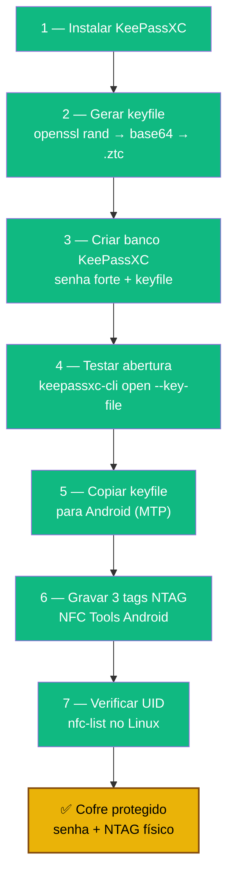

# Playbook 01 — KeePassXC + NTAG keyfile

**Objetivo:** Criar cofre KeePassXC protegido por senha + keyfile gravado em 3 tags NTAG.  
**Tempo:** ~20 min  
**Pré-requisitos:**
- [ ] KeePassXC 2.7.12+ instalado
- [ ] 3 tags NTAG215 em mãos
- [ ] Celular Android com NFC + app **NFC Tools** instalado (F-Droid ou Play Store)
- [ ] `age` instalado (`sudo apt install -y age`) — necessário no Playbook 03

---

## Visão geral do processo



---

## 1 — Instalar KeePassXC

```sh
sudo apt install -y keepassxc
keepassxc --version   # deve mostrar 2.7.x ou superior
```

---

## 2 — Gerar o keyfile

```sh
# Criar pasta de trabalho
mkdir -p ~/cofre ~/ztc-backup

# Gerar keyfile com 64 bytes de entropia (512 bits) — padrão NIST 2026
openssl rand -base64 64 > ~/keepass-keyfile.ztc
chmod 600 ~/keepass-keyfile.ztc

# Confirmar que foi criado
ls -lh ~/keepass-keyfile.ztc
wc -c ~/keepass-keyfile.ztc   # deve mostrar ~89 bytes (base64 de 64 bytes)
```

---

## 3 — Criar o banco de dados KeePassXC

**Via GUI (obrigatório para criar o banco corretamente):**

1. Abra o KeePassXC
2. **Database → New Database**
3. Nome: `Lab Passwords` — Next
4. Em **Encryption Settings** → Next (padrão está OK)
5. Em **Database Credentials:**
   - Marque **Password** → defina uma senha forte
   - Marque **Key File** → clique em **Browse** → selecione `~/keepass-keyfile.ztc`
6. **Done** → salve como `~/cofre/lab-passwords.kdbx`

---

## 4 — Testar abertura (confirmar que senha + keyfile são necessários)

```sh
# Use keepassxc-cli (sintaxe correta para 2.7.x+)
keepassxc-cli open --key-file ~/keepass-keyfile.ztc ~/cofre/lab-passwords.kdbx
```

O CLI vai pedir a senha e abrir o banco em modo interativo. Digite `exit` para sair.

> **Nota:** O comando `keepassxc --keyfile <arquivo>` **não funciona** na maioria das versões 2.7.x.
> Para abrir via GUI, simplesmente abra o KeePassXC normalmente — ele lembrará o keyfile configurado.

---

## 5 — Copiar keyfile para o celular

> **Base testada:** Debian 13 (Trixie). Em outras distros, ajuste o gerenciador de pacotes e procure o equivalente local.

**Opção A — Via terminal (`simple-mtpfs`):**

```sh
sudo apt install -y simple-mtpfs
mkdir -p ~/mnt-android
simple-mtpfs ~/mnt-android

cp ~/keepass-keyfile.ztc ~/mnt-android/Documents/

fusermount -u ~/mnt-android
```

**Opção B — Gerenciador de arquivos do desktop (GNOME, KDE, XFCE):**

Conecte o Android via USB → desbloqueie → escolha **"Transferência de arquivos"** → arraste `~/keepass-keyfile.ztc` para a pasta `Documents` do celular. O Nautilus/Dolphin monta MTP nativamente, sem pacotes extras.

> ⚠️ Se você estiver no **Ubuntu 24.04**, `simple-mtpfs` tem regressão conhecida — use a Opção B, Bluetooth ou microSD.

> **iPhone:** o iOS não monta como drive USB no Linux (protocolo AFC, não MTP) e o **Core NFC não permite gravar arquivos binários em NTAG215**. Use Android emprestado para gravar as tags; o iPhone consegue só ler depois (NFC Tools Pro, ~R$15).

---

## 6 — Gravar as 3 tags NTAG no celular

No celular Android com **NFC Tools**:

1. Abra o app → aba **Write**
2. **Add a record → Files → Custom** → selecione `keepass-keyfile.ztc`
3. Aproxime a tag NTAG → **Write / OK**
4. Repita para as outras 2 tags

**Destinos das tags (separação obrigatória):**
- Tag 1 → bolsa/bolso (uso diário)
- Tag 2 → gaveta/cofre em casa (reserva)
- Tag 3 → local off-site (familiar, escritório)

> ⚠️ **NTAG215 é clonável** com hardware acessível (Proxmark3, apps Android avançados).
> O UID **não é segredo nem fator de autenticação forte** — é apenas um identificador.
> A segurança real vem do *conteúdo* gravado na tag (o keyfile), combinado com a senha do KeePassXC.
> Trate a tag como uma chave física: quem a tiver **e** souber a senha consegue abrir o cofre.

---

## 7 — Verificar leitura no Linux

```sh
sudo apt install -y libnfc-bin

# Conecte o leitor NFC USB e aproxime uma tag
nfc-list
# Saída esperada: UID da tag, ex: 04:AB:CD:EF:12:34:56
```

---

✅ **Concluído** — você tem um cofre KeePassXC que só abre com senha + tag NFC física.

**Próximo passo obrigatório:** → [Playbook 03 — Backup do keyfile com age](./03-age-backup-keyfile.md) (não pule)  
**Depois:** → [Playbook 02 — Volume VeraCrypt](./02-veracrypt-vault.md)

📖 **Referência no curso:** [COMANDO 2B.1](../🎓%20Zero-Trust-Core-Expert%20-%20Versão%201.0.md#-comando-2b1-gerar-keyfile-no-keepassxc) · [2B.2](../🎓%20Zero-Trust-Core-Expert%20-%20Versão%201.0.md#-comando-2b2-backup-cifrado-do-keyfile-age--obrigatório-antes-dos-ntags) · [2B.3](../🎓%20Zero-Trust-Core-Expert%20-%20Versão%201.0.md#-comando-2b3-gravar-o-mesmo-keyfile-em-3-ntags) · [2B.4](../🎓%20Zero-Trust-Core-Expert%20-%20Versão%201.0.md#-comando-2b4-abrir-cofre-com-senha--keyfile)
