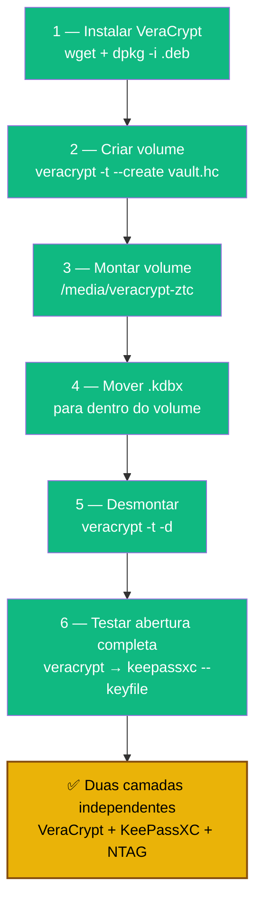

# Playbook 02 — VeraCrypt vault

**Objetivo:** Criar volume VeraCrypt e mover o `.kdbx` para dentro dele.  
**Tempo:** ~10 min  
**Pré-requisitos:**
- [ ] `lab-passwords.kdbx` criado (Playbook 01)
- [ ] `keepass-keyfile.ztc` criado (Playbook 01)

---

## Visão geral do processo



---

## 1 — Instalar VeraCrypt

```sh
# Baixar o .deb oficial (NÃO está nos repos Ubuntu)
wget -O /tmp/veracrypt.deb \
  "https://launchpad.net/veracrypt/trunk/1.26.24/+download/veracrypt-1.26.24-Ubuntu-24.04-amd64.deb"

sudo dpkg -i /tmp/veracrypt.deb

veracrypt --version   # deve mostrar 1.26.24
```

---

## 2 — Criar o volume criptografado

```sh
mkdir -p ~/cofre

veracrypt -t --create ~/cofre/vault.hc \
  --size=100M \
  --encryption=AES \
  --hash=SHA-512 \
  --filesystem=Ext4 \
  --volume-type=Normal \
  --password="" \
  --random-source=/dev/urandom
```

> O comando vai pedir a **senha mestra** interativamente. Use uma senha forte e diferente da do KeePass.

---

## 3 — Montar o volume

```sh
sudo mkdir -p /media/veracrypt-ztc

veracrypt -t ~/cofre/vault.hc /media/veracrypt-ztc
# Informe a senha quando solicitado
```

---

## 4 — Mover o banco KeePassXC para dentro do volume

```sh
mv ~/cofre/lab-passwords.kdbx /media/veracrypt-ztc/

# Confirmar
ls -lh /media/veracrypt-ztc/
```

---

## 5 — Desmontar

```sh
veracrypt -t -d /media/veracrypt-ztc
```

---

## 6 — Testar abertura completa

```sh
# Montar volume
veracrypt -t ~/cofre/vault.hc /media/veracrypt-ztc

# Abrir KeePassXC com o banco dentro do volume
keepassxc --keyfile ~/keepass-keyfile.ztc \
  /media/veracrypt-ztc/lab-passwords.kdbx

# Ao fechar o KeePassXC, desmontar:
veracrypt -t -d /media/veracrypt-ztc
```

---

✅ **Concluído** — `vault.hc` montado → `lab-passwords.kdbx` dentro → só abre com senha VeraCrypt + senha KeePass + keyfile NTAG.

**Próximo passo:** → [Playbook 04 — Script de abertura automática](./04-abrir-cofre-auto.md)

📖 **Referência no curso:** COMANDO 3.1.1, 3.1.2, 3.1.3
