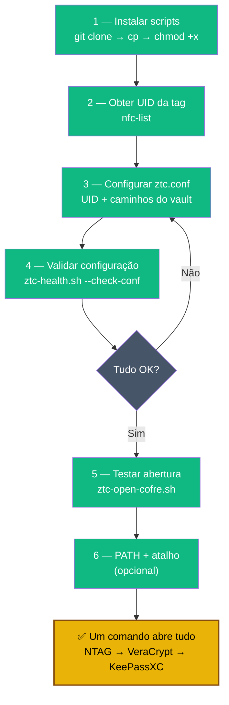

# Playbook 04 — Script de abertura automática

**Objetivo:** Configurar `ztc-open-cofre.sh` para abrir vault + KeePassXC com um comando.  
**Tempo:** ~15 min  
**Pré-requisitos:**
- [ ] Playbooks 01, 02 e 03 concluídos
- [ ] Leitor NFC USB conectado
- [ ] `nfc-list` funcionando (veja Playbook 01, Passo 7)

---

## Visão geral do processo



---

## 1 — Instalar o script

```sh
mkdir -p ~/bin ~/ztc-backup/manifest

# Clonar ou baixar o repositório
git clone https://github.com/VIPs-com/Zero-Trust-Core.git /tmp/ztc-repo

# Copiar scripts
cp /tmp/ztc-repo/scripts/ztc-open-cofre.sh ~/bin/
cp /tmp/ztc-repo/scripts/ztc-health.sh ~/bin/
cp /tmp/ztc-repo/scripts/ztc-rsync-offsite.sh ~/bin/
chmod +x ~/bin/ztc-*.sh

# Copiar arquivo de configuração
cp /tmp/ztc-repo/scripts/ztc.conf.example ~/ztc-backup/ztc.conf
```

---

## 2 — Obter o UID da tag NTAG

```sh
# Coloque a tag NTAG no leitor e rode:
nfc-list
```

Saída esperada:
```
NFC device: ACS ACR122U A9 opened
1 ISO14443A passive target(s) found:
ISO14443A (106 kbps) target:
    ATQA (SENS_RES): 00  44
       UID (NFCID1): 04 AB CD EF 12 34 56
```

Copie o UID sem espaços: `04:AB:CD:EF:12:34:56`

---

## 3 — Configurar `ztc.conf`

```sh
nano ~/ztc-backup/ztc.conf
```

Preencha as variáveis (substitua pelos seus caminhos reais):

```sh
ZTC_NFC_UID="04:AB:CD:EF:12:34:56"         # UID copiado no passo anterior
ZTC_VAULT_HC="$HOME/cofre/vault.hc"
ZTC_MOUNT_POINT="/media/veracrypt-ztc"
ZTC_KDBX="$ZTC_MOUNT_POINT/lab-passwords.kdbx"
ZTC_KEYFILE="$HOME/keepass-keyfile.ztc"
ZTC_REMOTE=""                               # deixe vazio por ora (Playbook 09)
ZTC_SSH_KEY=""                              # deixe vazio por ora
ZTC_MANIFEST_DIR="$HOME/ztc-backup/manifest"
```

Salvar: `Ctrl+O → Enter → Ctrl+X`

---

## 4 — Validar a configuração

```sh
~/bin/ztc-health.sh --check-conf
# Deve mostrar: [OK] para cada variável configurada
```

---

## 5 — Testar abertura completa

```sh
# Com a tag NTAG no leitor:
~/bin/ztc-open-cofre.sh

# Fluxo esperado:
# [OK] NTAG presente (UID: 04:AB:...)
# Informe a senha do VeraCrypt: ****
# [OK] Volume montado
# [OK] Abrindo KeePassXC...
```

---

## 6 — (Opcional) Adicionar ao PATH para abrir de qualquer lugar

```sh
echo 'export PATH="$HOME/bin:$PATH"' >> ~/.bashrc
source ~/.bashrc

# Agora você pode digitar apenas:
ztc-open-cofre.sh
```

---

## 7 — (Opcional) Atalho de desktop

```sh
cat > ~/.local/share/applications/ztc-cofre.desktop << 'EOF'
[Desktop Entry]
Name=Abrir Cofre ZTC
Comment=NFC + VeraCrypt + KeePassXC
Exec=bash -c 'source ~/.bashrc; ~/bin/ztc-open-cofre.sh'
Icon=keepassxc
Terminal=true
Type=Application
Categories=Security;
EOF
```

---

✅ **Concluído** — `ztc-open-cofre.sh` funcionando. Um comando abre tudo.

**Próximo passo Turbo:** → [Playbook 10 — Restore test mensal](./10-restore-test.md)  
**Próximo passo Expert:** → [Playbook 05 — Chave mestra PGP no Tails](./05-tails-master-pgp.md)

📖 **Referência no curso:** [COMANDO 5.0](../🎓%20Zero-Trust-Core-Expert%20-%20Versão%201.0.md#-comando-50-validar-ztcconf-antes-dos-scripts) · [5.3](../🎓%20Zero-Trust-Core-Expert%20-%20Versão%201.0.md#-comando-53-keepass--veracrypt-condicional-nfc-opcional)
