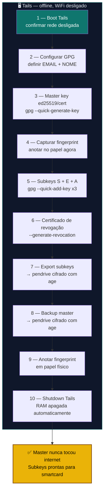

# Playbook 05 — Chave mestra PGP no Tails (air-gap)

**Objetivo:** Gerar master key [C] + subkeys [S][E][A] offline, certificado de revogação e backup cifrado.  
**Tempo:** ~45 min  
**Pré-requisitos:**
- [ ] Pendrive Tails 7.8+ gravado ([COMANDO 0.5](../🎓%20Zero-Trust-Core-Expert%20-%20Versão%201.0.md#-comando-05-pré-vôo-do-tails-no-host-com-internet) do curso)
- [ ] Pendrive extra (para exportar subkeys e backup)
- [ ] Papel e caneta (para anotar fingerprint)
- [ ] **Desligar WiFi e remover cabo de rede antes de iniciar**

---

## Visão geral do processo



> ⚠️ **Cada nó acima acontece SOMENTE no Tails.** Nada deste fluxo toca seu PC de uso diário.

---

## ANTES DE COMEÇAR

```
⚠️  Este procedimento é feito INTEIRAMENTE no Tails.
    Nada acontece no seu PC de uso diário.
    A master key NUNCA toca uma máquina com internet.
```

---

## 1 — Bootar o Tails

1. Inserir pendrive Tails → Reiniciar → Boot pelo pendrive
2. Na tela Welcome: **não ativar** persistência ainda → Start Tails
3. Confirmar: rede desativada → símbolo de WiFi com X na barra

---

## 2 — Configurar GPG no Tails

```sh
# Abrir terminal no Tails (Applications → Tools → Terminal)

# Definir o email da sua chave (substitua pelo seu)
EMAIL="voce@exemplo.com"
NOME="Seu Nome"

# Criar pasta de trabalho temporária
mkdir -p /tmp/pgp-lab
```

---

## 3 — Gerar a chave mestra [C]

```sh
gpg --quick-generate-key \
  "$NOME <$EMAIL>" \
  ed25519/cert \
  cert \
  3y
```

> Quando pedir passphrase: use uma senha forte. Anote no papel — se perder, perde o acesso à master.

---

## 4 — Capturar o fingerprint

```sh
gpg --list-secret-keys --with-fingerprint "$EMAIL"
```

Saída esperada:
```
sec   ed25519 2026-05-26 [C] [expires: 2029-05-26]
      ABCD 1234 EF56 7890 ABCD  1234 EF56 7890 ABCD 1234
uid           [ultimate] Seu Nome <voce@exemplo.com>
```

**Anote o fingerprint no papel agora.** Guarde junto com a revogação.

```sh
FPRINT="ABCD1234EF567890ABCDABCD1234EF567890ABCD1234"   # substitua pelo seu
```

---

## 5 — Adicionar subkeys [S][E][A]

```sh
# Subchave de assinatura [S]
gpg --quick-add-key "$FPRINT" ed25519 sign 2y

# Subchave de criptografia [E]
gpg --quick-add-key "$FPRINT" cv25519 encr 2y

# Subchave de autenticação [A]
gpg --quick-add-key "$FPRINT" ed25519 auth 2y

# Confirmar as 4 chaves (1 master + 3 subkeys)
gpg -K --with-keygrip "$EMAIL"
```

---

## 6 — Gerar certificado de revogação

```sh
gpg --generate-revocation --output /tmp/pgp-lab/revogacao.asc "$FPRINT"
# Responder: y → 0 (sem razão específica) → Enter
```

---

## 7 — Exportar subkeys para o pendrive extra

```sh
# Inserir pendrive extra
# Montar: Applications → Files → clicar no pendrive → anotar o caminho
PENDRIVE="/media/amnesia/SEUPENDRIVE"    # ajuste pelo caminho real

# Exportar somente as subkeys (sem a master)
gpg --export-secret-subkeys "$FPRINT" | \
  age -p -o "$PENDRIVE/subkeys.gpg.age"

# Exportar chave pública
gpg --export --armor "$FPRINT" > "$PENDRIVE/chave-publica.asc"

# Copiar revogação
cp /tmp/pgp-lab/revogacao.asc "$PENDRIVE/"
```

---

## 8 — Backup da master key (nunca sai do Tails em texto claro)

```sh
# Fazer backup da master cifrado com age
gpg --export-secret-keys "$FPRINT" | \
  age -p -o "$PENDRIVE/master-backup.gpg.age"

# A master key em texto claro NUNCA vai para o PC diário
```

---

## 9 — Imprimir ou anotar o fingerprint

```sh
# Exibir fingerprint de forma limpa para anotar
gpg --fingerprint "$EMAIL"
```

Anote em papel e guarde com a revogação em local físico seguro.

---

## 10 — Shutdown seguro do Tails

```sh
# Confirmar que o pendrive foi ejetado
sync
```

1. Ejetar o pendrive extra pelo gerenciador de arquivos
2. Applications → Log Out → **Shut Down**
3. O Tails apaga a RAM automaticamente ao desligar

---

✅ **Concluído** — master key criada, subkeys exportadas, revogação guardada. A master NUNCA tocou internet.

**Próximo passo:** → [Playbook 06 — Smartcard keytocard](./06-smartcard-keytocard.md)

📖 **Referência no curso:** [COMANDO 1.2](../🎓%20Zero-Trust-Core-Expert%20-%20Versão%201.0.md#-comando-12-gerar-master--subkeys-offline) · [1.3](../🎓%20Zero-Trust-Core-Expert%20-%20Versão%201.0.md#-comando-13-certificado-de-revogação-no-mesmo-dia) · [1.4](../🎓%20Zero-Trust-Core-Expert%20-%20Versão%201.0.md#-comando-14-backup-da-master-mídia-offline-dedicada) · [1.5](../🎓%20Zero-Trust-Core-Expert%20-%20Versão%201.0.md#-comando-15-exportar-material-para-o-pc-de-trabalho-sem-a-master) · [1.6](../🎓%20Zero-Trust-Core-Expert%20-%20Versão%201.0.md#-comando-16-checklist-antes-de-desligar-o-tails)
