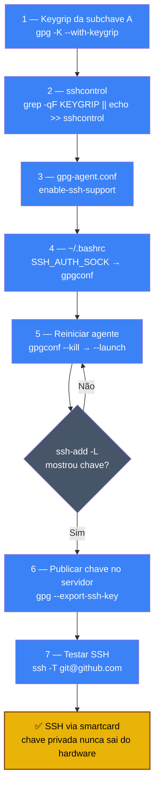

# Playbook 07 — SSH via gpg-agent (smartcard)

**Objetivo:** Usar a subchave [A] do smartcard como chave SSH. Login em servidores sem chave privada no disco.  
**Tempo:** ~15 min  
**Pré-requisitos:**
- [ ] Smartcard configurado com subkeys (Playbook 06)
- [ ] `gpg --card-status` mostrando as 3 chaves

---

## Visão geral do processo



---

## 1 — Obter o keygrip da subchave [A]

```sh
# Substituir pelo fingerprint da sua chave
FPRINT="ABCD1234EF567890ABCDABCD1234EF567890ABCD1234"

gpg -K --with-keygrip "$FPRINT"
```

Saída esperada:
```
sec#  ed25519 [C]
      Keygrip = AAAA...
ssb>  ed25519 [S]
      Keygrip = BBBB...
ssb>  cv25519 [E]
      Keygrip = CCCC...
ssb>  ed25519 [A]          ← esta
      Keygrip = DDDDDDDDDDDDDDDDDDDDDDDDDDDDDDDDDDDDDDDD
```

Copie o keygrip da linha `[A]`.

---

## 2 — Registrar no sshcontrol

```sh
# Criar arquivo sshcontrol se não existir
touch ~/.gnupg/sshcontrol

# Verificar se o keygrip já existe (evitar duplicata)
KEYGRIP="DDDDDDDDDDDDDDDDDDDDDDDDDDDDDDDDDDDDDDDD"   # substitua pelo seu

grep -qF "$KEYGRIP" ~/.gnupg/sshcontrol || \
  echo "$KEYGRIP" >> ~/.gnupg/sshcontrol

cat ~/.gnupg/sshcontrol   # deve mostrar o keygrip
```

---

## 3 — Configurar gpg-agent para SSH

```sh
# Adicionar ao gpg-agent.conf
mkdir -p ~/.gnupg
cat >> ~/.gnupg/gpg-agent.conf << 'EOF'
enable-ssh-support
default-cache-ttl 600
max-cache-ttl 7200
EOF

chmod 700 ~/.gnupg
chmod 600 ~/.gnupg/gpg-agent.conf
```

---

## 4 — Apontar SSH_AUTH_SOCK para o gpg-agent

```sh
# Adicionar ao ~/.bashrc
cat >> ~/.bashrc << 'EOF'

# gpg-agent como SSH agent
export SSH_AUTH_SOCK="$(gpgconf --list-dirs agent-ssh-socket)"
EOF

source ~/.bashrc
```

---

## 5 — Reiniciar o gpg-agent

```sh
gpgconf --kill gpg-agent
gpgconf --launch gpg-agent

# Verificar: deve listar a chave pública da subchave [A]
ssh-add -L
```

Saída esperada:
```
ssh-ed25519 AAAAC3Nz... cardno:000600...
```

---

## 6 — Adicionar a chave pública ao servidor remoto

```sh
# Exportar a chave pública SSH
gpg --export-ssh-key "$FPRINT"
```

Copie a saída e adicione ao `~/.ssh/authorized_keys` do servidor:

```sh
# No servidor remoto:
echo "ssh-ed25519 AAAAC3Nz... cardno:..." >> ~/.ssh/authorized_keys
```

---

## 7 — Testar conexão

```sh
# Testar com GitHub (exemplo)
ssh -T git@github.com
# Pede o PIN do smartcard → responde: Hi username! You've successfully authenticated.

# Testar com servidor próprio
ssh -v usuario@192.168.1.X
```

---

## 8 — Configurar ~/.ssh/config (opcional)

```sh
cat >> ~/.ssh/config << 'EOF'

Host meu-servidor
  HostName 192.168.1.X
  User ubuntu
  IdentitiesOnly yes
EOF
```

---

✅ **Concluído** — SSH autenticado pelo smartcard. A chave privada nunca sai do hardware.

**Próximo passo:** → [Playbook 08 — Backup HD 3-2-1-1-0](./08-backup-hd-3211.md)

📖 **Referência no curso:** COMANDO 3.2.1, 3.2.2, 3.2.3
