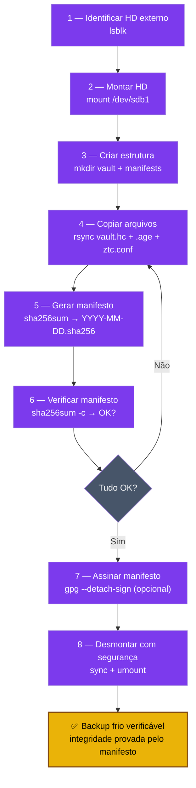

# Playbook 08 — Backup HD + manifesto sha256

**Objetivo:** Cópia fria do vault + kdbx em HD externo com manifesto de integridade verificável.  
**Tempo:** ~10 min  
**Pré-requisitos:**
- [ ] `vault.hc` e `lab-passwords.kdbx` criados (Playbooks 01 e 02)
- [ ] HD externo USB conectado

---

## Visão geral do processo



---

## 1 — Identificar o HD externo

```sh
lsblk
# Exemplo de saída:
# sdb      8:16   1  1.8T  0 disk
# └─sdb1   8:17   1  1.8T  0 part  /media/usuario/BACKUP_HD
```

---

## 2 — Montar o HD (se não montou automaticamente)

```sh
sudo mkdir -p /media/backup-hd
sudo mount /dev/sdb1 /media/backup-hd
```

---

## 3 — Criar estrutura no HD

```sh
mkdir -p /media/backup-hd/ztc-backup/{vault,manifests}
```

---

## 4 — Copiar os arquivos

```sh
# Cofre VeraCrypt (já criptografado — pode copiar aberto ou fechado)
# SEMPRE copiar com o vault FECHADO (desmontado)
veracrypt -t -d /media/veracrypt-ztc 2>/dev/null || true

rsync -av --progress \
  ~/cofre/vault.hc \
  /media/backup-hd/ztc-backup/vault/

# Backup do keyfile cifrado
rsync -av --progress \
  ~/ztc-backup/keepass-keyfile.ztc.age \
  /media/backup-hd/ztc-backup/

# Scripts e configuração (sem senhas)
rsync -av --progress \
  ~/ztc-backup/ztc.conf \
  /media/backup-hd/ztc-backup/
```

---

## 5 — Gerar manifesto de integridade

```sh
MANIFEST="/media/backup-hd/ztc-backup/manifests/$(date +%Y-%m-%d).sha256"

sha256sum \
  /media/backup-hd/ztc-backup/vault/vault.hc \
  /media/backup-hd/ztc-backup/keepass-keyfile.ztc.age \
  > "$MANIFEST"

cat "$MANIFEST"
```

Saída esperada:
```
a3f8c2d1...  /media/backup-hd/ztc-backup/vault/vault.hc
b7e4f9a2...  /media/backup-hd/ztc-backup/keepass-keyfile.ztc.age
```

---

## 6 — Verificar o manifesto

```sh
sha256sum -c "$MANIFEST"
# Saída esperada:
# /media/.../vault.hc: OK
# /media/.../keepass-keyfile.ztc.age: OK
```

---

## 7 — Assinar o manifesto com GPG (opcional, recomendado)

```sh
# Requer smartcard conectado e pcscd ativo
gpg --detach-sign --armor "$MANIFEST"
# Cria: manifesto.sha256.asc
```

---

## 8 — Desmontar o HD com segurança

```sh
sync
sudo umount /media/backup-hd
# Aguardar o LED do HD parar de piscar antes de desconectar
```

---

## Frequência recomendada

| Evento | Ação |
|--------|------|
| Toda alteração no vault.hc | Repetir passos 4–6 |
| Todo mês | Verificar manifesto (Playbook 10) |
| Toda 2ª cópia | HD off-site (diferente do HD local) |

---

✅ **Concluído** — backup frio com integridade verificável. Se o HD sumir, o manifesto prova o que estava lá.

**Próximo passo Expert:** → [Playbook 09 — WireGuard + VM off-site](./09-wireguard-vm.md)  
**Verificação mensal:** → [Playbook 10 — Restore test](./10-restore-test.md)

📖 **Referência no curso:** COMANDO 4.1, 4.2, 4.3
