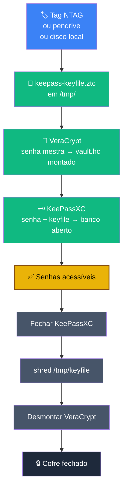

# Playbook 00 — Uso diário + Como o modelo de segurança funciona

**Objetivo:** Entender o modelo de proteção do cofre e saber abrir/fechar no dia a dia, manualmente, antes da automação.
**Tempo:** ~10 min de leitura + prática
**Pré-requisitos:**
- Para a **parte conceitual** (modelo, tabelas): nenhum — leia primeiro.
- Para a **parte prática** (abrir/fechar manual): Playbooks 01, 02 e 03 concluídos.

> 📍 **Onde este playbook se encaixa:** leia o conceito **antes** de construir, execute a prática **depois** de 01-03 e **antes** de automatizar com o 04. Ele é a ponte entre "construí o cofre" e "uso o cofre todo dia".

---

## Antes de tudo — entenda o que você construiu

Seu cofre tem **três fatores independentes** de proteção:

```
┌─────────────────────────────────────────────────────────┐
│                   PARA ABRIR O COFRE                    │
│                                                         │
│   FATOR 1          FATOR 2           FATOR 3            │
│   Senha            Senha             Keyfile            │
│   VeraCrypt        KeePassXC         (arquivo .ztc)     │
│                                                         │
│   "algo que        "algo que         "algo que          │
│    você sabe"       você sabe"        você tem"         │
└─────────────────────────────────────────────────────────┘
```

O **keyfile** é o seu **2FA físico**.

Sem o arquivo `keepass-keyfile.ztc`, as duas senhas juntas não abrem nada.
Sem as senhas, o arquivo sozinho não abre nada.
Você precisa dos **três ao mesmo tempo**.

---

## O keyfile é tão importante quanto a senha — entenda por quê

> A senha do KeePassXC é a **combinação do cofre**.
> O keyfile é a **chave física do cofre**.
> Você precisa dos dois — como um cofre bancário que exige chave + combinação.

Se alguém descobrir sua senha do KeePassXC mas não tiver o keyfile → **não abre**.
Se alguém roubar a tag NTAG mas não souber a senha → **não abre**.
Se alguém tiver os dois mas não souber a senha do VeraCrypt → **não chega nem lá**.

Isso é **defesa em profundidade real** — cada camada protege as outras.

---

## Onde o keyfile fica guardado?

Em três lugares, cada um com um propósito:

```
┌─────────────────────────────────────────────────────────────────┐
│  ONDE               FORMATO          PARA QUÊ                   │
├─────────────────────────────────────────────────────────────────┤
│  3 tags NTAG215     arquivo gravado  uso diário (fator físico)  │
│  (cartões físicos)  na tag           você aproxima e usa        │
├─────────────────────────────────────────────────────────────────┤
│  Pendrive           .ztc.age         BACKUP — se perder         │
│  (off-site)         (cifrado com     todas as tags, recupera    │
│                      age)            o keyfile com a senha age  │
├─────────────────────────────────────────────────────────────────┤
│  ~/keepass-         .ztc             cópia local opcional       │
│  keyfile.ztc        (texto claro)    para automação (Playbook   │
│  (disco Linux)                       04) — proteja com chmod 600│
└─────────────────────────────────────────────────────────────────┘
```

---

## "Se perder a tag, perco o cofre?"

**Não** — desde que você tenha feito o Playbook 03 (backup com `age`).

Fluxo de recuperação se perder todas as tags:

```
1. Pegue o pendrive de backup (off-site)
2. Decifre o backup:
   age -d ~/ztc-backup/keepass-keyfile.ztc.age > ~/keepass-keyfile.ztc
3. Use o arquivo recuperado para abrir o cofre normalmente
4. Grave novas tags NTAG com o keyfile recuperado (Playbook 01, Passo 6)
```

É por isso que o Playbook 03 diz "não pule" — **o backup do keyfile é seu plano B**.

---

## "Preciso do leitor NFC USB para usar no dia a dia?"

**Não.** O leitor USB serve para automação (Playbook 04).
No uso manual, o keyfile pode chegar ao Linux de qualquer forma:

| De onde vem o keyfile | Como transferir para o Linux |
|---|---|
| Tag NTAG + leitor USB | `nfc-mfclassic` lê direto para `/tmp/` |
| Tag NTAG + Android | NFC Tools lê → cabo USB → copia para `/tmp/` |
| Tag NTAG + iPhone | NFC Tools Pro lê → iCloud/AirDrop → copia para `/tmp/` |
| Pendrive de backup | `age -d backup.age > /tmp/keepass-keyfile.ztc` |
| Disco local (se manteve) | já está em `~/keepass-keyfile.ztc` |

**O arquivo é o que importa** — a tag é só o "pendrive NFC" que o carrega.
O NFC é elegante e conveniente, mas não é obrigatório para a segurança funcionar.

---

## Abrindo o cofre — passo a passo manual completo

### Etapa 1 — Obter o keyfile

**Se tiver leitor NFC USB:**
```sh
nfc-mfclassic r a u /tmp/keepass-keyfile.ztc
```

**Se estiver usando Android (NFC Tools):**
1. Abre **NFC Tools** → aba **Read** → aproxima a tag
2. Toca em **Export** → salva como `keepass-keyfile.ztc` em `Documents`
3. Conecta cabo USB → modo **Transferência de arquivos**
4. Copia para `/tmp/keepass-keyfile.ztc` no Linux

**Se estiver usando iPhone (NFC Tools Pro):**
1. Abre **NFC Tools Pro** → **Scan** → aproxima a tag
2. Exporta o arquivo → iCloud Drive ou AirDrop para Mac
3. No Linux: `rclone copy icloud:NFC/keepass-keyfile.ztc /tmp/`

**Se usar o arquivo do disco local diretamente:**
```sh
cp ~/keepass-keyfile.ztc /tmp/keepass-keyfile.ztc
```

---

### Etapa 2 — Montar o volume VeraCrypt

**Via terminal (só pede a senha):**
```sh
sudo mkdir -p /media/veracrypt-ztc
veracrypt -t --pim=0 --keyfiles="" --protect-hidden=no \
  ~/cofre/vault.hc /media/veracrypt-ztc
```

> As flags `--pim=0 --keyfiles="" --protect-hidden=no` suprimem 3 prompts desnecessários — o VeraCrypt pede **só a senha**. (Se você ativou PIM/keyfile/hidden, ajuste conforme o Playbook 02.)

**Via interface gráfica:**
1. Abre o **VeraCrypt** → **Select File** → `~/cofre/vault.hc`
2. Escolhe um slot → **Mount** → digita a senha → OK
3. Volume montado em `/media/veracrypt-ztc/`

---

### Etapa 3 — Abrir o KeePassXC

**Via interface gráfica:**
1. Abre o **KeePassXC** → **Database → Open Database**
2. Seleciona `/media/veracrypt-ztc/lab-passwords.kdbx`
3. **Password** → senha do KeePass · marca **Key File** → Browse → `/tmp/keepass-keyfile.ztc`
4. **OK** → cofre aberto ✅

**Via terminal:**
```sh
keepassxc-cli open \
  --key-file /tmp/keepass-keyfile.ztc \
  /media/veracrypt-ztc/lab-passwords.kdbx
```

> ⚠️ Não use `keepassxc --keyfile X file.kdbx` (GUI) — o flag é **ignorado** em 2.7.x. Use `keepassxc-cli open` (acima) ou abra a GUI e selecione o keyfile no diálogo.

---

### Etapa 4 — Fechar tudo (obrigatório)

```sh
# 1. Feche o KeePassXC pela interface (ou Ctrl+Q)

# 2. Apague o keyfile temporário com segurança
shred -u /tmp/keepass-keyfile.ztc
```

> **Nota:** o `shred` acima e para copias temporarias em `/tmp/`.
> Se usou o arquivo do disco local (`~/keepass-keyfile.ztc`), nao faca shred —
> apenas feche o cofre. O arquivo local esta protegido por `chmod 600`
> e pelo VeraCrypt fechado.

```sh
# 3. Desmonte o volume VeraCrypt
veracrypt -t -d /media/veracrypt-ztc
# ou pela GUI: seleciona o slot → Dismount
```

> ⚠️ Nunca deixe o volume montado sem uso. Desmontar leva 2 segundos e fecha todas as camadas.

---

## 🔒 Trave o cofre sozinho — auto-lock do KeePassXC

Cofre aberto + você saiu da mesa = qualquer um na máquina vê suas senhas. Configure o KeePassXC para se trancar sozinho:

**Ferramentas → Configurações → Segurança:**

| Opção | Valor recomendado | Por quê |
|---|---|---|
| Bloquear bancos após inatividade | **300 segundos** (5 min) | Tranca se você esquecer aberto |
| Bloquear quando a sessão for bloqueada / tampa fechada | ✅ ativado | Tranca ao bloquear a tela |
| Bloquear ao minimizar | ✅ (opcional) | Mais agressivo |
| Limpar área de transferência após | **10 segundos** | Senha copiada não fica no clipboard |

> Sem isso, copiar uma senha a deixa no clipboard até você copiar outra coisa — outro app (ou um gerenciador de clipboard) pode lê-la. O auto-clear resolve.

---

## ⌨️ Keylogger — a verdade honesta sobre o limite do cofre

> 🔴 **Leia com atenção — isto é o que a maioria dos tutoriais não conta.**

O cofre protege seus segredos **em repouso** (disco roubado, backup roubado, dispositivo perdido) e **contra quem não tem os três fatores**. Mas existe um vetor que **nenhuma camada criptográfica do cofre alcança**: um **keylogger** rodando no seu sistema de uso diário.

### Por que o keylogger fura tudo

Um keylogger captura o que você **digita** — incluindo a senha do VeraCrypt e a senha do KeePassXC — **no momento em que você as digita**, antes de qualquer cifragem. O ataque acontece na entrada do teclado, não no arquivo.

```
Você digita a senha  →  [KEYLOGGER captura aqui]  →  VeraCrypt/KeePassXC cifra
                              ↑
                    a criptografia não protege
                    o que vem ANTES dela
```

### O que o cofre AINDA protege, mesmo com keylogger ativo

| Cenário | Protegido? |
|---|---|
| Disco/backup roubado (cofre fechado) | ✅ Sim — keylogger não alcança dados em repouso |
| Keyfile (não é digitado, é arquivo) | ✅ A senha vaza, mas o keyfile não é "tecladado" |
| Atacante tem só as senhas capturadas | ✅ Ainda falta o keyfile físico (tag/arquivo) |
| Atacante tem keylogger **+ acesso ao keyfile** | ❌ Cofre comprometido quando aberto |

### Mitigações reais (não é teatro de segurança)

1. **A base é manter o SO limpo.** Zero Trust começa num host não comprometido: atualizações em dia, mínimo de software, nada de pirataria/cracks, downloads verificados. Se o host está limpo, não há keylogger. Esta é a defesa principal — as outras são reforço.

2. **Tails para operações de altíssimo valor.** Gerar/usar a master PGP (Playbook 05), decisões críticas: faça no Tails. Ele roda da RAM, sem persistência, ambiente conhecido e descartável — reduz drasticamente a chance de keylogger residente. É por isso que a master **nunca** sai do Tails.

3. **Smartcard (trilha Expert) tem vantagem real aqui.** O PIN ainda é digitado (e pode ser capturado), mas a chave privada **nunca sai do token**. Um keylogger captura o PIN — e o PIN sozinho é **inútil sem o cartão físico** na mão do atacante. Compare com o keyfile em disco: se o atacante tem o arquivo + senha capturada, abre. O smartcard quebra esse encadeamento.

4. **Auto-Type do KeePassXC** preenche senhas sem você digitar — derrota keyloggers simples de userspace. **Mas não resolve keylogger de kernel** (que vê o input sintético também). Reduz a superfície, não elimina.

5. **2FA/TOTP em contas críticas.** Mesmo que uma senha vaze pelo keylogger, o segundo fator (app autenticador, Módulo H6) limita o estrago.

### A conclusão honesta

> Se o seu SO de uso diário está **ativamente comprometido com um keylogger de kernel**, **nenhum** cofre de senhas é totalmente seguro enquanto está aberto — o atacante vê o que você digita. O ZTC **mitiga, não elimina**: mantenha o host limpo (base do modelo), use Tails para o que é crítico, e prefira smartcard, onde o segredo capturável (PIN) é inútil sem o hardware. O cofre continua protegendo dados em repouso e contra roubo físico **mesmo nesse cenário**.

Vender "segurança absoluta" seria mentira. O valor do ZTC é a **honestidade sobre o que cada camada cobre — e o que não cobre**.

---

## Fluxo visual completo



---

## Resumo mental — o que cada coisa protege

| Se alguém tiver... | Consegue abrir? |
|---|---|
| Só a senha do VeraCrypt | ❌ Não — falta senha KeePass + keyfile |
| Só a senha do KeePass | ❌ Não — falta senha VeraCrypt + keyfile |
| Só o keyfile (tag ou arquivo) | ❌ Não — faltam as duas senhas |
| Senha VeraCrypt + senha KeePass | ❌ Não — falta o keyfile |
| Keyfile + senha KeePass | ❌ Não — falta senha VeraCrypt |
| **Os três juntos** | ✅ Sim — e só assim |
| Keylogger ativo + keyfile acessível | ⚠️ Sim — ver seção keylogger acima |

---

## 🛡️ Cartão de bolso — Rotina de Aço

> Resumo imprimível de 1 página. O procedimento acima é o **como**; este cartão é o **lembrete diário** para não relaxar. Imprima, cole na parede ou guarde junto ao pendrive.

**🌅 Ao ligar**
- Sessão limpa (Tails/Whonix ou Debian atualizado); sistema/ISO verificados.
- Conectar o pendrive só quando for usar.

**🔐 Ao acessar o cofre**
- Senha-frase longa e única (frase, não palavra).
- Montar VeraCrypt/LUKS → usar → `shred /tmp/keyfile` → desmontar.
- **Nunca** digitar seed em máquina online.

**📲 No dia a dia**
- Wi-Fi público só com Tor (ou bridge). Nada de "VPN grátis por garantia".
- Não misturar conta pessoal com o ambiente seguro.
- Não abrir anexo/link suspeito.

**🌙 Ao desligar**
- Desmontar o pendrive e guardar.
- Desligar de fato (não suspender).
- Conferir que não ficou mídia conectada.

**⚠️ Regras de ouro**
- **3-2-1-1-0**: 3 cópias · 2 mídias · 1 off-site · 1 imutável · 0 erros (teste o restore).
- Disciplina > tecnologia. Camadas sem rotina = **teatro de segurança**.

> 🧘 **Mantras:** *"Disciplina vence o Red Team."* · *"Não existe bala de prata — só rotina de aço."*

---

✅ **Concluído** — você entende o modelo e sabe abrir/fechar o cofre manualmente.

**Próximo passo:** → [Playbook 04 — Automação com ztc-open-cofre.sh](./04-abrir-cofre-auto.md) (colapsa tudo isso em 1 comando + atalho de desktop)

📖 **Referência no curso:** [Módulo 1 — Modelo Zero Trust](../../🎓%20Zero-Trust-Core-Expert%20-%20Versão%201.0.md#-2-parte-1-primeiros-passos-semana-1) · [Threat model (Módulo 7)](../../🎓%20Zero-Trust-Core-Expert%20-%20Versão%201.0.md#-5-parte-4-expert-e-futuro-semana-4)
