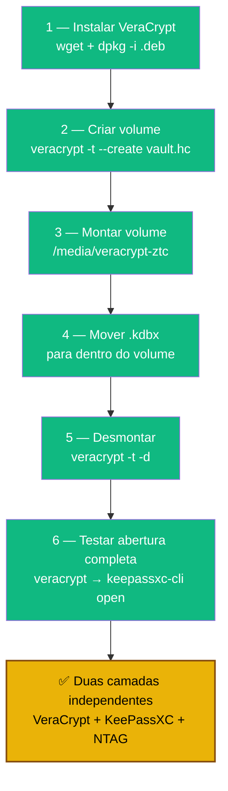

# Playbook 02 — VeraCrypt vault

**Objetivo:** Criar volume VeraCrypt e mover o `.kdbx` para dentro dele.  
**Tempo:** ~10 min  
**Pré-requisitos:**
- [ ] `lab-passwords.kdbx` criado (Playbook 01)
- [ ] `keepass-keyfile.ztc` criado (Playbook 01)

---

## Visão geral do processo



---

## 1 — Instalar VeraCrypt

VeraCrypt **não está nos repos Debian/Ubuntu** — baixe o `.deb` oficial em https://veracrypt.fr/en/Downloads.html e escolha o pacote que combina com sua distro.

```sh
# Em Debian 13 (Trixie), o .deb para Ubuntu 22.04 funciona via compatibilidade glibc.
# Aluno em outra distro: baixe o .deb correspondente (Ubuntu 22.04, 24.04, etc.)
wget -O /tmp/veracrypt.deb \
  "https://launchpad.net/veracrypt/trunk/1.26.24/+download/veracrypt-1.26.24-Ubuntu-22.04-amd64.deb"

sudo dpkg -i /tmp/veracrypt.deb
sudo apt -f install   # corrige dependências se faltarem

veracrypt --version   # deve mostrar 1.26.24
```

> **Outras distros:** Fedora/openSUSE têm `.rpm` na mesma página. Arch tem o pacote `veracrypt` no AUR.

---

## 2 — Criar o volume criptografado

```sh
mkdir -p ~/cofre

veracrypt -t --create ~/cofre/vault.hc \
  --size=500M \
  --encryption=AES \
  --hash=SHA-512 \
  --filesystem=Ext4 \
  --volume-type=Normal \
  --random-source=/dev/urandom
```

> O comando vai pedir a **senha mestra** interativamente (2x para confirmar). Use uma senha forte e diferente da do KeePass.

> **Por que 500M e não 100M?** VeraCrypt **não permite redimensionar** volumes depois. 500MB cabe o `.kdbx` + chaves PGP + documentos sensíveis sem precisar recriar. Se preferir menor, use `--size=100M` ciente da limitação.

> ⚠️ **Por que o `--password=""` foi removido?** Em modo não-interativo, esse flag cria o volume com **senha vazia** (falha silenciosa de segurança). Sem o flag, o VeraCrypt pede a senha interativamente — sem ambiguidade.

---

## 3 — Montar o volume

```sh
sudo mkdir -p /media/veracrypt-ztc

veracrypt -t ~/cofre/vault.hc /media/veracrypt-ztc
# Informe a senha quando solicitado
```

---

## 4 — Mover o banco KeePassXC para dentro do volume

```sh
mv ~/cofre/lab-passwords.kdbx /media/veracrypt-ztc/

# Confirmar
ls -lh /media/veracrypt-ztc/
```

---

## 5 — Desmontar

```sh
veracrypt -t -d /media/veracrypt-ztc
```

---

## 6 — Testar abertura completa

```sh
# Montar volume
veracrypt -t ~/cofre/vault.hc /media/veracrypt-ztc

# Abrir KeePassXC com o banco dentro do volume (sintaxe correta para 2.7.x+)
keepassxc-cli open \
  --key-file ~/keepass-keyfile.ztc \
  /media/veracrypt-ztc/lab-passwords.kdbx

# Ao sair do CLI (digite exit), desmontar:
veracrypt -t -d /media/veracrypt-ztc
```

> **Nota:** Use `keepassxc-cli open` (não `keepassxc --keyfile`). O flag `--keyfile` da versão GUI não funciona como argumento de linha de comando nas versões 2.7.x.

---

✅ **Concluído** — `vault.hc` montado → `lab-passwords.kdbx` dentro → só abre com senha VeraCrypt + senha KeePass + keyfile NTAG.

**Próximo passo:** → [Playbook 04 — Script de abertura automática](./04-abrir-cofre-auto.md)

📖 **Referência no curso:** [COMANDO 3.1.1](../../🎓%20Zero-Trust-Core-Expert%20-%20Versão%201.0.md#-comando-311-criar-volume-veracrypt) · [3.1.2](../../🎓%20Zero-Trust-Core-Expert%20-%20Versão%201.0.md#-comando-312-montar-e-guardar-o-kdbx-dentro) · [3.1.3](../../🎓%20Zero-Trust-Core-Expert%20-%20Versão%201.0.md#-comando-313-política-de-sincronização)
