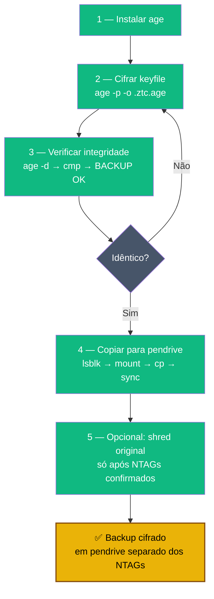

# Playbook 03 — Backup do keyfile com `age`

**Objetivo:** Cifrar o keyfile NTAG com `age` e guardar em pendrive separado.  
**Tempo:** ~5 min  
**Pré-requisitos:**
- [ ] `~/keepass-keyfile.ztc` criado (Playbook 01)
- [ ] Pendrive separado disponível (diferente dos NTAGs)

---

> ⚠️ **Leia antes de começar — regra de separação física:**
> O backup só tem valor se ficar em local **diferente** dos NTAGs.
> Se os 3 NTAGs e o pendrive estiverem no mesmo lugar (mesma gaveta, mesma mochila), você não tem backup real — tem um ponto único de falha.
> **Guarde o pendrive em local off-site: familiar de confiança, cofre bancário ou escritório.**

---

## Visão geral do processo



---

## 1 — Instalar `age`

```sh
sudo apt install -y age
age --version   # deve mostrar v1.x
```

---

## 2 — Cifrar o keyfile

```sh
mkdir -p ~/ztc-backup

# Cifrar com senha interativa (pede 2x para confirmar)
age -p -o ~/ztc-backup/keepass-keyfile.ztc.age ~/keepass-keyfile.ztc
```

> Quando pedir a passphrase: use uma senha **diferente** da senha do KeePass e da senha do VeraCrypt. Anote ou memorize — sem ela, o backup é inútil.

---

## 3 — Verificar a integridade do backup

```sh
# Decifrar em arquivo temporário
age -d ~/ztc-backup/keepass-keyfile.ztc.age > /tmp/keyfile-check.ztc

# Comparar com o original (saída vazia = idênticos = backup OK)
cmp ~/keepass-keyfile.ztc /tmp/keyfile-check.ztc && echo "✅ BACKUP OK — arquivos idênticos"

# Apagar o temporário com segurança
shred -u /tmp/keyfile-check.ztc
```

> Se o `cmp` mostrar diferença (qualquer saída antes da mensagem ✅), **apague o `.age` e repita o Passo 2**.
> Nunca prossiga com um backup que não passou na verificação.

---

## 4 — Copiar o backup para pendrive

```sh
# Descobrir o dispositivo do pendrive
lsblk

# Montar (ajuste sdb1 pelo seu dispositivo)
sudo mount /dev/sdb1 /mnt

# Copiar
cp ~/ztc-backup/keepass-keyfile.ztc.age /mnt/
sync

# Desmontar
sudo umount /mnt
```

> **Pendrive em FAT32?** Sistemas de arquivos FAT/exFAT **não suportam permissões Unix** — `chmod 600` não tem efeito. Se quiser proteção de leitura por usuário no pendrive:
> ```sh
> # Reformate o pendrive como ext4 (apaga tudo!)
> sudo mkfs.ext4 /dev/sdb1
> # Depois monte com seu UID como dono:
> sudo mount -o uid=$(id -u),gid=$(id -g) /dev/sdb1 /mnt
> # E aplique chmod 600 no arquivo .age
> ```
> Trade-off: ext4 não é lido por Windows nativo. Se precisa ler em Windows, deixe FAT32 e confie no `age` (já cifrado por senha).

---

## 5 — (Opcional) Apagar o keyfile em texto claro do disco

```sh
# Só faça isso se tiver certeza que os NTAGs estão gravados corretamente
# e o backup .age está no pendrive
shred -u ~/keepass-keyfile.ztc
```

> Se optar por manter o `keepass-keyfile.ztc` no disco, proteja com `chmod 400`.

---

✅ **Concluído** — backup cifrado do keyfile em pendrive separado dos NTAGs.

📖 **Referência no curso:** [COMANDO 2B.2](../../🎓%20Zero-Trust-Core-Expert%20-%20Versão%201.0.md#-comando-2b2-backup-cifrado-do-keyfile-age--obrigatório-antes-dos-ntags)
