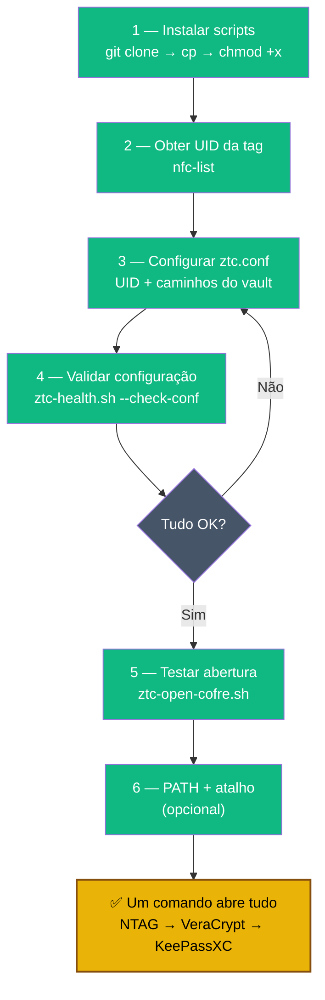

# Playbook 04 — Script de abertura automática

**Objetivo:** Configurar `ztc-open-cofre.sh` para abrir vault + KeePassXC com um comando.  
**Tempo:** ~15 min  
**Pré-requisitos:**
- [ ] Playbooks 01, 02 e 03 concluídos
- [ ] Leitor NFC USB conectado
- [ ] `nfc-list` funcionando (veja Playbook 01, Passo 7)

---

> ⚠️ **Leia antes de começar — sobre a segurança do UID NTAG:**
> O script `ztc-open-cofre.sh` verifica o UID da tag como **checagem de presença física**, não como segredo criptográfico.
> NTAG215 pode ser clonada com hardware acessível (Proxmark3, apps Android avançados). O UID **não é segredo**.
> O que protege o cofre é o *conteúdo* da tag (o keyfile) combinado com a senha do VeraCrypt e a senha do KeePassXC.
> Quem tiver a tag **e** souber as senhas consegue abrir — trate a tag como uma chave física, não como uma senha.

---

## Visão geral do processo



---

## 1 — Instalar o script

```sh
mkdir -p ~/bin ~/ztc-backup/manifest

# Clonar ou baixar o repositório
git clone https://github.com/VIPs-com/Zero-Trust-Core.git /tmp/ztc-repo

# Copiar scripts
cp /tmp/ztc-repo/scripts/ztc-open-cofre.sh ~/bin/
cp /tmp/ztc-repo/scripts/ztc-health.sh ~/bin/
cp /tmp/ztc-repo/scripts/ztc-rsync-offsite.sh ~/bin/
chmod +x ~/bin/ztc-*.sh

# Copiar arquivo de configuração
cp /tmp/ztc-repo/scripts/ztc.conf.example ~/ztc-backup/ztc.conf
```

---

## 2 — Obter o UID da tag NTAG

```sh
# Coloque a tag NTAG no leitor e rode:
nfc-list
```

Saída esperada:
```
NFC device: ACS ACR122U A9 opened
1 ISO14443A passive target(s) found:
ISO14443A (106 kbps) target:
    ATQA (SENS_RES): 00  44
       UID (NFCID1): 04 AB CD EF 12 34 56
```

Copie o UID sem espaços: `04:AB:CD:EF:12:34:56`

---

## 3 — Configurar `ztc.conf`

```sh
nano ~/ztc-backup/ztc.conf
```

Preencha as variáveis (substitua pelos seus caminhos reais):

```sh
ZTC_NFC_UID="04:AB:CD:EF:12:34:56"         # UID copiado no passo anterior
ZTC_VAULT_HC="$HOME/cofre/vault.hc"
ZTC_MOUNT_POINT="/media/veracrypt-ztc"
ZTC_KDBX="$ZTC_MOUNT_POINT/lab-passwords.kdbx"
ZTC_KEYFILE="$HOME/keepass-keyfile.ztc"
ZTC_REMOTE=""                               # deixe vazio por ora (Playbook 09)
ZTC_SSH_KEY=""                              # deixe vazio por ora
ZTC_MANIFEST_DIR="$HOME/ztc-backup/manifest"
```

Salvar: `Ctrl+O → Enter → Ctrl+X`

> **Nota sobre `ZTC_KEYFILE`:** se você executou o Passo 5 do Playbook 03 (`shred -u ~/keepass-keyfile.ztc`), o script não conseguirá ler o keyfile do disco. Nesse caso, copie o keyfile de uma das tags NTAG de volta para `~/keepass-keyfile.ztc` antes de rodar — ou mantenha o arquivo no disco com `chmod 400` (alternativa indicada no Playbook 03 Passo 5).

---

## 4 — Validar a configuração

```sh
~/bin/ztc-health.sh --check-conf
# Deve mostrar: [OK] para cada variável configurada
```

---

## 5 — Testar abertura completa

```sh
# Com a tag NTAG no leitor:
~/bin/ztc-open-cofre.sh

# Fluxo esperado:
# [OK] NTAG presente (UID: 04:AB:...)
# Informe a senha do VeraCrypt: ****
# [OK] Volume montado
# [OK] Abrindo KeePassXC...
```

---

## 6 — (Opcional) Adicionar ao PATH para abrir de qualquer lugar

```sh
echo 'export PATH="$HOME/bin:$PATH"' >> ~/.bashrc
source ~/.bashrc

# Agora você pode digitar apenas:
ztc-open-cofre.sh
```

---

## 7 — (Opcional) Atalho de desktop — abrir cofre

```sh
cat > ~/.local/share/applications/ztc-cofre-abrir.desktop << 'EOF'
[Desktop Entry]
Name=Abrir Cofre ZTC
Comment=NFC + VeraCrypt + KeePassXC
Exec=bash -c 'source ~/.bashrc; ~/bin/ztc-open-cofre.sh'
Icon=keepassxc
Terminal=true
Type=Application
Categories=Security;
EOF
```

---

## 8 — Instalar o script de FECHAR + atalho desktop

```sh
cp /tmp/ztc-repo/scripts/ztc-close-cofre.sh ~/bin/
chmod +x ~/bin/ztc-close-cofre.sh
```

```sh
cat > ~/.local/share/applications/ztc-cofre-fechar.desktop << 'EOF'
[Desktop Entry]
Name=Fechar Cofre ZTC
Comment=Sync + dismount VeraCrypt
Exec=bash -c 'source ~/.bashrc; ~/bin/ztc-close-cofre.sh; read -p "Pressione Enter para sair..."'
Icon=system-lock-screen
Terminal=true
Type=Application
Categories=Security;
EOF
```

**O que ele faz:**
- Detecta se KeePassXC ainda está aberto (avisa para salvar e fechar primeiro)
- `sync` para garantir gravação no disco
- `veracrypt -t -d` desmonta o volume
- Confirma com `[OK] Cofre fechado`

> 💡 **Disciplina diária:** ao terminar de trabalhar, clique "Fechar Cofre ZTC" no menu de aplicativos. 2 segundos pra blindar tudo de novo.

---

✅ **Concluído** — `ztc-open-cofre.sh` + `ztc-close-cofre.sh` funcionando. Dois cliques no desktop para a rotina diária.

---

## 9 — (Avançado) OpSec — disfarçar artefatos no disco

> 🥷 Esta seção é **opcional** e roda DEPOIS de tudo funcionar. O setup padrão do curso usa nomes didáticos (`vault.hc`, `keepass-keyfile.ztc`, `ztc-open-cofre.sh`) porque é mais fácil de aprender. Em produção, esses nomes denunciam o que você guarda.

### O que é gritante por padrão

| Local | Nome óbvio | Visto por... |
|-------|------------|---------------|
| `~/cofre/vault.hc` | "tem um cofre VeraCrypt aqui" | qualquer `ls`, navegador de arquivos |
| `~/keepass-keyfile.ztc` | "isto é keyfile do KeePass" | qualquer `ls` no home |
| `~/bin/ztc-open-cofre.sh` | "este script abre um cofre" | quem lista `~/bin/` ou `ps` |
| `~/ztc-backup/ztc.conf` | "pasta de backup com config" | qualquer `ls` |
| Menu de apps: "Abrir Cofre ZTC" | denuncia tudo | qualquer um na máquina |

> ⚠️ **Limite honesto:** quem ler o **código-fonte** do script vai entender o que ele faz (veracrypt + keepassxc). OpSec por nomes protege contra **listagem rápida**, não contra análise forense.

### Migração — antes vs depois

```sh
# Antes (didático)                          # Depois (discreto)
~/cofre/vault.hc                       →   ~/Documents/archive-2023.tar
~/keepass-keyfile.ztc                  →   ~/.config/.cache_session_b7f2.bin
~/bin/ztc-open-cofre.sh                →   ~/.local/bin/morning-routine.sh
~/bin/ztc-close-cofre.sh               →   ~/.local/bin/end-session.sh
~/ztc-backup/ztc.conf                  →   ~/.config/sync/cfg
/media/veracrypt-ztc/lab-passwords.kdbx →  /media/veracrypt-ztc/recipes.dat
"Abrir Cofre ZTC" (desktop entry)      →   "Morning Routine"
```

### Como aplicar a migração

**1. Rename físico dos arquivos (com cofre desmontado):**
```sh
mv ~/cofre/vault.hc                       ~/Documents/archive-2023.tar
mv ~/keepass-keyfile.ztc                  ~/.config/.cache_session_b7f2.bin

mkdir -p ~/.local/bin ~/.config/sync
mv ~/bin/ztc-open-cofre.sh                ~/.local/bin/morning-routine.sh
mv ~/bin/ztc-close-cofre.sh               ~/.local/bin/end-session.sh
mv ~/ztc-backup/ztc.conf                  ~/.config/sync/cfg
```

**2. Atualizar `cfg` (o ex-`ztc.conf`) com os novos caminhos:**
```sh
ZTC_VAULT_HC="$HOME/Documents/archive-2023.tar"
ZTC_KEYFILE="$HOME/.config/.cache_session_b7f2.bin"
ZTC_KDBX="/media/veracrypt-ztc/recipes.dat"
ZTC_MOUNT_POINT="/media/veracrypt-ztc"   # pode manter — só aparece quando montado
```

**3. Renomear o `.kdbx` na primeira abertura após montar:**
```sh
# Monta com a senha
veracrypt -t --pim=0 --keyfiles="" --protect-hidden=no \
  ~/Documents/archive-2023.tar /media/veracrypt-ztc

mv /media/veracrypt-ztc/lab-passwords.kdbx /media/veracrypt-ztc/recipes.dat
```

**4. Apontar os scripts para o novo `cfg` via env var:**
```sh
# Edite os 2 .desktop:
nano ~/.local/share/applications/ztc-cofre-abrir.desktop
nano ~/.local/share/applications/ztc-cofre-fechar.desktop
```

Trocar `Name=`, `Exec=` e nome do arquivo `.desktop`:
```ini
[Desktop Entry]
Name=Morning Routine
Exec=bash -c 'ZTC_CONF=$HOME/.config/sync/cfg ~/.local/bin/morning-routine.sh'
Icon=keepassxc
Terminal=true
Type=Application
```

```sh
mv ~/.local/share/applications/ztc-cofre-abrir.desktop \
   ~/.local/share/applications/morning-routine.desktop

mv ~/.local/share/applications/ztc-cofre-fechar.desktop \
   ~/.local/share/applications/end-session.desktop
```

**5. Testar:**
```sh
ZTC_CONF=$HOME/.config/sync/cfg ~/.local/bin/morning-routine.sh
# Deve abrir como antes
```

### Disciplina ao migrar

- [ ] Variáveis internas (`ZTC_VAULT_HC`, etc.) **podem ficar com nome ZTC** — só são vistas por quem lê o código do script
- [ ] Não renomeie os scripts antes de fazer backup do `cfg` antigo
- [ ] **Atualize o cron** se rodava `ztc-health.sh` ou `ztc-rsync-offsite.sh` automaticamente
- [ ] **Anote no Bitwarden** os caminhos novos — você vai esquecer em 6 meses

### O que NÃO vale a pena disfarçar

- Os nomes das variáveis dentro do script (`ZTC_VAULT_HC`) — só visíveis em análise de código
- O nome `keepassxc` no executável — é um pacote do sistema, todo mundo tem
- O nome `veracrypt` no executável — idem

**OpSec por nomes não é segurança forte** — é uma camada de inconveniência para quem só passa rápido pela máquina. A segurança real vem das **camadas criptográficas** (senha + keyfile + cofre cifrado). Mas disfarçar custa pouco e ajuda contra olhares casuais.

**Próximo passo Turbo:** → [Playbook 10 — Restore test mensal](../3-backup-resiliencia/10-restore-test.md)  
**Próximo passo Expert:** → [Playbook 05 — Chave mestra PGP no Tails](../2-identidade-pgp/05-tails-master-pgp.md)

📖 **Referência no curso:** [COMANDO 5.0](../../🎓%20Zero-Trust-Core-Expert%20-%20Versão%201.0.md#-comando-50-validar-ztcconf-antes-dos-scripts) · [5.3](../../🎓%20Zero-Trust-Core-Expert%20-%20Versão%201.0.md#-comando-53-keepass--veracrypt-condicional-nfc-opcional)
