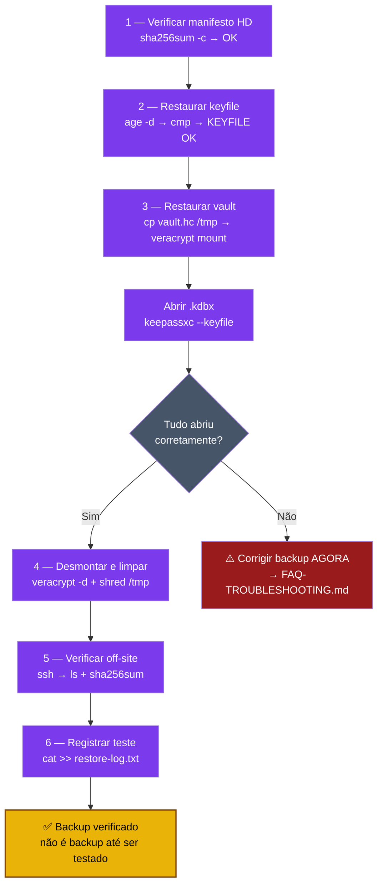

# Playbook 10 — Restore test mensal

**Objetivo:** Provar que seu backup funciona de verdade. Execute no 1º domingo de cada mês.  
**Tempo:** ~20 min  
**Pré-requisitos:**
- [ ] Backup HD concluído (Playbook 08) ou backup off-site (Playbook 09)
- [ ] Tags NTAG e pendrive backup disponíveis

---

## Visão geral do processo



---

```
⚠️  REGRA: Backup não testado = sem backup.
    Este teste é obrigatório para o CHECKPOINT 3.
```

---

## 1 — Verificar manifesto do HD

```sh
# Identificar o manifesto mais recente
MANIFEST=$(ls -t ~/ztc-backup/manifest/*.sha256 2>/dev/null | head -1)
echo "Manifesto: $MANIFEST"

# Verificar integridade (os arquivos locais devem bater)
sha256sum -c "$MANIFEST"
# Saída esperada: OK para cada arquivo
```

---

## 2 — Simular restauração do keyfile (NTAG perdido)

```sh
# Simular: fingir que perdeu as tags NTAG
# Restaurar o keyfile a partir do backup age

age -d ~/ztc-backup/keepass-keyfile.ztc.age > /tmp/keyfile-restore-test.ztc

# Comparar com o keyfile atual
cmp ~/keepass-keyfile.ztc /tmp/keyfile-restore-test.ztc && echo "KEYFILE OK"

# Limpar temporário
shred -u /tmp/keyfile-restore-test.ztc
```

---

## 3 — Simular restauração do vault (HD perdido)

```sh
# Simular: restaurar vault a partir do HD externo para /tmp

# Montar HD
sudo mount /dev/sdb1 /media/backup-hd

# Copiar vault para /tmp (simulação)
cp /media/backup-hd/ztc-backup/vault/vault.hc /tmp/vault-restore-test.hc

# Montar o vault restaurado
sudo mkdir -p /media/veracrypt-test
veracrypt -t /tmp/vault-restore-test.hc /media/veracrypt-test
# Informe a senha do VeraCrypt quando solicitado

# Verificar o conteúdo
ls -lh /media/veracrypt-test/

# Verificar que o .kdbx abre
keepassxc --keyfile ~/keepass-keyfile.ztc \
  /media/veracrypt-test/lab-passwords.kdbx
```

---

## 4 — Desmontar e limpar

```sh
veracrypt -t -d /media/veracrypt-test
sudo umount /media/backup-hd
shred -u /tmp/vault-restore-test.hc
```

---

## 5 — Verificar backup off-site (se tiver VM)

```sh
# Verificar que a VM tem os arquivos esperados
ssh -i ~/.ssh/id_ed25519_ztc ztc-bkp@10.66.66.1 \
  "ls -lh ~/ztc-backup/ && sha256sum ~/ztc-backup/*.hc"
```

---

## 6 — Registrar o teste

```sh
# Criar entrada de log do restore test
cat >> ~/ztc-backup/restore-log.txt << EOF
$(date -Is) — RESTORE TEST OK — $(uname -n)
  vault.hc restaurado: OK
  keyfile age restaurado: OK
  manifesto: OK
EOF

cat ~/ztc-backup/restore-log.txt
```

---

## Checklist de saída (CHECKPOINT 3)

```
- [ ] sha256sum -c manifesto → todos OK
- [ ] keyfile restaurado do .age → idêntico ao original
- [ ] vault.hc restaurado → montou e kdbx abriu
- [ ] data do teste registrada no restore-log.txt
```

---

✅ **Concluído** — backup verificado. Se algum passo falhou, corrija agora (não quando precisar de verdade).

**Se o vault não abriu ou o manifesto falhou:** abra o FAQ do curso — [docs/FAQ-TROUBLESHOOTING.md](../docs/FAQ-TROUBLESHOOTING.md)

📖 **Referência no curso:** COMANDO 4.3, CHECKPOINT 3
