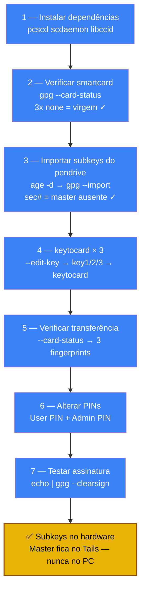

# Playbook 06 — Smartcard keytocard + PINs

**Objetivo:** Transferir subkeys [S][E][A] para o smartcard e configurar PINs.  
**Tempo:** ~20 min  
**Pré-requisitos:**
- [ ] Subkeys criadas no Tails (Playbook 05) → `subkeys.gpg.age` no pendrive
- [ ] Smartcard OpenPGP (Nitrokey 3, YubiKey 5, JCOP) conectado
- [ ] `pcscd` e `scdaemon` instalados

---

## Visão geral do processo



---

## 1 — Instalar dependências

```sh
sudo apt install -y pcscd scdaemon libccid gnupg2
sudo systemctl enable --now pcscd
```

---

## 2 — Verificar o smartcard

```sh
gpg --card-status
```

Saída esperada (trecho):
```
Reader ...........: ACS ACR122U [...]
Application type .: OpenPGP
...
Signature key ....: [none]
Encryption key....: [none]
Authentication key: [none]
```

Se mostrar `[none]` nas 3 chaves → cartão virgem, pronto para usar.

---

## 3 — Importar subkeys do pendrive

```sh
# Inserir pendrive com subkeys.gpg.age
PENDRIVE="/media/$USER/SEUPENDRIVE"   # ajuste pelo caminho real

# Decifrar e importar
age -d "$PENDRIVE/subkeys.gpg.age" | gpg --import

# Confirmar: deve aparecer sec# (master ausente, correto)
gpg -K
# Saída correta: sec#   (# = master não está no PC)
```

---

## 4 — Transferir subkeys para o cartão

```sh
# Substituir pelo fingerprint da sua chave
FPRINT="ABCD1234EF567890ABCDABCD1234EF567890ABCD1234"

gpg --edit-key "$FPRINT"
```

Dentro do prompt `gpg>`:

```
gpg> key 1
gpg> keytocard
> Selecionar slot: 1 (Signature)

gpg> key 1
gpg> key 2
gpg> keytocard
> Selecionar slot: 2 (Encryption)

gpg> key 2
gpg> key 3
gpg> keytocard
> Selecionar slot: 3 (Authentication)

gpg> save
```

---

## 5 — Verificar transferência

```sh
gpg --card-status
```

As 3 chaves devem mostrar fingerprint (não mais `[none]`):
```
Signature key ....: ABCD 1234 EF56 ...
Encryption key....: ABCD 1234 EF56 ...
Authentication key: ABCD 1234 EF56 ...
```

---

## 6 — Alterar PINs (User PIN + Admin PIN)

```sh
gpg --card-edit
```

Dentro do prompt `gpg/card>`:

```
gpg/card> admin
gpg/card> passwd
```

Menu de senhas:
```
1 - alterar PIN  (User PIN — padrão: 123456 → mude para ≥ 6 dígitos)
3 - alterar PIN de administrador  (Admin PIN — padrão: 12345678 → mude para ≥ 8 dígitos)
Q - sair
```

**🔴 OBRIGATÓRIO — configurar o Reset Code antes de sair (não pule!):**

O smartcard tem proteção anti-brute-force agressiva:

| Erro | Consequência |
|------|--------------|
| 3 tentativas erradas no **User PIN** | Cartão **bloqueia** — só desbloqueia com Admin PIN ou Reset Code |
| 3 tentativas erradas no **Admin PIN** | Cartão **destruído permanentemente** — perde subkeys, R$300+ no lixo |

O **Reset Code** é uma terceira credencial que permite desbloquear o User PIN **sem precisar do Admin PIN**. Configure agora — você só vai precisar dele se errar o User PIN 3x, mas se precisar, salva o cartão.

Ainda no prompt `gpg/card> passwd`:

```
4 - configurar Reset Code  (≥ 8 caracteres — diferente dos dois PINs)
```

> Salve as 3 credenciais no Bitwarden / KeePassXC imediatamente:
> - User PIN (uso diário)
> - Admin PIN (raramente — só pra trocar User PIN)
> - Reset Code (emergência — desbloquear User PIN se bater no limite)

Após configurar todos:
```
gpg/card> quit
```

> **Como usar o Reset Code** (se um dia precisar):
> ```
> gpg --card-edit
> gpg/card> admin
> gpg/card> unblock
> # Pede o Reset Code → defina novo User PIN
> ```

---

## 7 — Testar assinatura com o cartão

```sh
echo "teste" | gpg --clearsign
# Deve pedir o PIN do cartão → assinar → mostrar bloco -----BEGIN PGP SIGNED MESSAGE-----
```

---

✅ **Concluído** — subkeys [S][E][A] no smartcard. Master fica no Tails. PINs configurados.

**Próximo passo:** → [Playbook 07 — SSH via gpg-agent](./07-ssh-gpg-agent.md)

📖 **Referência no curso:** [COMANDO 2A.1](../../🎓%20Zero-Trust-Core-Expert%20-%20Versão%201.0.md#-comando-2a1-preparar-leitor-e-cartão) · [2A.2](../../🎓%20Zero-Trust-Core-Expert%20-%20Versão%201.0.md#-comando-2a2-keytocard-mover-subkeys) · [2A.3](../../🎓%20Zero-Trust-Core-Expert%20-%20Versão%201.0.md#-comando-2a3-pins-user-e-admin)
