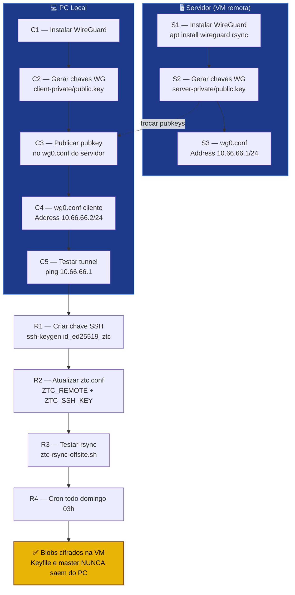

# Playbook 09 — WireGuard + VM off-site

**Objetivo:** Tunnel WireGuard entre PC local e VM remota para backup criptografado off-site.  
**Tempo:** ~30 min  
**Pré-requisitos:**
- [ ] VM Linux (Debian 13 Trixie) acessível com IP público ou VPS contratado
- [ ] Acesso SSH root/sudo à VM
- [ ] `vault.hc` e keyfiles prontos (Playbooks 01–03)

---

## Visão geral do processo



---

## SERVIDOR (VM remota) — execute via SSH

### S1 — Instalar WireGuard e criar usuário de backup

```sh
sudo apt install -y wireguard rsync openssh-server

# Criar usuário dedicado (sem shell interativo)
sudo adduser --disabled-password --gecos "" ztc-bkp
sudo mkdir -p /home/ztc-bkp/.ssh
sudo chown ztc-bkp:ztc-bkp /home/ztc-bkp/.ssh
sudo chmod 700 /home/ztc-bkp/.ssh
```

### S2 — Gerar chaves WireGuard no servidor

```sh
cd /etc/wireguard
sudo wg genkey | sudo tee server-private.key | sudo wg pubkey | sudo tee server-public.key
sudo chmod 600 server-private.key
cat server-public.key    # copie — vai precisar no cliente
```

### S3 — Configurar interface WireGuard no servidor

```sh
sudo tee /etc/wireguard/wg0.conf << EOF
[Interface]
Address = 10.66.66.1/24
PrivateKey = $(sudo cat /etc/wireguard/server-private.key)
ListenPort = 51820

[Peer]
# Cliente (PC local) — preencher após gerar chave no cliente
PublicKey = COLE_PUBKEY_CLIENTE_AQUI
AllowedIPs = 10.66.66.2/32
EOF

sudo systemctl enable --now wg-quick@wg0
```

---

## CLIENTE (PC local) — execute no seu PC

### C1 — Instalar WireGuard

```sh
sudo apt install -y wireguard
```

### C2 — Gerar chaves WireGuard no cliente

```sh
cd /etc/wireguard
sudo wg genkey | sudo tee client-private.key | sudo wg pubkey | sudo tee client-public.key
sudo chmod 600 client-private.key
cat client-public.key    # copie para colocar no servidor (S3)
```

### C3 — Voltar ao servidor e adicionar a chave pública do cliente

```sh
# No servidor, editar /etc/wireguard/wg0.conf
# Substituir COLE_PUBKEY_CLIENTE_AQUI pela chave gerada em C2
sudo sed -i "s/COLE_PUBKEY_CLIENTE_AQUI/$(cat /etc/wireguard/client-public.key)/" \
  /etc/wireguard/wg0.conf

sudo systemctl restart wg-quick@wg0
```

### C4 — Configurar interface no cliente

```sh
# IP público do servidor (substitua pelo real)
SERVER_IP="203.0.113.10"
SERVER_PUBKEY="$(cat /etc/wireguard/server-public.key)"   # copie do servidor

sudo tee /etc/wireguard/wg0.conf << EOF
[Interface]
Address = 10.66.66.2/24
PrivateKey = $(sudo cat /etc/wireguard/client-private.key)

[Peer]
PublicKey = $SERVER_PUBKEY
Endpoint = $SERVER_IP:51820
AllowedIPs = 10.66.66.1/32
PersistentKeepalive = 25
EOF

sudo systemctl enable --now wg-quick@wg0
```

### C5 — Testar o tunnel

```sh
ping 10.66.66.1 -c 3
# Deve responder: 64 bytes from 10.66.66.1
```

---

## RSYNC OFFSITE — configurar backup automático

### R1 — Criar chave SSH para o backup

```sh
ssh-keygen -t ed25519 -f ~/.ssh/id_ed25519_ztc -N ""
ssh-copy-id -i ~/.ssh/id_ed25519_ztc.pub ztc-bkp@10.66.66.1
```

### R1b — 🔴 OBRIGATÓRIO: restringir a chave SSH na VM (`command=`)

> ⚠️ Sem este passo, se o PC do aluno for comprometido (malware, roubo) o adversário usa a chave para abrir **shell completo** na VM, baixar todos os `vault.hc` históricos e atacar offline.
> Com este passo, a chave **só roda rsync** para o diretório específico — sem shell, sem ls livre, sem exfiltração.

**Na VM** (como usuário `ztc-bkp`):

```sh
# Instalar rrsync (vem com o pacote rsync no Debian/Ubuntu)
sudo apt install -y rsync
which rrsync || ls /usr/share/doc/rsync/scripts/rrsync*

# Se rrsync não estiver no PATH, copiar:
sudo cp /usr/share/doc/rsync/scripts/rrsync /usr/local/bin/
sudo chmod +x /usr/local/bin/rrsync

# Editar o authorized_keys do usuário ztc-bkp:
nano ~/.ssh/authorized_keys
```

Prefixar a chave pública (que o `ssh-copy-id` colocou no R1) com as restrições:

```
command="/usr/local/bin/rrsync ~/ztc-backup/",no-agent-forwarding,no-port-forwarding,no-pty,no-X11-forwarding ssh-ed25519 AAAA...sua-chave-publica...
```

> Tudo numa única linha. A chave pública original fica intacta após `command="..."`.

**Testar que shell está bloqueado** (no PC do aluno):

```sh
ssh -i ~/.ssh/id_ed25519_ztc ztc-bkp@10.66.66.1
# Esperado: "Refusing connection without rsync arguments"
# Ou conexão fecha imediatamente — SEM prompt de shell.
```

**Testar que rsync continua funcionando** (no PC do aluno):

```sh
~/bin/ztc-rsync-offsite.sh
# Deve sincronizar normalmente (rsync passa pelo rrsync wrapper).
```

### R2 — Atualizar ztc.conf

```sh
nano ~/ztc-backup/ztc.conf
```

```sh
ZTC_REMOTE="ztc-bkp@10.66.66.1:~/ztc-backup/"
ZTC_SSH_KEY="$HOME/.ssh/id_ed25519_ztc"
```

### R3 — Testar o script de backup offsite

```sh
~/bin/ztc-rsync-offsite.sh
# Deve sincronizar vault.hc e arquivos .age para a VM via WireGuard
```

### R4 — Agendar no cron (todo domingo 3h)

```sh
crontab -e
```

Adicionar linha:

```
0 3 * * 0 ~/bin/ztc-rsync-offsite.sh >> ~/ztc-backup/rsync.log 2>&1
```

---

✅ **Concluído** — backup off-site via WireGuard. Só blobs cifrados chegam à VM. Nunca keyfiles em texto claro.

**Regra crítica:** `ZTC_KEYFILE` e master PGP nunca vão para a VM.

**Próximo passo:** → [Playbook 10 — Restore test mensal](./10-restore-test.md)

📖 **Referência no curso:** [COMANDO 4.2.1](../../🎓%20Zero-Trust-Core-Expert%20-%20Versão%201.0.md#-comando-421-wireguard-na-vm-lado-servidor) · [4.2.2](../../🎓%20Zero-Trust-Core-Expert%20-%20Versão%201.0.md#-comando-422-usuário-e-diretório-de-backup-na-vm) · [4.2.3](../../🎓%20Zero-Trust-Core-Expert%20-%20Versão%201.0.md#-comando-423-rsync-só-blobs-com-ou-sem-nfc)
