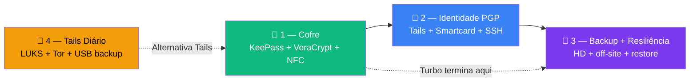

# ⚡ Playbooks — Zero Trust Core Expert

**Execução direta. Zero teoria. Copie e cole.**

Cada playbook é um procedimento completo, do zero ao "funcionou".
Cada um começa com um **diagrama "Visão geral do processo"** — olhe antes de executar.
Para entender *por quê* cada passo existe → [curso principal](../🎓%20Zero-Trust-Core-Expert%20-%20Versão%201.0.md).

> **Distro canônica:** Debian 13 (Trixie). Aluno em outra distro adapta gerenciador de pacotes / `.deb` específico.

---

## Organização em 3 blocos

```
playbooks/
├── 1-cofre/                  ← KeePass + VeraCrypt + NFC (Turbo)
├── 2-identidade-pgp/         ← Tails + Smartcard + SSH (Expert)
└── 3-backup-resiliencia/     ← HD + off-site + restore (3-2-1-1-0)
```



---

## 🔐 Bloco 1 — Cofre [`1-cofre/`](./1-cofre/) — Trilha Turbo

| # | Playbook | O que você terá | Tempo |
|---|----------|-----------------|------:|
| [00](./1-cofre/00-uso-diario.md) | Uso diário + modelo de segurança | 3 fatores · abrir/fechar manual · limites (keylogger) | ~10 min |
| [01](./1-cofre/01-keepass-ntag.md) | KeePassXC + NTAG keyfile | Cofre de senhas com fator físico | ~20 min |
| [02](./1-cofre/02-veracrypt-vault.md) | VeraCrypt vault | Volume cifrado com `.kdbx` dentro | ~10 min |
| [03](./1-cofre/03-age-backup-keyfile.md) | Backup do keyfile com `age` | Cópia cifrada em pendrive off-site | ~5 min |
| [04](./1-cofre/04-abrir-cofre-auto.md) | Script de abertura automática | `ztc-open-cofre.sh` configurado | ~15 min |

> **NFC é opcional** — `ZTC_NFC_UID=""` no `ztc.conf` desliga sem quebrar nada.

---

## 🔑 Bloco 2 — Identidade PGP [`2-identidade-pgp/`](./2-identidade-pgp/) — Trilha Expert

| # | Playbook | O que você terá | Tempo |
|---|----------|-----------------|------:|
| [05](./2-identidade-pgp/05-tails-master-pgp.md) | Chave mestra PGP no Tails | Master [C] offline + subkeys + revogação | ~45 min |
| [06](./2-identidade-pgp/06-smartcard-keytocard.md) | Smartcard — keytocard | Subkeys no token físico + PINs | ~20 min |
| [07](./2-identidade-pgp/07-ssh-gpg-agent.md) | SSH via gpg-agent | Login SSH com smartcard como 2FA | ~15 min |

---

## 💾 Bloco 3 — Backup + Resiliência [`3-backup-resiliencia/`](./3-backup-resiliencia/) — 3-2-1-1-0

| # | Playbook | O que você terá | Tempo |
|---|----------|-----------------|------:|
| [08](./3-backup-resiliencia/08-backup-hd-3211.md) | Backup HD + manifesto | Cópia fria local com `sha256` verificado | ~10 min |
| [09](./3-backup-resiliencia/09-wireguard-vm.md) | WireGuard + VM off-site | Backup remoto cifrado via túnel | ~30 min |
| [10](./3-backup-resiliencia/10-restore-test.md) | Restore test mensal | Prova de que o backup funciona | ~20 min |

> ⚠️ Playbook 10 é obrigatório para Turbo e Expert. Backup nunca testado = backup que não existe.

---

## 🐧 Bloco 4 — Tails Diário [`../tails/playbooks/`](../tails/playbooks/)

Para quem usa **Tails como sistema principal** (não Debian). Guia isolado com cofre LUKS, identidade via Tor, backup manual e health check por sessão.

| # | Playbook | O que você terá | Tempo |
|---|----------|-----------------|------:|
| [T01](../tails/playbooks/T01-tails-cofre-luks.md) | Tails Cofre LUKS | Persistent Storage + KeePassXC + keyfile USB | ~15 min |
| [T02](../tails/playbooks/T02-tails-online-identity.md) | Tails Online Identity | Subkeys + gpg-agent via Tor | ~20 min |
| [T03](../tails/playbooks/T03-tails-backup-manual.md) | Tails Backup Manual | USB cifrado com `age` + manifesto sha256 | ~15 min |
| [T04](../tails/playbooks/T04-tails-health-manual.md) | Tails Health Check | Verificação manual por sessão | ~10 min |

> Guia completo: [🐧 Zero-Trust-Core-Tails.md](../tails/🐧%20Zero-Trust-Core-Tails.md)

---

## Trilhas — qual ordem seguir?

**Trilha Turbo** (8-12h · R$50-265):
```
Bloco 1 (01 → 02 → 03 → 04)  →  Bloco 3 (10 restore test)
```

**Trilha Expert** (25-35h · R$725-2.150):
```
Bloco 1 (01-04)  →  Bloco 2 (05-07)  →  Bloco 3 (08-10)
```

---

## Estrutura de cada playbook

```
# Título
Objetivo · Tempo · Pré-requisitos
---
## Visão geral do processo   ← diagrama Mermaid do fluxo completo
## 1 — Passo 1               ← comandos, sem teoria
...
✅ Concluído                  ← próximo passo + referência no curso
```

## Regras deste formato

- **Cada passo tem no máximo 2 linhas de texto** — o resto é código
- **Diagrama Mermaid obrigatório** — o aluno enxerga o fluxo antes de executar
- **Nenhum link externo obrigatório** — o playbook é autossuficiente
- **Último bloco sempre:** `✅ Concluído` + link de referência no curso
- Se um passo exigir leitura extra → está errado — simplifique ou separe em outro playbook

## Quer mais playbooks? Repo irmão

O curso base [OpenPGP-GPG do Zero ao Expert](https://github.com/VIPs-com/OpenPGP-GPG-do-Zero-ao-Expert) tem sua própria pasta [`playbooks/`](https://github.com/VIPs-com/OpenPGP-GPG-do-Zero-ao-Expert/tree/main/playbooks) com **10 guias código-primeiro** (0–9 + capstone Whonix) — ambiente, chaves, backup, Git, SSH, Tails, manutenção e Whonix. Útil se você está fazendo os dois cursos em paralelo (trilha Expert).

---

*Zero Trust Core Expert · VIPs-com · [CC BY-SA 4.0](https://creativecommons.org/licenses/by-sa/4.0/)*
