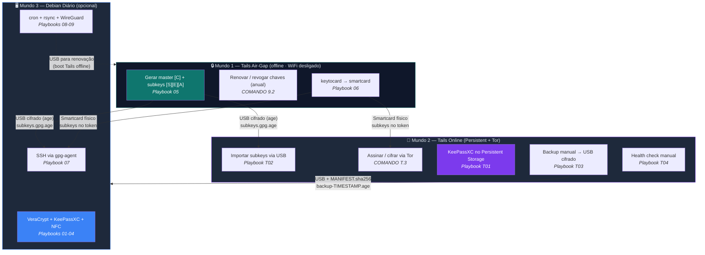
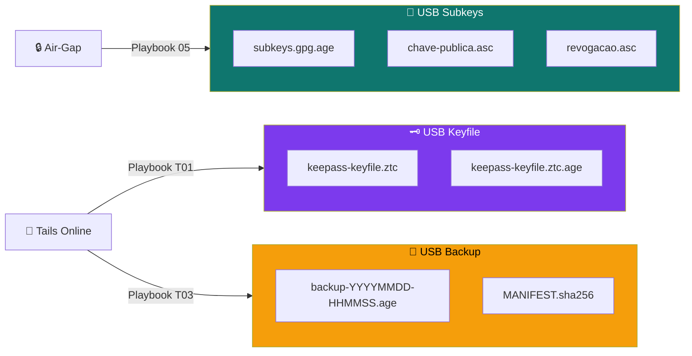
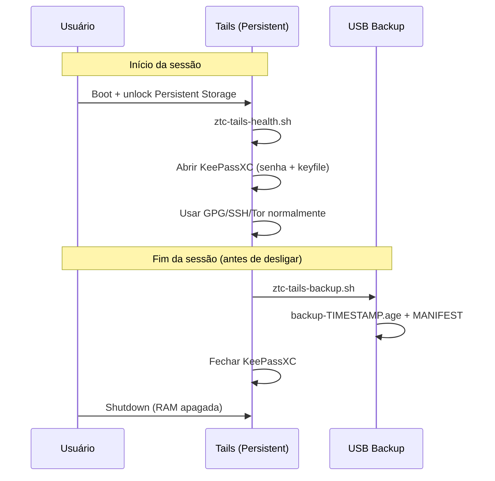
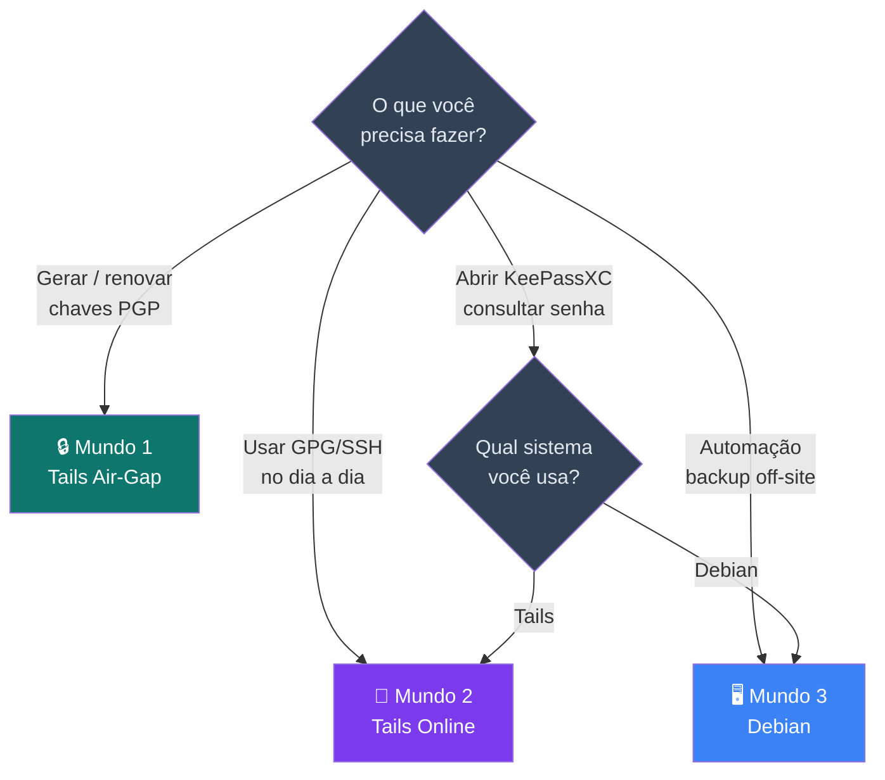

# Diagrama "Três Mundos" — Tails Air-Gap × Tails Online × Debian

> Diagrama de navegação para o aluno visualizar onde cada operação acontece e como os dados fluem entre os mundos.

---

## Visão geral — Três Mundos

---

## Fluxo de dados — o que vai em cada USB

> **Mínimo de pendrives:** 3 (Tails boot + subkeys/keyfile + backup). Idealmente 4 separados para isolamento.

---

## Ciclo de vida — operações por sessão

---

## Mapa de decisão — qual mundo usar?

---

*Zero Trust Core — Guia Tails · VIPs-com · [CC BY-SA 4.0](https://creativecommons.org/licenses/by-sa/4.0/)*
