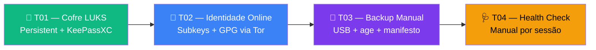

# 🐧 Playbooks Tails — Zero Trust Core

**Execução direta. Zero teoria. Copie e cole.**

Playbooks dedicados para quem usa **Tails** como sistema principal. Equivalentes aos playbooks Debian, adaptados para Persistent Storage + amnésia.

> **Distro canônica deste bloco:** Tails 7.8+ com Persistent Storage ativo.  
> Para o fluxo Debian → [playbooks principais](../../playbooks/).

---

## Organização

```
tails/playbooks/
├── T01-tails-cofre-luks.md          ← Persistent + KeePassXC
├── T02-tails-online-identity.md     ← Subkeys + GPG via Tor
├── T03-tails-backup-manual.md       ← USB cifrado com age
└── T04-tails-health-manual.md       ← Health check por sessão
```



---

## Playbooks

| # | Playbook | O que você terá | Tempo |
|---|----------|-----------------|------:|
| [T01](./T01-tails-cofre-luks.md) | Tails Cofre LUKS | Persistent Storage + KeePassXC + keyfile USB | ~15 min |
| [T02](./T02-tails-online-identity.md) | Tails Online Identity | Subkeys importadas + gpg-agent + Tor | ~20 min |
| [T03](./T03-tails-backup-manual.md) | Tails Backup Manual | Backup cifrado em USB + manifesto sha256 | ~15 min |
| [T04](./T04-tails-health-manual.md) | Tails Health Check | Verificação manual no início de cada sessão | ~10 min |

---

## Ordem recomendada

```
Parte T0 (fundamentos) → T01 (cofre) → T02 (identidade) → T03 (backup) → T04 (health)
```

> **Primeiro:** leia a [Parte T0 — Fundamentos Tails](../🐧%20Zero-Trust-Core-Tails.md#parte-t0--fundamentos-tails-do-zero) no guia principal. Cobre o modelo amnésico, Tor, bridges, Unsafe Browser, MAC spoofing, MAT2 e boas práticas — tudo que é exclusivo Tails e não tem equivalente no curso Debian.
>
> Depois de completar T01–T04, valide com o [CHECKPOINT T](../🐧%20Zero-Trust-Core-Tails.md#checkpoint-t--validação-final).

---

## Correspondência com playbooks Debian

| Tails | Equivale a (Debian) | Diferença principal |
|-------|---------------------|-------------------|
| T01 | PB 00–04 | LUKS em vez de VeraCrypt; USB keyfile em vez de NFC |
| T02 | PB 05–07 | PB-05 é idêntico; T02 cobre o "depois" (importar e usar online) |
| T03 | PB 08–10 | Manual em vez de cron+rsync; USB em vez de WireGuard |
| T04 | Parte do PB 08 | Script dedicado sem cron |

---

*Zero Trust Core — Guia Tails · VIPs-com · [CC BY-SA 4.0](https://creativecommons.org/licenses/by-sa/4.0/)*
