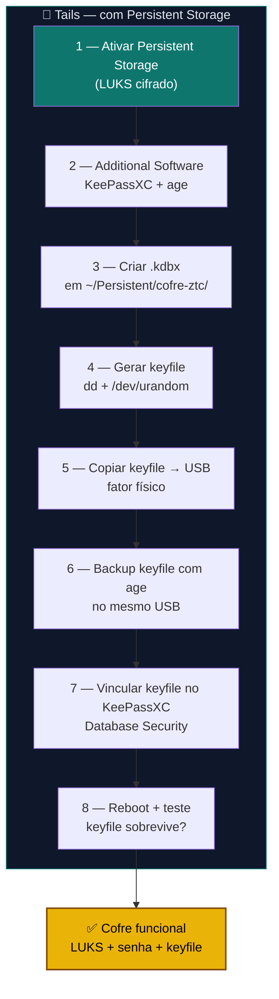

# Playbook T01 — Tails Cofre LUKS (Persistent + KeePassXC)

**Objetivo:** Configurar Persistent Storage + KeePassXC com keyfile como cofre de senhas no Tails.  
**Tempo:** ~15 min  
**Pré-requisitos:**
- [ ] Pendrive Tails 7.8+ gravado e bootado
- [ ] Pendrive extra (para keyfile — fator físico)
- [ ] Ter lido o [Guia Tails](../🐧%20Zero-Trust-Core-Tails.md) §Parte T1

---

## Visão geral do processo



---

## 1 — Ativar Persistent Storage

```
Applications → Tails → Persistent Storage
→ Create Persistent Storage
→ Passphrase: mínimo 5 palavras diceware
```

Ativar features:
```
✅ Personal Data
✅ GnuPG
✅ Additional Software
✅ Dotfiles
```

---

## 2 — Instalar Additional Software

```sh
sudo apt update
sudo apt install -y keepassxc age
# Tails pergunta "Install Every Time?" → Sim
```

---

## 3 — Criar diretório do cofre

```sh
mkdir -p ~/Persistent/cofre-ztc
```

Abrir KeePassXC:
```
Applications → Accessories → KeePassXC
→ Database → New Database
→ Salvar como: /home/amnesia/Persistent/cofre-ztc/senhas.kdbx
→ Senha mestra: forte e diferente da passphrase do Persistent
```

---

## 4 — Gerar keyfile aleatório

```sh
dd if=/dev/urandom bs=256 count=1 2>/dev/null | base64 > ~/Persistent/cofre-ztc/keepass-keyfile.ztc
chmod 600 ~/Persistent/cofre-ztc/keepass-keyfile.ztc
```

---

## 5 — Copiar keyfile para USB dedicado

```sh
PENDRIVE="/media/amnesia/SEUPENDRIVE"    # ajuste
cp ~/Persistent/cofre-ztc/keepass-keyfile.ztc "$PENDRIVE/"
sync
```

---

## 6 — Backup cifrado do keyfile

```sh
age -p -o "$PENDRIVE/keepass-keyfile.ztc.age" ~/Persistent/cofre-ztc/keepass-keyfile.ztc
```

> Guarde a passphrase do age — sem ela o backup é inútil.

---

## 7 — Vincular keyfile no KeePassXC

```
KeePassXC → Database → Database Security
→ Add Key File → selecionar keepass-keyfile.ztc
→ OK
```

Testar: fechar e reabrir o banco com senha + keyfile.

**Agora REMOVER o keyfile do Persistent Storage:**

```sh
# O keyfile deve ficar APENAS no USB dedicado — não no Persistent
# Isso garante que o USB é um VERDADEIRO segundo fator
rm ~/Persistent/cofre-ztc/keepass-keyfile.ztc

# Para abrir o KeePassXC, sempre apontar para o USB:
# Database → Database Security → Key File → /media/amnesia/SEUPENDRIVE/keepass-keyfile.ztc
```

> 🔴 Se o keyfile ficar no Persistent Storage junto com o `.kdbx`, alguém que quebre o LUKS tem os dois fatores. Com o keyfile **apenas no USB**, precisa do pendrive Tails (LUKS + senha KeePassXC) **E** do pendrive keyfile — dois objetos físicos separados.

---

## 8 — Reboot e teste

1. Reiniciar Tails
2. Ativar Persistent Storage (digitar passphrase)
3. **Inserir pendrive USB do keyfile**
4. Abrir KeePassXC → abrir `senhas.kdbx` com senha + keyfile do USB
5. Se abrir: cofre funcional

Saída esperada:
```sh
ls -la ~/Persistent/cofre-ztc/
# senhas.kdbx          ← banco de senhas (único arquivo aqui)

ls -la /media/amnesia/SEUPENDRIVE/
# keepass-keyfile.ztc   ← keyfile NO USB (não no Persistent)
# keepass-keyfile.ztc.age  ← backup cifrado do keyfile
```

> O keyfile **não** aparece em `~/Persistent/cofre-ztc/` — ele foi removido no passo 7. Vive **apenas** no pendrive USB dedicado (segundo fator físico).

---

✅ **Concluído** — cofre KeePassXC protegido por LUKS + senha + keyfile USB.

**Próximo passo:** → [T02 — Tails Online Identity](./T02-tails-online-identity.md)

📖 **Referência no guia:** [COMANDO T.1](../🐧%20Zero-Trust-Core-Tails.md#-comando-t1-configurar-persistent-storage--additional-software) · [COMANDO T.2](../🐧%20Zero-Trust-Core-Tails.md#-comando-t2-criar-cofre-keepassxc-no-persistent-storage)
