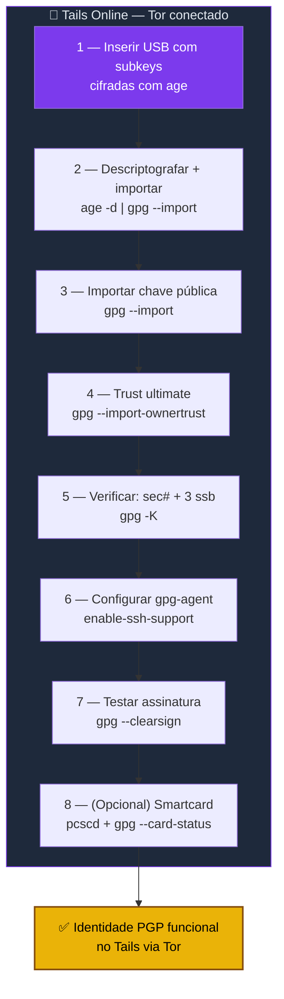

# Playbook T02 — Tails Online Identity (Subkeys + GPG via Tor)

**Objetivo:** Importar subkeys PGP no Tails online e configurar gpg-agent para assinar/cifrar via Tor.  
**Tempo:** ~20 min  
**Pré-requisitos:**
- [ ] [T01](./T01-tails-cofre-luks.md) concluído (Persistent Storage ativo)
- [ ] Master key gerada no air-gap ([Playbook 05](../../playbooks/2-identidade-pgp/05-tails-master-pgp.md))
- [ ] Pendrive com `subkeys.gpg.age` e `chave-publica.asc`

---

## Visão geral do processo



---

## 1 — Montar USB com subkeys

```sh
# Inserir pendrive → montar via Files
PENDRIVE="/media/amnesia/SEUPENDRIVE"    # ajuste
ls "$PENDRIVE"/subkeys.gpg.age "$PENDRIVE"/chave-publica.asc
```

---

## 2 — Descriptografar e importar subkeys

```sh
age -d "$PENDRIVE/subkeys.gpg.age" | gpg --import
```

> Digitar a passphrase do age (definida no Playbook 05, Passo 7).

---

## 3 — Importar chave pública

```sh
gpg --import "$PENDRIVE/chave-publica.asc"
```

---

## 4 — Confiar na própria chave

```sh
FPRINT=$(gpg --list-keys --with-colons | grep '^fpr' | head -1 | cut -d: -f10)
echo "$FPRINT:6:" | gpg --import-ownertrust
```

---

## 5 — Verificar

```sh
gpg -K
```

Saída esperada:
```
sec#  ed25519 2026-XX-XX [C] [expires: 2029-XX-XX]
      ABCD1234...
uid           [ultimate] Seu Nome <voce@exemplo.com>
ssb   ed25519 2026-XX-XX [S] [expires: 2028-XX-XX]
ssb   cv25519 2026-XX-XX [E] [expires: 2028-XX-XX]
ssb   ed25519 2026-XX-XX [A] [expires: 2028-XX-XX]
```

> `sec#` confirma que a master está **ausente** (só stub). Subkeys (`ssb`) prontas.

---

## 6 — Configurar gpg-agent (SSH support)

```sh
# Adicionar suporte SSH (sobrevive reboot se Dotfiles ativado)
grep -qF 'enable-ssh-support' ~/.gnupg/gpg-agent.conf 2>/dev/null || \
  echo "enable-ssh-support" >> ~/.gnupg/gpg-agent.conf

# Registrar keygrip da subchave [A]
KEYGRIP=$(gpg -K --with-keygrip | grep -A1 '\[A\]' | grep Keygrip | awk '{print $3}')
grep -qF "$KEYGRIP" ~/.gnupg/sshcontrol 2>/dev/null || \
  echo "$KEYGRIP" >> ~/.gnupg/sshcontrol

# Reiniciar agente
gpgconf --kill gpg-agent
gpgconf --launch gpg-agent
export SSH_AUTH_SOCK=$(gpgconf --list-dirs agent-ssh-socket)

# Verificar chave SSH
ssh-add -L
```

Saída esperada:
```
ssh-ed25519 AAAA... (none)
```

---

## 7 — Testar assinatura

```sh
echo "teste de assinatura ZTC" | gpg --clearsign
```

Saída esperada:
```
-----BEGIN PGP SIGNED MESSAGE-----
Hash: SHA512

teste de assinatura ZTC
-----BEGIN PGP SIGNATURE-----
...
-----END PGP SIGNATURE-----
```

---

## 8 — Smartcard (opcional)

Se você tem um smartcard OpenPGP com subkeys via `keytocard`:

```sh
sudo apt install -y pcscd
sudo systemctl start pcscd
gpg --card-status
```

> Com smartcard, não precisa importar subkeys de USB — basta inserir o cartão.

---

✅ **Concluído** — identidade PGP funcional no Tails. Subkeys prontas para assinar, cifrar e autenticar via Tor.

**Próximo passo:** → [T03 — Tails Backup Manual](./T03-tails-backup-manual.md)

📖 **Referência no guia:** [COMANDO T.3](../🐧%20Zero-Trust-Core-Tails.md#-comando-t3-importar-subkeys-no-tails-online--gpg-agent)
