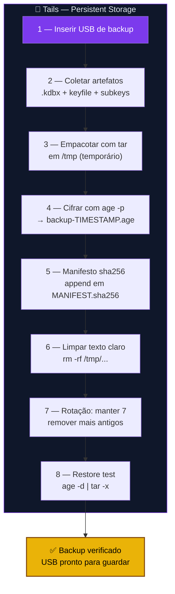

# Playbook T03 — Tails Backup Manual (USB + age + manifesto)

**Objetivo:** Criar backup cifrado do Persistent Storage em USB externo com verificação sha256.  
**Tempo:** ~15 min  
**Pré-requisitos:**
- [ ] [T01](./T01-tails-cofre-luks.md) concluído (cofre funcional)
- [ ] Pendrive de backup (diferente do Tails e do keyfile)
- [ ] `age` instalado (Additional Software)

---

## Visão geral do processo



---

## 1 — Inserir USB de backup

```sh
BACKUP_USB="/media/amnesia/BACKUP"    # ajuste pelo caminho real
mkdir -p "$BACKUP_USB/ztc-backup"
```

---

## 2 — Coletar artefatos

```sh
TMP=$(mktemp -d /tmp/ztc-bkp.XXXXXX)

# .kdbx (obrigatório)
cp ~/Persistent/cofre-ztc/senhas.kdbx "$TMP/"

# keyfile (se existir)
cp ~/Persistent/cofre-ztc/keepass-keyfile.ztc "$TMP/" 2>/dev/null || true

# Subkeys GPG (se importadas)
gpg --export-secret-subkeys --armor > "$TMP/subkeys-export.asc" 2>/dev/null || true
gpg --export --armor > "$TMP/pubkey-export.asc" 2>/dev/null || true
```

---

## 3+4 — Empacotar e cifrar

```sh
STAMP=$(date +%Y%m%d-%H%M%S)
tar -cf - -C "$TMP" . | age -p -o "$BACKUP_USB/ztc-backup/backup-$STAMP.age"
```

> Escolha uma passphrase forte. Guarde-a no KeePassXC antes de fechar a sessão.

---

## 5 — Manifesto sha256

```sh
sha256sum "$BACKUP_USB/ztc-backup/backup-$STAMP.age" >> "$BACKUP_USB/ztc-backup/MANIFEST.sha256"
```

---

## 6 — Limpar texto claro

```sh
rm -rf "$TMP"
```

---

## 7 — Rotação

```sh
cd "$BACKUP_USB/ztc-backup"
ls -1t backup-*.age | tail -n +8 | xargs rm -v 2>/dev/null || echo "Nada para rotacionar"
```

---

## 8 — Restore test completo (obrigatório)

> 🔴 **Backup nunca testado = backup que não existe.** O script abaixo verifica que seu backup é **realmente restaurável** — não apenas que o arquivo existe.

### Opção A: Script automático (recomendado)

```sh
# Instalar o script (primeira vez)
cp /caminho/do/repo/scripts/ztc-tails-restore-test.sh ~/Persistent/bin/
chmod +x ~/Persistent/bin/ztc-tails-restore-test.sh

# Rodar (testa o backup mais recente no USB)
export ZTC_TAILS_BACKUP_USB=/media/amnesia/BACKUP
~/Persistent/bin/ztc-tails-restore-test.sh

# Ou especificar um backup específico:
~/Persistent/bin/ztc-tails-restore-test.sh /media/amnesia/BACKUP/ztc-backup/backup-20260601-183022.age
```

**O script verifica 7 coisas:**

| # | Teste | O que valida |
|---|-------|-------------|
| 1 | Descriptografar | Passphrase age funciona, arquivo não corrompido |
| 2 | .kdbx | Existe, tamanho plausível, hash confere com original, **abre no KeePassXC** |
| 3 | Keyfile | Existe, hash confere com original |
| 4 | Subkeys GPG | Importam em keyring temporário, **assinatura funciona** |
| 5 | Chave pública | Importa corretamente |
| 6 | Revogação | Certificado presente no backup |
| 7 | Manifesto | Hash confere, assinatura GPG válida |

Saída esperada (backup 100% verificado):
```
==============================================
  RESULTADO DO RESTORE TEST
==============================================

  Total de verificacoes: 12
  ✅ PASS: 10
  ❌ FAIL: 0
  ⚠️  WARN: 2

  🟡 BACKUP OK COM AVISOS
  Backup restauravel, mas 2 item(ns) merecem atencao.
==============================================
```

> O script usa um **keyring GPG temporário** — não toca o seu keyring real. Todos os artefatos são **sobrescritos e removidos** no final (cleanup seguro).

### Opção B: Restore test manual (passo a passo)

Se preferir fazer manualmente (para entender cada etapa):

```sh
# 1. Descriptografar
mkdir -p /tmp/restore-test
age -d "$BACKUP_USB/ztc-backup/backup-$STAMP.age" | tar -xf - -C /tmp/restore-test

# 2. Verificar conteúdo
ls -la /tmp/restore-test/
# Esperado: senhas.kdbx, subkeys-export.asc, pubkey-export.asc, *.rev

# 3. Verificar .kdbx (precisa da senha mestra do KeePassXC)
keepassxc-cli ls /tmp/restore-test/senhas.kdbx
# Se pedir keyfile: adicionar --key-file /tmp/restore-test/keepass-keyfile.ztc
# Se listar entradas: banco válido ✅

# 4. Testar GPG em keyring temporário
export GNUPGHOME=$(mktemp -d)
gpg --import /tmp/restore-test/subkeys-export.asc
gpg -K   # deve mostrar sec# + ssb
echo "teste" | gpg --clearsign   # deve assinar sem erro

# 5. Limpar TUDO
rm -rf /tmp/restore-test "$GNUPGHOME"
unset GNUPGHOME
```

### Quando rodar o restore test

| Momento | Por quê |
|---------|---------|
| **Após cada backup** | Confirmar que o backup que acabou de criar funciona |
| **Mensal** | Verificar que backups mais antigos ainda são restauráveis |
| **Após trocar passphrase age** | Garantir que a nova passphrase abre os backups antigos (spoiler: não abre — cada backup usa a passphrase da criação) |
| **Antes de viajar** | Último check que tudo está recuperável se perder o pendrive |

---

✅ **Concluído** — backup cifrado em USB com manifesto verificado + restore test funcional.

**Próximo passo:** → [T04 — Scripts de Manutenção: Manual de Uso](./T04-tails-health-manual.md)

📖 **Referência no guia:** [COMANDO T.4](../🐧%20Zero-Trust-Core-Tails.md#-comando-t4-backup-manual-do-persistent-storage)
