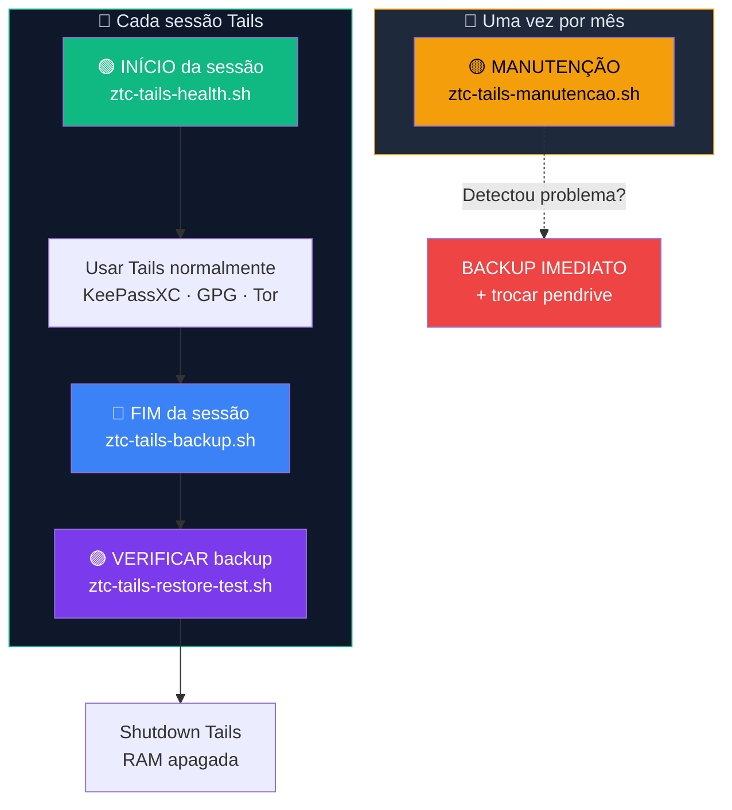

# Playbook T04 — Scripts de Manutenção: Manual de Uso Completo

**Objetivo:** Instalar, entender e usar os 3 scripts que mantêm seu Tails seguro e funcional.  
**Tempo:** ~15 min (instalação) · ~5 min (uso diário) · ~10 min (manutenção mensal)  
**Pré-requisitos:**
- [ ] [T01](./T01-tails-cofre-luks.md)–[T03](./T03-tails-backup-manual.md) concluídos
- [ ] Persistent Storage ativo com Dotfiles habilitado

---

## Visão geral — os 3 scripts e quando usar cada um



---

## 🔴 IMPORTANTE — não pule esta fase

Seu pendrive Tails é o **único lugar** onde vivem suas chaves, senhas e configurações. Diferente de um PC com HD/SSD de 500 GB, um pendrive USB:

- Tem **vida útil limitada** (1.000–10.000 ciclos de escrita)
- Pode **morrer sem aviso** (corrupção silenciosa)
- É **pequeno e fácil de perder/danificar** fisicamente
- Não tem RAID, não tem redundância, não tem recovery automático

**Se o pendrive morrer e você não rodou os scripts:**
- Sem health check → você não sabe se os dados estão íntegros
- Sem backup → perda total (chaves, senhas, tudo)
- Sem manutenção → não detectou que o flash estava morrendo

> Os 3 scripts são sua **linha de vida**. São rápidos (~2-5 min cada), rodam no terminal, e podem salvar meses de trabalho.

---

## Mapa rápido — qual script usar quando

| Situação | Script | Tempo | Requer admin? |
|----------|--------|:-----:|:-------------:|
| Acabei de bootar o Tails | `ztc-tails-health.sh` | ~2 min | Não |
| Vou desligar o Tails (fim do dia) | `ztc-tails-backup.sh` | ~3 min | Não |
| Acabei de fazer backup | `ztc-tails-restore-test.sh` | ~3 min | Não |
| Primeiro domingo do mês | `ztc-tails-manutencao.sh` | ~5 min | **Sim** |
| KeePassXC deu erro estranho | `ztc-tails-health.sh` + `ztc-tails-manutencao.sh` | ~7 min | Sim |
| Tails ficou lento no boot | `ztc-tails-manutencao.sh` | ~5 min | Sim |
| Vou viajar / guardar pendrive por semanas | `ztc-tails-backup.sh` + `ztc-tails-restore-test.sh` | ~8 min | Não |
| Suspeito que pendrive está morrendo | `ztc-tails-manutencao.sh` + backup + restore test | ~12 min | Sim |

---

## 1 — Instalação (primeira vez — todos os 3 scripts)

```sh
# Criar diretório de scripts no Persistent
mkdir -p ~/Persistent/bin
```

### Opção A — copiar do repositório (se clonado)

```sh
# Se você clonou o repo Zero Trust Core:
REPO="/media/amnesia/SEUPENDRIVE/Zero-Trust-Core"  # ajuste

cp "$REPO"/scripts/ztc-tails-health.sh ~/Persistent/bin/
cp "$REPO"/scripts/ztc-tails-backup.sh ~/Persistent/bin/
cp "$REPO"/scripts/ztc-tails-manutencao.sh ~/Persistent/bin/
cp "$REPO"/scripts/ztc-tails-restore-test.sh ~/Persistent/bin/
chmod +x ~/Persistent/bin/ztc-tails-*.sh
```

### Opção B — baixar diretamente do GitHub (via Tor)

```sh
# No Tor Browser, baixar os 3 scripts de:
# https://github.com/VIPs-com/Zero-Trust-Core/tree/main/scripts
#
# Salvar em ~/Persistent/bin/ e dar permissão:
chmod +x ~/Persistent/bin/ztc-tails-health.sh
chmod +x ~/Persistent/bin/ztc-tails-backup.sh
chmod +x ~/Persistent/bin/ztc-tails-manutencao.sh
chmod +x ~/Persistent/bin/ztc-tails-restore-test.sh
```

### Verificar instalação

```sh
ls -la ~/Persistent/bin/ztc-tails-*.sh
```

Saída esperada:
```
-rwx------ 1 amnesia amnesia  XXXX Jun  1 14:00 ztc-tails-backup.sh
-rwx------ 1 amnesia amnesia  XXXX Jun  1 14:00 ztc-tails-health.sh
-rwx------ 1 amnesia amnesia  XXXX Jun  1 14:00 ztc-tails-manutencao.sh
```

### Criar aliases para facilitar (opcional mas recomendado)

```sh
# Adicionar ao ~/.bashrc (sobrevive reboot se Dotfiles ativo)
cat >> ~/Persistent/dotfiles/.bashrc << 'EOF'

# --- Scripts ZTC Tails ---
alias health='~/Persistent/bin/ztc-tails-health.sh'
alias backup='~/Persistent/bin/ztc-tails-backup.sh'
alias manutencao='sudo ~/Persistent/bin/ztc-tails-manutencao.sh'
alias restore-test='~/Persistent/bin/ztc-tails-restore-test.sh'
EOF
```

Depois de reiniciar ou rodar `source ~/.bashrc`, basta digitar:
```sh
health       # em vez de ~/Persistent/bin/ztc-tails-health.sh
backup       # em vez de ~/Persistent/bin/ztc-tails-backup.sh
manutencao   # em vez de sudo ~/Persistent/bin/ztc-tails-manutencao.sh
```

---

## 2 — Script 1: `ztc-tails-health.sh` (início de cada sessão)

### O que verifica

```
┌──────────────────────────────────────────────────────┐
│  ztc-tails-health.sh — Checklist de segurança        │
│                                                      │
│  0. Versão do Tails (exibe para verificação manual)  │
│  1. Persistent Storage montado?                      │
│  2. GPG: subkeys presentes? Master ausente (sec#)?   │
│  3. KeePassXC instalado?                             │
│  4. Banco de senhas (.kdbx) encontrado?              │
│  5. age instalado?                                   │
│  6. Smartcard detectado? (opcional)                   │
│  7. NFC tag detectada? (opcional)                     │
│  8. Último backup: data + integridade sha256          │
└──────────────────────────────────────────────────────┘
```

### Como rodar

```sh
~/Persistent/bin/ztc-tails-health.sh
```

Para checar também o backup USB (conecte o pendrive de backup antes):
```sh
export ZTC_TAILS_BACKUP_USB=/media/amnesia/BACKUP
~/Persistent/bin/ztc-tails-health.sh
```

### Saída esperada (tudo OK)

```
=== Zero Trust Core — Tails Health ===
[INFO] Tails versao: 7.8 — verifique em tails.net se e a mais recente
[OK] Persistent Storage montado
[OK] gpg -K — subkeys presentes (sec# = master ausente OK)
[OK] KeePassXC instalado
[OK] /home/amnesia/Persistent/cofre-ztc/senhas.kdbx legivel
[OK] age instalado
[SKIP] Smartcard — pcscd ausente (instale como Additional Software)
[SKIP] NFC — nfc-list ausente
[INFO] Ultimo backup: 20260601
[OK] Integridade do ultimo backup verificada (sha256 confere)
=== Tails Health: OK ===
```

### Interpretação dos resultados

| Status | Significado | O que fazer |
|--------|------------|------------|
| `[OK]` | Check passou | Nada — tudo certo |
| `[INFO]` | Informação | Ler e verificar manualmente (ex.: versão do Tails) |
| `[SKIP]` | Componente opcional ausente | Normal se não usa smartcard/NFC |
| `[WARN]` | Algo precisa de atenção | Ler a mensagem, avaliar se precisa corrigir |
| `[FAIL]` | **Problema bloqueante** | **Corrigir ANTES de usar o Tails para qualquer coisa** |

### Troubleshooting dos FAILs mais comuns

| Mensagem FAIL | Causa | Solução |
|--------------|-------|---------|
| "Persistent Storage NAO montado" | Esqueceu de ativar na Welcome Screen | Reiniciar Tails e ativar Persistent Storage |
| "KeePassXC ausente" | Não marcou como Additional Software | `sudo apt install keepassxc` → "Install Every Time" |
| "senhas.kdbx nao encontrado" | Primeiro uso ou caminho errado | Seguir Playbook T01 para criar o cofre |
| "gpg nao encontrado" | Instalação Tails corrompida | Regravar pendrive Tails do zero (T0.6) |
| "Hash do ultimo backup NAO confere" | Backup corrompido ou adulterado | Fazer novo backup IMEDIATO (Playbook T03) |

---

## 3 — Script 2: `ztc-tails-backup.sh` (fim de cada sessão)

### O que faz

```
┌──────────────────────────────────────────────────────┐
│  ztc-tails-backup.sh — Backup cifrado para USB       │
│                                                      │
│  1. Valida Persistent Storage e .kdbx                │
│  2. Verifica que destino é mídia removível            │
│  3. Lembra de salvar passphrase age no KeePassXC     │
│  4. Coleta: .kdbx + keyfile + subkeys GPG + pubkey   │
│     + certificados de revogação                      │
│  5. Empacota com tar + cifra com age -p               │
│  6. Gera manifesto sha256 + assina com GPG            │
│  7. Rotação: mantém últimos 7 backups                │
│  8. Exibe comando de restore test                     │
└──────────────────────────────────────────────────────┘
```

### Como rodar

```sh
# Inserir pendrive de backup → identificar o caminho
ls /media/amnesia/

# Rodar (vai perguntar o caminho interativamente)
~/Persistent/bin/ztc-tails-backup.sh

# Ou definir o caminho via variável (sem pergunta)
export ZTC_TAILS_BACKUP_USB=/media/amnesia/BACKUP
~/Persistent/bin/ztc-tails-backup.sh
```

### Saída esperada (backup bem-sucedido)

```
========================================================
  ANTES DE CONTINUAR:
  A passphrase age que voce vai digitar protege este backup.
  Se perder a passphrase, o backup fica IRRECUPERAVEL.

  Recomendado: abra o KeePassXC agora e crie uma entrada
  'Backup Tails - age' com a passphrase que vai usar.
  Use minimo 5 palavras diceware ou 20+ caracteres.
========================================================

Passphrase ja registrada no KeePassXC? (s/N): s
Coletando artefatos...
  + keyfile
  + subkeys GPG (permissoes restritas)
  + 1 certificado(s) de revogacao
Cifrando com age (minimo 5 palavras diceware)...
[OK] Manifesto atualizado + assinado com GPG

[OK] Backup concluido: backup-20260601-183022.age
[OK] 3 backups mantidos (4.2M total em /media/amnesia/BACKUP/ztc-backup)

Para restore test:
  age -d /media/amnesia/BACKUP/ztc-backup/backup-20260601-183022.age | tar -xf - -C /tmp/restore-test
```

### Fluxo visual do backup

```
~/Persistent/                        USB de backup
├── cofre-ztc/                       /media/amnesia/BACKUP/ztc-backup/
│   ├── senhas.kdbx ──────────────┐
│   └── keepass-keyfile.ztc ──────┤
~/.gnupg/ (subkeys) ─────────────┤  tar + age -p
~/.gnupg/openpgp-revocs.d/ ──────┤  ──────────►  backup-20260601-183022.age
                                  │               MANIFEST.sha256
                                  │               MANIFEST.sha256.signed
                                  └──────────────────────────────────────
```

### Erros comuns e solução

| Erro | Causa | Solução |
|------|-------|---------|
| "Caminho recusado por seguranca" | Digitou caminho do sistema (`/home`, `/etc`) | Usar caminho do pendrive (`/media/amnesia/...`) |
| "nao parece ser midia removivel" | Digitou subdiretório ou caminho interno | Verificar com `ls /media/amnesia/` |
| "Passphrase ja registrada?" → Abortou | Não salvou passphrase no KeePassXC ainda | Abrir KeePassXC, criar entrada, rodar novamente |
| age pede passphrase 2x e aborta | Passphrases digitadas não conferem | Digitar com mais cuidado; verificar layout do teclado |

---

## 4 — Script 3: `ztc-tails-manutencao.sh` (mensal)

### O que verifica

```
┌──────────────────────────────────────────────────────┐
│  ztc-tails-manutencao.sh — Diagnóstico do pendrive   │
│  ⚠️  Requer senha de administração no Tails          │
│                                                      │
│  1. ESPAÇO: uso do Persistent (aviso >75%, FAIL >90%)│
│     + top 5 maiores diretórios                       │
│  2. FILESYSTEM: fsck em modo leitura (sem corrigir)  │
│     detecta corrupção antes que vire perda de dados  │
│  3. FLASH USB: SMART (se suportado) + teste de       │
│     10 leituras aleatórias (detecta bad blocks)      │
│  4. LIMPEZA: cache apt, /tmp, ~/.cache,              │
│     arquivos grandes fora do Persistent              │
│  5. VIDA ÚTIL: orientações sobre quando trocar       │
│     o pendrive (2-3 anos / por tipo de flash)        │
└──────────────────────────────────────────────────────┘
```

### Como rodar

```sh
# PRECISA de senha de administração:
# Welcome Screen → Additional Settings → Administration Password

# Rodar:
sudo ~/Persistent/bin/ztc-tails-manutencao.sh

# Ou com o alias (se configurou no passo 1):
manutencao
```

### Saída esperada (pendrive saudável)

```
==============================================
  Zero Trust Core — Manutencao Tails
  2026-06-01 18:30
==============================================

--- 1. Espaco em disco ---
[OK] Persistent Storage 23% usado (10G livres de 13G)

Maiores diretorios em ~/Persistent/:
1.2M    /home/amnesia/Persistent/cofre-ztc/
420K    /home/amnesia/Persistent/bin/
120K    /home/amnesia/Persistent/dotfiles/
48K     /home/amnesia/Persistent/docs/

--- 2. Integridade do filesystem ---
[OK] LUKS mapeado em: /dev/mapper/TailsData_unlocked
     Verificando filesystem (somente-leitura)...
[OK] Filesystem limpo (sem erros)

--- 3. Saude do pendrive ---
Dispositivo Tails: /dev/sda
[INFO] SMART nao suportado por este pendrive (normal para USB flash)

Teste rapido de leitura (10 blocos aleatorios)...
[OK] 10/10 leituras aleatorias sem erro

--- 4. Limpeza ---
[OK] Cache apt limpo
[INFO] /tmp/ usando: 12M (sera limpo no shutdown)
[INFO] Cache do usuario (~/.cache/): 8.4M

--- 5. Vida util do pendrive ---

Pendrives USB flash tem vida util limitada [...]

==============================================
  RESULTADO: TUDO OK
  Proximo check: daqui a 1 mes
==============================================
```

### Saída com problema (pendrive morrendo)

```
--- 3. Saude do pendrive ---
Dispositivo Tails: /dev/sda
[INFO] SMART disponivel — executando diagnostico...
SMART Health Status: FAILED

Teste rapido de leitura (10 blocos aleatorios)...
[FAIL] 2 erros de leitura em 10 testes!
       Pendrive pode estar morrendo — BACKUP IMEDIATO + trocar pendrive

==============================================
  RESULTADO: PROBLEMAS DETECTADOS
  Corrija os itens [FAIL] acima.
  Se pendrive estiver morrendo: BACKUP IMEDIATO (Playbook T03)
==============================================
```

### O que fazer quando detectar problema

| Resultado | Ação imediata | Próximo passo |
|-----------|-------------|--------------|
| Espaço > 90% | `sudo apt clean` + remover arquivos grandes | Mover backups antigos para USB externo |
| Filesystem com erros | **Backup IMEDIATO** (T03) | Bootar outro Tails → `sudo fsck` no pendrive desmontado |
| Erros de leitura no flash | **Backup IMEDIATO** (T03) | Comprar pendrive novo → clonar (T0.7) |
| SMART FAILED | **Backup IMEDIATO** (T03) | Pendrive morrendo — trocar HOJE |
| Setores remapeados > 0 | Monitorar mensalmente | Se aumentar: trocar pendrive |

> 🔴 **Em TODOS os casos de FAIL na manutenção:** a primeira ação é **sempre** rodar `ztc-tails-backup.sh` para garantir que você tem um backup fresco antes que o pendrive pare de funcionar.

---

## 5 — Script 4: `ztc-tails-restore-test.sh` (após cada backup)

### O que verifica

```
┌──────────────────────────────────────────────────────┐
│  ztc-tails-restore-test.sh — Restore test completo   │
│                                                      │
│  1. Descriptografa backup .age (testa passphrase)    │
│  2. Verifica .kdbx (existe, tamanho, hash, ABRE)     │
│  3. Verifica keyfile (existe, hash confere)           │
│  4. Importa subkeys GPG (keyring temporário)         │
│  5. Testa assinatura GPG (funcional?)                │
│  6. Verifica chave pública                           │
│  7. Verifica certificado de revogação                │
│  8. Valida manifesto sha256 + assinatura GPG         │
│                                                      │
│  ⚡ Usa keyring GPG TEMPORÁRIO (não toca o real)     │
│  🧹 Limpa + sobrescreve TUDO no final               │
└──────────────────────────────────────────────────────┘
```

### Como rodar

```sh
# Testar o backup mais recente no USB:
export ZTC_TAILS_BACKUP_USB=/media/amnesia/BACKUP
~/Persistent/bin/ztc-tails-restore-test.sh

# Ou testar um backup específico:
~/Persistent/bin/ztc-tails-restore-test.sh /media/amnesia/BACKUP/ztc-backup/backup-20260601-183022.age
```

### Saída esperada (backup saudável)

```
==============================================
  Zero Trust Core — Restore Test Completo
  2026-06-01 18:35
==============================================

Backup selecionado (mais recente): backup-20260601-183022.age
Arquivo: /media/amnesia/BACKUP/ztc-backup/backup-20260601-183022.age
Tamanho: 1.2M

=== Teste 1/7: Descriptografar backup ===
[PASS] Backup descriptografado e extraido com sucesso

=== Teste 2/7: Banco de senhas (.kdbx) ===
[PASS] .kdbx encontrado: senhas.kdbx (45678 bytes)
[PASS] .kdbx hash confere com original (sha256 identico)
[PASS] KeePassXC abriu o .kdbx com sucesso — banco valido!

=== Teste 3/7: Keyfile ===
[PASS] Keyfile encontrado: keepass-keyfile.ztc (345 bytes)

=== Teste 4/7: Subkeys GPG ===
[PASS] Arquivo de subkeys encontrado: subkeys-export.asc
[PASS] Subkeys importadas no keyring de teste: 1 chave(s), 3 subchave(s)
[PASS] Assinatura GPG funcional com subkeys restauradas

=== Teste 5/7: Chave publica ===
[PASS] Chave publica importada (1 chave(s))

=== Teste 6/7: Certificado de revogacao ===
[PASS] 1 certificado(s) de revogacao encontrado(s)

=== Teste 7/7: Manifesto e integridade ===
[PASS] Hash do arquivo confere com MANIFEST.sha256
[PASS] Assinatura GPG do manifesto verificada

--- Limpeza ---
[OK] Diretorio de teste removido e sobrescrito

==============================================
  RESULTADO DO RESTORE TEST
==============================================

  Total de verificacoes: 12
  ✅ PASS: 12
  ❌ FAIL: 0
  ⚠️  WARN: 0

  🟢 BACKUP 100% VERIFICADO
  Todos os componentes foram restaurados e testados.
  Este backup e confiavel para uso em emergencia.
==============================================
```

### Interpretação dos resultados

| Resultado | Significado | Ação |
|-----------|------------|------|
| 🟢 100% VERIFICADO | Backup completamente restaurável | Nenhuma — backup confiável |
| 🟡 OK COM AVISOS | Backup restaurável mas incompleto | Revisar [WARN] — pode faltar keyfile ou revogação |
| 🔴 COM PROBLEMAS | Backup **não restaurável** | Criar novo backup IMEDIATO com `ztc-tails-backup.sh` |

---

## 6 — Calendário de manutenção recomendado

```
┌─────────────────────────────────────────────────────┐
│  📅 Rotina do aluno Tails                           │
│                                                     │
│  CADA SESSÃO:                                       │
│    🟢 Boot → health    (2 min)                      │
│    🔵 Antes de desligar → backup   (3 min)          │
│    🟣 Após backup → restore-test   (3 min)          │
│                                                     │
│  TODO MÊS (1º domingo):                            │
│    🟡 manutencao   (5 min, precisa admin)           │
│    🔵 backup       (se não fez nessa sessão)        │
│    🔄 Atualizar clone do pendrive Tails (T0.7)      │
│                                                     │
│  A CADA 6 MESES:                                    │
│    🔄 Trocar passphrase LUKS (se necessário)        │
│    📋 Revisar features do Persistent Storage        │
│    🧹 Limpeza profunda (remover pacotes não usados) │
│                                                     │
│  A CADA 2-3 ANOS:                                   │
│    🔄 Trocar pendrive (mesmo sem sintomas)           │
│    🔄 Regravar Tails + restaurar do backup          │
└─────────────────────────────────────────────────────┘
```

---

## 7 — Variáveis de configuração (todos os scripts)

Todos os scripts aceitam variáveis de ambiente para customizar caminhos:

```sh
# Definir antes de rodar qualquer script:
export ZTC_TAILS_PERSISTENT=~/Persistent
export ZTC_TAILS_COFRE=~/Persistent/cofre-ztc
export ZTC_TAILS_KDBX=~/Persistent/cofre-ztc/senhas.kdbx
export ZTC_TAILS_KEYFILE=~/Persistent/cofre-ztc/keepass-keyfile.ztc
export ZTC_TAILS_BACKUP_USB=/media/amnesia/BACKUP
export ZTC_TAILS_BACKUP_KEEP=7
```

| Variável | Usada por | Default | Função |
|----------|----------|---------|--------|
| `ZTC_TAILS_PERSISTENT` | health, backup | `$HOME/Persistent` | Caminho do Persistent Storage |
| `ZTC_TAILS_COFRE` | health, backup | `$PERSISTENT/cofre-ztc` | Diretório do cofre |
| `ZTC_TAILS_KDBX` | health, backup | `$COFRE/senhas.kdbx` | Arquivo KeePassXC |
| `ZTC_TAILS_KEYFILE` | backup | `$COFRE/keepass-keyfile.ztc` | Keyfile KeePassXC |
| `ZTC_TAILS_BACKUP_USB` | health, backup | (vazio — pergunta) | USB de backup |
| `ZTC_TAILS_BACKUP_KEEP` | backup | `7` | Quantidade de backups mantidos na rotação |

> Para não digitar toda vez: adicione os `export` ao `~/Persistent/dotfiles/.bashrc`.

---

✅ **Concluído** — os 3 scripts estão instalados e você sabe quando e como usar cada um.

**Próximo passo:** → [CHECKPOINT T](../🐧%20Zero-Trust-Core-Tails.md#checkpoint-t--validação-final) — validação final do setup Tails.

📖 **Referência no guia:** [COMANDO T.5](../🐧%20Zero-Trust-Core-Tails.md#-comando-t5-health-check-manual) · [COMANDO T.4](../🐧%20Zero-Trust-Core-Tails.md#-comando-t4-backup-manual-do-persistent-storage)
