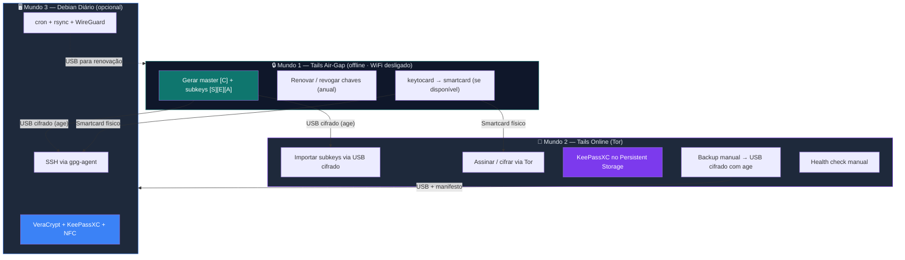
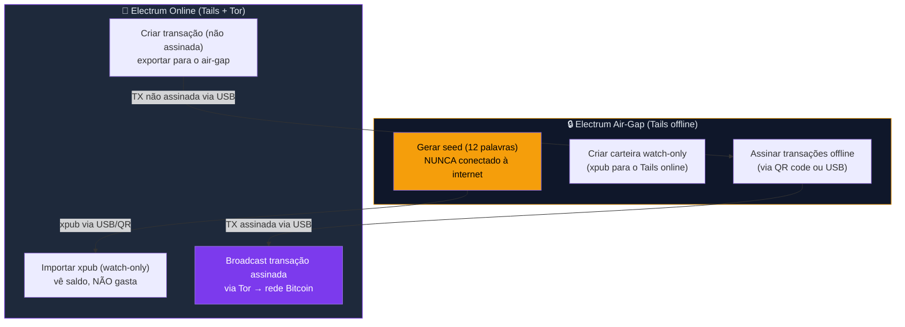

# Zero Trust Core — Guia Dedicado Tails

> **Versão:** 1.0 · **Distro:** Tails 7.8+ · **Licença:** CC BY-SA 4.0  
> **Pré-requisito:** leitura do [curso principal](../🎓%20Zero-Trust-Core-Expert%20-%20Versão%201.0.md) §0 (Onboarding)

Este guia cobre **tudo que o aluno Tails precisa** para construir seu ecossistema de segurança sem depender de Debian como sistema diário. Funciona de forma independente — não é necessário voltar ao curso principal durante a execução.

---

## Sumário

- [Por que um guia separado?](#por-que-um-guia-separado)
- [Três Mundos — diagrama de navegação](#três-mundos--diagrama-de-navegação)
- [Equivalência Debian ↔ Tails](#equivalência-debian--tails)
- [Parte T0 — Fundamentos Tails (do zero)](#parte-t0--fundamentos-tails-do-zero)
- [Parte T1 — Cofre no Tails (LUKS + KeePassXC)](#parte-t1--cofre-no-tails-luks--keepassxc)
- [Parte T2 — Identidade PGP (Air-Gap + Online)](#parte-t2--identidade-pgp-air-gap--online)
- [Parte T3 — Backup Manual (USB + age)](#parte-t3--backup-manual-usb--age)
- [Parte T4 — Health Check Manual](#parte-t4--health-check-manual)
- [CHECKPOINT T — Validação Final](#checkpoint-t--validação-final)
- [Referências oficiais](#referências-oficiais)

---

## Por que um guia separado?

O curso principal assume **Debian 13 (Trixie)** como sistema diário. Várias ferramentas centrais não existem no Tails:

| Indisponível no Tails | Motivo | Alternativa neste guia |
|----------------------|--------|----------------------|
| VeraCrypt | Não empacotado; Tails já cifra com LUKS | Persistent Storage (LUKS nativo) |
| cron / systemd timers | Tails é amnésico — daemons resetam no reboot | Scripts manuais por sessão |
| rsync + WireGuard (automático) | Sem daemons persistentes | Backup manual para USB cifrado |
| NFC/NTAG via `nfc-list` | libnfc precisa reinstalar cada boot | USB keyfile como fator físico |

O que **funciona igual** no Tails:
- GnuPG 2.4+ (nativo)
- `age` (instalável via Additional Software)
- KeePassXC (instalável via Additional Software)
- Smartcard OpenPGP via `pcscd` (Additional Software)
- `sha256sum`, `gpg --verify`, terminal padrão

---

## Três Mundos — diagrama de navegação



> **Aluno Tails-only:** seus mundos são 1 e 2. O Mundo 3 (Debian) é opcional — usado apenas se você tiver um PC diário com Linux instalado.
>
> **Mundo online persistente (avançado):** quem tem hardware para virtualização pode usar o **[Whonix](../whonix/🧅%20Zero-Trust-Core-Whonix.md)** como ambiente online de 1ª classe — Gateway+Workstation com anti-vazamento de IP por design. É o "escritório anônimo" que complementa este air-gap; ver o guia dedicado.
>
> **Diagramas adicionais** (fluxo USB, ciclo de vida por sessão, mapa de decisão): [DIAGRAMA-TAILS-MUNDOS.md](docs/DIAGRAMA-TAILS-MUNDOS.md)

**Fluxo de dados entre mundos:**

```
Mundo 1 (air-gap)                Mundo 2 (Tails online)
   master key                       subkeys importadas
   revogação                        KeePassXC (.kdbx)
   backup age                       sessão GPG via Tor
        │                                  │
        └──── USB cifrado ─────────────────┘
                                           │
                                    USB backup age
                                    manifesto sha256
                                           │
                                    disco frio / pendrive
                                    guardado fisicamente
```

---

## Equivalência Debian ↔ Tails

| Conceito | Debian 13 (curso principal) | Tails (este guia) |
|----------|---------------------------|-------------------|
| Cofre criptografado | VeraCrypt `.hc` | LUKS Persistent Storage |
| Gerenciador de senhas | KeePassXC (apt install) | KeePassXC (Additional Software) |
| Fator físico "algo que tenho" | NTAG NFC + `nfc-list` | USB keyfile em pendrive dedicado |
| Backup off-site automatizado | rsync + WireGuard + cron | Manual: USB cifrado com `age` |
| Health check periódico | `ztc-health.sh` via cron | `ztc-tails-health.sh` manual |
| SSH com smartcard | gpg-agent persistente | gpg-agent por sessão (resetado no reboot) |
| Backup versionado | `ztc-snapshot-vault.sh` + rotação | `ztc-tails-backup.sh` + manifesto em USB |

---

## Parte T0 — Fundamentos Tails (do zero)

Antes de configurar cofres, GPG ou backups, o aluno Tails precisa entender conceitos que **não existem no Debian** e não têm link no curso principal. Esta seção é o "Módulo 0" do mundo Tails.

### T0.1 — O modelo amnésico: o que sobrevive e o que morre

O Tails roda inteiramente na RAM. Quando você desliga, **tudo é apagado** — a RAM é sobrescrita ativamente pelo kernel antes de cortar a energia. Isso é uma **feature de segurança**, não um bug. O único lugar onde dados sobrevivem é o Persistent Storage (LUKS cifrado no pendrive).

```
┌─────────────────────────────────────────────────┐
│           RAM (APAGADA no shutdown)              │
│  • Aplicativos abertos                          │
│  • Arquivos em /tmp, ~/Desktop, ~/Downloads     │
│  • Histórico do terminal                        │
│  • Conexões Tor ativas                          │
│  • Processos, variáveis de ambiente             │
│  • Clipboard (área de transferência)            │
│  • Swap (Tails não usa swap em disco)           │
│  • Senhas digitadas em diálogos GPG             │
│  • Qualquer arquivo baixado e não salvo         │
└─────────────────────────────────────────────────┘

┌─────────────────────────────────────────────────┐
│    Persistent Storage (SOBREVIVE reboot)         │
│  • ~/Persistent/ (Personal Data)                │
│  • ~/.gnupg/ (se GnuPG ativado)                 │
│  • Additional Software (pacotes marcados)       │
│  • Dotfiles (~/.bashrc, gpg-agent.conf, etc.)   │
│  • Bookmarks do Tor Browser (se ativado)        │
│  • Thunderbird (se ativado)                     │
│  • Chaves SSH (se ativado)                      │
│  • Network Connections (se ativado)             │
│  • Electrum (se Bitcoin Client ativado)         │
└─────────────────────────────────────────────────┘
```

**Implicações práticas que o aluno PRECISA internalizar:**

| Ação | O que acontece se desligar sem salvar |
|------|--------------------------------------|
| Criou arquivo em `~/Desktop/nota.txt` | **Perdido para sempre** |
| Baixou PDF em `~/Downloads/` | **Perdido para sempre** |
| Editou `~/.bashrc` (sem Dotfiles ativo) | **Perdido** — volta ao default |
| Instalou pacote sem marcar Additional Software | **Perdido** — precisa reinstalar |
| Salvou arquivo em `~/Persistent/cofre-ztc/` | ✅ Sobrevive |
| Importou chave GPG (com GnuPG ativo) | ✅ Sobrevive |
| Definiu senha admin na Welcome Screen | **Só vale para esta sessão** |

> **Regra de ouro:** se você criou um arquivo e não o moveu para `~/Persistent/`, ele **desaparece** no desligamento. Não tem lixeira, não tem recuperação, não tem "undo".

**Teste prático (faça agora para internalizar):**
```sh
# 1. Crie um arquivo temporário
echo "teste amnesia" > /tmp/teste-amnesia.txt
cat /tmp/teste-amnesia.txt   # funciona agora

# 2. Crie um arquivo persistente
echo "teste persistente" > ~/Persistent/teste-persistente.txt

# 3. Reinicie o Tails e verifique:
cat /tmp/teste-amnesia.txt          # FALHA — arquivo não existe
cat ~/Persistent/teste-persistente.txt   # OK — arquivo presente
```

**Por que isso importa para segurança:**
- Se seu pendrive for apreendido, o adversário encontra **apenas** o Persistent Storage (cifrado com LUKS)
- Sem a passphrase, o conteúdo é ilegível
- Tudo que estava na RAM já foi apagado no shutdown
- Se você for forçado a desligar rapidamente (emergência), puxe o pendrive — o Tails não deixa rastro na máquina host (não toca o disco rígido do computador)

### T0.2 — Senha de administração: quando ativar e riscos reais

Na tela Welcome Screen do Tails, você pode definir uma **Administration Password** (equivalente a `sudo`). Essa senha é **temporária** — vale apenas para a sessão atual e desaparece no reboot.

**Quando ativar:**

| Situação | Ativar? | Por quê |
|----------|---------|---------|
| Instalar pacote pela primeira vez (`sudo apt`) | **Sim** | Additional Software precisa de root na instalação inicial |
| Montar dispositivo externo manualmente | **Sim** | Alguns USB exigem `mount` manual |
| Depurar rede (`ifconfig`, `tcpdump`, `wg`) | **Sim** | Ferramentas de rede exigem root |
| Configurar bridge Tor manualmente | **Sim** | Editar configs de rede |
| Uso diário normal (navegar, GPG, KeePassXC) | **Não** | Menos privilégio = menos risco |
| Air-gap (gerar/renovar chaves PGP) | **Não** | Offline, sem necessidade de root |
| Sessão rápida (consultar uma senha no KeePassXC) | **Não** | Minimizar superfície de ataque |

**Como ativar:**
```
Welcome Screen (tela inicial do Tails)
→ Clicar no "+" em Additional Settings (canto inferior esquerdo)
→ Administration Password
→ Digitar uma senha temporária (qualquer senha — só vale para esta sessão)
→ Start Tails
```

**Riscos concretos de ativar quando não precisa:**

1. **Escalação de privilégio:** se um exploit no Tor Browser ganhar execução de código no seu usuário, com senha admin ativa ele pode rodar `sudo` e comprometer o sistema inteiro (kernel, memória, Persistent Storage)
2. **Erro humano:** com root, um comando errado (`rm -rf /`) causa dano irreversível na sessão
3. **Forensics:** processos root podem acessar áreas de memória que processos normais não alcançam — mais dados expostos se o adversário capturar a RAM (cold boot attack)

> **Regra:** inicie o Tails **sem** senha admin. Se precisar de root durante a sessão, reinicie com senha admin, faça o que precisa, reinicie novamente sem.

### T0.3 — Tor: como funciona, bridges e redes restritivas

**O que o Tails faz automaticamente (e por que é diferente de usar Tor no Debian):**

No Debian, você pode instalar o Tor Browser e usá-lo — mas o resto do sistema (apt, rsync, SSH, DNS) vai pela rede normal. No Tails, **absolutamente tudo** passa pelo Tor:
- Navegação (Tor Browser)
- DNS (resolvido pelo Tor, não pelo ISP)
- Atualizações do sistema (`apt` via Tor)
- Qualquer conexão de rede de qualquer aplicativo
- Horário do sistema (sincronizado via Tor, não NTP direto)

Aplicativos que tentam se conectar diretamente à internet (sem Tor) são **bloqueados pelo firewall** do Tails. Isso é uma proteção contra vazamento — mesmo que um aplicativo tenha um bug que tente resolver DNS diretamente, o firewall impede.

**Cenário normal (Tor funciona):**
```
Boot Tails → Conectar WiFi/Ethernet → Tor conecta automaticamente (~30s–2min)
→ Ícone de cebola na barra superior fica verde → pronto
```

**Cenário bloqueado (precisa de bridge):**

Bridges são relays Tor não-listados publicamente. O ISP/firewall não consegue bloquear porque não sabe os IPs.

```
Na tela de conexão ao Tor (aparece após conectar WiFi):
→ "Connect to Tor automatically"  ← tente isso primeiro
→ Se falhar: "Hide to my local network that I'm connecting to Tor"
→ Escolher tipo de bridge:

  1. obfs4 (recomendado — ofusca tráfego, parece HTTPS normal)
  2. Snowflake (usa WebRTC via voluntários — bom em redes com DPI agressivo)
  3. meek-azure (tráfego parece Microsoft Azure — último recurso)
  4. Bridge customizada (pedir em https://bridges.torproject.org via e-mail ou web)
```

**Obtendo bridges customizadas (se as built-in não funcionarem):**

```
Método 1 — Via web (de outro computador/celular):
  Acesse: https://bridges.torproject.org
  Resolva o captcha → copie as linhas de bridge

Método 2 — Via e-mail:
  Envie e-mail para bridges@torproject.org
  Assunto: (vazio)
  Corpo: get transport obfs4
  Resposta chega em minutos com linhas de bridge

Método 3 — Via Telegram:
  Bot: @GetBridgesBot → envie /bridges
```

**Diagnóstico se Tor não conectar:**

| Sintoma | Causa provável | Solução |
|---------|---------------|---------|
| Ícone de cebola fica girando sem parar | Tor bloqueado pelo ISP/firewall | Usar bridge obfs4 |
| Conecta mas páginas não carregam | DNS ou relay lento | Esperar 1 min; trocar circuito (New Tor Circuit) |
| "Clock skew detected" | Horário do computador muito errado | BIOS → corrigir data/hora antes de bootar Tails |
| Conexão cai repetidamente | WiFi instável ou ISP throttling | Testar em outra rede; cabo Ethernet se possível |

> **Para air-gap (Mundo 1):** Tor não se aplica — você desliga toda rede antes de bootar. Bridges são apenas para o Mundo 2 (Tails online).

### T0.4 — Unsafe Browser: portais cativos (e por que é perigoso)

Em WiFi de hotel, aeroporto ou café, normalmente aparece uma tela de login (portal cativo) antes de liberar internet. O Tor Browser **não consegue** acessar essas telas porque tenta rotear tudo pelo Tor — que precisa da internet para funcionar (loop).

Solução: o **Unsafe Browser** — um navegador especial do Tails que **não usa Tor** (tráfego direto, sem anonimato).

**Como usar:**
```
Applications → Internet → Unsafe Browser
→ O Tails mostra um aviso: "The Unsafe Browser is not anonymous"
→ Aceitar → navegador abre
→ O portal cativo deve carregar automaticamente
→ Fazer login/aceitar termos
→ FECHAR o Unsafe Browser imediatamente
→ Aguardar: Tor deve conectar em 30–60 segundos
```

**O que o Unsafe Browser expõe:**

| Dado | Visível para a rede local? |
|------|---------------------------|
| Seu IP real | **Sim** |
| MAC do dispositivo (ou o spoofed) | **Sim** |
| Sites que você acessa nele | **Sim** (ISP e rede local veem) |
| Cookies e dados de formulário | **Sim** (para o portal cativo) |
| Sua identidade Tails/Tor | **Não** — o Unsafe Browser é isolado do Tor Browser |

🔴 **O que NUNCA fazer no Unsafe Browser:**
- Navegar em sites além do portal cativo
- Fazer login em contas pessoais (e-mail, redes sociais, banco)
- Digitar senhas reais
- Baixar arquivos
- Deixar aberto após autenticação no portal

> O Unsafe Browser existe para **uma única ação**: liberar o WiFi. Fechar assim que o portal aceitar o login. Se a rede exigir dados pessoais (CPF, e-mail) para liberar, considere se vale a pena usar essa rede.

### T0.5 — MAC address spoofing: o que é, por que importa, quando desativar

**O que é MAC address:** todo dispositivo de rede (placa WiFi, Ethernet) tem um identificador único de fábrica — o MAC address (ex.: `AA:BB:CC:DD:EE:FF`). Redes locais usam esse identificador para rastrear dispositivos. Se você conectar no WiFi do café hoje e amanhã, o roteador sabe que é o mesmo dispositivo.

**O que o Tails faz:** a cada boot, o Tails gera um **MAC address aleatório** (diferente do real). Para a rede local, você é um dispositivo novo a cada sessão.

**Como desativar (quando necessário):**
```
Welcome Screen → Additional Settings (ícone "+")
→ MAC Address Anonymization
→ "Don't anonymize"
→ Start Tails
```

**Quando desativar:**

| Situação | MAC spoofing | Por quê |
|----------|-------------|---------|
| WiFi público (café, aeroporto) | ✅ **Ativado** (default) | Impede rastreamento entre visitas |
| Rede doméstica SEM filtro MAC | ✅ **Ativado** (default) | Sem motivo para desativar |
| Rede com filtro MAC (whitelist) | ❌ **Desativar** | Roteador rejeita MACs desconhecidos |
| Rede corporativa com 802.1X | ❌ **Desativar** | Autenticação por certificado + MAC |
| Rede monitorada por admin hostil | ✅ **Ativado** | MAC spoofed dificulta correlação |

**Riscos de ATIVAR em rede com filtro:**
- WiFi simplesmente não conecta (MAC rejeitado)
- Em redes corporativas, pode gerar alerta de "dispositivo desconhecido"

**Riscos de DESATIVAR:**
- Rede local pode correlacionar sessões Tails com seu hardware real
- Em combinação com outras informações, pode desanonimizar você

> **Regra prática:** deixe ativado (default). Só desative se a rede recusar a conexão — e nesse caso, saiba que a rede terá seu MAC real.

### T0.6 — Atualização do Tails: automática, manual e emergencial

O Tails publica atualizações de segurança a cada ~4 semanas. Cada versão corrige vulnerabilidades no Tor Browser, kernel Linux e pacotes Debian. **Usar Tails desatualizado é como usar um cofre com a porta aberta** — a criptografia e o anonimato dependem de software atualizado.

**Como saber sua versão:**
```
Canto superior direito da barra do Tails → clicar no ícone de informação
Ou: Applications → Tails → About Tails
```

**Upgrade automático (recomendado — funciona na maioria dos casos):**
```
1. Boot Tails com rede
2. Notificação aparece: "A new version of Tails is available"
3. Clique em "Upgrade now"
4. Download automático (~100–500 MB incremental)
5. Instalação automática
6. Reiniciar quando solicitado
→ Persistent Storage preservado ✅
→ Additional Software preservado ✅
```

**Upgrade manual (quando automático falha):**

O upgrade automático falha se você pulou muitas versões (máximo ~5 incrementais). Nesse caso:

```sh
# ANTES DE TUDO — fazer backup do Persistent Storage:
# Siga o Playbook T03 (backup para USB cifrado com age)

# No PC diário (ou outro Tails):
# 1. Baixar nova ISO em tails.net/install/download
# 2. Verificar integridade (T0.12)

# Método A — Tails Cloner (preserva Persistent):
# Boot pelo Tails antigo → Applications → Tails → Tails Cloner
# → "Upgrade from an ISO image" → selecionar a ISO nova
# → Persistent Storage é PRESERVADO ✅

# Método B — Regravar do zero (se Tails Cloner falhar):
# Regravar o pendrive com a ISO nova (dd, Etcher, etc.)
# ⚠️ Persistent Storage é APAGADO — restaurar do backup T03
```

**Upgrade emergencial (versão com falha de segurança crítica):**

Ocasionalmente, o Tails publica uma versão de emergência para fechar um 0-day no Tor Browser ou kernel. Nesses casos:

```
1. NÃO use o Tails antigo para navegar até atualizar
2. Boot Tails → atualização aparece como "Security update" → aplicar imediatamente
3. Se automático falhar: upgrade manual método A (Tails Cloner)
4. Verificar versão após reiniciar
```

**Política de atualização recomendada:**

| Frequência | Ação |
|-----------|------|
| A cada boot | Verificar se há atualização pendente |
| Máximo 2 semanas | Atualizar mesmo que não use o Tails diariamente |
| Após 3+ meses parado | Upgrade manual obrigatório (automático pode falhar) |
| Security advisory | Atualizar antes de qualquer uso |

> 🔴 **Tails desatualizado = vulnerável.** O Tor Browser dentro do Tails é patcheado junto — usar Tails antigo é usar Tor Browser vulnerável.

### T0.7 — Clonar o pendrive Tails (backup do boot)

Se seu único pendrive Tails morrer (corrupção, dano físico, perda), você perde:
- O Tails configurado
- O Persistent Storage inteiro (`.kdbx`, keyring GPG, dotfiles, Additional Software)
- Acesso às subkeys (se não tiver backup em outro USB)

**Solução: manter 2 pendrives Tails idênticos.**

**Como clonar:**
```
Applications → Tails → Tails Cloner
→ Inserir segundo pendrive (mínimo 8 GB, recomendado 16 GB)
→ "Clone the current Tails"
→ Selecionar o pendrive destino
→ ⚠️ TODO o conteúdo do pendrive destino será apagado
→ Aguardar (5–15 min dependendo do tamanho)
```

**O que é clonado:**

| Componente | Clonado? |
|-----------|---------|
| Sistema Tails (SO completo) | ✅ Sim |
| Persistent Storage (cifrado) | ✅ Sim (mesma passphrase) |
| Additional Software (lista) | ✅ Sim |
| Todos os arquivos em ~/Persistent/ | ✅ Sim |
| Keyring GPG | ✅ Sim |
| Dotfiles | ✅ Sim |

**Política de clonagem:**

| Evento | Ação |
|--------|------|
| Após configurar Persistent Storage pela primeira vez | Clonar imediatamente |
| Após upgrade do Tails | Clonar novamente (clone fica desatualizado) |
| Após importar subkeys GPG ou adicionar senhas importantes | Clonar ou fazer backup T03 |
| Mensal (manutenção) | Verificar que clone ainda funciona (boot test) |

**Teste do clone (obrigatório):**
```
1. Boot pelo clone (pendrive backup)
2. Unlock Persistent Storage (mesma passphrase)
3. Verificar: ~/Persistent/ contém seus arquivos?
4. Verificar: gpg -K mostra suas subkeys?
5. Verificar: KeePassXC abre o .kdbx?
→ Se sim: clone funcional
→ Se não: clonar novamente
```

**Armazenamento do clone:**
- Guardar em local físico diferente do pendrive principal (casa vs trabalho, por exemplo)
- Proteger contra dano físico (caixa, saco antiestático)
- **Não** deixar os dois pendrives Tails no mesmo lugar (roubo/incêndio = perda total)

> O clone é sua **linha de vida**. Sem ele, a perda do pendrive principal significa reconstruir tudo do zero — incluindo gerar novas chaves PGP se não tiver backup em outro lugar.

### T0.8 — Persistent Storage: o que ativar, o que evitar, e as consequências

Nem tudo no Persistent Storage deve ser ativado. Cada feature ativada **aumenta a superfície de ataque** e **reduz o anonimato** (mais dados sobrevivem entre sessões). Mas desativar demais significa perder trabalho ou reconfigurar tudo a cada boot.

**Decisão por feature:**

| Feature | Ativar? | O que persiste | Risco se pendrive for capturado |
|---------|---------|---------------|-------------------------------|
| **Personal Data** | ✅ Sempre | Arquivos em ~/Persistent | Adversário vê nomes de arquivos (conteúdo cifrado pelo LUKS) |
| **GnuPG** | ✅ Sempre | Keyring GPG (~/.gnupg) | Subkeys expostas (protegidas por passphrase GPG) |
| **Additional Software** | ✅ Sempre | Lista de pacotes para reinstalar | Adversário vê quais ferramentas você usa |
| **Dotfiles** | ✅ Recomendado | `.bashrc`, `gpg-agent.conf`, `sshcontrol` | Configurações revelam workflow |
| **SSH Client** | ✅ Se usa SSH | ~/.ssh/ (chaves, known_hosts, config) | Adversário vê quais servidores você acessa |
| **Electrum Bitcoin Wallet** | ✅ Se usa Bitcoin | Carteira Electrum, histórico de transações | 🔴 **Alto risco:** histórico financeiro completo exposto |
| **Thunderbird** | ⚠️ Apenas se necessário | E-mails, contatos, configuração de contas | 🔴 **Alto risco:** conteúdo de e-mails + metadados de comunicação |
| **Tor Browser Bookmarks** | ⚠️ Opcional | Bookmarks salvos | Revela interesses e sites visitados regularmente |
| **Network Connections** | ⚠️ Opcional | SSIDs WiFi, senhas de rede, VPNs | Revela locais visitados e redes usadas |
| **Printers** | ❌ Raramente | Configuração de impressoras | Impressoras adicionam tracking dots (micro-pontos amarelos que identificam a impressora) |

**Perfis de ativação recomendados:**

```
Perfil "Mínimo" (consulta rápida — máximo anonimato):
  ✅ Personal Data
  ✅ GnuPG
  ✅ Additional Software
  (tudo mais desativado)

Perfil "ZTC Padrão" (este curso):
  ✅ Personal Data
  ✅ GnuPG
  ✅ Additional Software
  ✅ Dotfiles
  ✅ SSH Client (se usa)
  ✅ Electrum (se usa Bitcoin)

Perfil "Produtividade" (uso diário extenso — menor anonimato):
  ✅ Tudo acima
  ✅ Thunderbird
  ✅ Tor Browser Bookmarks
  ⚠️ Network Connections (conveniência vs risco)
```

**Como ativar/desativar features:**
```
Applications → Tails → Persistent Storage
→ Toggle cada feature individualmente
→ Algumas mudanças exigem reiniciar
```

> **Princípio:** ative o mínimo necessário para seu workflow. Se o pendrive for capturado, o adversário precisa quebrar a passphrase LUKS — mas se conseguir, tudo que estava ativado fica exposto. Menos dados persistentes = menos exposição.

### T0.9 — MAT2: limpeza de metadados

O Tails inclui o **MAT2** (Metadata Anonymisation Toolkit 2) integrado no gerenciador de arquivos. Metadados em documentos, imagens e PDFs podem revelar:
- Nome do autor, software usado, datas de edição
- Coordenadas GPS em fotos
- Nome do computador, versão do SO

```
Gerenciador de arquivos → botão direito no arquivo
→ "Remove metadata"
→ Cria cópia limpa com sufixo ".cleaned"
```

Formatos suportados: PDF, DOCX, XLSX, PPTX, JPEG, PNG, TIFF, ODP, ODS, ODT, FLAC, MP3, MP2, OGG, entre outros.

```sh
# Via terminal (para múltiplos arquivos):
mat2 arquivo.pdf
mat2 --inplace foto.jpg    # sobrescreve o original

# Verificar metadados antes de limpar:
mat2 --show arquivo.pdf
```

> **Antes de enviar qualquer arquivo** pelo Tor ou por e-mail: passe pelo MAT2. Metadados são o vazamento silencioso mais comum.

### T0.10 — OnionShare: compartilhar arquivos via Tor (sem cloud, sem rastro)

O Tails inclui o **OnionShare** — ferramenta para compartilhar arquivos criando um servidor temporário na rede Tor (endereço `.onion`). Não precisa de conta, não precisa de cloud, não depende de terceiros, não deixa rastro no servidor (porque o servidor é o seu Tails).

**Por que isso importa no ZTC:** quando você precisa transferir um backup `.age`, uma chave pública PGP, ou qualquer arquivo cifrado para outro computador/pessoa — sem usar USB físico, sem upload para Google Drive/Dropbox, sem expor seu IP.

**Como usar cada modo:**

**Modo 1 — Share Files (enviar arquivo):**
```
Applications → Internet → OnionShare
→ Aba "Share"
→ Arrastar arquivo(s) para a janela (ou clicar "Add")
→ "Start sharing"
→ Aparece um endereço: http://onionshare:xxxxx.onion
→ Copiar o endereço + chave privada (exibida na tela)
→ Enviar o endereço para o destinatário via canal seguro (Signal, chat cifrado)
→ Destinatário abre o endereço no Tor Browser → faz download
→ "Stop sharing" quando concluir (ou ativar "Stop after first download")
```

**Modo 2 — Receive Files (receber arquivo):**
```
OnionShare → Aba "Receive"
→ "Start Receive Mode"
→ Endereço .onion gerado — enviar para quem vai fazer upload
→ Arquivos recebidos aparecem em ~/OnionShare/
→ ⚠️ Arquivos recebidos podem ser maliciosos — NÃO abrir diretamente
→ Passar pelo MAT2 (T0.9) antes de abrir
```

**Modo 3 — Chat anônimo:**
```
OnionShare → Aba "Chat"
→ "Start Chat Server"
→ Endereço .onion gerado — enviar para participantes
→ Chat efêmero — desaparece quando você fecha ou desliga Tails
→ Sem log, sem registro, sem conta
```

**Modo 4 — Host a Website:**
```
OnionShare → Aba "Website"
→ Selecionar pasta com HTML
→ "Start sharing" → site .onion temporário
→ Útil para publicar informação anonimamente
```

**Configurações de segurança importantes:**

| Opção | Recomendação | Por quê |
|-------|-------------|---------|
| "Stop after first download" | ✅ Ativar | Evita que endereço fique ativo indefinidamente |
| "Use a private key" | ✅ Ativar | Destinatário precisa da chave para acessar — proteção contra interceptação do .onion. **Envie o endereço .onion e a chave por canais DIFERENTES** (ex.: endereço via Signal, chave via e-mail cifrado) para que comprometimento de um canal não dê acesso completo |
| "Use custom title" | ⚠️ Cuidado | Não colocar informações identificáveis no título |

**Cenários de uso no ZTC:**

| Cenário | Como fazer |
|---------|-----------|
| Enviar backup `.age` para outro PC seu | Share Files → baixar no outro Tails/Debian via Tor Browser |
| Receber chave pública PGP de alguém | Receive Files → importar com `gpg --import` |
| Coordenar restore de emergência | Chat anônimo temporário |
| Publicar fingerprint PGP | Website temporário com chave pública |

> Quando você desliga o Tails (ou fecha o OnionShare), o endereço .onion **deixa de existir**. Não há servidor intermediário, não há log. Os dados só existiram em trânsito pela rede Tor.

### T0.11 — Thunderbird + OpenPGP no Tails: e-mail cifrado via Tor

O Tails vem com **Thunderbird** pré-instalado. Todo o tráfego do Thunderbird passa pelo Tor automaticamente (IMAP, SMTP, tudo via Tor). Se você ativou as subkeys GPG (Parte T2), pode enviar e-mails assinados e cifrados com OpenPGP nativo do Thunderbird.

**Configuração passo a passo:**

```
1. Ativar Persistent Storage → Thunderbird (se quiser guardar e-mails entre sessões)
   ⚠️ Isso guarda TODO o conteúdo de e-mails no pendrive — considere o threat model

2. Applications → Internet → Thunderbird
   → Configurar conta de e-mail:
     • IMAP (recomendado — sincroniza com servidor)
     • Servidor IMAP/SMTP do provedor
     • ⚠️ Alguns provedores bloqueiam login via Tor (Gmail, Outlook)
     • Provedores compatíveis com Tor: Proton Mail (bridge), Tutanota, Riseup, Disroot

3. Settings → Account Settings → End-to-End Encryption
   → OpenPGP: "Add Key"
   → "Use your external key through GnuPG" (usa as subkeys importadas na Parte T2)
   → OU importar chave diretamente no Thunderbird

4. Para enviar e-mail cifrado:
   → Compor mensagem → ícone de cadeado → "Require Encryption"
   → Thunderbird precisa da chave pública do destinatário
   → Se não tiver: "Attach My Public Key" para o destinatário importar
```

**Modelo de ameaça do Thunderbird no Tails:**

| Cenário | Persistent Thunderbird ATIVADO | Persistent Thunderbird DESATIVADO |
|---------|-------------------------------|----------------------------------|
| Adversário captura pendrive | 🔴 Lê todos os e-mails (se quebrar LUKS) | ✅ Nada persiste — e-mails somem no shutdown |
| Adversário tem acesso remoto ao Tails (exploit) | 🔴 Lê e-mails em memória + disco | 🟡 Lê apenas e-mails da sessão atual (RAM) |
| Provedor de e-mail intimado | 🟡 Servidor tem metadados (de/para/quando), não conteúdo cifrado | 🟡 Mesmo — cifração protege conteúdo |
| Você perde o pendrive | 🟡 E-mails perdidos se não tiver backup | ✅ Nada para perder |

**Recomendações por perfil:**

```
Perfil "Máximo anonimato":
  → NÃO ativar Persistent → Thunderbird
  → Usar e-mail descartável via Tor Browser (Proton, Tutanota web)
  → Cada sessão é limpa — nenhum e-mail sobrevive
  → Para comunicação sensível: usar OnionShare (T0.10) em vez de e-mail

Perfil "Produtividade com segurança":
  → Ativar Persistent → Thunderbird
  → Usar provedor com OpenPGP (Proton Mail Bridge ou Riseup)
  → Cifrar TODA comunicação com OpenPGP
  → Backup periódico com ztc-tails-backup.sh (os e-mails vão junto)
  → Passphrase LUKS forte (proteção se pendrive for capturado)

Perfil "ZTC Padrão" (recomendado para este curso):
  → NÃO ativar Persistent → Thunderbird
  → Para GPG sign/encrypt: usar terminal (gpg --clearsign, gpg --encrypt)
  → E-mail via Tor Browser quando necessário
  → Comunicação sensível: OnionShare ou mensageiros cifrados
```

> **Por que não ativar Thunderbird por padrão:** e-mails são metadados ricos — de/para/quando/assunto. Mesmo cifrados, os metadados ficam em texto claro no disco. Se o adversário quebrar o LUKS, ele sabe com quem você se comunica, quando e com que frequência. Isso pode ser mais danoso que o conteúdo dos e-mails.

### T0.12 — Electrum: carteira Bitcoin air-gap e online no Tails

O Tails vem com o **Electrum** pré-instalado — uma carteira Bitcoin leve que não precisa baixar toda a blockchain. Para quem trabalha com Bitcoin, o Tails oferece o ambiente **mais seguro possível**: isolamento de rede (Tor), amnésia (RAM limpa), e criptografia de disco (LUKS).

O Electrum no Tails pode funcionar em **dois modos**, equivalentes aos Mundos 1 e 2 do nosso curso:



> 🔐 **Regra de mídia (OpSec):** mantenha **duas mídias separadas** — a do **segredo** (seed/carteira, só no Tails offline) e a de **transporte** (carrega só o arquivo da transação). **Nunca** leve a mídia do segredo ao ambiente online. E lembre: o pendrive que cruza os mundos é um vetor **[BadUSB](#segurança-usb-ataques-de-firmware-badusb)** — prefira **QR code** quando der (elimina a ponte USB).

---

#### Modo 1: Electrum Air-Gap (máxima segurança — cold wallet)

Neste modo, a seed (chave privada) **nunca** toca uma máquina com internet. As transações são criadas online (watch-only) e assinadas offline.

**Passo 1 — Gerar seed no Tails OFFLINE:**
```
1. Boot Tails SEM rede (WiFi desligado, cabo removido)
2. NÃO ativar Persistent Storage (sessão descartável)
3. Definir senha admin (para acessar Electrum se necessário)
4. Applications → Internet → Electrum Bitcoin Wallet
```

```
Electrum → Create New Wallet
→ Nome: qualquer (será descartado com a sessão)
→ Standard wallet
→ Create a new seed
→ Seed type: Segwit (padrão, endereços bc1...)
→ ⚠️ Electrum gera 12 palavras por padrão (seed nativa)
→    BIP39 (24 palavras) é suportado mas não é o default
→ ⚠️ ANOTAR AS 24 PALAVRAS NO PAPEL
→ NUNCA fotografar, NUNCA digitar em computador online
→ Confirmar as palavras
→ Definir senha da carteira (protege o arquivo .wallet)
```

> 🔴 **As 12 palavras são TODO o seu Bitcoin.** Quem tem as palavras, tem as moedas. Guarde em papel, em dois locais físicos diferentes, como a revogação PGP (mesma lógica do COMANDO 1.3).

**Passo 2 — Exportar xpub (chave pública estendida):**

O xpub permite criar uma carteira "watch-only" que vê o saldo mas NÃO pode gastar.

```
Electrum → Wallet → Information
→ Copiar o "Master Public Key" (xpub... ou zpub...)
→ Salvar em arquivo no pendrive:
```

```sh
# No Tails offline, salvar xpub no pendrive
PENDRIVE="/media/amnesia/SEUPENDRIVE"
echo "zpub..." > "$PENDRIVE/electrum-xpub.txt"
sync
```

**Passo 3 — Anotar e desligar:**
```
1. Verificar: 12 palavras anotadas no papel? ✅
2. Verificar: xpub salvo no pendrive? ✅
3. Fechar Electrum
4. Shutdown Tails → RAM apagada → seed não existe mais digitalmente
5. A seed existe APENAS no papel
```

---

#### Modo 2: Electrum Watch-Only (Tails online — monitorar saldo)

No Tails online (com Tor), importar o xpub para ver saldo e endereços sem risco:

```
1. Boot Tails COM rede + Persistent Storage
2. Applications → Internet → Electrum Bitcoin Wallet
```

```
Electrum → Create New Wallet
→ Standard wallet
→ "Use a master key"
→ Colar o xpub (do pendrive)
→ Definir senha da carteira
```

A carteira watch-only mostra:
- ✅ Saldo total
- ✅ Histórico de transações
- ✅ Endereços para receber
- ❌ **NÃO consegue gastar** (não tem a seed)

> O Electrum no Tails conecta à rede Bitcoin **via Tor** automaticamente. Seu IP real nunca é exposto aos servidores Electrum.

---

#### Assinar transação offline (fluxo completo)

Quando quiser **gastar** Bitcoin, o fluxo é:

```
1. [Tails online] Electrum watch-only → Create transaction
   → Preencher destinatário e valor
   → "Pay" → "Finalize" → "Export" → salvar .psbt no pendrive

2. [Tails offline] Boot outro Tails sem rede
   → Abrir Electrum → Restore from seed (digitar as 12 palavras)
   → Tools → "Load transaction" → From file → selecionar .psbt do pendrive
   → "Sign" → digitar senha da carteira
   → "Export" → salvar .txn assinada no pendrive

3. [Tails online] Electrum watch-only
   → Tools → "Load transaction" → From file → selecionar .txn do pendrive
   → "Broadcast" → transação enviada via Tor

4. [Tails offline] Shutdown → RAM apagada → seed desaparece
```

---

#### Backup da carteira Electrum

| Dado | Como guardar | Onde |
|------|-------------|------|
| **Seed (12 palavras)** | Papel escrito à mão | 2 locais físicos separados (como revogação PGP) |
| **Seed backup extra** | Metal (placa gravada, resistente a fogo) | Cofre físico ou local seguro |
| **xpub** | Arquivo texto no pendrive | Com backups ZTC (não é segredo — só mostra saldo) |
| **Arquivo .wallet** | No Persistent Storage (se ativado Bitcoin Client) | Backup com `ztc-tails-backup.sh` |

> **Metal plate para seed:** mesma lógica do Módulo H2 (Apêndice G) do curso principal. Papel queima, metal sobrevive. Se você tem Bitcoin significativo, invista R$30–80 em uma placa de metal para gravar as 12 palavras.

---

#### Erros fatais com Electrum no Tails

| Erro | Consequência | Prevenção |
|------|-------------|-----------|
| Digitar seed no teclado a cada assinatura | Keylogger de hardware captura as 12 palavras | Usar carteira cifrada em USB (ver abaixo) em vez de redigitar seed |
| Gerar seed com internet ligada | Malware pode capturar a seed | **Sempre** gerar offline (Mundo 1) |
| Fotografar as 12 palavras | Foto sincroniza com cloud → seed exposta | Papel escrito à mão, nunca foto |
| Guardar seed em arquivo digital | Se pendrive/PC for comprometido → Bitcoin perdido | Seed = papel/metal, nunca arquivo |
| Não testar restore da seed | Achar que anotou certo, na hora H errou uma palavra | Testar restore em sessão descartável antes de receber Bitcoin |
| Usar Electrum sem Tor | IP real exposto a servidores Electrum | No Tails, Tor é automático — verificar que Tor está conectado antes de abrir Electrum |
| Deixar Persistent Storage com Bitcoin Client ativo e passphrase fraca | Adversário com acesso físico ao pendrive pode tentar bruteforce | Passphrase LUKS forte (5+ palavras diceware) |

---

#### Teste de restore (obrigatório antes de receber Bitcoin)

```
1. Boot Tails offline (novo, sem Persistent Storage)
2. Electrum → Create New Wallet → Standard → "I already have a seed"
3. Digitar as 12 palavras do papel
4. Verificar: mesmos endereços aparecem? Mesmo xpub?
5. Se sim: seed correta ✅
6. Se não: anotar novamente com mais cuidado
7. Shutdown (sessão descartável, RAM limpa)
```

> 🔴 **Nunca receba Bitcoin em um endereço sem ter testado o restore da seed.** Se as palavras estiverem erradas, o Bitcoin fica inacessível para sempre.

---

#### Alternativa avançada: carteira cifrada em USB (evitar redigitar seed)

Para não digitar as 12 palavras a cada assinatura offline (risco de keylogger de hardware), você pode manter uma **carteira Electrum cifrada** em USB dedicado:

```sh
# No Tails offline (após gerar seed e testar restore):

# 1. Salvar a carteira Electrum cifrada (protegida por senha forte)
# Electrum → File → Save Copy → salvar no pendrive como wallet-offline.enc

# 2. Nas próximas assinaturas offline:
# Boot Tails offline → Electrum → Open Wallet → selecionar wallet-offline.enc do USB
# → Digitar APENAS a senha da carteira (não as 12 palavras)

# 3. O USB com wallet-offline.enc deve ser tratado como material sensível:
# - Guardado separado do pendrive Tails
# - Cifrado adicionalmente com age se desejado:
age -p -o wallet-offline.enc.age wallet-offline.enc
```

> Essa abordagem troca "digitar 12 palavras toda vez" por "digitar 1 senha forte toda vez" — reduz exposição a keyloggers. A seed continua existindo apenas no papel/metal como backup último.

---

### T0.13 — Verificação do Tails antes do primeiro boot

Se o ISO do Tails foi adulterado (ataque de supply chain, espelho comprometido, download corrompido), **tudo que você fizer no Tails está comprometido** — chaves PGP, seeds Bitcoin, senhas, tudo. A verificação é o **primeiro ato de segurança** antes de qualquer outra coisa.

**Método 1 — Verificação via extensão do navegador (mais fácil):**

```
1. Acessar https://tails.net/install/download no navegador
2. A página detecta seu sistema operacional e oferece o download
3. Após baixar, clicar em "Verify Tails" na mesma página
4. Selecionar o arquivo .img baixado
5. A extensão JavaScript verifica o hash do arquivo contra o esperado
→ "Verification successful!" = OK ✅
→ Qualquer outro resultado = NÃO gravar, baixar novamente
```

> Este método depende de confiar no site tails.net (servido via HTTPS). Para verificação independente (paranoia justificada), use o Método 2.

**Método 2 — Verificação via assinatura OpenPGP (independente):**

```sh
# No PC diário (Debian, Ubuntu, Fedora, etc.)

# 1. Importar a chave de assinatura do Tails
#    Fingerprint: A490 D0F4 D311 A415 3E2B B7CA DBB8 02B2 58AC D84F
gpg --keyserver keys.openpgp.org --recv-keys A490D0F4D311A4153E2BB7CADBB802B258ACD84F

# 2. Verificar a chave importada
gpg --fingerprint A490D0F4D311A4153E2BB7CADBB802B258ACD84F
```

Saída esperada (exemplo — a data de expiração muda conforme o Tails renova a chave):
```
pub   rsa4096 2015-01-18 [C] [expires: 20XX-XX-XX]
      A490 D0F4 D311 A415 3E2B  B7CA DBB8 02B2 58AC D84F
uid           [ unknown] Tails developers (offline long-term identity key)
              <tails@boum.org>
```

> ⚠️ Se a chave aparecer como **expirada**, o Tails pode ter rotacionado para uma nova chave. Consulte https://tails.net/doc/about/openpgp_keys/ para o fingerprint atual. **Nunca ignore uma chave expirada** — busque a versão atualizada.

```sh
# 3. Baixar a assinatura do ISO
wget https://tails.net/torrents/files/tails-amd64-VERSION.img.sig

# 4. Verificar
gpg --verify tails-amd64-VERSION.img.sig tails-amd64-VERSION.img
```

Saída esperada (boa):
```
gpg: Signature made [data]
gpg: using RSA key [subchave]
gpg: Good signature from "Tails developers (offline long-term identity key)
                          <tails@boum.org>" [unknown]
gpg: WARNING: This key is not certified with a trusted signature!
```

> O aviso "not certified with a trusted signature" é normal se você não assinou a chave do Tails com sua própria chave (web of trust). O importante é ver **"Good signature"**. Se disser "BAD signature" → 🔴 **não grave o pendrive**.

**Método 3 — Verificação via sha256 (mínimo aceitável):**

```sh
# Comparar o hash do arquivo com o publicado em tails.net
sha256sum tails-amd64-VERSION.img
# Comparar manualmente com o hash na página de download
```

> Este método verifica integridade (arquivo não corrompido) mas NÃO autenticidade (poderia ser adulterado se o site também foi comprometido). Use Método 2 para máxima segurança.

**Gravar o pendrive após verificação:**

```sh
# Linux — identificar o pendrive
lsblk
# Procurar o dispositivo do pendrive (ex.: /dev/sdb — SEM número de partição)

# Gravar (CUIDADO: sobrescreve TODO o conteúdo do dispositivo)
sudo dd if=tails-amd64-VERSION.img of=/dev/sdX bs=16M oflag=direct status=progress
sync

# Alternativa gráfica: GNOME Disks → "Restore Disk Image" → selecionar .img
# Alternativa Windows/Mac: Etcher (balena.io/etcher)
```

> 🔴 **Conferir 3x o dispositivo de destino** antes de rodar `dd`. Erro no `/dev/sdX` apaga seu disco principal.

**Quando re-verificar:**

| Situação | Verificar novamente? |
|----------|---------------------|
| Primeiro download | ✅ Obrigatório |
| Upgrade automático (via Tails Upgrader) | Não precisa — o Tails verifica internamente |
| Upgrade manual (nova ISO) | ✅ Obrigatório |
| Pendrive ficou meses guardado sem uso | ⚠️ Recomendado (boot e verificar versão) |
| Suspeita de tampering físico | ✅ Regravar do zero com ISO verificado |

---

### T0.14 — Boot: BIOS/UEFI, Secure Boot e shutdown de emergência

**Antes de bootar o Tails pela primeira vez:**

```
1. Entrar na BIOS/UEFI do computador (geralmente F2, F12, Del ou Esc no boot)
2. Configurar:
   • Boot Order: USB primeiro (ou usar Boot Menu one-time: F12 na maioria)
   • Secure Boot: DESATIVAR (Tails não é assinado para Secure Boot na maioria dos PCs)
   • Fast Boot: DESATIVAR (pode pular USB)
   • Legacy/CSM: se UEFI não bootar o Tails, tentar Legacy mode
3. Salvar e reiniciar com o pendrive Tails inserido
```

**Diagnóstico de boot:**

| Sintoma | Causa provável | Solução |
|---------|---------------|---------|
| PC ignora o pendrive | Boot order errado ou Fast Boot | Entrar na BIOS, priorizar USB |
| Tela preta após selecionar Tails | Driver gráfico incompatível | No menu do Tails: pressionar Tab → adicionar `nomodeset` |
| "Secure Boot violation" | Secure Boot ativado | Desativar na BIOS |
| Tails inicia mas WiFi não funciona | Driver WiFi proprietário não incluído | Usar cabo Ethernet ou adaptador USB WiFi compatível |
| PC muito antigo (32-bit) | Tails requer 64-bit (amd64) desde 2017 | Usar distribuição alternativa (Debian Live) |

**Shutdown de emergência — o que acontece se puxar o pendrive:**

```
Cenário: adversário se aproxima, você precisa desligar AGORA

1. PUXAR o pendrive Tails do computador
   → A tela congela ou fica preta
   → O SO parou (estava rodando do pendrive)

2. O que acontece com a RAM:
   → Se o PC continuar ligado: RAM ainda contém dados (senhas, chaves)
   → Se você desligar o PC (segurar power 5s): RAM começa a decair
   → Cold boot attack: adversário sofisticado pode ler RAM residual (~30s a 5min)

3. Melhor procedimento (se tiver 10 segundos):
   → Tails → Power Off (menu do sistema)
   → Tails faz memory wipe ativo (sobrescreve RAM antes de desligar)
   → MUITO mais seguro que puxar o pendrive

4. Se não tiver tempo:
   → Puxar pendrive + segurar botão power 5-10s
   → Dados na RAM decaem naturalmente em segundos/minutos
   → Dados no Persistent Storage permanecem seguros (cifrados com LUKS)
```

> 🔴 O shutdown limpo do Tails (pelo menu) faz **memory wipe ativo** — sobrescreve toda a RAM antes de desligar. Puxar o pendrive **não** faz esse wipe. Sempre que possível, desligue pelo menu.

---

### T0.15 — Tails em VM vs bare metal (máquina real)

| Aspecto | Bare metal (pendrive) | Máquina virtual (VM) |
|---------|----------------------|---------------------|
| **Air-gap real** | ✅ Sim (desligar WiFi = isolamento verdadeiro) | ❌ Não — o host tem rede, memória compartilhada |
| **Memory wipe** | ✅ Tails sobrescreve RAM no shutdown | ❌ O host pode reter cópia da RAM da VM |
| **Keylogger do host** | ✅ Não se aplica (Tails É o SO) | 🔴 Host pode capturar tudo que você digita |
| **Clipboard** | ✅ Isolado | 🔴 Host pode acessar clipboard da VM |
| **Snapshot/checkpoint** | ✅ Impossível | 🔴 Host pode fazer snapshot da VM inteira |
| **Persistência indesejada** | ✅ RAM limpa no shutdown | 🔴 Swap do host, logs do hypervisor |

**Conclusão:**

```
Para air-gap (gerar chaves PGP, seed Bitcoin): OBRIGATÓRIO bare metal
Para uso online (Tor, KeePassXC, GPG sign): bare metal RECOMENDADO
VM aceitável APENAS para: testes, aprendizado, lab sem dados reais
```

> 🔴 **Nunca gere chaves PGP ou seeds Bitcoin em Tails dentro de VM.** O host (Windows, macOS, Linux) pode interceptar a seed antes que o Tails a cifre. A VM é uma ilusão de isolamento — o host vê tudo.

---

### T0.16 — Identidades separadas: múltiplos pendrives Tails

Se você usa o Tails para contextos diferentes (trabalho, ativismo, uso pessoal, Bitcoin), cada contexto deve ter **seu próprio pendrive Tails** com Persistent Storage separado.

**Por que separar:**

| Risco se usar um único pendrive | Consequência |
|--------------------------------|-------------|
| KeePassXC com senhas do trabalho + senhas de ativismo | Correlação de identidades se pendrive for capturado |
| Carteira Bitcoin + e-mail pessoal no mesmo Persistent | Adversário liga Bitcoin a sua identidade |
| Bookmarks Tor de contextos diferentes | Padrão de navegação revela múltiplas identidades |
| Subkeys GPG de identidades diferentes no mesmo keyring | `gpg -K` mostra todas as identidades de uma vez |

**Como organizar:**

```
Pendrive A — "Trabalho"
  • Persistent: KeePassXC (senhas corporativas), GPG (chave profissional), SSH
  • Sem Bitcoin, sem bookmarks pessoais

Pendrive B — "Pessoal"
  • Persistent: KeePassXC (senhas pessoais), GPG (chave pessoal)
  • Thunderbird (se necessário), Electrum (Bitcoin pessoal)

Pendrive C — "Air-gap dedicado"
  • SEM Persistent Storage (sessão descartável cada vez)
  • Usado APENAS para: gerar master PGP, gerar seed Bitcoin, renovar chaves
  • Nunca conecta à internet
```

**Tor e separação de circuitos:**

Cada sessão do Tails usa circuitos Tor diferentes. Mas dentro da **mesma sessão**, se você acessar o Proton Mail pessoal E um fórum de ativismo, o Tor Browser usa circuitos diferentes por aba — porém o servidor de saída pode ser o mesmo, e o padrão de tempo (acesso simultâneo) pode correlacionar.

```
Regra: um pendrive = um contexto = uma identidade
Se precisar alternar: desligar Tails → trocar pendrive → bootar outro
```

> A separação física (pendrives diferentes) é mais forte que a separação lógica (abas diferentes) — porque o Persistent Storage, o keyring GPG e os dados locais são completamente isolados.

---

### T0.17 — Teclado, idioma, fuso horário e relógio

**Teclado:**

O Tails inicia com layout **US English (QWERTY)** por padrão. Se você usa ABNT2 (brasileiro) ou outro layout, configure **antes** de digitar passphrases:

```
Welcome Screen → Language & Region → Keyboard Layout
→ Selecionar "Portuguese (Brazil)" ou seu layout
→ Start Tails

Ou durante a sessão:
→ Barra superior → clicar no indicador de teclado → selecionar layout
```

> 🔴 **Definir o teclado ANTES de criar passphrases.** Se você digitar uma passphrase em layout US e depois trocar para ABNT2, os caracteres especiais mudam de posição e a passphrase fica inacessível.

**Fuso horário e relógio:**

O Tails **intencionalmente NÃO mostra o fuso horário real**. O relógio do sistema pode parecer errado — isso é uma feature de privacidade:

- O Tails sincroniza o horário via Tor (não NTP direto) para não revelar sua localização
- O relógio pode ficar defasado em alguns minutos — normal
- O fuso horário é definido como **UTC** internamente
- Mostrar o horário local revelaria sua localização geográfica

```
Se o relógio estiver muito errado (horas de diferença):
→ Verificar data/hora na BIOS antes de bootar
→ "Clock skew detected" no Tor = relógio da BIOS muito errado
→ Corrigir na BIOS → reiniciar Tails
```

> Não tente "corrigir" o relógio do Tails para mostrar seu horário local — é intencional.

---

### T0.18 — Câmera, microfone e segurança física de hardware

O Tails protege contra ameaças de software, mas **não controla hardware**:

**Webcam:**

| Ameaça | Mitigação |
|--------|----------|
| Malware ativa webcam silenciosamente | Cobrir com adesivo opaco ou slide cover |
| LED da webcam nem sempre indica gravação | Assumir que pode estar ativa — cobrir fisicamente |
| Webcam USB externa | Desconectar quando não estiver em uso |

**Microfone:**

| Ameaça | Mitigação |
|--------|----------|
| Microfone do laptop sempre ligado | Desativar na BIOS (se disponível) |
| Microfone externo (headset) | Desconectar quando não estiver em uso |
| Microfone do laptop sem opção de desativar | Abafar com fita (eficácia limitada) |

```sh
# No Tails, verificar dispositivos de áudio/vídeo:
# (requer senha admin)
sudo lsusb | grep -i -E 'camera|webcam|audio|mic'
sudo dmesg | grep -i -E 'camera|uvcvideo|snd'
```

**Segurança física geral:**

- **Tela:** em locais públicos, usar filtro de privacidade (tela anti-espião)
- **Shoulder surfing:** digitar passphrases com cuidado — observadores podem ver
- **Impressão digital no teclado:** teclas mais usadas ficam gastas — risco teórico em passphrases curtas
- **Pendrive Tails:** não rotular como "TAILS" ou "SEGURANÇA" — discrição operacional (ver Seção OpSec do curso principal)

---

### T0.19 — Impressão segura e tracking dots

Quase todas as impressoras a laser modernas adicionam **Machine Identification Code (MIC)** — micro-pontos amarelos invisíveis a olho nu que codificam:
- Número de série da impressora
- Data e hora da impressão
- Em alguns modelos: informações de rastreamento adicionais

```
Esses pontos são INVISÍVEIS no papel branco
Visíveis com: luz UV, microscópio, ou filtro azul sobre scan do documento
```

**Se você precisa imprimir documentos sensíveis a partir do Tails:**

| Método | Segurança | Praticidade |
|--------|-----------|-------------|
| Impressora jato de tinta (inkjet) | ✅ Maioria NÃO adiciona tracking dots | Qualidade menor |
| Impressora a laser | 🔴 Quase todas adicionam tracking dots | Qualidade melhor |
| Impressora pública (biblioteca, coworking) | 🔴 Tracking dots + câmeras + logs | Evitar para documentos sensíveis |
| PDF em vez de papel | ✅ Sem tracking dots | Depende do contexto |

```sh
# Antes de imprimir: limpar metadados do arquivo com MAT2 (T0.9)
mat2 documento.pdf

# Configurar impressora no Tails (requer senha admin):
# Applications → System Tools → Settings → Printers → Add
# ⚠️ Não ativar Persistent Storage → Printers (evita guardar config)
```

> Se o documento impresso pode ser atribuído a você e isso é um risco: prefira formato digital (PDF cifrado via GPG) ou imprima em impressora inkjet sem histórico de compra ligado a você.

---

### T0.20 — Personalizar o Tails: pacotes, dotfiles, instalação offline e manutenção do Persistent

Esta seção cobre tudo que o aluno precisa para manter o Tails como um sistema **funcional e personalizado** a longo prazo — não apenas "instalar e usar uma vez".

---

#### Additional Software: como funciona por baixo

Quando você instala um pacote com `sudo apt install` e o Tails pergunta "Install Every Time?":

```
┌─────────────────────────────────────────────────┐
│  O que o Tails faz internamente:                │
│                                                 │
│  1. Baixa e instala o pacote normalmente        │
│  2. Salva o NOME do pacote numa lista em:       │
│     /live/persistence/TailsData_unlocked/       │
│     live-additional-software.conf               │
│  3. A cada boot (com Persistent ativo):         │
│     → Lê a lista                                │
│     → Baixa os pacotes via Tor (apt via onion)  │
│     → Instala automaticamente                   │
│  4. O pacote em si NÃO é armazenado localmente  │
│     → Precisa de internet para reinstalar       │
└─────────────────────────────────────────────────┘
```

**Implicações importantes:**

| Fato | Consequência |
|------|-------------|
| Pacotes são baixados a cada boot | Boot é mais lento (~1-5 min extra dependendo da conexão Tor) |
| Precisa de internet para reinstalar | Sem rede = sem Additional Software (exceto o que já vem no Tails) |
| Lista é armazenada no Persistent | Adversário que quebrar LUKS vê quais pacotes você instalou |
| Nem todo pacote funciona | Tails é baseado em Debian Bookworm (stable) — nem tudo é compatível |

**Gerenciar Additional Software:**

```sh
# Ver a lista de pacotes Additional Software
cat /live/persistence/TailsData_unlocked/live-additional-software.conf 2>/dev/null

# Ou via GUI:
# Applications → Tails → Additional Software
# (mostra a lista e permite remover pacotes)
```

**Remover um pacote da lista (para de instalar a cada boot):**
```
Applications → Tails → Additional Software
→ Selecionar o pacote → "Remove"
→ Na próxima sessão, o pacote não será mais instalado
```

---

#### Instalar pacotes OFFLINE (sem internet — via pendrive com `.deb`)

Se você precisa usar o Tails **sem internet** (air-gap) mas quer pacotes extras, precisa pré-baixar os `.deb` em outra máquina e levá-los via USB.

**Passo 1 — Baixar os `.deb` em outra máquina (Debian/Ubuntu):**

```sh
# No PC diário (com internet), baixar pacotes e dependências:
mkdir -p /tmp/tails-debs

# Exemplo: baixar age e todas as dependências
apt download age
# Se precisar de dependências que o Tails não tem:
apt-get download $(apt-cache depends --recurse --no-recommends --no-suggests \
  --no-conflicts --no-breaks --no-replaces --no-enhances age | \
  grep "^\w" | sort -u)

# Mover os .deb para o pendrive
cp /tmp/tails-debs/*.deb /media/usuario/PENDRIVE/debs/
```

> **Cuidado com versões:** o Tails é baseado em **Debian Bookworm (stable)**. Baixe os `.deb` de uma máquina Debian 12 (Bookworm) — pacotes de Ubuntu ou Debian unstable podem ter dependências incompatíveis.

**Passo 2 — Instalar no Tails offline:**

```sh
# No Tails (com senha admin ativa), inserir pendrive com os .deb:
PENDRIVE="/media/amnesia/SEUPENDRIVE"

# Instalar todos os .deb do diretório
sudo dpkg -i "$PENDRIVE"/debs/*.deb

# Se der erro de dependência:
sudo apt-get install -f    # só funciona COM internet
# Sem internet: precisa garantir que TODOS os .deb de dependência estão no pendrive
```

**Passo 3 — Tornar permanente (opcional):**

Pacotes instalados via `dpkg -i` **não** são salvos automaticamente como Additional Software. Para persistir:

```sh
# Copiar os .deb para o Persistent Storage
mkdir -p ~/Persistent/debs
cp "$PENDRIVE"/debs/*.deb ~/Persistent/debs/

# Criar script de reinstalação em ~/Persistent/bin/
cat > ~/Persistent/bin/reinstalar-debs.sh << 'SCRIPT'
#!/bin/sh
set -eu
echo "Reinstalando pacotes offline..."
sudo dpkg -i ~/Persistent/debs/*.deb
echo "[OK] Pacotes instalados"
SCRIPT
chmod +x ~/Persistent/bin/reinstalar-debs.sh
```

> A cada boot sem internet, rode `~/Persistent/bin/reinstalar-debs.sh` para ter os pacotes de volta. Não é automático como Additional Software, mas funciona sem rede.

---

#### Dotfiles: o que personalizar e como persistir

Com Persistent Storage → **Dotfiles** ativado, o Tails cria links simbólicos de `~/Persistent/dotfiles/` para o `$HOME` do usuário `amnesia`. Isso significa que configurações personalizadas sobrevivem entre reboots.

**Onde ficam os dotfiles:**
```
~/Persistent/dotfiles/
├── .bashrc          → link para ~/.bashrc
├── .gnupg/
│   ├── gpg.conf     → link para ~/.gnupg/gpg.conf
│   └── gpg-agent.conf → link para ~/.gnupg/gpg-agent.conf
├── .ssh/
│   └── config       → link para ~/.ssh/config
└── (outros dotfiles que você criar)
```

**Dotfiles recomendados para o aluno ZTC:**

```sh
# Criar diretório base (primeira vez)
mkdir -p ~/Persistent/dotfiles/.gnupg

# 1. gpg-agent.conf — habilitar SSH via GPG
cat > ~/Persistent/dotfiles/.gnupg/gpg-agent.conf << 'EOF'
enable-ssh-support
default-cache-ttl 600
max-cache-ttl 7200
pinentry-program /usr/bin/pinentry-gtk-2
EOF

# 2. gpg.conf — defaults seguros
cat > ~/Persistent/dotfiles/.gnupg/gpg.conf << 'EOF'
keyid-format 0xlong
with-fingerprint
personal-digest-preferences SHA512 SHA384 SHA256
cert-digest-algo SHA512
default-preference-list SHA512 SHA384 SHA256 AES256 AES192 AES ZLIB BZIP2 ZIP Uncompressed
no-emit-version
no-comments
EOF

# 3. .bashrc — aliases úteis
cat >> ~/Persistent/dotfiles/.bashrc << 'EOF'

# --- Zero Trust Core aliases ---
alias health='~/Persistent/bin/ztc-tails-health.sh'
alias backup='~/Persistent/bin/ztc-tails-backup.sh'
alias gpg-check='gpg -K --with-keygrip'
alias ssh-agent-restart='gpgconf --kill gpg-agent && gpgconf --launch gpg-agent && export SSH_AUTH_SOCK=$(gpgconf --list-dirs agent-ssh-socket)'
EOF
```

**Como o Tails aplica os dotfiles:**
```
1. Boot Tails + unlock Persistent Storage
2. Tails procura ~/Persistent/dotfiles/
3. Para cada arquivo/diretório encontrado:
   → Cria um link simbólico em $HOME apontando para o arquivo em dotfiles/
   → Ex.: ~/.bashrc → ~/Persistent/dotfiles/.bashrc
4. Aplicativos leem de $HOME normalmente (o link é transparente)
```

> **Cuidado:** se um dotfile contiver informações sensíveis (senhas, tokens), ele fica no Persistent Storage cifrado. Mas se o adversário quebrar o LUKS, terá acesso a essas configurações.

---

#### Estrutura recomendada do Persistent Storage para aluno ZTC

```
~/Persistent/
├── bin/                              ← scripts ZTC
│   ├── ztc-tails-health.sh
│   ├── ztc-tails-backup.sh
│   └── reinstalar-debs.sh           ← se usa pacotes offline
├── cofre-ztc/                        ← cofre KeePassXC
│   ├── senhas.kdbx
│   └── keepass-keyfile.ztc
├── debs/                             ← pacotes .deb offline (se necessário)
├── dotfiles/                         ← configurações persistentes
│   ├── .bashrc
│   └── .gnupg/
│       ├── gpg.conf
│       └── gpg-agent.conf
└── docs/                             ← documentos pessoais
    ├── threat-model.md               ← seu threat model (COMANDO 7.1)
    └── runbook-emergencia.pdf        ← impresso também!
```

---

#### Manutenção do Persistent Storage e saúde do pendrive

O script [`ztc-tails-manutencao.sh`](../scripts/ztc-tails-manutencao.sh) faz uma varredura completa do pendrive Tails. Rode **mensalmente** ou quando suspeitar de problema.

**Instalação:**
```sh
cp /caminho/do/repo/scripts/ztc-tails-manutencao.sh ~/Persistent/bin/
chmod +x ~/Persistent/bin/ztc-tails-manutencao.sh
```

**Uso (requer senha de administração):**
```sh
~/Persistent/bin/ztc-tails-manutencao.sh
```

**O que o script verifica (5 áreas):**

| # | Verificação | O que detecta |
|---|------------|--------------|
| 1 | **Espaço em disco** | Persistent lotado (>75% aviso, >90% crítico) + top 5 maiores diretórios |
| 2 | **Integridade do filesystem** | `fsck` em modo leitura — detecta corrupção sem arriscar os dados |
| 3 | **Saúde do flash USB** | SMART (se suportado) + teste de leitura aleatória (10 blocos) — detecta setores mortos |
| 4 | **Limpeza** | Cache apt, /tmp, ~/.cache, arquivos grandes fora do Persistent |
| 5 | **Vida útil** | Orientações sobre ciclos de escrita e quando trocar o pendrive |

**Sinais de que o pendrive está morrendo:**

| Sintoma | Gravidade | Ação |
|---------|----------|------|
| "No space left on device" | 🟡 | `sudo apt clean` + limpar arquivos grandes |
| KeePassXC falha ao salvar com "I/O error" | 🔴 | **Backup imediato** (T03) + trocar pendrive |
| Boot do Tails fica mais lento ao longo dos meses | 🟡 | Rodar script de manutenção, verificar espaço |
| `fsck` encontra erros repetidamente | 🔴 | **Backup imediato** + migrar para pendrive novo |
| Arquivos corrompidos sem explicação | 🔴 | Flash morrendo — **trocar pendrive AGORA** |
| Additional Software falha ao instalar | 🟡 | `sudo apt clean` para liberar cache |
| Erros de leitura no teste aleatório | 🔴 | Pendrive com bad blocks — **backup + trocar** |

**Vida útil de pendrives USB flash:**

```
Tipo de flash    Ciclos de escrita    Duração típica (uso Tails)
─────────────    ──────────────────   ─────────────────────────
SLC (caro)       ~100.000 ciclos      10+ anos
MLC              ~10.000 ciclos       5-8 anos
TLC (comum)      ~3.000 ciclos        2-4 anos
QLC (barato)     ~1.000 ciclos        1-2 anos
```

> **Recomendação:** trocar o pendrive Tails a cada **2-3 anos** mesmo sem sintomas. Usar pendrives USB 3.0 de marcas confiáveis (Kingston, SanDisk, Samsung). Manter o clone (T0.7) em pendrive **diferente** — se um morrer, o outro salva.

**Limpeza manual (se não quiser rodar o script):**
```sh
# Limpar cache de pacotes
sudo apt clean

# Ver o que ocupa mais espaço
du -sh ~/Persistent/*/ 2>/dev/null | sort -rh | head -10

# Verificar espaço total
df -h ~/Persistent
```

---

#### Recuperação: se o Persistent Storage corromper

Se o Persistent Storage não desbloqueia ou mostra erros:

```
Cenário 1: "Wrong passphrase" mas você tem certeza que está certa
  → Verificar layout de teclado (T0.17) — pode estar em US em vez de ABNT2
  → Tentar com Caps Lock desativado
  → Se tiver o clone (T0.7): testar com o clone

Cenário 2: Persistent desbloqueia mas arquivos estão corrompidos
  → Fazer backup IMEDIATO do que conseguir ler
  → Copiar ~/Persistent/ para USB externo
  → Regravar Tails (T0.6 Método B) + restaurar do backup T03

Cenário 3: Pendrive não boota mais
  → Usar o clone (T0.7)
  → Se não tiver clone: regravar + restaurar do backup T03
  → Se não tiver backup: 🔴 reconstruir tudo do zero (por isso T0.7 e T03 são obrigatórios)

Cenário 4: "Partition table corrupted" ou erro de hardware
  → Pendrive provavelmente danificado fisicamente
  → Tentar em outra porta USB / outro PC
  → Se dados são críticos: ferramenta de recuperação (TestDisk) em outro Linux
  → Caso extremo: serviço de recuperação profissional (expõe dados ao técnico)
```

> 🔴 **Regra absoluta:** clone (T0.7) + backup USB cifrado (T03) = sobrevivência garantida. Sem esses dois, a corrupção do pendrive é perda total.

---

#### Trocar a passphrase LUKS do Persistent Storage

Se a passphrase foi comprometida (shoulder surfing, coerção, suspeita), troque imediatamente:

```
Applications → Tails → Persistent Storage
→ Clicar no ícone de engrenagem (⚙️) ao lado de "Change Passphrase"
→ Digitar a passphrase atual
→ Digitar a nova passphrase (mínimo 5 palavras diceware)
→ Confirmar
```

Ou via terminal (requer senha admin):
```sh
# Identificar a partição do Persistent Storage
sudo blkid | grep TailsData
# Geralmente: /dev/sda2 ou /dev/disk/by-partlabel/TailsData

# Trocar passphrase
sudo cryptsetup luksChangeKey /dev/disk/by-partlabel/TailsData
# Digitar passphrase atual → nova → confirmar
```

**Quando trocar:**

| Situação | Ação |
|----------|------|
| Alguém viu você digitar a passphrase | Trocar imediatamente |
| Suspeita de compromisso do pendrive | Trocar + fazer backup + clonar |
| Rotação periódica (boa prática) | A cada 6-12 meses |
| Após usar Tails em ambiente hostil | Trocar ao chegar em local seguro |

> Após trocar: **atualizar o clone** (T0.7) — o clone antigo tem a passphrase antiga.

---

#### Segurança USB: ataques de firmware (BadUSB)

O guia ZTC usa pendrives USB intensamente (Tails boot, keyfile, backup, subkeys). Um pendrive com **firmware malicioso** pode se disfarçar de teclado e injetar comandos quando conectado — isso é o ataque **BadUSB**.

**Mitigações:**

| Medida | Eficácia | Praticidade |
|--------|---------|-------------|
| Usar pendrives de marcas confiáveis (Kingston, SanDisk, Samsung) | 🟡 Reduz risco, não elimina | ✅ Alta |
| Usar pendrives com **write-protect switch** (Kanguru, etc.) | ✅ Impede firmware rewrite | 🟡 Custo maior |
| Nunca usar pendrive de origem desconhecida | ✅ Elimina vetor | ✅ Fácil |
| Separar pendrives por função (boot, keyfile, backup) | 🟡 Limita dano se um for comprometido | ✅ Já recomendado |
| Verificar `dmesg` após inserir USB | 🟡 Detecta dispositivos inesperados | ⚠️ Requer conhecimento |

```sh
# Após inserir um pendrive, verificar se apareceu apenas como storage:
dmesg | tail -20
# Procurar por: "USB Mass Storage" → normal
# Suspeito se aparecer: "USB HID" (teclado), "USB Network" (rede)
```

> No contexto ZTC, o risco é baixo se você compra pendrives novos e lacrados de lojas confiáveis. Mas **nunca** use um pendrive encontrado ou dado por estranho.

---

### Resumo T0 — checklist pré-voo Tails

Antes de seguir para T1–T4, confirme:

**Segurança fundamental:**
- [ ] Verifiquei a integridade do ISO antes de gravar (T0.13)
- [ ] Entendo o modelo amnésico — arquivo fora do Persistent = perdido para sempre (T0.1)
- [ ] Sei quando ativar/desativar senha de administração e os riscos (T0.2)
- [ ] Sei fazer shutdown limpo (memory wipe) vs emergência (puxar pendrive) (T0.14)
- [ ] Entendo: Tails em VM NÃO é air-gap — host vê tudo (T0.15)

**Rede e anonimato:**
- [ ] Sei configurar bridges se Tor não conectar (obfs4, Snowflake, customizada) (T0.3)
- [ ] Conheço o Unsafe Browser — só para portais cativos, fechar imediatamente (T0.4)
- [ ] MAC spoofing: entendo o default e quando desativar (T0.5)

**Setup e manutenção:**
- [ ] BIOS/UEFI configurado para boot USB + Secure Boot desativado (T0.14)
- [ ] Teclado configurado para meu layout ANTES de criar passphrases (T0.17)
- [ ] Tails está na versão mais recente + sei como atualizar (T0.6)
- [ ] Tenho um clone do pendrive Tails testado (boot + unlock Persistent) (T0.7)
- [ ] Persistent Storage configurado com features mínimas necessárias (T0.8)
- [ ] Dotfiles configurados: gpg-agent.conf, gpg.conf, .bashrc (T0.20)
- [ ] Sei instalar pacotes offline via .deb se necessário (T0.20)
- [ ] ~/Persistent/ organizado com estrutura recomendada (T0.20)
- [ ] Sei verificar espaço e integridade do Persistent Storage (T0.20)
- [ ] `ztc-tails-manutencao.sh` instalado e rodado sem FAIL (T0.20)

**Ferramentas integradas:**
- [ ] Sei usar MAT2 para limpar metadados antes de enviar qualquer arquivo (T0.9)
- [ ] Conheço o OnionShare para transferir arquivos sem cloud (T0.10)
- [ ] Entendo os riscos do Thunderbird no Tails e quando usar/não usar (T0.11)
- [ ] Webcam coberta, microfone desativado/desconectado (T0.18)

**Separação de identidades:**
- [ ] Entendo: um pendrive = um contexto = uma identidade (T0.16)
- [ ] Se uso contextos separados: tenho pendrives Tails separados (T0.16)

**Bitcoin (se aplicável):**
- [ ] Entendo o fluxo air-gap do Electrum (seed offline, xpub watch-only) (T0.12)
- [ ] Testei restore da seed em sessão descartável (T0.12)

---

## Parte T1 — Cofre no Tails (LUKS + KeePassXC)

### ▸ COMANDO T.1: Configurar Persistent Storage + Additional Software

O Persistent Storage do Tails já é cifrado com LUKS — é o equivalente do VeraCrypt `.hc` no Debian. Você não precisa instalar nada extra para ter criptografia de disco.

```sh
# No Tails, acesse:
# Applications → Tails → Persistent Storage
#
# 1. Clique em "Create Persistent Storage"
# 2. Defina uma passphrase FORTE (mínimo 5 palavras diceware)
# 3. Ative as features:
#    ✅ Personal Data       (arquivos em ~/Persistent)
#    ✅ GnuPG              (keyring sobrevive reboot)
#    ✅ Additional Software (pacotes instalados persistem)
#    ✅ Dotfiles            (configurações shell)
```

Agora instale os pacotes necessários como Additional Software:

```sh
# Instalar KeePassXC e age como Additional Software
# (Tails pergunta se quer tornar permanente — responda "Install Every Time")
sudo apt update
sudo apt install -y keepassxc age
```

Saída esperada:
```
Setting up keepassxc ...
Setting up age ...
```

> O Tails vai lembrar desses pacotes em boots futuros via Additional Software.

---

### ▸ COMANDO T.2: Criar cofre KeePassXC no Persistent Storage

```sh
# Verificar que Persistent Storage está montado
mountpoint -q /home/amnesia/Persistent && echo "[OK] Persistent montado" || echo "[FAIL] Ative Persistent Storage"

# Criar diretório para o cofre
mkdir -p ~/Persistent/cofre-ztc
```

Abra o KeePassXC:
```
Applications → Accessories → KeePassXC
```

No KeePassXC:
1. **Database → New Database**
2. Salvar como: `/home/amnesia/Persistent/cofre-ztc/senhas.kdbx`
3. Definir senha mestra forte (diferente da passphrase do Persistent Storage)
4. **Opcional — keyfile como segundo fator:**

```sh
# Gerar keyfile aleatório
dd if=/dev/urandom bs=256 count=1 2>/dev/null | base64 > ~/Persistent/cofre-ztc/keepass-keyfile.ztc

# Copiar para USB dedicado (fator físico — "algo que tenho")
PENDRIVE="/media/amnesia/SEUPENDRIVE"    # ajuste pelo caminho real
cp ~/Persistent/cofre-ztc/keepass-keyfile.ztc "$PENDRIVE/"

# Backup cifrado do keyfile
age -p -o "$PENDRIVE/keepass-keyfile.ztc.age" ~/Persistent/cofre-ztc/keepass-keyfile.ztc
```

5. No KeePassXC: Database → Database Security → Add Key File → selecione `keepass-keyfile.ztc`

Saída esperada (verificar):
```sh
ls -la ~/Persistent/cofre-ztc/
# senhas.kdbx           (banco de senhas)
# keepass-keyfile.ztc   (keyfile local)
```

> **Diferença do Debian:** no Debian o `.kdbx` fica dentro de um volume VeraCrypt (duas camadas). No Tails, o Persistent Storage (LUKS) já provê a camada de disco — o `.kdbx` com senha + keyfile é suficiente.

> 🔴 **Após configurar o keyfile no KeePassXC: apague o keyfile do Persistent Storage** e mantenha-o **apenas no USB dedicado**. Se o keyfile ficar junto com o `.kdbx` no Persistent, alguém que quebre o LUKS tem os dois fatores. Com o keyfile **exclusivamente no USB**, são necessários dois objetos físicos (pendrive Tails + pendrive keyfile) para abrir o cofre.

**Playbook:** [T01 — Tails Cofre LUKS](playbooks/T01-tails-cofre-luks.md)

---

## Parte T2 — Identidade PGP (Air-Gap + Online)

A geração da master key é idêntica ao curso principal — acontece no **Mundo 1 (air-gap)**. O que muda é o que acontece no **Mundo 2 (Tails online)** quando você quer *usar* as subkeys.

> Para gerar a master key, siga o [Playbook 05](../playbooks/2-identidade-pgp/05-tails-master-pgp.md) do curso principal — ele já é 100% Tails.

### ▸ COMANDO T.3: Importar subkeys no Tails Online + gpg-agent

Depois de gerar as chaves no air-gap (Mundo 1), você precisa importar as **subkeys** (nunca a master) no Tails online para usar no dia a dia.

```sh
# 1. Boot Tails com Persistent Storage habilitado
# 2. Inserir pendrive com subkeys.gpg.age (exportado no Playbook 05)

PENDRIVE="/media/amnesia/SEUPENDRIVE"    # ajuste pelo caminho real

# 3. Descriptografar e importar subkeys
age -d "$PENDRIVE/subkeys.gpg.age" | gpg --import

# 4. Importar chave pública
gpg --import "$PENDRIVE/chave-publica.asc"

# 5. Confiar na própria chave (trust ultimate)
FPRINT=$(gpg --list-keys --with-colons | grep '^fpr' | head -1 | cut -d: -f10)
echo "$FPRINT:6:" | gpg --import-ownertrust

# 6. Verificar — deve mostrar ssb (subkeys) sem sec (master)
gpg -K
```

Saída esperada:
```
sec#  ed25519 2026-XX-XX [C] [expires: 2029-XX-XX]
      ABCD1234...
uid           [ultimate] Seu Nome <voce@exemplo.com>
ssb   ed25519 2026-XX-XX [S] [expires: 2028-XX-XX]
ssb   cv25519 2026-XX-XX [E] [expires: 2028-XX-XX]
ssb   ed25519 2026-XX-XX [A] [expires: 2028-XX-XX]
```

> `sec#` = master **ausente** (o `#` indica que só o stub existe). As subkeys (`ssb`) estão presentes e prontas.

### Configurar gpg-agent para a sessão

```sh
# Habilitar suporte SSH via gpg-agent (sessão atual)
echo "enable-ssh-support" >> ~/.gnupg/gpg-agent.conf

# Pegar o keygrip da subchave [A] (autenticação)
KEYGRIP=$(gpg -K --with-keygrip | grep -A1 '\[A\]' | grep Keygrip | awk '{print $3}')
echo "$KEYGRIP" >> ~/.gnupg/sshcontrol

# Reiniciar agente
gpgconf --kill gpg-agent
gpgconf --launch gpg-agent

# Exportar socket SSH
export SSH_AUTH_SOCK=$(gpgconf --list-dirs agent-ssh-socket)

# Testar
ssh-add -L
```

Saída esperada:
```
ssh-ed25519 AAAA... (none)
```

> **No Tails:** essa configuração resetará no próximo boot. Se o Persistent Storage inclui GnuPG e Dotfiles, o `gpg-agent.conf` e `sshcontrol` sobrevivem — mas o agente precisa ser reiniciado a cada sessão.

**Playbook:** [T02 — Tails Online Identity](playbooks/T02-tails-online-identity.md)

---

### Smartcard no Tails (opcional)

Se você tem um smartcard OpenPGP (Nitrokey, YubiKey), ele funciona no Tails com um passo extra:

```sh
# Instalar pcscd como Additional Software
sudo apt install -y pcscd
sudo systemctl start pcscd

# Testar
gpg --card-status
```

> Se o `keytocard` já foi feito no air-gap (Playbook 06), basta inserir o smartcard e as subkeys são usadas diretamente — sem importar de USB.

---

## Parte T3 — Backup Manual (USB + age)

No Debian, backups são automatizados com `cron` + `rsync` + WireGuard. No Tails, **tudo é manual** — o sistema é amnésico.

### ▸ COMANDO T.4: Backup manual do Persistent Storage

> 🔴 **Use o script [`ztc-tails-backup.sh`](../scripts/ztc-tails-backup.sh) em vez dos comandos abaixo.** O script inclui proteções de segurança que os comandos manuais não têm: validação de caminhos, proteção de permissões (`umask 077`), aviso para salvar passphrase age no KeePassXC antes de cifrar, inclusão automática do certificado de revogação, e assinatura GPG do manifesto. Os comandos abaixo são didáticos — mostram o que o script faz por dentro.

```sh
# 1. Inserir pendrive de backup (diferente do Tails)
BACKUP_USB="/media/amnesia/BACKUP"    # ajuste pelo caminho real

# 2. Criar diretório com timestamp
STAMP=$(date +%Y%m%d-%H%M%S)
DEST="$BACKUP_USB/ztc-backup/$STAMP"
mkdir -p "$DEST"

# 3. Copiar artefatos do Persistent Storage
cp ~/Persistent/cofre-ztc/senhas.kdbx "$DEST/"
cp ~/Persistent/cofre-ztc/keepass-keyfile.ztc "$DEST/" 2>/dev/null || true

# 4. Exportar keyring GPG (subkeys — NUNCA master)
gpg --export-secret-subkeys --armor > "$DEST/subkeys-export.asc"
gpg --export --armor > "$DEST/pubkey-export.asc"

# 5. Cifrar tudo com age
tar -cf - -C "$DEST" . | age -p -o "$BACKUP_USB/ztc-backup/backup-$STAMP.age"

# 6. Gerar manifesto sha256
sha256sum "$BACKUP_USB/ztc-backup/backup-$STAMP.age" >> "$BACKUP_USB/ztc-backup/MANIFEST.sha256"

# 7. Limpar diretório temporário (texto claro)
rm -rf "$DEST"

# 8. Verificar
echo "--- Último backup ---"
tail -1 "$BACKUP_USB/ztc-backup/MANIFEST.sha256"
ls -lh "$BACKUP_USB/ztc-backup/backup-$STAMP.age"
```

Saída esperada:
```
--- Último backup ---
a1b2c3d4...  backup-20260601-143022.age
-rw-r--r-- 1 amnesia amnesia 1.2M Jun  1 14:30 backup-20260601-143022.age
```

> **Ou use o script dedicado** [`ztc-tails-backup.sh`](../scripts/ztc-tails-backup.sh) que faz tudo acima + rotação automática.

### Rotação manual

```sh
# Manter apenas os 7 backups mais recentes
cd "$BACKUP_USB/ztc-backup"
ls -1t backup-*.age | tail -n +8 | xargs rm -v 2>/dev/null || echo "Nada para rotacionar"
```

### Restore test (obrigatório)

```sh
# Testar restore em diretório temporário
mkdir -p /tmp/restore-test
age -d "$BACKUP_USB/ztc-backup/backup-$STAMP.age" | tar -xf - -C /tmp/restore-test

# Verificar conteúdo
ls -la /tmp/restore-test/
# Deve conter: senhas.kdbx, subkeys-export.asc, pubkey-export.asc

# Limpar
rm -rf /tmp/restore-test
```

**Playbook:** [T03 — Tails Backup Manual](playbooks/T03-tails-backup-manual.md)

---

## Parte T4 — Health Check Manual

No Debian, `ztc-health.sh` roda via cron diariamente. No Tails, rode **manualmente no início de cada sessão**.

### ▸ COMANDO T.5: Health check manual

```sh
# Copiar o script para ~/Persistent (sobrevive reboot)
cp /caminho/do/repo/scripts/ztc-tails-health.sh ~/Persistent/bin/
chmod +x ~/Persistent/bin/ztc-tails-health.sh

# Rodar
~/Persistent/bin/ztc-tails-health.sh
```

Saída esperada:
```
=== Zero Trust Core — Tails Health ===
[OK] Persistent Storage montado
[OK] gpg -K — subkeys presentes (sec# = master ausente OK)
[OK] KeePassXC instalado
[OK] senhas.kdbx legível
[OK] age instalado
[SKIP] Smartcard — pcscd ausente (instale como Additional Software)
[SKIP] NFC — nfc-list ausente
[INFO] Último backup: 2026-06-01 (0 dias atrás)
=== fim ===
```

**Playbook:** [T04 — Tails Health Check Manual](playbooks/T04-tails-health-manual.md)

---

## CHECKPOINT T — Validação Final

Critérios mínimos para o aluno Tails considerar o setup completo:

**Fundamentos (Parte T0):**

| # | Critério | Como verificar |
|---|----------|---------------|
| T0a | Tails verificado (assinatura OpenPGP ou extensão web) | Ter feito a verificação antes de gravar (T0.13) |
| T0b | Tails na versão mais recente | `About Tails` no desktop — comparar com tails.net |
| T0c | Clone do pendrive Tails funcional | Boot pelo clone + unlock Persistent + verificar arquivos |
| T0d | Persistent Storage com features corretas para o perfil | Revisar lista em Tails → Persistent Storage (T0.8) |
| T0e | Sabe configurar bridges (obfs4/Snowflake/customizada) | Teste: ativar bridge obfs4, conectar, desativar, reconectar |
| T0f | Entende amnésia completamente | Criar arquivo em /tmp, reiniciar, confirmar que sumiu |
| T0g | Sabe quando ativar/desativar senha admin | Explicar os riscos de root ativo (T0.2) |
| T0h | BIOS/UEFI configurado + Secure Boot desativado | Boot Tails sem intervenção manual |
| T0i | Teclado configurado para layout correto | Digitar caracteres especiais corretamente antes de passphrases |
| T0j | Entende shutdown limpo vs emergência | Explicar memory wipe ativo vs puxar pendrive (T0.14) |
| T0k | Entende: Tails em VM ≠ air-gap real | Explicar por que host vê RAM/teclado/clipboard (T0.15) |
| T0l | Webcam coberta + microfone controlado | Inspeção visual do hardware (T0.18) |
| T0m | Persistent Storage organizado + dotfiles configurados | `ls ~/Persistent/` mostra estrutura recomendada (T0.20) |
| T0n | Sabe instalar pacotes offline via .deb | Demonstrar fluxo: baixar → USB → `dpkg -i` (T0.20) |
| T0o | Sabe verificar espaço e integridade do Persistent | `df -h ~/Persistent` + sabe rodar `fsck` (T0.20) |
| T0p | Script de manutenção rodado sem FAIL | `ztc-tails-manutencao.sh` sem erros (T0.20) |

**Cofre + Identidade + Backup (Partes T1–T4):**

| # | Critério | Como verificar |
|---|----------|---------------|
| T1 | Persistent Storage ativo com LUKS | `mountpoint -q ~/Persistent && echo OK` |
| T2 | KeePassXC funcional no Persistent | Abrir `senhas.kdbx` com senha + keyfile |
| T3 | Additional Software configurado | KeePassXC + age disponíveis após reboot |
| T4 | Subkeys importadas (sem master) | `gpg -K` mostra `sec#` + 3 `ssb` |
| T5 | Assinatura GPG funcional | `echo test \| gpg --clearsign` sem erro |
| T6 | Backup USB cifrado + manifesto | `sha256sum -c MANIFEST.sha256` OK |
| T7 | Restore test executado | Conteúdo extraído bate com original |
| T8 | `ztc-tails-health.sh` sem FAIL | Todos os checks [OK] ou [SKIP] (nunca [FAIL]) |

**Electrum / Bitcoin (se aplicável):**

| # | Critério | Como verificar |
|---|----------|---------------|
| T-BTC1 | Seed gerada em Tails **offline** (WiFi desligado) | Confirmar que gerou sem rede |
| T-BTC2 | Seed anotada em **papel** (nunca digital, nunca foto) | Mostrar o papel (sem revelar as palavras) |
| T-BTC3 | Restore test da seed executado | Restaurar em sessão descartável, confirmar mesmos endereços |
| T-BTC4 | xpub exportado para watch-only no Tails online | Electrum online mostra saldo sem poder gastar |
| T-BTC5 | Fluxo de assinatura offline testado | Criar TX watch-only → assinar offline → broadcast |

**Boas práticas (validação oral/escrita — o aluno precisa EXPLICAR, não apenas executar):**

| # | Critério |
|---|----------|
| T9 | Aluno explica: quando usar Unsafe Browser, o que ele expõe, e por que fechar imediatamente |
| T10 | Aluno explica: o que são metadados, por que passá-los pelo MAT2, e quais formatos são suportados |
| T11 | Aluno explica: o que é MAC spoofing, por que o Tails ativa por padrão, e quando desativar |
| T12 | Aluno explica: diferença entre seed Electrum e xpub — quem tem a seed tem os Bitcoin |
| T13 | Aluno explica: por que metadados de e-mail são perigosos mesmo com conteúdo cifrado |
| T14 | Aluno explica: por que Tails em VM NÃO é air-gap e quais ataques o host pode fazer |
| T15 | Aluno explica: por que um pendrive por contexto/identidade e o risco de misturar |
| T16 | Aluno explica: o que são tracking dots de impressora e como mitigar |
| T17 | Aluno explica: por que o relógio do Tails parece errado e por que não corrigir |

> **Correspondência:** CHECKPOINT T é equivalente aos CHECKPOINTs 1–3 do curso principal, adaptado para Tails. Os itens T0a–T0l cobrem fundamentos exclusivos Tails. T-BTC1–5 cobrem Bitcoin air-gap. T9–T17 validam compreensão profunda (não apenas execução mecânica — o aluno precisa entender o **por quê**).

---

## Diferenças importantes para lembrar

### Tails é amnésico — consequências práticas

1. **Sem cron:** todo script roda manualmente, no início ou fim da sessão
2. **Sem daemons:** gpg-agent precisa ser reiniciado a cada boot
3. **Additional Software:** pacotes sobrevivem reboot *se* marcados como "Install Every Time"
4. **GnuPG keyring:** sobrevive reboot *se* Persistent Storage → GnuPG estiver ativado
5. **Dotfiles:** `~/.gnupg/gpg-agent.conf` e `sshcontrol` sobrevivem *se* Dotfiles ativado

### NTAG NFC no Tails — por que não?

| Fator | Debian | Tails |
|-------|--------|-------|
| `libnfc` | `apt install` permanente | Reinstalar cada boot (Additional Software) |
| Leitor USB NFC | Funciona com driver padrão | Hit-or-miss no Tails |
| Praticidade | Alta (plug and read) | Baixa (setup repetido) |

**Alternativa no Tails:** use um **pendrive USB dedicado** com o keyfile como fator físico "algo que tenho". Mesmo nível de segurança prático (posse física necessária), sem a complexidade do NFC.

### Smartcard vs USB keyfile no Tails

| | Smartcard OpenPGP | USB keyfile |
|---|---|---|
| Custo | R$200–500 | R$15–30 (pendrive comum) |
| Setup no Tails | `pcscd` via Additional Software | Zero setup |
| Subkeys protegidas? | Sim (não exportáveis) | Não (exportáveis) |
| Recomendado para Tails? | Expert com hardware | Todos |

---

## Referências oficiais

| Recurso | URL |
|---------|-----|
| Tails — página oficial | https://tails.net |
| Verificar download Tails | https://tails.net/install/download/index.en.html |
| Persistent Storage | https://tails.net/doc/persistent_storage/index.en.html |
| Additional Software | https://tails.net/doc/persistent_storage/additional_software/index.en.html |
| Senha de administração | https://tails.net/doc/first_steps/welcome_screen/administration_password/index.en.html |
| Tor bridges | https://tails.net/doc/anonymous_internet/tor/index.en.html |
| Unsafe Browser | https://tails.net/doc/anonymous_internet/unsafe_browser/index.en.html |
| MAC address spoofing | https://tails.net/doc/first_steps/welcome_screen/mac_spoofing/index.en.html |
| Atualização do Tails | https://tails.net/doc/upgrade/index.en.html |
| Tails Cloner (backup USB) | https://tails.net/doc/persistent_storage/backup/index.en.html |
| MAT2 (metadados) | https://tails.net/doc/sensitive_documents/graphics/index.en.html |
| OnionShare | https://tails.net/doc/anonymous_internet/onionshare/index.en.html |
| Thunderbird no Tails | https://tails.net/doc/anonymous_internet/thunderbird/index.en.html |
| GnuPG e Tails | https://tails.net/doc/encryption_and_privacy/gpgapplet/index.en.html |
| OpenPGP smartcard no Tails | https://tails.net/doc/encryption_and_privacy/smartcards/index.en.html |
| Tails known issues (hardware) | https://tails.net/support/known_issues/index.en.html |
| Tails changelog (versão atual) | https://tails.net/news/index.en.html |
| Electrum Bitcoin Wallet | https://electrum.org |
| Electrum docs (cold storage) | https://electrum.readthedocs.io/en/latest/coldstorage.html |
| Electrum no Tails | https://tails.net/doc/anonymous_internet/electrum/index.en.html |
| age (encryption tool) | https://github.com/FiloSottile/age |
| KeePassXC (docs) | https://keepassxc.org/docs/KeePassXC_GettingStarted |

> Revalide os URLs antes de cada turma — Tails reestrutura a documentação com frequência.

---

*Zero Trust Core — Guia Tails · VIPs-com · [CC BY-SA 4.0](https://creativecommons.org/licenses/by-sa/4.0/)*
