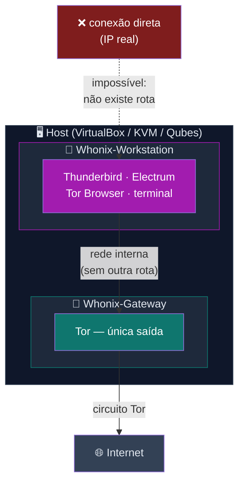
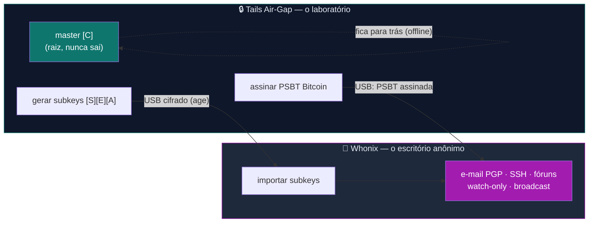
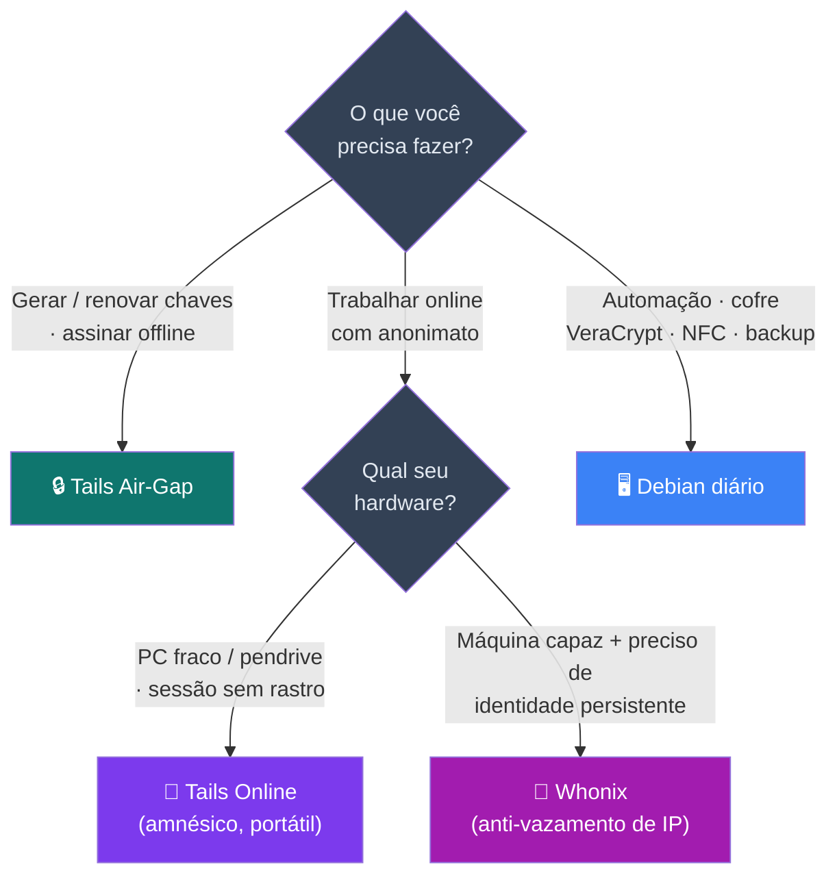
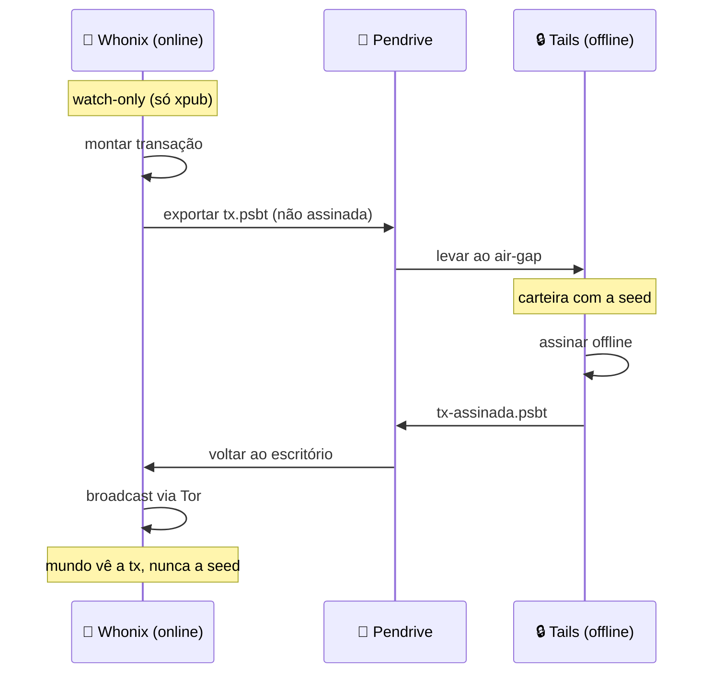

# Diagramas Whonix — Gateway+Workstation × Laboratório/Escritório × Decisão

> Diagramas de apoio ao [guia Whonix](../🧅%20Zero-Trust-Core-Whonix.md). Visualizam o isolamento de
> rede, o fluxo Tails↔Whonix e como escolher entre os três sistemas.

---

## 1 — Isolamento de rede (Gateway + Workstation)

O coração do Whonix: a Workstation **não tem rota para a internet** — só fala com o Gateway, que só fala Tor.

> Mesmo um malware que comprometa a Workstation **não acha um IP real para vazar** — é *fail-closed*.

---

## 2 — Laboratório (Tails) ↔ Escritório (Whonix)

A master nasce e mora no Tails air-gap. Só **subkeys** (e PSBTs assinadas) cruzam para o Whonix.

---

## 3 — Mapa de decisão: qual sistema usar?

---

## 4 — Ciclo Bitcoin (seed nunca online)

---

*Zero Trust Core — Guia Whonix · VIPs-com · [CC BY-SA 4.0](https://creativecommons.org/licenses/by-sa/4.0/)*
