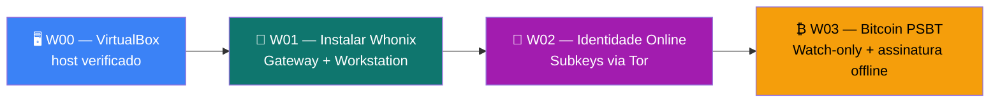

# 🧅 Playbooks Whonix — Zero Trust Core

**Execução direta. Zero teoria. Copie e cole.**

Playbooks dedicados para quem usa **Whonix** como ambiente *online persistente e anônimo*. Complementam
o air-gap do Tails: o Tails cria e guarda a master; o Whonix usa as subkeys no dia a dia, sempre atrás do Tor.

> **Pré-requisito de hardware:** host com virtualização (VT-x/AMD-V), ~8 GB RAM, dezenas de GB de disco.  
> Em **PC fraco**, prefira o [guia Tails](../../tails/🐧%20Zero-Trust-Core-Tails.md) — entrega mais anonimato por real.

---

## Organização

```
whonix/playbooks/
├── W00-instalar-configurar-virtualbox.md  ← Host: VirtualBox verificado (Oracle + GPG)
├── W01-instalar-whonix.md                 ← Gateway + Workstation (verificar + isolar)
├── W02-importar-subkeys-tails.md          ← Subkeys do Tails (master fica no air-gap)
└── W03-bitcoin-psbt-tails-whonix.md       ← Watch-only no Whonix, assinatura no Tails
```



---

## Playbooks

| # | Playbook | O que você terá | Tempo |
|---|----------|-----------------|------:|
| [W00](./W00-instalar-configurar-virtualbox.md) | Instalar VirtualBox | Host com Oracle VirtualBox verificado (GPG + DKMS + vboxusers) | ~20 min |
| [W01](./W01-instalar-whonix.md) | Instalar Whonix | Gateway + Workstation verificados, Tor forçado, sem vazamento de IP | ~40 min |
| [W02](./W02-importar-subkeys-tails.md) | Importar subkeys do Tails | `sec#` + 3 `ssb` no Whonix; master nunca saiu do air-gap | ~20 min |
| [W03](./W03-bitcoin-psbt-tails-whonix.md) | Bitcoin PSBT Tails↔Whonix | Transação transmitida via Tor sem a seed tocar a rede | ~25 min |

**Scripts (host):** [`ztc-whonix-install-virtualbox.sh`](../scripts/ztc-whonix-install-virtualbox.sh) · [`ztc-whonix-sign-virtualbox-modules.sh`](../scripts/ztc-whonix-sign-virtualbox-modules.sh) (Secure Boot/MOK) · [`ztc-whonix-verify-virtualbox-host.sh`](../scripts/ztc-whonix-verify-virtualbox-host.sh) · [`ztc-whonix-verify-image.sh`](../scripts/ztc-whonix-verify-image.sh) · [`ztc-whonix-import-ova.sh`](../scripts/ztc-whonix-import-ova.sh)  
**Script (Workstation):** [`ztc-whonix-health.sh`](../scripts/ztc-whonix-health.sh)

---

## Ordem recomendada

```
Guia Whonix (conceitos) → W00 (VirtualBox) → W01 (Whonix) → W02 (identidade) → W03 (Bitcoin, opcional)
```

> **Primeiro:** leia o [guia principal Whonix](../🧅%20Zero-Trust-Core-Whonix.md) — modelo
> Gateway+Workstation, persistência × amnésia, e por que **não** empilhar VPN no Tor.
>
> Depois de W01–W02, valide com o [CHECKPOINT W](../🧅%20Zero-Trust-Core-Whonix.md#checkpoint-w--validação-final).

---

## Correspondência com playbooks Tails

| Whonix | Equivale a (Tails) | Diferença principal |
|--------|---------------------|-------------------|
| W00 | (host) preparação | VirtualBox verificado no Debian — não existe equivalente Tails |
| W01 | T0 (boot/verificação) + T01 | Instala 2 VMs em vez de gravar 1 pendrive; persistente |
| W02 | [T02](../../tails/playbooks/T02-tails-online-identity.md) | Procedimento **idêntico** no que importa; muda o ambiente de destino |
| W03 | [T0.12 Electrum](../../tails/🐧%20Zero-Trust-Core-Tails.md#t012--electrum-carteira-bitcoin-air-gap-e-online-no-tails) | O "lado online" é o Whonix; a assinatura continua no Tails air-gap |

---

*Zero Trust Core — Guia Whonix · VIPs-com · [CC BY-SA 4.0](https://creativecommons.org/licenses/by-sa/4.0/)*
