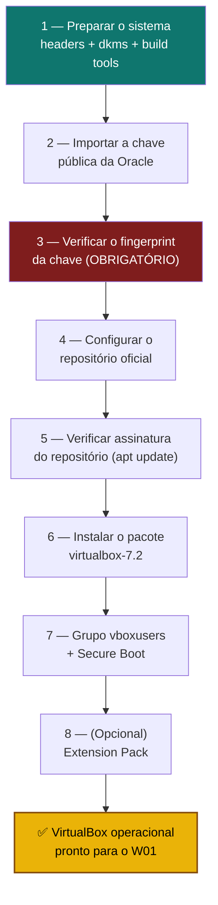

# Playbook W00 — Instalar e Configurar o VirtualBox (Debian 13 "Trixie")

**Objetivo:** Instalar o Oracle VirtualBox a partir do **repositório oficial da Oracle**, com **verificação de assinatura GPG** da chave e do repositório, dependências de kernel (DKMS) corretas, grupo `vboxusers` configurado e módulos carregados — pré-requisito para o [W01 — Instalar Whonix](./W01-instalar-whonix.md).
**Tempo:** ~15–20 min (download depende da conexão)
**Pré-requisitos:**
- [ ] Host **Debian 13 "Trixie"**, arquitetura **amd64**
- [ ] Virtualização habilitada na BIOS/UEFI (VT-x / AMD-V)
- [ ] Acesso `sudo`
- [ ] Decisão tomada sobre **Secure Boot** (ver passo 7 — módulos de terceiros não assinados são bloqueados se estiver habilitado)

> 🔴 **Nunca instale o VirtualBox de fontes não oficiais** (PPAs de terceiros, "mirrors", sites de download genéricos). Use somente `download.virtualbox.org` e a chave publicada em `virtualbox.org`. O mesmo rigor de verificação de assinatura do [W01](./W01-instalar-whonix.md) se aplica aqui — é o host que vai rodar Gateway e Workstation.

---

## Visão geral do processo



---

## 1 — Preparar o sistema

Atualize o índice de pacotes e instale as ferramentas necessárias para o DKMS compilar os módulos do kernel:

```sh
sudo apt update
sudo apt install -y linux-headers-$(uname -r) dkms build-essential gcc make perl curl wget gnupg2
```

Confirme que os headers do kernel **em execução** existem:

```sh
uname -r
ls /usr/src/linux-headers-$(uname -r)
```

> ⚠️ Se o diretório não existir, o DKMS **não** conseguirá compilar `vboxdrv`, `vboxnetflt` e `vboxnetadp` depois. Resolva isso antes de continuar — reinstale os headers correspondentes à versão exata do kernel.

---

## 2 — Importar a chave pública da Oracle

A chave de assinatura oficial dos pacotes VirtualBox para Debian:

```sh
wget -O- https://www.virtualbox.org/download/oracle_vbox_2016.asc | \
  sudo gpg --dearmor --yes -o /usr/share/keyrings/oracle-virtualbox.gpg
```

> **Não confie em fingerprint de terceiros** — a referência oficial é a wiki do VirtualBox: `https://www.virtualbox.org/wiki/Linux_Downloads`.

---

## 3 — Verificar o fingerprint da chave (OBRIGATÓRIO)

```sh
gpg --show-keys --fingerprint /usr/share/keyrings/oracle-virtualbox.gpg
```

Fingerprint oficial esperada (Oracle Corporation, VirtualBox archive signing key):

```
B9F8 D658 297A F3EF C18D 5CDF A2F6 83C5 2980 AECF
```

> 🔴 **Se o fingerprint não bater exatamente → PARE.** Apague o arquivo (`sudo rm /usr/share/keyrings/oracle-virtualbox.gpg`) e recomece do passo 2. Chave não verificada = repositório não confiável.

---

## 4 — Configurar o repositório oficial

```sh
echo "deb [arch=amd64 signed-by=/usr/share/keyrings/oracle-virtualbox.gpg] https://download.virtualbox.org/virtualbox/debian trixie contrib" | \
  sudo tee /etc/apt/sources.list.d/virtualbox.list
```

Confirme o conteúdo do arquivo:

```sh
cat /etc/apt/sources.list.d/virtualbox.list
```

---

## 5 — Verificar assinatura do repositório

```sh
sudo apt update
```

Saída esperada: **nenhuma** menção a `NO_PUBKEY` ou `BADSIG`.

```
🔴 Se aparecer NO_PUBKEY ou BADSIG → PARE. Não instale.
   Rode: sudo apt-get clean && sudo rm -rf /var/lib/apt/lists/* && sudo apt update
   Se persistir, o repositório não é confiável — remova o arquivo .list e investigue.
```

Confirme também que o candidato do pacote vem da Oracle, não de outra fonte:

```sh
apt-cache policy virtualbox-7.2
```

A saída deve apontar para `download.virtualbox.org/virtualbox/debian trixie/contrib`.

---

## 6 — Instalar o VirtualBox

```sh
sudo apt install -y virtualbox-7.2
```

> Série `7.2` é a estável atual. Revalide em [virtualbox.org/wiki/Linux_Downloads](https://www.virtualbox.org/wiki/Linux_Downloads) antes de cada turma. Use `virtualbox-7.1` apenas se precisar da branch anterior — a versão do Extension Pack (passo 8) deve corresponder **exatamente** à série instalada.

O DKMS compila os módulos automaticamente durante a instalação. Verifique:

```sh
lsmod | grep vbox
# se vazio, carregue manualmente:
sudo modprobe vboxdrv
```

---

## 7 — Grupo `vboxusers` e Secure Boot

**Grupo de acesso** (necessário para USB e outros recursos):

```sh
sudo usermod -aG vboxusers "$USER"
```

> Faça **logout/login** (ou `newgrp vboxusers`) para aplicar.

**Secure Boot:** se estiver **habilitado** na UEFI, os módulos de terceiros (`vboxdrv`, `vboxnetflt`, `vboxnetadp` — o `vboxpci` não existe mais desde a série 6.1) são **bloqueados** por padrão. Duas opções:

1. Desabilitar Secure Boot na UEFI (mais simples, reduz uma camada de proteção de boot); ou
2. **Assinar com MOK (recomendado — automatizado pelos scripts):** o `ztc-whonix-install-virtualbox.sh` gera a chave, registra no firmware (`mokutil --import`) e sincroniza para `/var/lib/shim-signed/mok/` (caminho que o `vboxdrv.sh` nativo do pacote exige). Após o reboot com a tela azul (`Enroll MOK → Continue → Yes → senha → Reboot`), rode `ztc-whonix-sign-virtualbox-modules.sh` — repita só o sign a cada update de kernel (a tela azul é uma vez só).

> Se Secure Boot estiver desabilitado, nenhuma ação adicional é necessária aqui.
> Fluxo validado em campo (jul/2026): Debian 13 trixie + Secure Boot + VirtualBox 7.2.12.

---

## 8 — (Opcional) Extension Pack

Habilita USB 2.0/3.0, RDP e criptografia de discos virtuais. A versão **deve corresponder exatamente** à instalada:

```sh
VBOX_VERSION=$(dpkg-query -W -f='${Version}' virtualbox-7.2 | cut -d: -f2 | cut -d- -f1)
wget "https://download.virtualbox.org/virtualbox/${VBOX_VERSION}/Oracle_VirtualBox_Extension_Pack-${VBOX_VERSION}.vbox-extpack"
sudo VBoxManage extpack install --replace "Oracle_VirtualBox_Extension_Pack-${VBOX_VERSION}.vbox-extpack"
```

> Recomendado para o W02 (USB passthrough do pendrive Tails). Não é obrigatório só para importar o `.ova` do Whonix.

---

## 9 — Verificação final

```sh
VBoxManage --version
lsmod | grep vbox
groups "$USER" | grep -q vboxusers && echo "OK: usuário no grupo vboxusers"
```

**Teste de sanidade:** abra o VirtualBox (GUI) e confirme que a tela inicial abre sem erros de driver/kernel.

---

## Automação (opcional)

Suíte de 3 scripts (port da suíte Privacy-OS-Hub `whonix-host` v3.5.4) — automatiza os passos 1–9 com a mesma política ZTC: **aborta** em falha de fingerprint ou assinatura.

```sh
cd whonix/scripts
chmod +x ztc-whonix-*.sh
sudo ./ztc-whonix-install-virtualbox.sh -y            # pacote + Extension Pack + MOK (se SB)
# Secure Boot ON: reboot → tela azul Enroll MOK → depois:
sudo ./ztc-whonix-sign-virtualbox-modules.sh -y --qa-log
sudo ./ztc-whonix-verify-virtualbox-host.sh --qa-log  # esperado: RESULTADO: PASS
```

| Script | Função | Log |
|--------|--------|-----|
| `ztc-whonix-install-virtualbox.sh` | Repo + GPG + pacote + Extension Pack + MOK import | `/var/log/virtualbox-install.log` |
| `ztc-whonix-sign-virtualbox-modules.sh` | vboxconfig + assinatura + carga (repetir a cada kernel novo) | `/var/log/virtualbox-sign.log` |
| `ztc-whonix-verify-virtualbox-host.sh` | 9 checks read-only + QA log | `qa-logs/10-virtualbox-host-*.txt` |

Flags do install: `-y` não-interativo · `-v 7.2` série · `--no-extpack` · `--reset-mok --new-mok-keys` (refazer MOK do zero). Progresso: `/root/module-signing/.hub-vbox-progress`.

---

## Rollback / Desinstalação

```sh
sudo apt purge -y virtualbox-7.2
sudo apt autoremove -y
sudo rm -f /etc/apt/sources.list.d/virtualbox.list
sudo rm -f /usr/share/keyrings/oracle-virtualbox.gpg
sudo apt update
```

---

✅ **Concluído** — VirtualBox instalado a partir de fonte verificada, módulos carregados, usuário no grupo `vboxusers`. Host pronto para importar as imagens do Whonix.

**Próximo passo:** → [W01 — Instalar Whonix (Gateway + Workstation)](./W01-instalar-whonix.md)

📖 **Referência oficial:** [VirtualBox Linux Downloads](https://www.virtualbox.org/wiki/Linux_Downloads)
