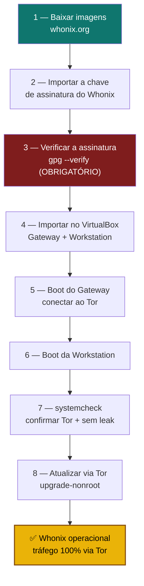

# Playbook W01 — Instalar Whonix (Gateway + Workstation)

**Objetivo:** Baixar, **verificar a assinatura**, importar e isolar o Whonix-Gateway + Whonix-Workstation, confirmando que a Workstation não tem rota fora do Tor.  
**Tempo:** ~40 min (download depende da conexão)  
**Pré-requisitos:**
- [ ] Host com **virtualização** habilitada na BIOS/UEFI (VT-x / AMD-V)
- [ ] ~8 GB de RAM e dezenas de GB de disco livres
- [ ] **VirtualBox** instalado (ou KVM/libvirt) num host **confiável e atualizado**
- [ ] Leu o [guia principal Whonix](../🧅%20Zero-Trust-Core-Whonix.md) — em especial "Requisitos honestos"

> 🔴 **Em PC fraco, pare aqui** e use o [guia Tails](../../tails/🐧%20Zero-Trust-Core-Tails.md). Duas VMs travando não te deixam mais seguro.

---

## Visão geral do processo



---

## 1 — Baixar as imagens

No **host**, baixe as imagens do Whonix (VirtualBox `.ova` ou KVM `.libvirt.xz`) **somente** de:

```
https://www.whonix.org/wiki/Download
```

> Baixe também o arquivo de **assinatura** (`.asc`/`.sig`) correspondente, na mesma página.

---

## 2 — Importar a chave de assinatura do Whonix

A chave de assinatura oficial e seu **fingerprint** estão publicados na página oficial de verificação.
**Não confie em fingerprint de terceiros** — pegue da fonte:

```
https://www.whonix.org/wiki/Verify_the_virtual_machine_images
```

```sh
# Importar a chave conforme instruído na página oficial (ex.: via arquivo .asc baixado de derivative.org)
gpg --import patrick.asc

# Conferir o fingerprint contra o publicado em whonix.org/wiki/Verify_the_virtual_machine_images
gpg --keyid-format long --fingerprint <FINGERPRINT_DA_PÁGINA_OFICIAL>
```

> ⚠️ Por que não fixamos o fingerprint aqui: a chave de assinatura pode ser rotacionada. A regra ZTC é
> **verificar sempre contra a fonte oficial no momento do download** — o mesmo rigor da
> [verificação do Tails (T0.13)](../../tails/🐧%20Zero-Trust-Core-Tails.md).

---

## 3 — Verificar a assinatura (OBRIGATÓRIO)

```sh
gpg --verify Whonix-*.ova.asc Whonix-*.ova
```

Saída esperada (essência):
```
gpg: Good signature from "Patrick Schleizer ..." 
```

> 🔴 **Se aparecer `BAD signature` ou a chave não bater com o fingerprint oficial → PARE.** Não importe.
> Apague o arquivo e baixe de novo. Imagem não verificada = você não sabe o que está rodando.

---

## 4 — Importar no VirtualBox

**Via GUI:** VirtualBox → **Arquivo → Importar Appliance** → selecione o `.ova` → Importar.
Isso cria **duas VMs**: `Whonix-Gateway` e `Whonix-Workstation`.

**Via terminal:**
```sh
VBoxManage import Whonix-*.ova
VBoxManage list vms     # deve listar Whonix-Gateway e Whonix-Workstation
```

> **KVM/libvirt:** siga o guia oficial — extraia o `.libvirt.xz` e importe as redes + domínios com os
> scripts/arquivos fornecidos pelo Whonix. O isolamento de rede é equivalente.

---

## 5 — Boot do Gateway (conectar ao Tor)

```
Inicie PRIMEIRO o Whonix-Gateway.
```

- Aceite os avisos iniciais (uso legal, sem garantias).
- No **Anon Connection Wizard**: conexão normal, ou **bridge** se sua rede censura o Tor
  (mesmo conceito da [seção T0.3 do Tails](../../tails/🐧%20Zero-Trust-Core-Tails.md)).
- Aguarde o Gateway sinalizar **Tor conectado**.

---

## 6 — Boot da Workstation

```
Com o Gateway já rodando, inicie o Whonix-Workstation.
```

A Workstation só tem **uma** interface de rede, apontada para o Gateway. Ela **não** fala com a
internet diretamente — é o coração do modelo anti-vazamento.

---

## 7 — systemcheck (confirmar Tor + ausência de leak)

Na **Workstation**:

```sh
systemcheck
```

Esperado: confirmação de que o Tor está funcionando e a configuração de rede está correta.

**Teste de vazamento (sanidade):** abra o **Tor Browser** da Workstation em
`https://check.torproject.org` → deve dizer **"Congratulations. This browser is configured to use Tor."**
O IP mostrado é de um nó de saída Tor, **nunca** o seu.

> 🧪 Confirme o isolamento: a Workstation não deve ter rota para a internet exceto via Gateway. Se você
> tentou configurar uma segunda placa de rede "para facilitar", **desfez** a proteção — remova-a.

---

## 8 — Atualizar via Tor

Na Workstation e no Gateway:

```sh
sudo apt update && sudo apt full-upgrade
```

> No Whonix, o `apt` já sai pelo Tor. Mantenha **as duas VMs** atualizadas — o Gateway é tão crítico
> quanto a Workstation.

---

✅ **Concluído** — Whonix operacional, tráfego 100% via Tor, Workstation isolada sem rota de vazamento.

**Próximo passo:** → [W02 — Importar subkeys do Tails](./W02-importar-subkeys-tails.md)

📖 **Referência no guia:** [O modelo Gateway + Workstation](../🧅%20Zero-Trust-Core-Whonix.md#o-modelo-gateway--workstation) · [Requisitos honestos](../🧅%20Zero-Trust-Core-Whonix.md#requisitos-reais-e-honestos-o-dilema-do-pc-velho)
