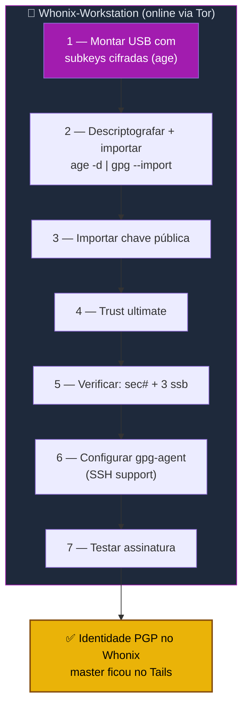

# Playbook W02 — Importar subkeys do Tails no Whonix

**Objetivo:** Importar as subkeys PGP no Whonix-Workstation e configurar o gpg-agent, mantendo a **master sempre no Tails air-gap**.  
**Tempo:** ~20 min  
**Pré-requisitos:**
- [ ] [W01](./W01-instalar-whonix.md) concluído (Gateway + Workstation rodando)
- [ ] Master gerada no air-gap ([Playbook 05](../../playbooks/2-identidade-pgp/05-tails-master-pgp.md))
- [ ] Pendrive com `subkeys.gpg.age` + `chave-publica.asc` (gerados no Tails)

> 🟢 **Este procedimento é o mesmo do [Playbook T02](../../tails/playbooks/T02-tails-online-identity.md)** —
> o que importa é idêntico. Muda só o ambiente de destino (Whonix-Workstation em vez do Tails online).
> Mantemos aqui por completude do guia Whonix.

---

## Visão geral do processo



---

## 1 — Montar o USB com as subkeys

Conecte o pendrive à VM (VirtualBox: **Dispositivos → USB → [seu pendrive]**).

```sh
PENDRIVE="/media/user/SEUPENDRIVE"     # ajuste o caminho real
ls "$PENDRIVE"/subkeys.gpg.age "$PENDRIVE"/chave-publica.asc
```

---

## 2 — Descriptografar e importar as subkeys

```sh
age -d "$PENDRIVE/subkeys.gpg.age" | gpg --import
```

> Digite a passphrase do `age` (a mesma definida ao exportar no Tails, Playbook 05).
> Se o `age` não estiver instalado: `sudo apt install -y age`.

---

## 3 — Importar a chave pública

```sh
gpg --import "$PENDRIVE/chave-publica.asc"
```

---

## 4 — Confiar na própria chave

```sh
FPRINT=$(gpg --list-keys --with-colons | grep '^fpr' | head -1 | cut -d: -f10)
echo "$FPRINT:6:" | gpg --import-ownertrust
```

---

## 5 — Verificar

```sh
gpg -K
```

Saída esperada:
```
sec#  ed25519 2026-XX-XX [C] [expires: 2029-XX-XX]
      ABCD1234...
uid           [ultimate] Seu Nome <voce@exemplo.com>
ssb   ed25519 2026-XX-XX [S] [expires: 2028-XX-XX]
ssb   cv25519 2026-XX-XX [E] [expires: 2028-XX-XX]
ssb   ed25519 2026-XX-XX [A] [expires: 2028-XX-XX]
```

> 🔑 **`sec#`** (com o `#`) confirma que a **master está ausente** — só ficou o stub. As três `ssb`
> são as subkeys de trabalho. Se aparecer `sec` **sem** `#`, você exportou a master por engano: apague
> tudo e refaça a exportação no Tails com `--export-secret-subkeys`.

---

## 6 — Configurar gpg-agent (suporte SSH)

```sh
grep -qF 'enable-ssh-support' ~/.gnupg/gpg-agent.conf 2>/dev/null || \
  echo "enable-ssh-support" >> ~/.gnupg/gpg-agent.conf

# Registrar o keygrip da subchave [A]
KEYGRIP=$(gpg -K --with-keygrip | grep -A1 '\[A\]' | grep Keygrip | awk '{print $3}')
grep -qF "$KEYGRIP" ~/.gnupg/sshcontrol 2>/dev/null || \
  echo "$KEYGRIP" >> ~/.gnupg/sshcontrol

gpgconf --kill gpg-agent
gpgconf --launch gpg-agent
export SSH_AUTH_SOCK=$(gpgconf --list-dirs agent-ssh-socket)

ssh-add -L
```

---

## 7 — Testar assinatura

```sh
echo "teste de assinatura ZTC no Whonix" | gpg --clearsign
```

Saída esperada: bloco `-----BEGIN PGP SIGNED MESSAGE-----` … `-----END PGP SIGNATURE-----`.

---

## Se o Whonix for comprometido

A Workstation é persistente e online — assuma que **pode** cair um dia. Plano:

1. No **Tails air-gap**, gere novas subkeys a partir da master (que nunca saiu de lá).
2. **Revogue** as subkeys antigas e publique a chave pública atualizada.
3. Reimporte as novas subkeys no Whonix (repita este playbook).

> A **master (raiz da confiança) permanece intacta** — você rotaciona as cópias de trabalho, não a identidade.

---

✅ **Concluído** — identidade PGP funcional no Whonix, via Tor, com a master segura no Tails.

**Próximo passo:** → [W03 — Bitcoin PSBT Tails↔Whonix](./W03-bitcoin-psbt-tails-whonix.md) (se você opera Bitcoin)

📖 **Referência no guia:** [Fluxo de chaves Tails → Whonix](../🧅%20Zero-Trust-Core-Whonix.md#fluxo-de-chaves-tails--whonix-master-offline-só-subkeys-online)
