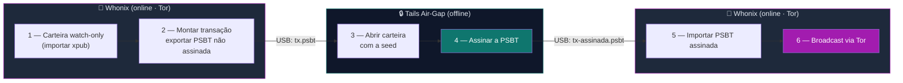

# Playbook W03 — Bitcoin PSBT Tails ↔ Whonix

**Objetivo:** Operar Bitcoin com a **seed sempre offline** — montar e transmitir transações no Whonix (via Tor), assinar no Tails air-gap.  
**Tempo:** ~25 min  
**Pré-requisitos:**
- [ ] [W01](./W01-instalar-whonix.md) concluído (Whonix operacional)
- [ ] Seed gerada e testada no **Tails air-gap** + **xpub** salva — ver [T0.12 Electrum no guia Tails](../../tails/🐧%20Zero-Trust-Core-Tails.md#t012--electrum-carteira-bitcoin-air-gap-e-online-no-tails)
- [ ] **Pendrive de transporte** (transitório, dedicado) — separado da mídia que guarda a seed

> 🟢 **A mecânica do Electrum (gerar seed, watch-only, exportar/assinar PSBT) já está em
> [T0.12](../../tails/🐧%20Zero-Trust-Core-Tails.md#t012--electrum-carteira-bitcoin-air-gap-e-online-no-tails).**
> Este playbook mostra **só o que muda** quando o lado online é o Whonix em vez do Tails online.

---

## Visão geral do processo



> 🔴 **Regra absoluta:** a **seed nunca toca o Whonix.** Não há "subchave" de seed — a seed *é* a raiz.
> Se ela aparecer em qualquer sistema online, considere os fundos comprometidos.

---

## OpSec — duas mídias diferentes (transporte × segredo)

A moral do fluxo: **a mídia do segredo nunca toca o ambiente online.** Use **dois pendrives distintos**:

| Mídia | Carrega | Onde entra | Regra |
|-------|---------|-----------|-------|
| 🔐 **Mídia de segredo** (cofre LUKS / seed) | seed, chaves | **só** no Tails offline | **NUNCA** montar no Whonix |
| 📂 **Pendrive de transporte** (transitório) | só o arquivo `.psbt` | online ↔ offline | dedicado e descartável |

- O Whonix só vê **transações** (PSBT não assinada / assinada) — **nunca** a seed nem o cofre.
- **Não abra o cofre LUKS no Whonix.** Precisa da seed? É no Tails offline, ponto.

> 🔴 **O transporte é, ele mesmo, um risco (BadUSB):** o pendrive de transporte tocou o online e pode
> levar algo de volta ao Tails. Por isso ele é **dedicado e barato**, você copia **só o `.psbt`**, e o
> Tails amnésico limita a persistência — ver [BadUSB no guia Tails](../../tails/🐧%20Zero-Trust-Core-Tails.md#segurança-usb-ataques-de-firmware-badusb).
>
> 🥇 **Melhor ainda — QR em vez de USB:** o Electrum troca PSBT por **QR code** (animado para TX grandes),
> o que **elimina a ponte USB** — nenhum pendrive cruza os mundos. Prefira QR; o transitório é o plano B.

---

## 1 — Carteira watch-only no Whonix (só a xpub)

Na **Whonix-Workstation**, instale o Electrum (verificando a assinatura — mesmo rigor do W01) e crie
uma carteira **watch-only** importando **apenas a xpub** gerada no Tails:

```
Electrum → File → New → "Use a master key" → colar a xpub → (NÃO há seed aqui)
```

A carteira mostra saldo e endereços, mas **não consegue assinar** — é exatamente o que queremos online.

> Por padrão, o Electrum no Whonix já sai pelo Tor. Confirme em **Tools → Network** que está conectado
> via Tor/proxy do Gateway.

---

## 2 — Montar a transação e exportar a PSBT

```
Electrum → aba Send → preencher destino, valor e taxa → Pay...
→ em vez de transmitir, escolha "Export" / "Save" → salvar como tx.psbt no pendrive
```

A PSBT é uma transação **não assinada**. Copie `tx.psbt` para o pendrive.

---

## 3–4 — Assinar offline no Tails air-gap

Leve o pendrive ao **Tails air-gap (offline, WiFi desligado)** e siga
[T0.12](../../tails/🐧%20Zero-Trust-Core-Tails.md#t012--electrum-carteira-bitcoin-air-gap-e-online-no-tails):

```
Electrum (offline, carteira com a seed) → Tools → Load transaction → from file → tx.psbt
→ Sign → Export / Save → tx-assinada.psbt no pendrive
```

A seed é usada **apenas aqui**, offline. Ao desligar o Tails, ela some da RAM.

---

## 5–6 — Transmitir no Whonix via Tor

De volta à **Whonix-Workstation**:

```
Electrum (watch-only) → Tools → Load transaction → from file → tx-assinada.psbt
→ Broadcast
```

A transação entra na rede Bitcoin **através do Tor**. O mundo vê a transação; **nunca** a sua seed nem o seu IP.

---

## Por que Whonix aqui (e não só Tails online)?

| | Tails online | Whonix |
|---|---|---|
| Broadcast via Tor | ✅ | ✅ |
| **Vazamento de IP** se o Electrum/app falhar | possível | **bloqueado** pelo Gateway |
| Carteira watch-only **persistente** entre sessões | 🟡 só com Persistent (risco) | ✅ natural |

Para quem transmite com frequência e quer a watch-only sempre à mão, o Whonix soma persistência +
anti-vazamento. Para uso esporádico, o Tails online resolve.

---

✅ **Concluído** — transação Bitcoin anônima, com a seed isolada no air-gap o tempo todo.

📖 **Referência no guia:** [Fluxo Bitcoin: seed sempre offline, PSBT no Whonix](../🧅%20Zero-Trust-Core-Whonix.md#fluxo-bitcoin-seed-sempre-offline-psbt-no-whonix)
