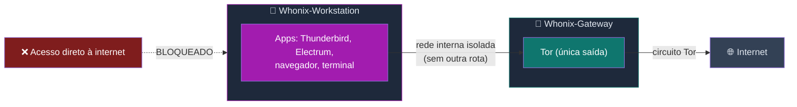
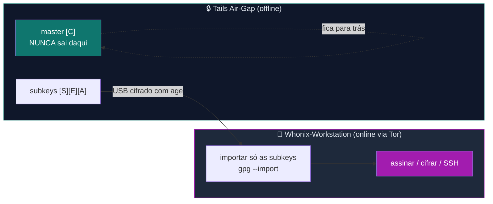
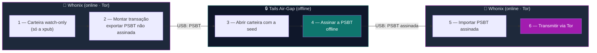
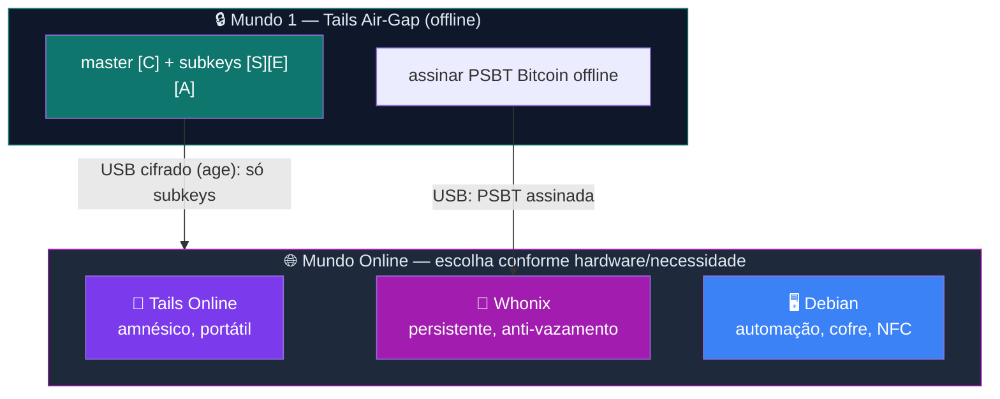

# Zero Trust Core — Guia Dedicado Whonix

> **O escritório anônimo.** Este guia fecha a arquitetura do curso com o ambiente *online persistente*
> que complementa o Tails air-gap. Onde o Tails é o **laboratório descartável** (cria a chave e some),
> o Whonix é o **escritório blindado** (você trabalha todo dia, sempre atrás do Tor).

---

## Sumário

- [Por que um guia separado?](#por-que-um-guia-separado)
- [Por que Whonix? (o escritório anônimo)](#por-que-whonix-o-escritório-anônimo)
- [Whonix × Tails × Debian — quando cada um brilha](#whonix--tails--debian--quando-cada-um-brilha)
- [O modelo Gateway + Workstation](#o-modelo-gateway--workstation)
- [Requisitos reais e honestos (o dilema do "PC velho")](#requisitos-reais-e-honestos-o-dilema-do-pc-velho)
- [O dilema da persistência (Tails efêmero × persistente × Whonix)](#o-dilema-da-persistência-tails-efêmero--persistente--whonix)
- [Fluxo de chaves: Tails → Whonix (master offline, só subkeys online)](#fluxo-de-chaves-tails--whonix-master-offline-só-subkeys-online)
- [Fluxo Bitcoin: seed sempre offline, PSBT no Whonix](#fluxo-bitcoin-seed-sempre-offline-psbt-no-whonix)
- [⚠️ Correção de segurança: NÃO empilhe "VPN grátis + Tor"](#-correção-de-segurança-não-empilhe-vpn-grátis--tor)
- [CHECKPOINT W — Validação Final](#checkpoint-w--validação-final)
- [Diagrama dos Mundos atualizado](#diagrama-dos-mundos-atualizado)
- [Playbooks Whonix](#playbooks-whonix)
- [Referências oficiais](#referências-oficiais)

---

## Por que um guia separado?

O curso principal usa **Debian 13 (Trixie)** como sistema diário e **Tails** para o air-gap. O guia
[Tails dedicado](../tails/🐧%20Zero-Trust-Core-Tails.md) cobre o "mundo online amnésico" (Tails + Tor).
Falta o terceiro modelo: um **ambiente online persistente e anônimo por design**, para quem precisa
operar todo dia atrás do Tor sem recriar o ambiente a cada boot — e sem depender da disciplina de
"lembrar de rotear pelo Tor". Esse é o **Whonix**.

Ele entra como **leitura avançada / capstone** da Parte 4 (Expert). Não substitui o Tails nem o Debian
— acrescenta uma opção de 1ª classe para o *mundo online*, com um modelo de isolamento que nenhum dos
outros dois oferece.

> 🔵 **Pré-requisito conceitual:** você já entende master offline + subkeys (Parte 1), o fluxo air-gap
> do [Tails](../tails/🐧%20Zero-Trust-Core-Tails.md) e o [threat model (Módulo 7)](../🎓%20Zero-Trust-Core-Expert%20-%20Versão%201.0.md#-módulo-7-threat-modeling-e-opsec).

---

## Por que Whonix? (o escritório anônimo)

O Tor protege contra rastreamento de rede — **se** todo o tráfego passar por ele. O ponto fraco de
qualquer sistema "normal + Tor Browser" é o **vazamento**: um app mal configurado, uma atualização,
um malware, e o IP real escapa por fora do Tor.

O Whonix resolve isso na **arquitetura**, não na disciplina do usuário:

- Você trabalha numa máquina (**Workstation**) que **não tem rota de rede nenhuma** a não ser por uma
  segunda máquina (**Gateway**) que só sabe falar Tor.
- Mesmo que a Workstation seja **comprometida por malware**, ela **não consegue** vazar seu IP real —
  porque ela nunca teve acesso à internet "crua". É **fail-closed**: na dúvida, não passa.

| | Tor Browser num PC normal | Whonix |
|---|---|---|
| Quem garante que tudo vai pelo Tor? | **Você** (config + disciplina) | A **arquitetura** (Gateway força) |
| App vazou fora do Tor? | IP real exposto | Bloqueado — sem rota fora do Gateway |
| Malware na Workstation rouba o IP? | Sim | Não há IP real para roubar |

Em uma frase: **o Tails te dá amnésia; o Whonix te dá uma jaula de rede à prova de vazamento.**

---

## Whonix × Tails × Debian — quando cada um brilha

Não é "qual é o melhor" — é **qual ferramenta para qual tarefa**. Os três coexistem na arquitetura ZTC.

| Critério | 🔒 Tails (air-gap / online) | 🧅 Whonix | 🖥️ Debian diário |
|---|---|---|---|
| **Amnésia** | ✅ Total (RAM, nada persiste) | ❌ Persistente por design | ❌ Persistente |
| **Portabilidade** | ✅ Pendrive, qualquer PC | ❌ Precisa host + virtualização | ❌ Instalado |
| **Anti-vazamento de IP** | 🟢 Forte (firewall força Tor) | 🟢 **Máximo** (Gateway isolado) | 🔴 Depende de você |
| **Persistência de identidade** | 🟡 Frágil (Persistent = risco) | ✅ É o ponto forte | ✅ Sim |
| **Hardware fraco ("PC velho")** | ✅ Roda em quase tudo | ❌ Pesado (2 VMs) | 🟡 Depende |
| **Melhor para** | Gerar/renovar chaves; sessão "sem rastro" | Trabalho **online diário** anônimo | Automação, cofre, backup, NFC |

**Leitura estratégica:**

- **Operação crítica e única** (gerar master, assinar offline) → **Tails air-gap**. Nada persiste, nada vaza.
- **Rotina online anônima** (e-mail PGP, fóruns, pesquisa sensível, broadcast de transação) → **Whonix**, se você tem hardware para virtualização.
- **Automação, cofre VeraCrypt, NFC, backup off-site** → **Debian diário** (núcleo do curso).

> 🧠 **Analogia:** o Tails é a **luva descartável** (faz o trabalho sujo e joga fora); o Whonix é a
> **casa com cortinas sempre fechadas** (você mora lá, mas ninguém vê de fora); o Debian é a
> **oficina** (onde ficam as ferramentas pesadas e a automação).

---

## O modelo Gateway + Workstation

O Whonix são **duas máquinas** (normalmente duas VMs no mesmo host):

- **Whonix-Gateway** — roda o Tor. É a **única** ponte para a internet. Não se usa para trabalhar.
- **Whonix-Workstation** — onde você abre apps. Sua **única** placa de rede aponta para o Gateway.

Por que isso importa: num PC comum, um malware que comprometa o navegador pode chamar a internet
direto e revelar seu IP. Na Workstation do Whonix, **não existe essa rota** — o malware fica preso
atrás do Tor. A separação física (duas VMs) torna o vazamento de IP **muito difícil por design**: a
Workstation **não conhece** seu IP real (enxerga só um endereço interno), então um malware nela
simplesmente **não tem o que vazar** — a proteção não depende de você "ter configurado certo".

> 🔴 **Honestidade (como no resto do curso):** o Whonix blinda o **IP**, não a sua **identidade**. Se
> você logar numa conta pessoal, escrever seu nome ou cair em *fingerprint* de navegador, você se
> desanonimiza sozinho. A jaula de rede cobre o vazamento *técnico*; o **elo humano** continua sendo
> você — ver as [personas do Módulo 7](../🎓%20Zero-Trust-Core-Expert%20-%20Versão%201.0.md#-módulo-7-threat-modeling-e-opsec).

> 🥇 **Padrão-ouro:** rodar o Whonix sobre **[Qubes OS](https://www.qubes-os.org/)** (Qubes-Whonix),
> onde o isolamento entre Gateway, Workstation e host é reforçado pelo hypervisor Xen. Para a maioria,
> Whonix em VirtualBox/KVM sobre um host Linux confiável já é um salto enorme.

---

## Requisitos reais e honestos (o dilema do "PC velho")

A pesquisa que originou este guia tinha um cenário recorrente: *"PC velho + pendrive simples"*. Para
esse cenário, a resposta honesta é: **o Whonix provavelmente não é para você — use o Tails.**

| | O que o Whonix exige |
|---|---|
| **Virtualização** | CPU com VT-x/AMD-V; rodar **duas VMs** ao mesmo tempo (Gateway + Workstation) |
| **RAM** | Confortável a partir de ~8 GB no host (2 VMs + host) |
| **Disco** | Dezenas de GB (VMs persistem em disco) |
| **Host confiável** | O Whonix **herda a segurança do host** — host comprometido compromete as VMs (exceto em Qubes) |
| **Não é portátil** | Vive no host; não é "boot e pronto" como o Tails |

> 🔴 **Honestidade, não venda.** O mesmo princípio do resto do curso (ver a [seção keylogger do
> Módulo 7](../🎓%20Zero-Trust-Core-Expert%20-%20Versão%201.0.md#-keylogger--o-que-o-cofre-não-protege-e-como-mitigar)
> e o [horizonte PQC do Módulo 8](../🎓%20Zero-Trust-Core-Expert%20-%20Versão%201.0.md#-módulo-8-preparação-pós-quântica-horizonte)):
> nenhuma ferramenta é mágica. Se você só tem um notebook fraco e um pendrive, **o Tails entrega mais
> anonimato por real investido** do que tentar rodar duas VMs travando. O Whonix vale quando você
> **já tem** uma máquina capaz e precisa de uma **identidade online persistente**.

---

## O dilema da persistência (Tails efêmero × persistente × Whonix)

Uma dúvida que confunde quase todo mundo: *"se eu ligo o Persistent Storage do Tails, ele não vira
um Whonix?"* — **Não.** E entender por quê é o coração da decisão.

| Modelo | O que é | Trade-off |
|---|---|---|
| **Tails efêmero** | Roda na RAM, apaga tudo ao desligar | 🟢 Segurança máxima; ❌ nada sobrevive |
| **Tails persistente** | Partição LUKS no próprio pendrive | 🟡 Conveniência; ⚠️ **abre superfície de ataque** — quem pegar o pendrive tenta a senha, e você perde a vantagem "amnésica" que torna o Tails único |
| **Whonix** | Persistente **por design**, em VM atrás do Tor | ✅ Persistência é o **propósito**; o ganho é o anti-vazamento de IP, não a amnésia |

A diferença não é técnica, é de **modelo de ameaça**:

- No **Tails**, persistência **contradiz** o design (o valor dele é não deixar rastro).
- No **Whonix**, persistência é **esperada** (não dá para ter rotina diária sem guardar nada).

> 💡 **Regra prática:** se você habilitou o Persistent Storage do Tails para *uso online diário*, você
> transformou o Tails num "Debian com Tor" pior — e nesse caso **o Whonix faz isso melhor**. Use o
> Persistent do Tails só para o que ele foi feito (keyfile, config, cofre LUKS de sessão), não como
> substituto de um sistema persistente.

---

## Fluxo de chaves: Tails → Whonix (master offline, só subkeys online)

"Mas se eu importo minhas chaves no Whonix, elas não ficam expostas num sistema persistente?" — Sim,
**as subkeys ficam**. E está tudo bem, porque a **master nunca sai do Tails**. Esse é exatamente o
modelo da [Parte 1](../🎓%20Zero-Trust-Core-Expert%20-%20Versão%201.0.md#-2-parte-1-primeiros-passos-semana-1)
aplicado ao Whonix.

- **Master [C]** → gerada e guardada **só** no Tails air-gap. É a raiz da confiança.
- **Subkeys [S][E][A]** → exportadas, cifradas com `age`, levadas por USB, importadas no Whonix.
- **Se o Whonix for comprometido** → você **revoga as subkeys** e gera novas no Tails. A master
  (raiz) permanece intacta — você não perde a identidade, só rotaciona as "cópias de trabalho".

É isto que dissolve o "bug mental": importar para o Whonix **não** é o mesmo que persistência no
Tails, porque a chave crítica (master) **continua no ambiente efêmero**. O que vai para o Whonix são
subkeys descartáveis e recriáveis.

> 📎 **Passo a passo:** [W02 — Importar subkeys do Tails no Whonix](./playbooks/W02-importar-subkeys-tails.md).
> O procedimento espelha o [Playbook T02](../tails/playbooks/T02-tails-online-identity.md) (idêntico no
> que importa); muda o ambiente de destino.

---

## Fluxo Bitcoin: seed sempre offline, PSBT no Whonix

Seeds não têm "subchave": a seed **é** a raiz absoluta. Se ela tocar um sistema online, acabou. Logo,
o modelo é o mesmo do PGP, mas ainda mais rígido — **a seed nunca, jamais, vai ao Whonix.**

1. **Whonix** vê apenas a **xpub** (chave pública estendida) → monta a transação → exporta uma **PSBT**
   (Partially Signed Bitcoin Transaction) **não assinada**.
2. **Tails air-gap** abre a carteira com a seed, **assina a PSBT offline**.
3. **Whonix** importa a PSBT assinada e **transmite via Tor**. O mundo vê a transação; nunca a seed.

> 📎 **A mecânica do Electrum (gerar seed, watch-only, PSBT, assinar)** já está documentada em detalhe
> na [seção T0.12 do guia Tails](../tails/🐧%20Zero-Trust-Core-Tails.md#t012--electrum-carteira-bitcoin-air-gap-e-online-no-tails).
> Este guia **não duplica** — o [W03](./playbooks/W03-bitcoin-psbt-tails-whonix.md) só mostra o que muda
> quando o "lado online" é o Whonix em vez do Tails online.
>
> 🔐 **Regra de mídia:** use **dois pendrives** — segredo (cofre/seed, só no Tails) × transporte (só o `.psbt`); **nunca** monte o cofre no Whonix, e prefira **QR** ao USB. Detalhes no [W03](./playbooks/W03-bitcoin-psbt-tails-whonix.md#opsec--duas-mídias-diferentes-transporte--segredo).

---

## ⚠️ Correção de segurança: NÃO empilhe "VPN grátis + Tor"

> 🔴 **Mito comum (e que aparecia na pesquisa original):** *"use uma VPN grátis antes do Tor para
> ficar mais seguro"*. **Isso está errado e pode te prejudicar.** Corrigindo de forma definitiva:

- **Tails e Whonix já roteiam 100% do tráfego pelo Tor.** Não há tráfego "fora do Tor" para uma VPN proteger.
- Adicionar uma VPN **não soma** anonimato — ela vira **um único ponto que vê e pode registrar você**.
  Uma **VPN grátis** é o pior caso: o modelo de negócio dela costuma ser **monetizar/registrar** seu tráfego.
- "VPN → Tor" e "Tor → VPN" têm trade-offs específicos que **a maioria das pessoas configura errado** e
  que **degradam** o anonimato em vez de melhorá-lo. O próprio projeto Whonix documenta isso e
  desaconselha para o usuário típico.
- **Se o seu problema é esconder do seu provedor (ISP) que você usa Tor**, a ferramenta correta **não é
  VPN** — são as **[bridges/pontes Tor](https://tb-manual.torproject.org/bridges/)** (cobertas na
  [seção T0.3 do guia Tails](../tails/🐧%20Zero-Trust-Core-Tails.md)).

✅ **Regra ZTC:** confie no Tor que o Tails/Whonix já força. Use **bridges** para censura/ocultação do
ISP. **Não** acrescente VPNs (muito menos grátis) "por garantia" — em anonimato, camada a mais sem
entender o modelo de ameaça costuma ser **teatro de segurança**.

---

## CHECKPOINT W — Validação Final

Marque tudo antes de considerar o "mundo Whonix" operacional:

- [ ] Whonix baixado de **whonix.org** e **assinatura OpenPGP verificada** (não confie em mirror/torrent sem verificar)
- [ ] **Gateway + Workstation** rodando; teste confirmando que a Workstation **não acessa a rede direto** (só via Gateway)
- [ ] Host **confiável** (atualizado, mínimo de software) — ou rodando sobre Qubes
- [ ] Subkeys importadas: `gpg -K` mostra `sec#` (master ausente) + 3 `ssb`
- [ ] A **master nunca saiu do Tails** — você consegue explicar por que isso ≠ persistência no Tails
- [ ] Se Bitcoin: fluxo PSBT testado (watch-only no Whonix → assinatura no Tails → broadcast via Tor)
- [ ] Você sabe explicar: **amnésia (Tails) × persistência (Whonix)**, **anti-vazamento do Gateway**, e **por que não empilhar VPN grátis no Tor**
- [ ] Plano de revogação: se a Workstation cair, você revoga subkeys e recria no Tails

---

## Diagrama dos Mundos atualizado

O guia Tails apresenta os "Três Mundos". Com o Whonix, o **mundo online** ganha uma opção de 1ª classe:

> **Diagramas adicionais** (Gateway+Workstation, mapa de decisão Tails/Whonix/Debian): [DIAGRAMA-WHONIX.md](./docs/DIAGRAMA-WHONIX.md).

---

## Playbooks Whonix

Execução direta, copiar e colar — espelham os playbooks Tails (T01–T04):

| # | Playbook | O que você terá | Tempo |
|---|----------|-----------------|------:|
| [W00](./playbooks/W00-instalar-configurar-virtualbox.md) | Instalar VirtualBox | Host Debian com Oracle VirtualBox verificado (GPG) | ~20 min |
| [W01](./playbooks/W01-instalar-whonix.md) | Instalar Whonix | Gateway + Workstation verificados e isolados | ~40 min |
| [W02](./playbooks/W02-importar-subkeys-tails.md) | Importar subkeys do Tails | Identidade PGP online (master fica no Tails) | ~20 min |
| [W03](./playbooks/W03-bitcoin-psbt-tails-whonix.md) | Bitcoin PSBT Tails↔Whonix | Transação anônima sem expor a seed | ~25 min |

> Índice completo: [whonix/playbooks/README.md](./playbooks/README.md).
>
> **Scripts host (W00–W01):** [`ztc-whonix-install-virtualbox.sh`](./scripts/ztc-whonix-install-virtualbox.sh) · [`ztc-whonix-import-ova.sh`](./scripts/ztc-whonix-import-ova.sh)
>
> **Script Workstation (sessão):** [`ztc-whonix-health.sh`](./scripts/ztc-whonix-health.sh) — checagem de
> sessão na Workstation (Tor via `systemcheck`, subkeys com master ausente, gpg-agent, `age`). Espelha
> o `ztc-tails-health.sh`. Rode no início de cada sessão.
>
> **E o backup do Whonix?** Não é shell script: o Whonix é uma VM persistente, então o backup é um
> **snapshot da VM no host** (VirtualBox/Qubes) — e os **segredos** (subkeys) já vêm cifrados do fluxo
> air-gap do Tails ([W02](./playbooks/W02-importar-subkeys-tails.md)). Automação cross-VM fica como follow-up.

---

## Referências oficiais

- **Whonix** — [whonix.org](https://www.whonix.org/) · [documentação](https://www.whonix.org/wiki/Documentation)
- **Verificar o download** — [whonix.org/wiki/Verify_the_images](https://www.whonix.org/wiki/Verify_the_images)
- **VPN + Tor (por que tomar cuidado)** — [whonix.org/wiki/Tunnels/Introduction](https://www.whonix.org/wiki/Tunnels/Introduction)
- **Qubes-Whonix (padrão-ouro)** — [qubes-os.org](https://www.qubes-os.org/) · [whonix.org/wiki/Qubes](https://www.whonix.org/wiki/Qubes)
- **Tor bridges (censura/ISP)** — [tb-manual.torproject.org/bridges](https://tb-manual.torproject.org/bridges/)
- **Guia Tails (mundo air-gap + online amnésico)** — [../tails/🐧 Zero-Trust-Core-Tails.md](../tails/🐧%20Zero-Trust-Core-Tails.md)

---

*Zero Trust Core — Guia Whonix · VIPs-com · [CC BY-SA 4.0](https://creativecommons.org/licenses/by-sa/4.0/)*
