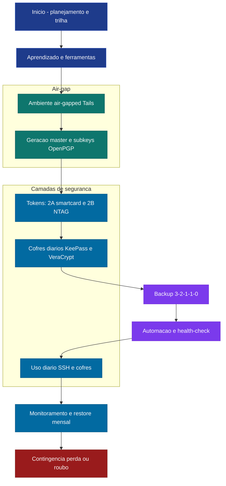
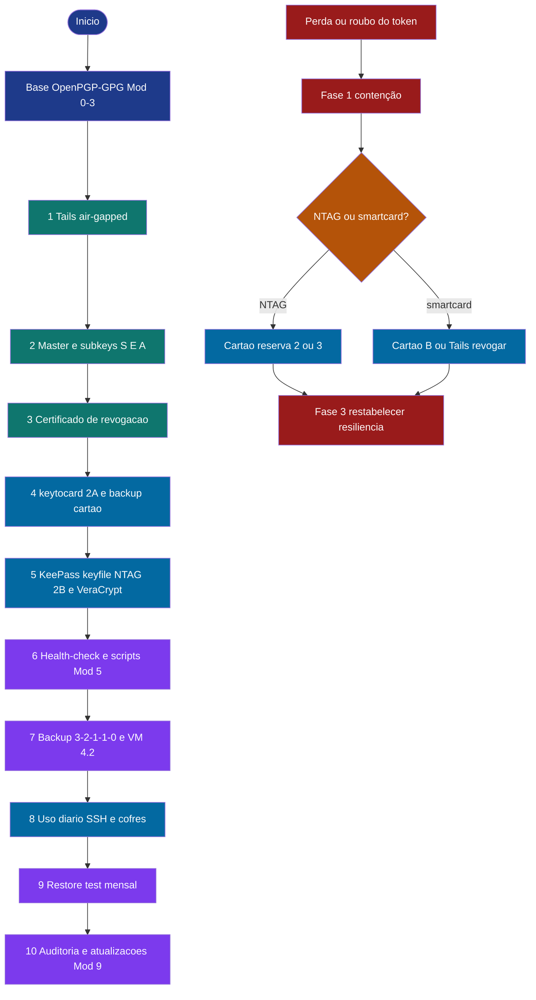
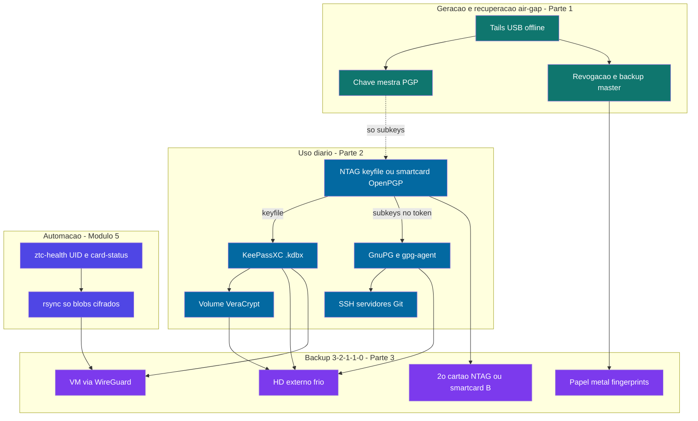
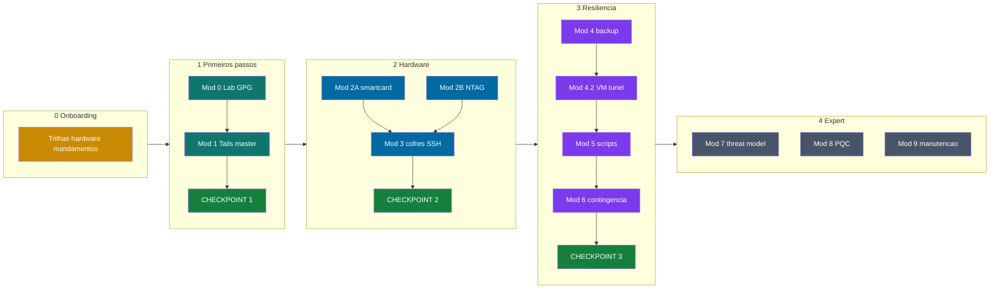
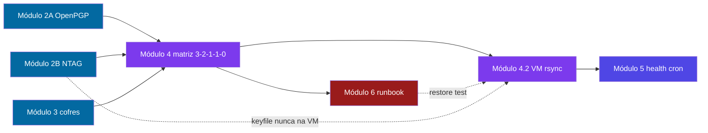
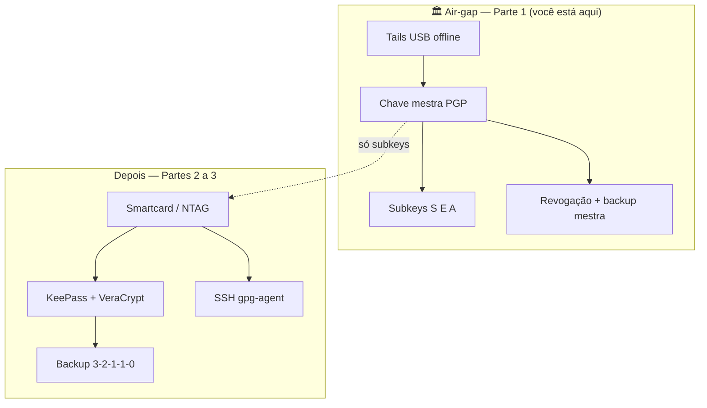
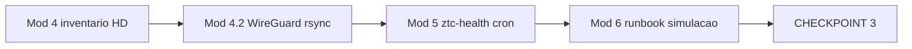
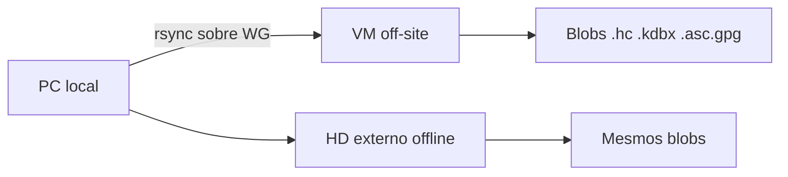
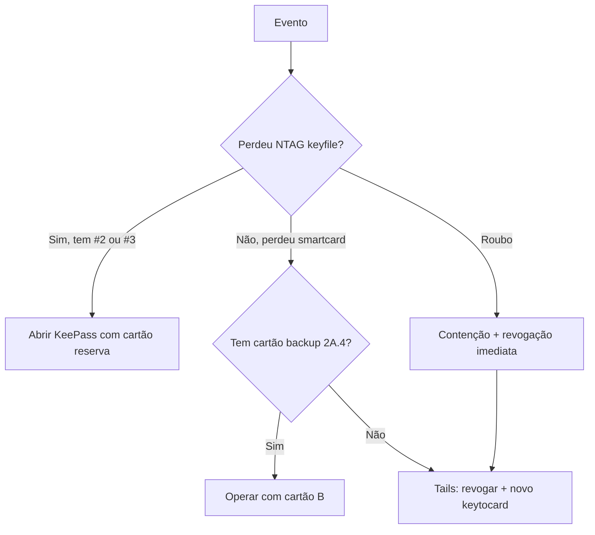

# 🎓 Zero Trust Core Expert – **VERSÃO 1.0 (canônica)**

**Air-Gap + NFC + OpenPGP + KeePassXC + VeraCrypt**

**Autor:** Projeto Colaborativo (VIPs-com)  
**GnuPG:** **2.4.4+** (Ubuntu 24.04 LTS / `apt`; repositório [gnupg.org](https://gnupg.org/) se precisar do upstream) — alinhado ao [OpenPGP-GPG do Zero ao Expert](https://github.com/VIPs-com/OpenPGP-GPG-do-Zero-ao-Expert#trilha-integrada-zero-trust-core-expert)  
**Tails:** **7.8** (estável em [tails.net/latest](https://tails.net/latest/) — **revalide** antes de gravar o USB)  
**KeePassXC:** **2.7.12+** no PC de uso diário ([keepassxc.org](https://keepassxc.org/)) — no Tails 7.6+ o padrão é **GNOME Secrets**; GnuPG no Tails segue sendo o foco do air-gap  
**VeraCrypt:** **1.26.24** ([veracrypt.fr](https://www.veracrypt.fr/en/Downloads.html))  
**Baseline conferida:** maio/2026 (issue editorial v1.0.1)  
**Metodologia:** 🔴🟡🟢🔵 + COMANDO A COMANDO + Checkpoints  
**Licença:** [CC BY-SA 4.0](https://creativecommons.org/licenses/by-sa/4.0/)  
**Status:** ✅ **VERSÃO 1.0.2** — Curso completo + correções pós-auditoria VIPs-com (maio/2026) · ver [docs/AUDITORIA-v1.0.1.md](docs/AUDITORIA-v1.0.1.md)

> 📌 **Nota editorial:** **`🎓 Zero-Trust-Core-Expert - Versão 1.0.md`** é o curso oficial deste repositório. O nome didático é **Zero Trust Core Expert**; o *filename* usa hífens para compatibilidade com Git e Windows.

> 📎 **Pré-requisito (trilha Expert):** domínio ou conclusão paralela de [OpenPGP-GPG do Zero ao Expert](https://github.com/VIPs-com/OpenPGP-GPG-do-Zero-ao-Expert#trilha-integrada-zero-trust-core-expert) — este material **integra** PGP com cofres, NFC, VeraCrypt, backup off-site e operação diária; **não** repete do zero a teoria OpenPGP.

> 📎 **Repositório Git (opcional):** clone ou ZIP deste projeto — estudar só com este `.md` no computador continua válido.  
> 📖 **Primeira vez no repositório?** Leia o [Manual de uso](docs/MANUAL-DE-USO.md) (estrutura, trilhas, ligação com OpenPGP-GPG, primeiros passos).

* * *

## 📌 0. ONBOARDING (O QUE VOCÊ VÊ ANTES DE COMEÇAR)

* * *

### 🎓 CARTA DO PROFESSOR

Olá! Seja bem-vindo(a) ao **Zero Trust Core Expert**.

Este curso é para quem quer montar uma **fortaleza digital artesanal**: cofre de senhas local, token físico (NFC ou smartcard), identidade OpenPGP com chave mestra em air-gap, SSH sem expor segredos no disco, e backup **3-2-1-1-0** com disciplina operacional — **sem** depender de duas YubiKeys caras, mas **com** responsabilidade sua sobre cada camada.

**⚠️ AVISO:** tags NFC simples (NTAG) **não** são o mesmo que smartcard OpenPGP. Misturar os dois no mesmo plano sem entender os limites é o erro mais comum deste tipo de projeto.

**Regra de ouro:** pratique em laboratório (VM ou máquina secundária). A chave **mestra** PGP nasce **offline** no Tails — nunca no sistema de uso diário.

**Vamos construir sua soberania digital em camadas.** 🚀

* * *

### 🎯 RESULTADOS ESPERADOS

Ao final deste curso, você será capaz de:

| # | Resultado | Nível |
| --- | --- | :---: |
| 1 | Operar cofre KeePassXC com senha + keyfile e volume VeraCrypt | 🟢 |
| 2 | Diferenciar NTAG (keyfile) de smartcard OpenPGP (subkeys não exportáveis) | 🟢 |
| 3 | Gerar master + subkeys no Tails e transferir subkeys para token | 🔵 |
| 4 | Autenticar SSH via `gpg-agent` e subchave [A] | 🔵 |
| 5 | Implementar backup 3-2-1-1-0 com teste de restauração | 🔵 |
| 6 | Sincronizar blobs criptografados para off-site (VM + túnel) sem vazar segredos | 🔵 |
| 7 | Executar runbook de contingência (perda de cartão, revogação) | ⚫ |
| 8 | Automatizar health-check (UID, `card-status`, integridade de backup) | ⚫ |

> 📎 **Coluna «Nível»:** 🔴/🟡/🟢/🔵 = legenda do curso (abaixo). **⚫** = expert+ / longo prazo.

* * *

### 👤 PERFIL DO ALUNO & PRÉ-REQUISITOS

**Público-alvo:**

* Quem já estuda ou concluiu fundamentos GPG/OpenPGP
* Entusiastas de privacidade, SysAdmins e desenvolvedores
* Quem quer integrar senhas, tokens NFC e servidores próprios

**Pré-requisitos:**

* **Mínimo:** ler a [Carta](#-carta-do-professor) e a [Legenda de cores](#-legenda-de-cores-guia-visual)
* **Recomendado:** curso [OpenPGP-GPG do Zero ao Expert](https://github.com/VIPs-com/OpenPGP-GPG-do-Zero-ao-Expert/blob/main/%F0%9F%8E%93%20OpenPGP-GPG%20do%20Zero%20ao%20Expert%20-%20Vers%C3%A3o%201.0.md#modulo-0-ztc) (Módulos [0](https://github.com/VIPs-com/OpenPGP-GPG-do-Zero-ao-Expert/blob/main/%F0%9F%8E%93%20OpenPGP-GPG%20do%20Zero%20ao%20Expert%20-%20Vers%C3%A3o%201.0.md#modulo-0-ztc)–[3](https://github.com/VIPs-com/OpenPGP-GPG-do-Zero-ao-Expert/blob/main/%F0%9F%8E%93%20OpenPGP-GPG%20do%20Zero%20ao%20Expert%20-%20Vers%C3%A3o%201.0.md#modulo-3-ztc) no mínimo)
* **Hardware:** pendrive para Tails; leitor NFC USB ou celular com NFC; smartcard OpenPGP **ou** tags NTAG para keyfile (papéis diferentes)
* **iPhone como dispositivo principal:** KeePass/VeraCrypt no desktop; OpenPGP em smartcard tem suporte **limitado** no iOS (Apêndice D) — planeje Android ou PC Linux para a trilha Expert

* * *

### 🛠️ CHECKLIST DE FERRAMENTAS NECESSÁRIAS

| Ferramenta | Onde obter | Para quê |
| --- | --- | --- |
| **KeePassXC 2.7.12+** | [keepassxc.org](https://keepassxc.org/) | Cofre `.kdbx` no **host** (não é o app padrão do Tails 7.6+) |
| **VeraCrypt 1.26.24** | [veracrypt.fr](https://www.veracrypt.fr/) | Volume para cofre e backups |
| **GnuPG 2.4.4+** | `apt` / [gnupg.org](https://www.gnupg.org/) | OpenPGP + agente SSH |
| **pcscd** + leitor | `apt install pcscd` + USB NFC/CCID | Smartcard OpenPGP |
| **Tails 7.8+** | [tails.net/latest](https://tails.net/latest/) | Air-gap: GnuPG + master offline |
| **OpenKeychain** (Android) | F-Droid / APK offline | Backup móvel / NFC |
| **WireGuard** (opc.) | [wireguard.com](https://www.wireguard.com/) | Túnel para backup off-site |
| **age** | `apt install age` | Backup cifrado do keyfile (2B.2) e master no Tails |
| **libnfc** + `nfc-list` | `apt install libnfc-bin` | Módulos 5.1 / 5.3 (opcional se sem checagem UID) |

> 📎 **Lista completa por SO (Linux, Windows, macOS, Android, iOS):** [docs/INVENTARIO-SOFTWARE-HARDWARE.md](docs/INVENTARIO-SOFTWARE-HARDWARE.md) · resumo no [Apêndice F](#apêndice-f--inventário-software-e-hardware).

> 📎 **NTAG vs OpenPGP:** tag NTAG = **keyfile** KeePass (clonável com acesso físico). **Smartcard OpenPGP** = subkeys [S][E][A] no token (não exportáveis). Não use o mesmo rótulo “NFC” para os dois.

* * *

### 🎯 ESCOLHA SEU CAMINHO

```
┌─────────────────────────────────────────────────────────────────────────────┐
│                                                                             │
│   🟢 MODO TURBO (2–3 semanas · ~8–12 h)                                     │
│   ─────────────────────────────────────                                     │
│   • KeePassXC + VeraCrypt + keyfile em NTAG (3 cartões)                     │
│   • Backup local + HD externo                                               │
│   • Sem Tails / sem VM off-site / sem PQC                                   │
│   • Ideal para: começar cofre forte antes do token OpenPGP                  │
│   • Pula: Tails/master PGP, VM off-site, Módulos 7–8, simulação 6.1         │
│                                                                             │
│   🔵 MODO EXPERT (6–8 semanas · ~25–35 h)                                   │
│   ─────────────────────────────────────                                     │
│   • Tudo do Turbo +                                                          │
│   • Master no Tails + subkeys no smartcard                                  │
│   • SSH via gpg-agent · backup 3-2-1-1-0 · VM + túnel                         │
│   • Automação, health-check, contingência, threat modeling                  │
│   • Ideal para: soberania digital completa (este curso na íntegra)          │
│   • Inclui: Tails, smartcard, 3-2-1-1-0, VM, contingência, threat model     │
│                                                                             │
│   👀 MODO CURIOSO                                                           │
│   ───────────────                                                           │
│   • Onboarding + arquitetura + mapa visual — sem obrigação de checkpoints    │
│                                                                             │
│   ⚡ TURBO HÍBRIDO — Ative conforme o que você já tem                        │
│   ──────────────────────────────────────────────────                        │
│   • Qualquer módulo H (Apêndice G) adicionado ao Turbo base                 │
│   • H1 QR · H2 metal · H3 Android · H4 iPhone · H5 servidor · H6 TOTP      │
│   • Custo extra: R$0–50 · Tempo: +1–3h por módulo escolhido                 │
│   • Ver: Apêndice G — Módulos H (ao final dos Apêndices)                    │
│                                                                             │
└─────────────────────────────────────────────────────────────────────────────┘
```

#### Matriz de tempo (referência do mantenedor · maio/2026)

| Trilha | Partes | Horas orientativas | Exemplo de calendário |
| --- | --- | --- | --- |
| **Turbo** | 0 (parcial) + 2B + 3.1 + 4.1–4.2 local | **8–12 h** | 2–3 semanas, 3 h/semana |
| **Expert** | 1 → 2 → 3 → 4 + apêndices | **25–35 h** | 6–8 semanas, 4–5 h/semana |
| **Curioso** | §0 + §1 + leitura Parte 4 Módulo 7 | **3–5 h** | 1 fim de semana |

> 💡 Ajuste à sua rotina; o que importa são os **CHECKPOINTs**, não a velocidade.

* * *

### 🚨 20 MANDAMENTOS DA CRIPTOGRAFIA ARTESANAL FORTE

| # | Mandamento | Categoria |
| --- | --- | --- |
| 1 | A chave mestra PGP **nunca** nasce no sistema online | Air-gap |
| 2 | NTAG ≠ YubiKey ≠ smartcard OpenPGP — **não confunda** | Hardware |
| 3 | Três NTAGs idênticos para keyfile; nunca só um cartão | KeePass |
| 4 | VM off-site guarda **só** blobs já criptografados | Backup |
| 5 | Backup sem teste de restore mensal = **inexistente** | Operação |
| 6 | `keytocard` move subkeys; a master **fica** no Tails | OpenPGP |
| 7 | Revogação criada **no mesmo dia** da geração da master | Air-gap |
| 8 | PIN do smartcard ≠ senha do KeePass ≠ senha do VeraCrypt | Segredos |
| 9 | Keyfile em claro na nuvem **anula** o fator físico | KeePass |
| 10 | Dois smartcards ou backup `.asc` cifrado antes de apagar cópias | Resiliência |
| 11 | `pcscd` ativo antes de reclamar que o cartão “sumiu” | Operação |
| 12 | `sshcontrol` aponta para keygrip da subchave **[A]** | SSH |
| 13 | Manifesto `sha256` assinado ou guardado em duas mídias | Backup |
| 14 | Break-glass da VM **não** depende só do NTAG perdido | Off-site |
| 15 | Simulação de contingência **antes** de confiar no runbook | Contingência |
| 16 | Tails e GnuPG: confira [tails.net/latest](https://tails.net/latest/) a cada release | Manutenção |
| 17 | Roubo de token = **revogação**, não “esperar ver se volta” | Contingência |
| 18 | Automação **não** substitui entender o que o script faz | Automação |
| 19 | Threat model revisado quando mudar emprego, país ou VPS | OpSec |
| 20 | PQC é **horizonte** — não quebre o arquitetura atual por hype | Futuro |

* * *

### 📖 GLOSSÁRIO RÁPIDO (1 MINUTO)

| Termo | Significado |
| --- | --- |
| **Zero Trust Core** | Ecossistema pessoal em camadas (cofre + token + PGP + SSH + backup) |
| **NTAG** | Tag NFC simples; boa para keyfile; **clonável** |
| **OpenPGP card** | Smartcard com subkeys não exportáveis |
| **Keyfile** | Arquivo extra exigido pelo KeePassXC além da senha |
| **3-2-1-1-0** | 3 cópias · 2 mídias · 1 off-site · 1 imutável offline · 0 erros (teste) |
| **Air-gap** | Ambiente sem rede (Tails / celular offline) |

* * *

### 🗺️ COMO USAR ESTE CURSO

| Passo | Onde | Tempo |
| ---: | --- | --- |
| 0 | [README.md](README.md) do repositório (jornada + kits em R$) | 3 min |
| 1 | **[Manual de uso](docs/MANUAL-DE-USO.md)** — estrutura `docs/` + `scripts/` | 5–15 min |
| 2 | **Onboarding** (§0 abaixo) + **§1 Mapa** (índice + diagramas) | 20–30 min |
| 3 | Siga a **trilha** escolhida no mapa (Turbo ou Expert) — títulos `##` e **COMANDO** | curso |
| 4 | Marque cada **CHECKPOINT** antes de avançar | — |

**Atalhos:** compras → [Inventário + kits](docs/INVENTARIO-SOFTWARE-HARDWARE.md) · fluxos coloridos → [DIAGRAMAS-VISUAIS.md](docs/DIAGRAMAS-VISUAIS.md) · aula 1 → [Slides abertura](docs/SLIDES-ABERTURA-TURMA.md).

* * *

### ⏳ LINHA DO TEMPO EVOLUTIVA (2023–2035)

| Período | Características | Status |
| --- | --- | --- |
| **2023–2024** | Senhas em nuvem; pouca integração token + cofre | 🟡 Legado |
| **2025–2026** | ECC + cofres locais + NFC caseiro documentado | 🟢 **ATUAL** |
| **2027–2028** | PQC híbrido em OpenPGP; Sequoia em CI | ⚠️ Preparação |
| **2029–2035** | Migração ML-KEM / rotação de identidade | 🔮 Futuro |

* * *

## 🗺️ 1. MAPA DO CURSO (VISÃO GERAL)

> ⚠️ **Somente consulta:** índice visual alinhado à **v1.0.2** (maio/2026). O conteúdo vinculante são os títulos `##` / `###` e cada **▸ COMANDO** no corpo do arquivo — não apenas linhas desta árvore.

### 🧭 Navegação em 3 camadas (menos fricção)

| Camada | O quê | Quando |
| --- | --- | --- |
| **A — Repositório** | `README` + `docs/` + `scripts/` | Antes de comprar hardware ou clonar |
| **B — Trilha** | Turbo **ou** Expert (atalho abaixo) | Depois do §0 Onboarding |
| **C — COMANDO** | Passo a passo executável | Durante cada módulo |

**Regra:** perdeu o fio? Volte ao [README](README.md) (jornada Mermaid) → confira sua trilha aqui → abra o **COMANDO** do módulo atual.

---

### 📁 Camada A — Repositório GitHub (não está só neste `.md`)

```
Zero-Trust-Core/  (v1.0.2)
│
├── README.md ........................ porta de entrada · badges · jornada · kits R$
├── 🎓 Zero-Trust-Core-Expert - Versão 1.0.md ... VOCÊ ESTÁ AQUI (curso canônico)
├── scripts/ ......................... ztc-health · ztc-rsync-offsite · ztc-open-cofre
│   └── ztc.conf.example
└── docs/
    ├── MANUAL-DE-USO.md ............. 1ª vez no repo (leia antes da Parte 1)
    ├── INVENTARIO-SOFTWARE-HARDWARE.md  software/HW · kits A–D em R$
    ├── DIAGRAMAS-VISUAIS.md ......... fluxos A–E (PDF / impressão)
    ├── SLIDES-ABERTURA-TURMA.md ..... instrutor · 1ª aula (+ .marp.md)
    ├── AUDITORIA-v1.0.1.md .......... histórico v1.0.1 → v1.0.2
    └── CHECKLIST-PRE-TURMA-EQUIPE.md  testes NFC + Tails (instrutor)
```

---

### 🎯 Camada B — Trilhas (o que estudar, em ordem)

| Ordem | 🟢 **Turbo** (~8–12 h · ~R$ 50–265) | 🔵 **Expert** (~25–35 h · ~R$ 725–2.150) |
| ---: | --- | --- |
| 1 | [§0](#-0-onboarding-o-que-você-vê-antes-de-começar) + [§1](#-1-mapa-do-curso-visão-geral) | idem + [OpenPGP-GPG](https://github.com/VIPs-com/OpenPGP-GPG-do-Zero-ao-Expert/blob/main/%F0%9F%8E%93%20OpenPGP-GPG%20do%20Zero%20ao%20Expert%20-%20Vers%C3%A3o%201.0.md#modulo-0-ztc) Mód. 0–3 |
| 2 | — *pula Parte 1* | [Parte 1](#-2-parte-1-primeiros-passos-semana-1) → [CP1](#-checkpoint-1-identidade-air-gapped) |
| 3 | [Parte 2](#-3-parte-2-hardware-e-integração-semana-2): [2B](#-módulo-2b-ntag--keyfile-keepassxc) + [3.1](#-módulo-31-keepassxc--veracrypt) | Parte 2: [2A](#-módulo-2a-openpgp-smartcard-keytocard) + [2B](#-módulo-2b-ntag--keyfile-keepassxc) + [3.1](#-módulo-31-keepassxc--veracrypt) + [3.2](#-módulo-32-ssh-via-gpg-agent-subchave-a) → [CP2](#-checkpoint-2-token--cofre--ssh) |
| 4 | [Parte 3](#-4-parte-3-resiliência-e-operação-semana-3): só [Mód. 4](#-módulo-4-backup-3-2-1-1-0-por-ativo) | Parte 3 completa → [CP3](#-checkpoint-3-backup-e-contingência) |
| 5 | [A](#apêndice-a--top-15-erros-comuns) · [C](#apêndice-c--hardware-recomendado-brasil--2026) · [F](#apêndice-f--inventário-software-e-hardware) | [Parte 4](#-5-parte-4-expert-e-futuro-semana-4) + [Apêndices](#-6-apêndices) |

**Expert:** `scripts/` nos Módulos **4.2** e **5** são **obrigatórios** (não opcionais). **Turbo:** fluxo manual do KeePass/VeraCrypt basta.

---

### 🔗 Índice clicável (use no GitHub / VS Code preview)

Clique para ir direto ao módulo. Se um link não saltar, use `Ctrl+F` pelo nome do **COMANDO**.

| Bloco | Ir para |
| --- | --- |
| **Onboarding** | [§0](#-0-onboarding-o-que-você-vê-antes-de-começar) · [Carta](#-carta-do-professor) · [Trilhas](#-escolha-seu-caminho) · [Ferramentas](#-checklist-de-ferramentas-necessárias) · [Mandamentos](#-20-mandamentos-da-criptografia-artesanal-forte) |
| **Parte 1** 🔴 Expert | [Legenda](#-legenda-de-cores-guia-visual) · [Mód. 0](#-módulo-0-preparação-do-ambiente) · [Mód. 1](#-módulo-1-sua-primeira-chave-no-air-gap-tails) · [CHECKPOINT 1](#-checkpoint-1-identidade-air-gapped) |
| **Parte 2** | [Mód. 2A](#-módulo-2a-openpgp-smartcard-keytocard) · [Mód. 2B](#-módulo-2b-ntag--keyfile-keepassxc) ([2B.2 age](#-comando-2b2-backup-cifrado-do-keyfile-age--obrigatório-antes-dos-ntags)) · [Mód. 3.1](#-módulo-31-keepassxc--veracrypt) · [Mód. 3.2](#-módulo-32-ssh-via-gpg-agent-subchave-a) · [CHECKPOINT 2](#-checkpoint-2-token--cofre--ssh) |
| **Parte 3** | [Mód. 4](#-módulo-4-backup-3-2-1-1-0-por-ativo) · [Mód. 4.2](#-módulo-42-vm-off-site--wireguard--rsync) · [Mód. 5](#-módulo-5-automação-e-health-check) ([5.0 conf](#-comando-50-validar-ztcconf-antes-dos-scripts) · [5.3 NFC](#-comando-53-keepass--veracrypt-condicional-nfc-opcional)) · [Mód. 6](#-módulo-6-plano-de-contingência) ([6.1](#-comando-61-simulação-de-mesa-obrigatória) · [6.2 revogação lab](#-comando-62-ensaio-de-revogação-em-lab)) · [CP3](#-checkpoint-3-backup-e-contingência) |
| **Parte 4** | [Mód. 7](#-módulo-7-threat-modeling-e-opsec) · [Mód. 8](#-módulo-8-preparação-pós-quântica-horizonte) · [Mód. 9](#-módulo-9-manutenção-de-longo-prazo) · [Exame](#-exame-final-e-projeto) |
| **Apêndices** | [A erros](#apêndice-a--top-15-erros-comuns) · [B scripts](#apêndice-b--índice-de-scripts-v1) · [C hardware BR](#apêndice-c--hardware-recomendado-brasil--2026) · [F inventário](#apêndice-f--inventário-software-e-hardware) · [D multi-SO](#apêndice-d--guia-multiplataforma) · [E PQC](#apêndice-e--migração-rsa--ecc--pqc) · [G Turbo Híbrido](#apêndice-g--módulos-h-turbo-híbrido) · [Conclusão](#-conclusão--soberania-digital) |

**COMANDOs mais consultados:** [0.5 Tails](#-comando-05-pré-vôo-do-tails-no-host-com-internet) · [1.2 master](#-comando-12-gerar-master--subkeys-offline) · [3.1.1 VeraCrypt](#-comando-311-criar-volume-veracrypt) · [4.3 restore](#-comando-43-teste-de-restauração-ritual-mensal) · [6.1 simulação](#-comando-61-simulação-de-mesa-obrigatória)

---

### 📚 Camada C — Árvore do curso (visão ASCII + índice acima)

*Números à esquerda (0, 1, 2…) = seções `##` do Markdown. “Parte N” = nome didático.*

```
📚 Zero Trust Core Expert – v1.0.2 (canônica)
│
├── §0  ONBOARDING ........................... (tudo antes deste mapa)
│   ├── Carta · Resultados · Perfil
│   ├── Ferramentas (+ age, libnfc na checklist)
│   ├── Turbo × Expert × Curioso
│   ├── 20 Mandamentos · Glossário rápido
│   └── Como usar · Linha do tempo 2023–2035
│
├── §1  MAPA + DIAGRAMAS ..................... VOCÊ ESTÁ AQUI
│   ├── Repositório docs/ + scripts/ (acima)
│   ├── Trilhas Turbo / Expert (acima)
│   └── Mermaid A–E → docs/DIAGRAMAS-VISUAIS.md
│
├── LEGENDA 🔴🟡🟢🔵 ........................ (antes da Parte 1)
│
├── §2  PARTE 1 — Primeiros passos (2–4 h) .... 🔴 Expert; Turbo PULA
│   ├── Módulo 0: COMANDO 0.1–0.9 (lab; Tails pré-vôo)
│   ├── Módulo 1: COMANDO 1.1–1.6 (Tails offline, master, revogação)
│   └── 🏁 CHECKPOINT 1
│
├── §3  PARTE 2 — Hardware e integração (5–7 h)
│   ├── Módulo 2A: COMANDO 2A.1–2A.4 (smartcard · keytocard) … Expert
│   ├── Módulo 2B: COMANDO 2B.1–2B.4
│   │   ├── 2B.2 backup keyfile age (obrigatório antes dos NTAGs)
│   │   └── 2B.3 três NTAGs iguais
│   ├── Módulo 3.1: VeraCrypt 3.1.1–3.1.3 (CLI -t validada)
│   ├── Módulo 3.2: SSH gpg-agent 3.2.1–3.2.3 … Expert
│   └── 🏁 CHECKPOINT 2
│
├── §4  PARTE 3 — Resiliência e operação (6–8 h)
│   ├── Módulo 4: 4.1–4.3 (3-2-1-1-0, restore mensal)
│   ├── Módulo 4.2: 4.2.1–4.2.3 (WireGuard, rsync, ztc-rsync) … Expert
│   ├── Módulo 5: 5.1 ztc-health · 5.2 cron · 5.3 ztc-open-cofre (NFC)
│   ├── Módulo 6: runbook + COMANDO 6.1 simulação de mesa
│   └── 🏁 CHECKPOINT 3
│
├── §5  PARTE 4 — Expert e futuro (Semana 4+)
│   ├── Módulo 7: threat model (7.1)
│   ├── Módulo 8: PQC horizonte (8.1)
│   ├── Módulo 9: manutenção anual (9.1–9.2)
│   └── Exame final
│
└── §6  APÊNDICES + CONCLUSÃO
    ├── A — 15 erros comuns
    ├── B — índice scripts (→ pasta scripts/)
    ├── C — hardware BR (preços)
    ├── F — inventário SW/HW (→ docs/INVENTARIO…)
    ├── D — multiplataforma (+ D.1 WSL2)
    ├── E — RSA → ECC → PQC
    ├── G — Módulos H: Turbo Híbrido (H1–H6)
    ├── Glossário completo
    └── Conclusão — soberania digital
```

> 📌 **Sincronização:** ao alterar um **COMANDO**, atualize esta árvore e, se aplicável, [DIAGRAMAS-VISUAIS.md](docs/DIAGRAMAS-VISUAIS.md) e [MANUAL-DE-USO.md](docs/MANUAL-DE-USO.md).

---

### ✅ Próximos passos (projeto e aluno)

| Quem | Pendência | Onde rastrear |
| --- | --- | --- |
| **Aluno** | Escolher kit A–D e instalar ferramentas do §0 | [Inventário § Kits](docs/INVENTARIO-SOFTWARE-HARDWARE.md) |
| **Aluno** | Executar COMANDOs na ordem da **sua trilha** | Títulos `##` abaixo |
| **Instrutor** | Teste hardware `ztc-open-cofre.sh` + Tails | [Issue #2](https://github.com/VIPs-com/Zero-Trust-Core/issues/2) |
| **Instrutor** | 1ª aula: slides 1–4 → Módulo 0 | [SLIDES-ABERTURA-TURMA.md](docs/SLIDES-ABERTURA-TURMA.md) |
| **Equipe** | Tag/release futura só após mudança editorial relevante | GitHub Releases |
| **Concluído v1.0.2** | Auditoria, backup 2B.2, VeraCrypt CLI, script 5.3 | [AUDITORIA-v1.0.1.md](docs/AUDITORIA-v1.0.1.md) |
| **Sign-off repositório** | Chave mestra 🔐 — pronto para turma | [AUDITORIA-TECNICA-PRE-TURMA.md](docs/AUDITORIA-TECNICA-PRE-TURMA.md) |

* * *

### 📊 Diagramas visuais (fluxos Mermaid)

> 💡 Abra o preview Markdown (GitHub ou VS Code) ou cole em [mermaid.live](https://mermaid.live). **Síntese só visual:** [docs/DIAGRAMAS-VISUAIS.md](docs/DIAGRAMAS-VISUAIS.md) (ideal para imprimir/PDF). **Inventário software/hardware:** [docs/INVENTARIO-SOFTWARE-HARDWARE.md](docs/INVENTARIO-SOFTWARE-HARDWARE.md).

**Legenda das cores nos diagramas:**

| Cor no fluxo | Significado | Alinhado à legenda do curso |
| --- | --- | --- |
| Azul escuro | Início / planejamento | 🔵 Expert |
| Verde-água | Air-gap (Tails, master) | 🔵 |
| Azul | Camadas de uso diário | 🟢 Padrão |
| Roxo | Backup e automação | 🔵 |
| Vermelho | Contingência / perda | 🔴 Crítico |
| Verde | Checkpoints | Meta de conclusão |

#### A) Fluxograma geral da estratégia

Visão de ponta a ponta — da decisão de montar o ecossistema até o plano de contingência.



| Etapa | Parte / modulo no curso |
| --- | --- |
| B | §0 Onboarding; opcional [OpenPGP-GPG](https://github.com/VIPs-com/OpenPGP-GPG-do-Zero-ao-Expert#trilha-integrada-zero-trust-core-expert) |
| C–D | Parte 1, Modulo 1 |
| E | Parte 2, Modulos **2A** e **2B** |
| F | Parte 2, Modulo 3 |
| G–H | Parte 3, Modulos 4, 4.2, 5 |
| I | Parte 2 Modulo 3.2 + operacao diaria |
| J | COMANDO 4.3 + Modulo 9 |
| K | Parte 3, Modulo 6 |

* * *

#### B) Jornada operacional (dez passos + ramo de perda)

Trilha **Expert** alinhada aos COMANDOs; ramo inferior = **nao** e fluxo feliz — e sim o que fazer se o token sumir.



* * *

#### C) Arquitetura — como as pecas se conectam

Mapa mental dos **mundos**: uso diario, air-gap, backup e automacao.



* * *

#### D) Partes do curso × checkpoints

Onde voce esta na **narrativa editorial** (nao substitui os COMANDOs).



| Trilha Turbo | Pula |
| --- | --- |
| Parte 1 completa | Tails + master |
| Modulos 2A, 3.2, 4.2, 6, 7–8 | Smartcard SSH VM contingencia avancada |

* * *

#### E) Parte 3 — modulos interligados

Por que backup, VM, scripts e contingencia **dependem** dos tokens e cofres das Partes 1–2.



> 📎 **Síntese visual (PDF/impressão):** [docs/DIAGRAMAS-VISUAIS.md](docs/DIAGRAMAS-VISUAIS.md) · fonte mantenedor: `_interno/docs/diagrams/`

* * *

## 🔴🟡🟢🔵 LEGENDA DE CORES (GUIA VISUAL)

| Cor | Significado | Quando usar |
| :---: | --- | --- |
| 🔴 | **OBSOLETO / PERIGOSO** | Não use (ex.: master key online, keyfile só em nuvem) |
| 🟡 | **FUNCIONA** | Válido, mas verboso ou frágil |
| 🟢 | **PADRÃO ATUAL** | Recomendado no dia a dia |
| 🔵 | **EXPERT** | Air-gap, token, VM off-site, automação |
| ⚫ | **HORIZONTE** | PQC, migração longa — planejamento |

> 💰 **DICA:** guarde esta legenda; ela aparece em todo o curso.

* * *

## 🔴 2. PARTE 1: PRIMEIROS PASSOS (Semana 1)

> ⏱️ **Tempo estimado:** 2–4 horas (trilha **Expert**) · Turbo pode pular esta parte e voltar depois do [OpenPGP-GPG do Zero ao Expert](https://github.com/VIPs-com/OpenPGP-GPG-do-Zero-ao-Expert/blob/main/%F0%9F%8E%93%20OpenPGP-GPG%20do%20Zero%20ao%20Expert%20-%20Vers%C3%A3o%201.0.md#modulo-0-ztc)  
> 🎯 **Objetivo:** sala-cofre **air-gapped** (Tails), identidade PGP com master offline, subkeys [S][E][A], revogação guardada — **sem** importar a master no PC de uso diário

No [mapa visual](#-1-mapa-do-curso-visão-geral), você está em **Módulo 0 → Módulo 1 → CHECKPOINT 1**. A Parte 2 (tokens, KeePass, SSH) só faz sentido **depois** deste eixo.

* * *

### 🔎 OBSERVAÇÕES IMPORTANTES (leia antes dos COMANDOs)

Este curso monta um ecossistema **artesanal, mas robusto**: você controla cada camada; não compra uma “caixa preta” — assume **disciplina operacional**.

| Pilar | O que é | Dica para o aluno |
| --- | --- | --- |
| **KeePassXC + VeraCrypt** | Cofre de senhas local + volume extra | Base do dia a dia; vem na **Parte 2** (Módulo 3) |
| **Token físico** | Fator “algo que você tem” | **NTAG** = keyfile KeePass (clonável). **Smartcard OpenPGP** = subkeys PGP/SSH (forte) |
| **GnuPG + OpenPGP** | Identidade criptográfica | Ganho real: chave privada de uso no **token**, PIN obrigatório |
| **SSH + gpg-agent** | Login em servidores sem senha no disco | Subchave **[A]**; **Parte 2**, Módulo 3.2 |
| **Backup 3-2-1-1-0** | Resiliência + teste de restore | **Parte 3**; VM só com blobs já criptografados |

👉 Esse plano aproxima a **filosofia** de uma YubiKey (defesa em profundidade, token físico) **sem depender** do firmware dela — em troca, você configura, documenta e testa.

> 📎 **Não confunda com a Parte 2:** scripts que “só abrem KeePass se o NFC estiver presente”, montam VeraCrypt e checam UID do cartão são **automação** (Módulo 5). Aqui você constrói a **raiz de confiança** offline.



* * *

### 📋 MÓDULO 0: PREPARAÇÃO DO AMBIENTE

> 🎯 **Objetivo:** laboratório Linux com GnuPG, `pcscd` e identidade **descartável** — **nunca** gere aqui a master real do seu projeto de produção

> 💡 Se ainda não domina terminal e `apt`, faça os **COMANDO 0.1–0.4** do [OpenPGP-GPG do Zero ao Expert — Módulo 0](https://github.com/VIPs-com/OpenPGP-GPG-do-Zero-ao-Expert/blob/main/%F0%9F%8E%93%20OpenPGP-GPG%20do%20Zero%20ao%20Expert%20-%20Vers%C3%A3o%201.0.md#modulo-0-ztc). Abaixo está o **mínimo** para seguir o Zero Trust Core.

* * *

#### ▸ COMANDO 0.1: Terminal e pasta de trabalho

```sh
echo "Laboratório Zero Trust Core OK"
mkdir -p ~/zero-trust-lab && cd ~/zero-trust-lab
pwd
```

* * *

#### ▸ COMANDO 0.2–0.3: GnuPG e ferramentas do curso

```sh
sudo apt update
sudo apt install -y gnupg2 pcscd scdaemon libccid rng-tools age wget curl
gpg --version
```

**Saída esperada:** série **2.4.x** no Ubuntu 24.04 LTS (adequado a este curso).

* * *

#### ▸ COMANDO 0.4: Serviço de cartão (para a Parte 2)

```sh
sudo systemctl enable --now pcscd
gpg --card-status 2>/dev/null || echo "Sem cartão ainda — normal no Módulo 0"
```

* * *

#### ▸ COMANDO 0.5: Pré-vôo do Tails (no host, com internet)

1. Abra [tails.net/latest](https://tails.net/latest/) e anote a **versão estável** publicada hoje.  
2. Baixe a **imagem USB** (`.img`) e os arquivos de verificação da [página oficial de download](https://tails.net/install/download/index.en.html).  
3. Tenha um pendrive dedicado (≥ 8 GB) e confirme o dispositivo com `lsblk` **antes** de gravar.

> 🔴 O comando `dd` grava no **disco inteiro** (`/dev/sdX`), não na partição. Errar a letra = destruir o HD errado.

**Detalhamento completo (verificação OpenPGP + `dd`):** [OpenPGP-GPG do Zero ao Expert — COMANDO 6.1](https://github.com/VIPs-com/OpenPGP-GPG-do-Zero-ao-Expert/blob/main/%F0%9F%8E%93%20OpenPGP-GPG%20do%20Zero%20ao%20Expert%20-%20Vers%C3%A3o%201.0.md#comando-6-1-tails-ztc) (mesmo fluxo; use a versão publicada em [tails.net/latest](https://tails.net/latest/), ex.: **7.8** em maio/2026).

* * *

#### ▸ COMANDO 0.6: Identidade de laboratório no PC (não é a master!)

No PC **online**, crie uma chave **só para exercícios** — distinta da identidade que nascerá no Tails:

```sh
gpg --quick-generate-key "Lab Zero Trust <lab@example.invalid>" ed25519 default 30d
gpg --list-secret-keys "Lab Zero Trust"
```

| 🔴 Nunca | 🟢 Sempre |
| --- | --- |
| `gpg --full-generate-key` no PC como “master de produção” | Master de produção **somente** no Tails offline |
| Reutilizar e-mail/nome real da master no lab | UID fictício no laboratório |

* * *

#### ▸ COMANDO 0.7–0.8: Baseline `gpg.conf` e `gpg-agent` (PC lab)

Crie ou edite `~/.gnupg/gpg.conf` (ajuste conforme sua política):

```ini
# GnuPG 2.4.x — pubring.kbx é o padrão; não use keyring legado (.gpg)
keyid-format 0xlong
with-fingerprint
use-agent
```

Em `~/.gnupg/gpg-agent.conf` (SSH será usado na Parte 2):

```ini
default-cache-ttl 600
max-cache-ttl 7200
enable-ssh-support
```

Recarregue o agente:

```sh
gpgconf --kill gpg-agent
gpgconf --launch gpg-agent
export GPG_TTY=$(tty)
```

Documentação oficial: [GnuPG Agent Examples](https://www.gnupg.org/documentation/manuals/gnupg/Agent-Examples.html).

* * *

#### ▸ COMANDO 0.9: Celular antigo offline (opcional · 🟡)

Alternativa **mais barata**, **menos forte** que Tails para a master:

1. Factory reset; **sem** conta Google; SIM removido.  
2. Modo avião permanente; Wi‑Fi e Bluetooth desligados.  
3. Instale **OpenKeychain** via APK copiado por cabo USB ([openkeychain.org](https://www.openkeychain.org/)).  
4. Gere chave com passphrase **muito forte** — sem smartcard, o segredo fica no arquivo do app.

> 🟢 **Trilha Expert:** use Tails no Módulo 1. Celular = cofre de bolso ou backup, não substituto obrigatório.

* * *

### 📋 MÓDULO 1: SUA PRIMEIRA CHAVE NO AIR-GAP (TAILS)

> 🎯 **Objetivo:** você é a **autoridade certificadora raiz** — master [C] offline, subkeys [S][E][A], revogação e backup em mídia separada

#### 🏛️ O papel do air-gap

A **chave mestra** nasce em um ambiente que **nunca** viu a internet e **não** volta ao PC de uso diário. Ela só **certifica** e **revoga** subchaves. As subchaves são as “funcionárias” do dia a dia (assinar, cifrar, SSH).

Isso resolve o drama das “duas YubiKeys”: você pode ter **vários smartcards** com as **mesmas subkeys** (após `keytocard` na Parte 2) e backup da master em cofre offline — sem pagar duas chaves proprietárias.

> 📎 **Correção importante:** `keytocard` exige **smartcard OpenPGP** (Nitrokey, Yubikey OpenPGP, etc.). **Tags NTAG** servem ao KeePass (keyfile), não substituem applet PGP — isso é **Módulo 2B**, não este.

* * *

#### Matriz rápida: Tails em laboratório × produção

| Cenário | Internet na sessão da master | Onde fica a master depois |
| --- | --- | --- |
| **Laboratório** | Desligada ao gerar/exportar | Pendrive criptografado ou persistência Tails **só no lab** |
| **Produção** | **Sempre desligada** | Segundo pendrive / volume LUKS; **nunca** no PC online |

* * *

#### ▸ COMANDO 1.1: Gravar e iniciar o Tails

Siga o [COMANDO 6.1 do OpenPGP-GPG](https://github.com/VIPs-com/OpenPGP-GPG-do-Zero-ao-Expert/blob/main/%F0%9F%8E%93%20OpenPGP-GPG%20do%20Zero%20ao%20Expert%20-%20Vers%C3%A3o%201.0.md#comando-6-1-tails-ztc) no host (download, `gpg --verify`, `dd`).

No boot do Tails:

1. Escolha **Português** (ou seu idioma).  
2. Em *Configuração adicional*, habilite **Armazenamento persistente** (mín. 4 GB) se quiser guardar exports entre reboots no **lab**.  
3. Na persistência, marque **GnuPG** (e só o necessário).

> 📎 **Tails 7.6+:** o gerenciador de senhas padrão no desktop Tails é **[GNOME Secrets](https://gitlab.gnome.org/World/secrets)** (formato `.kdbx` compatível). Este curso usa **KeePassXC no sistema de uso diário** — no Tails você só precisa de **GnuPG** para a master. KeePassXC no Tails = [software adicional](https://tails.net/doc/persistent_storage/additional_software/index.en.html), opcional.

**Antes de gerar a master:** desligue Wi‑Fi (interruptor físico se existir) e confirme que não há cabo de rede.

* * *

#### ▸ COMANDO 1.2: Gerar master + subkeys (OFFLINE)

No terminal do Tails, com **internet desligada**:

```sh
# Ajuste o UID — use identidade real só se este for seu ritual de PRODUÇÃO offline
UID_MASTER="Sua Identidade (MASTER OFFLINE) <voce@dominio.invalid>"
export GNUPGHOME=/home/amnesia/.gnupg

# Master: apenas Certificação (ed25519)
gpg --quick-generate-key "$UID_MASTER" ed25519 cert 3y

# Extrair fingerprint da master recem criada
FP_MASTER=$(gpg --list-keys --with-colons "$UID_MASTER" | awk -F: '/^fpr:/ {print $10; exit}')

# Subchaves (no mesmo Tails, ainda offline)
gpg --quick-add-key "$FP_MASTER" ed25519 sign 2y
gpg --quick-add-key "$FP_MASTER" cv25519 encrypt 2y
gpg --quick-add-key "$FP_MASTER" ed25519 auth 2y

# Confira hierarquia
gpg --list-secret-keys --keyid-format long "$FP_MASTER"
```

**O que você deve ver:** uma linha `sec` (master) e três `ssb` com `[S]`, `[E]`, `[A]`.

> 💡 **Dica:** anote o **fingerprint** da master em **papel**, não em nuvem.

* * *

#### ▸ COMANDO 1.3: Certificado de revogação (no mesmo dia)

```sh
FP_MASTER=$(gpg --list-secret-keys --with-colons "$UID_MASTER" | awk -F: '/^fpr:/ {print $10; exit}')
gpg --output ~/revogacao.asc --generate-revocation "$FP_MASTER"
```

Guarde `revogacao.asc` em:

- Pendrive **criptografado** (recomendado), e  
- Cópia em local físico separado (envelope lacrado / cofre).

* * *

#### ▸ COMANDO 1.4: Backup da master (mídia offline dedicada)

```sh
gpg --export-secret-keys --armor "$FP_MASTER" > ~/backup-master-$(date +%Y%m%d).asc
sync
```

| 🔴 Nunca | 🟢 Faça |
| --- | --- |
| Enviar `backup-master-*.asc` por e-mail, WhatsApp ou nuvem | Criptografar com `age` ou VeraCrypt **antes** de guardar cópia extra |
| Importar a master no notebook de uso diário | Importar **só subkeys** no PC (próximo comando) |

Exemplo com `age` (no Tails, se `age` estiver instalado):

```sh
age -p -o ~/backup-master-$(date +%Y%m%d).asc.age ~/backup-master-$(date +%Y%m%d).asc
shred -u ~/backup-master-$(date +%Y%m%d).asc
```

* * *

#### ▸ COMANDO 1.5: Exportar material para o PC de trabalho (sem a master)

```sh
gpg --export --armor "$FP_MASTER" > ~/public-key.asc
gpg --export-secret-subkeys --armor "$FP_MASTER" > ~/subkeys-for-lab.asc
```

Copie para um pendrive **apenas**:

- `public-key.asc`  
- `subkeys-for-lab.asc` (só para laboratório / até ir para o smartcard)  
- `revogacao.asc` (criptografado)

**Não copie** `backup-master-*.asc` para o mesmo pendrive que você usa no PC online, se puder evitar — use mídia separada.

No PC lab (Módulo 0), importe **sem** a master:

```sh
gpg --import ~/public-key.asc
gpg --import ~/subkeys-for-lab.asc
gpg --list-secret-keys
```

Confirme: aparecem subkeys; a master **não** deve estar disponível para assinar no PC (`sec#` ou ausência de `sec` com capacidade de certificação local).

* * *

#### ▸ COMANDO 1.6: Checklist antes de desligar o Tails

```sh
gpg -K --with-subkey-fingerprints --keyid-format long
ls -lh ~/*.asc 2>/dev/null || true
sync
```

- [ ] Internet esteve **desligada** durante geração e export  
- [ ] Revogação criada e copiada  
- [ ] Backup da master em mídia **separada** do pendrive “diário”  
- [ ] Fingerprint anotado em papel  

Desligue o Tails. A sessão amnésica apaga o RAM; o que importa está nos arquivos que você copiou.

* * *

#### 🔗 Próximo passo no mapa do curso

| Feito na Parte 1 | Vem na Parte 2 |
| --- | --- |
| Master + subkeys + revogação | **Módulo 2A:** `keytocard` → smartcard OpenPGP |
| — | **Módulo 2B:** keyfile em NTAG para KeePassXC |
| — | **Módulo 3:** VeraCrypt + KeePass + SSH |

> 📎 **Automação (UID NFC, mount VeraCrypt, KeePass condicional):** Módulo 5 — não pule para scripts antes de ter token e cofre configurados.

* * *

## 🏁 CHECKPOINT 1: IDENTIDADE AIR-GAPPED

Marque **todos** antes de abrir a Parte 2:

- [ ] Pendrive Tails gravado e verificado ([tails.net/latest](https://tails.net/latest/))
- [ ] Master [C] gerada **somente** no Tails com rede desligada
- [ ] Subkeys [S], [E], [A] existem e foram listadas com `gpg -K`
- [ ] `revogacao.asc` guardado em **dois** contextos (mídia + papel/metal com fingerprint)
- [ ] Backup da master em mídia offline dedicada (idealmente criptografado com `age`/VeraCrypt)
- [ ] PC de uso diário importou **apenas** chave pública + subkeys — **sem** master
- [ ] Você consegue explicar a diferença: **NTAG (keyfile)** × **smartcard (subkeys)** × **master (só air-gap)**

**Rubrica mínima:** se alguém roubar o notebook hoje, não deve obter a capacidade de **revogar ou recertificar** sua identidade — só operar subkeys até você revogar no Tails.

### 📋 Gabarito — CHECKPOINT 1 (instrutor e autoavaliação)

| Item | Prova rápida |
| --- | --- |
| Tails verificado | `gpg --verify` da imagem OK · boot Tails |
| Master só air-gap | `gpg -K` no PC diário **sem** `sec` da master |
| Subkeys | `gpg -K --with-subkey-fingerprint` → [S][E][A] |
| Revogação ×2 | `revogacao.asc` + fingerprint em papel/metal |
| Backup master | restore `.age`/VeraCrypt **no Tails** |

Detalhe (comandos e falhas comuns): [docs/GABARITO-CHECKPOINTS.md](docs/GABARITO-CHECKPOINTS.md#checkpoint-1--identidade-air-gapped) · [FAQ](docs/FAQ-TROUBLESHOOTING.md).

* * *

## 🟡 3. PARTE 2: HARDWARE E INTEGRAÇÃO (Semana 2)

> ⏱️ **Tempo estimado:** 5–7 horas  
> 🎯 **Objetivo:** subkeys no **smartcard OpenPGP**, keyfile KeePass em **NTAG**, cofre VeraCrypt + KeePassXC, SSH via subchave **[A]**

**Pré-requisito:** [CHECKPOINT 1](#-checkpoint-1-identidade-air-gapped) concluído.

No [mapa visual](#-1-mapa-do-curso-visão-geral): **Módulos 2A → 2B → 3 → CHECKPOINT 2**.

* * *

### 📋 MÓDULO 2A: OPENPGP SMARTCARD (`keytocard`)

> 🎯 **Objetivo:** mover subkeys [S][E][A] para um **cartão OpenPGP** (Nitrokey, Yubikey OpenPGP, etc.) — **não** use NTAG213 comum para este passo

| Hardware | Serve para `keytocard`? |
| --- | --- |
| Nitrokey 3 / Start, Yubikey 5 NFC (OpenPGP), cartões JCOP | 🟢 Sim |
| Tag NTAG213/215 só com arquivo gravado | 🔴 Não — vá para [Módulo 2B](#-módulo-2b-ntag--keyfile-keepassxc) |

> 📎 Roteiro longo e checklist pós-transferência: [OpenPGP-GPG — Sub-módulo token + COMANDO 6.4](https://github.com/VIPs-com/OpenPGP-GPG-do-Zero-ao-Expert/blob/main/%F0%9F%8E%93%20OpenPGP-GPG%20do%20Zero%20ao%20Expert%20-%20Vers%C3%A3o%201.0.md#comando-6-4).

* * *

#### ▸ COMANDO 2A.1: Preparar leitor e cartão

```sh
sudo systemctl restart pcscd
gpg --card-status
```

**Saída esperada (campos importantes):**

```
Reader ...........: ...
Application ID ...: D276000124010200...
Version ..........: 3.1
...
```

Se falhar: confira cabo USB, drivers e grupo `pcscd` — no curso OpenPGP, veja **Módulo 7 (Token USB)**.

* * *

#### ▸ COMANDO 2A.2: `keytocard` (mover subkeys)

Importe no host as subkeys exportadas do Tails (Parte 1), se ainda não fez:

```sh
gpg --import ~/subkeys-for-lab.asc
FP=$(gpg --list-secret-keys --with-colons | awk -F: '/^fpr:/ {print $10; exit}')
gpg --edit-key "$FP"
```

No prompt interativo do GnuPG (ajuste índices com `key N` conforme `gpg -K`):

```
gpg> key 1
gpg> keytocard
# escolha slot de assinatura (Signing) quando perguntado

gpg> key 2
gpg> keytocard
# slot de cifra (Encryption)

gpg> key 3
gpg> keytocard
# slot de autenticação (Authentication)

gpg> save
```

> 🔴 **Master [C] nunca vai para o cartão** — só subkeys. Se o GnuPG perguntar sobre mover a primary key, recuse.

* * *

#### ▸ COMANDO 2A.3: PINs User e Admin

```sh
gpg --change-pin
# Opção 1: PIN do usuário (3 tentativas no cartão)
# Opção 3: PIN de administrador (para reset — anote em cofre físico)
```

| PIN | Uso |
| --- | --- |
| **User** | Dia a dia (SSH, assinar, decriptar) |
| **Admin** | Reset do cartão — **não** compartilhe; guarde offline |

Teste:

```sh
echo "teste" | gpg --clearsign
gpg --card-status
```

* * *

#### ▸ COMANDO 2A.4: Segundo cartão (backup físico)

Repita o ritual no Tails **ou** mantenha backup `.asc` cifrado das subkeys antes de apagar cópias no disco — política do time.

Para **dois cartões idênticos** em uso:

1. Exporte subkeys no Tails (como na Parte 1).  
2. `keytocard` no **cartão A** (uso diário).  
3. Com **outro cartão virgem**, repita import + `keytocard` no **cartão B** (cofre/fora de casa).

> 💡 Dois cartões com mesmas subkeys ≈ “duas YubiKeys” caseiras — custo baixo, disciplina alta.

* * *

### 📋 MÓDULO 2B: NTAG + KEYFILE KeePassXC

> 🎯 **Objetivo:** fator físico **barato** para o cofre de senhas — **keyfile** gerado pelo KeePassXC, gravado em **2–3 tags NTAG** iguais

> ⚠️ Tag NTAG é **clonável** se alguém tiver acesso físico prolongado. Use como **camada extra** com senha mestra forte — não como única proteção.

> 🔴 **Leia antes de gravar os cartões:** se você perder **todos** os NTAGs **e** não tiver backup cifrado do keyfile (COMANDO 2B.2), o `.kdbx` pode tornar-se **irrecuperável** — mesmo com senha mestra. Os três cartões físicos **não substituem** uma cópia `age` em mídia air-gap.

* * *

#### ▸ COMANDO 2B.1: Gerar keyfile no KeePassXC

1. Abra o KeePassXC ([keepassxc.org/docs](https://keepassxc.org/docs/)).  
2. Crie um banco novo ou use banco de **laboratório**.  
3. **Database → Database Security → Add key file → Generate**  
4. Salve `keepass-keyfile.ztc` em pasta local — **não** na nuvem.

Documentação oficial: [KeePassXC FAQ — Key Files](https://keepassxc.org/docs/#key-files).

* * *

#### ▸ COMANDO 2B.2: Backup cifrado do keyfile (`age`) — **obrigatório antes dos NTAGs**

O keyfile **não** deve ir para a VM nem para nuvem em claro. Guarde uma cópia **cifrada** em mídia separada dos três NTAGs (pendrive no cofre, HD frio ou ritual no Tails).

```sh
# No PC lab (após gerar keepass-keyfile.ztc)
sudo apt install -y age
cp ~/keepass-keyfile.ztc ~/ztc-backup/keepass-keyfile.ztc

age -p -o ~/ztc-backup/keepass-keyfile.ztc.age ~/ztc-backup/keepass-keyfile.ztc
shred -u ~/ztc-backup/keepass-keyfile.ztc

# Copie APENAS o arquivo .age para mídia offline (não no mesmo pendrive dos NTAGs de bolso)
ls -lh ~/ztc-backup/keepass-keyfile.ztc.age
```

**Restauração (simule uma vez):**

```sh
age -d ~/ztc-backup/keepass-keyfile.ztc.age > ~/keepass-keyfile-restored.ztc
cmp ~/keepass-keyfile-restored.ztc ~/keepass-keyfile.ztc && echo "OK — restore integro"
shred -u ~/keepass-keyfile-restored.ztc
```

| Onde guardar `keepass-keyfile.ztc.age` | Pode |
| --- | --- |
| HD externo frio | 🟢 |
| Pendrive no cofre (separado do NTAG #1) | 🟢 |
| VM / nuvem | 🔴 Nunca em claro; `.age` só se você aceitar risco do blob + senha `age` forte |
| Mesmo bolso que o NTAG diário | 🔴 Derrota o propósito do backup |

* * *

#### ▸ COMANDO 2B.3: Gravar o mesmo keyfile em 3 NTAGs

**Android (NFC Tools):** gravar arquivo ou UID como política do seu ritual — o KeePassXC valida o **conteúdo** do keyfile, não o UID, salvo configuração customizada.

**Linux (`nfc-list` / leitor USB):**

```sh
# Exemplo: ler UID para health-check futuro (Módulo 5)
nfc-list
```

Rotulagem física:

| Cartão | Função |
| --- | --- |
| **#1** | Carteira — uso diário |
| **#2** | Cofre em casa |
| **#3** | Local off-site (familiar / cofre bancário) |

> 🔴 **Nunca** envie o keyfile em claro para VM off-site (Parte 3). O backup digital é o arquivo **`.age`** do COMANDO 2B.2.

* * *

#### ▸ COMANDO 2B.4: Abrir cofre com senha + keyfile

```sh
keepassxc --keyfile ~/keepass-keyfile.ztc ~/lab-passwords.kdbx
```

Na interface: senha mestra **e** keyfile obrigatórios.

| Erro comum | Correção |
| --- | --- |
| KeePassXC 2.7+ não mostra keyfile | Clique em **“I have a key file”** e selecione o arquivo |
| Keyfile em nuvem com `.kdbx` | Separe: sincronize só `.kdbx`; keyfile por canal físico |

* * *

### 📋 MÓDULO 3.1: KeePassXC + VeraCrypt

> 🎯 **Objetivo:** `.kdbx` dentro de volume VeraCrypt — duas camadas independentes de criptografia

* * *

#### ▸ COMANDO 3.1.1: Criar volume VeraCrypt

Use **[VeraCrypt 1.26.24](https://www.veracrypt.fr/en/Downloads.html)** (última estável; conferir [release notes](https://www.veracrypt.fr/en/Release%20Notes.html) antes de aulas em lote).

**🟢 Recomendado para a primeira turma:** criar o volume pela **interface gráfica** (AES + SHA-512 ou Argon2id, conforme o assistente).

**🟡 CLI (VeraCrypt 1.26.24 · testado em Ubuntu 24.04):** o modo texto exige `-t` / `--text` como **primeiro** argumento ([documentação Unix](https://www.veracrypt.fr/en/Command%20Line%20Usage.html)).

```sh
# Criar volume 500 MiB (substitua a senha; use gerenciador de senhas ou prompt interativo)
# VeraCrypt nao esta nos repos Ubuntu — baixe o .deb em:
# https://www.veracrypt.fr/en/Downloads.html  (escolha Ubuntu 24.04)
sudo dpkg -i veracrypt-*.deb
sudo apt-get install -f -y   # instala dependencias se necessario
VAULT="/caminho/seguro/vault.hc"
sudo veracrypt -t --create "$VAULT" \
  --size 500M \
  --password 'SUA_SENHA_FORTE_AQUI' \
  --encryption AES \
  --hash SHA-512 \
  --filesystem exFAT \
  --volume-type normal \
  --pim 0 \
  -k ""

# Conferir
ls -lh "$VAULT"
```

> 💡 Em produção, prefira digitar a senha no prompt interativo (omitir `--password` no comando) para não deixar a senha no histórico do shell.

**Montar / desmontar (CLI):**

```sh
sudo mkdir -p /media/veracrypt-ztc
veracrypt -t "$VAULT" /media/veracrypt-ztc
# ... usar o volume ...
veracrypt -t -d /media/veracrypt-ztc
```

> 💡 Guarde a senha do volume **fora** do KeePass que está dentro dele (ex.: papel + outro fator).  
> 🔴 **Legado:** volumes TrueCrypt antigos — migre para VeraCrypt antes de confiar no backup.

* * *

#### ▸ COMANDO 3.1.2: Montar e guardar o `.kdbx` dentro

```sh
sudo mkdir -p /media/veracrypt-ztc
veracrypt -t /caminho/seguro/vault.hc /media/veracrypt-ztc
cp ~/lab-passwords.kdbx /media/veracrypt-ztc/
sync
veracrypt -t -d /media/veracrypt-ztc
```

Fluxo diário (manual neste módulo; automação no Módulo 5):

1. Aproximar NTAG (se usar ritual de presença).  
2. Montar VeraCrypt.  
3. Abrir KeePassXC apontando para `.kdbx` no volume.

* * *

#### ▸ COMANDO 3.1.3: Política de sincronização

| Arquivo | Pode ir para nuvem/rsync? | Keyfile NTAG? |
| --- | --- | --- |
| `vault.hc` (container fechado) | 🟡 Só se já for blob opaco + senha forte | Não |
| `lab-passwords.kdbx` dentro do volume | Dentro do `.hc` montado, trate o par como um segredo | Cartão físico |

* * *

### 📋 MÓDULO 3.2: SSH VIA GPG-AGENT (SUBCHAVE [A])

> 🎯 **Objetivo:** autenticar em servidores/GitHub com subchave **[A]** no smartcard — PIN no token, sem chave SSH no disco

> 📎 Detalhamento completo: [OpenPGP-GPG — Módulo 5 (COMANDO 5.1–5.6)](https://github.com/VIPs-com/OpenPGP-GPG-do-Zero-ao-Expert/blob/main/%F0%9F%8E%93%20OpenPGP-GPG%20do%20Zero%20ao%20Expert%20-%20Vers%C3%A3o%201.0.md#modulo-5-ztc). Abaixo: fluxo mínimo Zero Trust Core.

* * *

#### ▸ COMANDO 3.2.1: Keygrip da subchave [A]

```sh
FP=$(gpg --list-secret-keys --with-colons | awk -F: '/^fpr:/ {print $10; exit}')
gpg -K --with-keygrip "$FP" | grep -A2 "\[A\]"
```

Anote a linha `Keygrip = ...`.

* * *

#### ▸ COMANDO 3.2.2: `sshcontrol` + agente

```sh
KEYGRIP_AUTH="COLE_O_KEYGRIP_AQUI"
grep -qF "$KEYGRIP_AUTH" ~/.gnupg/sshcontrol 2>/dev/null || echo "$KEYGRIP_AUTH" >> ~/.gnupg/sshcontrol

gpgconf --kill gpg-agent
gpgconf --launch gpg-agent
export GPG_TTY=$(tty)
export SSH_AUTH_SOCK=$(gpgconf --list-dirs agent-ssh-socket)
```

* * *

#### ▸ COMANDO 3.2.3: Chave pública SSH e testes

```sh
gpg --export-ssh-key "$FP" | tee ~/gpg-ssh-key.pub
ssh-add -L
ssh -T git@github.com
```

Para servidor próprio:

```sh
cat ~/gpg-ssh-key.pub >> ~/.ssh/authorized_keys
ssh localhost echo "OK via smartcard"
```

| Problema | Solução |
| --- | --- |
| `ssh-add -L` vazio | Cartão inserido? PIN digitado? `sshcontrol` correto? |
| `Permission denied` | Chave pública não está em `authorized_keys` |
| WSL2 + Windows | Dois agentes — 📎 [Apêndice D](#apêndice-d--guia-multiplataforma); prefira Linux nativo no lab |

* * *

#### 📱 Celular antigo / OpenKeychain (opcional)

- Leitor NFC OTG + [OpenKeychain](https://www.openkeychain.org/) para assinar no Android.  
- iOS: suporte limitado a smartcard — não prometa paridade.

* * *

## 🏁 CHECKPOINT 2: TOKEN + COFRE + SSH

Marque **todos** antes da Parte 3 (backup):

- [ ] `gpg --card-status` OK com cartão inserido  
- [ ] Assinatura de teste (`--clearsign`) OK com PIN  
- [ ] **Três** NTAG gravados com o **mesmo** keyfile (ou política documentada)  
- [ ] Backup `keepass-keyfile.ztc.age` criado (COMANDO 2B.2) e testado restore  
- [ ] KeePass abre com senha + keyfile  
- [ ] Volume VeraCrypt monta e contém `.kdbx`  
- [ ] `ssh-add -L` lista chave; `ssh -T git@github.com` (ou servidor lab) OK  
- [ ] Segundo smartcard ou backup cifrado de subkeys existe  

**Rubrica:** roubo do laptop **sem** cartão + **sem** keyfile → atacante não abre cofre nem SSH; roubo do cartão → acione o plano de contingência (Parte 3, Módulo 6).

### 📋 Gabarito — CHECKPOINT 2 (instrutor e autoavaliação)

| Item | Prova rápida |
| --- | --- |
| Cartão | `gpg --card-status` sem erro |
| Assinatura | `gpg --clearsign` com PIN OK |
| NTAG ×3 + backup | mesmo keyfile · `age -d` do 2B.2 OK |
| Cofre | VeraCrypt monta · KeePass abre |
| SSH | `ssh-add -L` · `ssh -T git@github.com` OK |
| NFC (Expert) | `ztc-open-cofre.sh` → `[OK] NTAG presente` |

Detalhe: [docs/GABARITO-CHECKPOINTS.md](docs/GABARITO-CHECKPOINTS.md#checkpoint-2--token--cofre--ssh) · evidência turma [issue #2](https://github.com/VIPs-com/Zero-Trust-Core/issues/2).

* * *

## 🔵 4. PARTE 3: RESILIÊNCIA E OPERAÇÃO (Semana 3)

> ⏱️ **Tempo estimado:** 6–8 horas  
> 🎯 **Objetivo:** backup **3-2-1-1-0** por ativo, VM off-site só com blobs, automação de health-check, runbook de contingência testado

**Pré-requisito:** [CHECKPOINT 2](#-checkpoint-2-token--cofre--ssh) concluído.

No [mapa visual](#-1-mapa-do-curso-visão-geral): **Módulo 4 → 4.2 → 5 → 6 → CHECKPOINT 3** — veja o diagrama **E) Parte 3 — módulos interligados**.



* * *

### 🔎 REGRA DE OURO DO OFF-SITE

| Pode ir para VM / nuvem / rsync | **Nunca** enviar para VM |
| --- | --- |
| `vault.hc` fechado (container VeraCrypt) | Senha do volume VeraCrypt |
| `*.kdbx` **dentro** do volume montado (blob opaco) | Keyfile KeePass em claro |
| `revogacao.asc` / backups `.asc.gpg` (já cifrados) | Chave mestra PGP em claro |
| Manifesto de hashes (opcional) | PIN do smartcard |
| — | Master key exportada sem cifra simétrica forte |

> 💡 A VM é um **armário trancado** onde você guarda caixas já lacradas — não a chave do armário.

* * *

### 📋 MÓDULO 4: BACKUP 3-2-1-1-0 (POR ATIVO)

> 🎯 **Objetivo:** três cópias, duas mídias, uma off-site, uma imutável offline, **zero** erros aceitos sem teste de restauração

| Símbolo | Significado |
| --- | --- |
| **3** | Três cópias independentes do mesmo blob |
| **2** | Duas tecnologias de mídia (ex.: NVMe + HD externo) |
| **1** | Uma cópia fora do seu domicílio (VM + túnel) |
| **1** (extra) | Uma cópia **imutável** / air-gap (pendrive no cofre) |
| **0** | Zero falhas aceitas no ritual — **restore testado** |

* * *

#### Matriz de ativos (Zero Trust Core)

| Ativo | Cópia 1 (principal) | Cópia 2 (local fria) | Cópia 3 (off-site) | Imutável / air-gap |
| --- | --- | --- | --- | --- |
| **Cofre `.kdbx`** | PC (dentro de `vault.hc` montado) | HD externo desconectado | VM via rsync | Pendrive VeraCrypt no cofre |
| **Container `vault.hc`** | Mesmo fluxo | HD externo | VM (blob fechado) | Mídia separada |
| **Keyfile NTAG** | Cartão #1 (carteira) | Cartões #2 e #3 + `keepass-keyfile.ztc.age` | — | Pendrive cofre; **nunca** keyfile em claro na VM |
| **Subkeys [S][E][A]** | Smartcard diário | Smartcard backup ou `.asc` cifrado | `.asc.gpg` na VM | Backup Tails Parte 1 |
| **Master [C]** | — (nunca no PC online) | — | — | Pendrive Tails / metal + `backup-master` cifrado |
| **Revogação** | Papel + cofre | Segunda mídia | VM (cifrado) | Tails export |
| **Config `sshcontrol`** | `~/.gnupg/` | Cópia em cofre KeePass | Opcional | — |

* * *

#### ▸ COMANDO 4.1: Inventário e hashes locais

```sh
mkdir -p ~/ztc-backup/manifest
cd ~/ztc-backup

# Ajuste caminhos aos seus arquivos reais
sha256sum /caminho/seguro/vault.hc \
  /caminho/seguro/lab-passwords.kdbx \
  ~/revogacao.asc 2>/dev/null \
  | tee manifest/$(date +%Y%m%d)-local.sha256

cat manifest/$(date +%Y%m%d)-local.sha256
```

Guarde o manifesto em **dois** lugares (PC + HD externo). Opcional: assine com subchave [S]:

```sh
gpg --clearsign manifest/$(date +%Y%m%d)-local.sha256
```

* * *

#### ▸ COMANDO 4.2: Backup frio no HD externo

```sh
# Monte o HD externo (exFAT ou ext4) — desmonte quando terminar
rsync -av --progress \
  /caminho/seguro/vault.hc \
  ~/ztc-backup/manifest/ \
  /media/HD-EXTERNO/ztc-offline/

# Backups cifrados (*.asc.gpg) — loop POSIX, sem erro se nao existirem ainda
for f in /caminho/seguro/*.asc.gpg; do
  [ -f "$f" ] && rsync -av "$f" /media/HD-EXTERNO/ztc-offline/
done

sync
# Desmonte o HD — política "cold storage"
```

| Erro comum | Correção |
| --- | --- |
| HD sempre plugado | Trate como cópia 1, não como mídia fria |
| Copiar keyfile junto com `.kdbx` em claro | Keyfile só em NTAG ou blob `age`/VeraCrypt dedicado |

* * *

#### ▸ COMANDO 4.3: Teste de restauração (ritual mensal)

**Simulação mínima (30 min):**

1. Em máquina **lab** ou live USB, copie `vault.hc` do HD externo.  
2. Monte VeraCrypt com senha **de teste** (ou cópia de lab).  
3. Abra `.kdbx` com senha + keyfile do **cartão #2** (não o diário).  
4. Verifique: entradas críticas legíveis; fingerprint PGP anotado bate com `gpg --fingerprint`.

```sh
# Após restore de chaves cifradas (se aplicável)
gpg --decrypt backup-subkeys.asc.gpg | gpg --import
gpg --card-status
```

Marque no calendário: **todo dia 1** ou **primeiro domingo do mês** = restore test. Sem isso, o **0** do 3-2-1-1-0 não existe.

* * *

### 📋 MÓDULO 4.2: VM OFF-SITE + WIREGUARD + RSYNC

> 🎯 **Objetivo:** cópia off-site automatizada — tráfego só pelo túnel; servidor minimalista

Alternativas ao WireGuard: **Tailscale** (mais simples) ou SSH sobre VPN corporativa — o princípio é o mesmo: **não** expor rsync/SSH na internet aberta.

**Segundo off-site (opcional):** bucket S3-compatível com **criptografia no cliente** (`rclone crypt`) — mesma regra: só blobs já lacrados, nunca keyfile/PIN/master.

* * *

#### ▸ COMANDO 4.2.1: WireGuard na VM (lado servidor)

Na VM (Debian/Alpine, VPS ou NAS):

```sh
sudo apt install wireguard
umask 077
wg genkey | tee server.key | wg pubkey > server.pub
wg genkey | tee client.key | wg pubkey > client.pub
```

`/etc/wireguard/wg0.conf` (exemplo — ajuste IPs e chaves):

```ini
[Interface]
Address = 10.66.66.1/24
ListenPort = 51820
PrivateKey = COLE_SERVER_PRIVATE_KEY

[Peer]
PublicKey = COLE_CLIENT_PUBLIC_KEY
AllowedIPs = 10.66.66.2/32
```

No **PC cliente**, perfil espelhado (`Address = 10.66.66.2/24`, `Endpoint` = IP público da VM). Ative:

```sh
sudo systemctl enable --now wg-quick@wg0
sudo wg show
ping -c 2 10.66.66.1
```

Firewall: permita **só** UDP 51820; bloqueie SSH público se possível — admin via túnel.

* * *

#### ▸ COMANDO 4.2.2: Usuário e diretório de backup na VM

```sh
# Na VM, via SSH pelo túnel 10.66.66.x
sudo adduser --disabled-password ztc-bkp
sudo mkdir -p /var/backups/ztc/incoming
sudo chown ztc-bkp:ztc-bkp /var/backups/ztc/incoming
```

Chave SSH **dedicada** no PC (não a do GitHub):

```sh
ssh-keygen -t ed25519 -f ~/.ssh/ztc-bkp-ed25519 -C "ztc-offsite"
ssh-copy-id -i ~/.ssh/ztc-bkp-ed25519.pub ztc-bkp@10.66.66.1
```

> 📎 **Break-glass:** guarde **uma** senha ou chave de recuperação da VM em papel (memorizada), **fora** do KeePass que depende do cartão perdido — senão, perda do NTAG + PC trava também o off-site.

* * *

#### ▸ COMANDO 4.2.3: `rsync` só blobs (com ou sem NFC)

**Modo A — presença física (recomendado no início):**

```sh
#!/bin/sh
# ~/bin/ztc-rsync-offsite.sh — ajuste variáveis
NFC_UID_ESPERADO="04:xx:xx:xx"   # opcional: saída de nfc-list
REMOTE="ztc-bkp@10.66.66.1:/var/backups/ztc/incoming/"
SRC_HC="/caminho/seguro/vault.hc"
SRC_MANIFEST="$HOME/ztc-backup/manifest/"

# Opcional: exija cartão antes do sync
# nfc-list | grep -q "$NFC_UID_ESPERADO" || { echo "NTAG ausente"; exit 1; }

rsync -avz -e "ssh -i $HOME/.ssh/ztc-bkp-ed25519" \
  "$SRC_HC" \
  "$SRC_MANIFEST" \
  "$REMOTE"

ssh -i "$HOME/.ssh/ztc-bkp-ed25519" ztc-bkp@10.66.66.1 \
  "sha256sum /var/backups/ztc/incoming/* 2>/dev/null | tail -5"
```

**Modo B — noturno:** blobs já são opacos; NFC no sync é **reforço**, não substituto da criptografia do cofre.



* * *

### 📋 MÓDULO 5: AUTOMAÇÃO E HEALTH-CHECK

> 🎯 **Objetivo:** detectar cartão ausente, smartcard travado e backup desatualizado **antes** do desastre

* * *

#### ▸ COMANDO 5.0: Validar `ztc.conf` antes dos scripts

Evita a classe de erro mais comum no primeiro uso: caminho errado, `ZTC_NFC_UID` mal formatado ou conf ausente.

```sh
cp scripts/ztc.conf.example ~/ztc-backup/ztc.conf
# Edite caminhos reais (ZTC_VAULT_HC, ZTC_REMOTE, ZTC_NFC_UID opcional)
~/bin/ztc-health.sh --check-conf
```

| Saída | Significado |
| --- | --- |
| `[OK] check-conf` | Pode rodar `ztc-rsync-offsite.sh` e `ztc-open-cofre.sh` |
| `[WARN]` | Funciona, mas revise (ex.: volume ainda não criado) |
| `[FAIL]` | Corrija o conf antes de automatizar |

* * *

#### ▸ COMANDO 5.1: Script `ztc-health.sh`

Rode **`--check-conf`** (COMANDO 5.0) na primeira vez e após editar o conf. Depois, health completo:

```sh
#!/bin/sh
# ~/bin/ztc-health.sh
set -e
echo "=== Zero Trust Core Health ==="

# 1) Smartcard OpenPGP
if gpg --card-status >/tmp/ztc-card.out 2>&1; then
  echo "[OK] gpg --card-status"
  grep -E "^(Serial|URL of public)" /tmp/ztc-card.out || true
else
  echo "[FAIL] smartcard — pcscd? cartão inserido?"
fi

# 2) Agente SSH
export SSH_AUTH_SOCK=$(gpgconf --list-dirs agent-ssh-socket)
if ssh-add -L >/dev/null 2>&1; then
  echo "[OK] ssh-add -L"
else
  echo "[WARN] nenhuma chave SSH no agente"
fi

# 3) NFC (opcional)
if command -v nfc-list >/dev/null 2>&1; then
  nfc-list 2>/dev/null | head -5 || echo "[WARN] nfc-list sem tag"
fi

# 4) Idade do último manifesto
MANIFEST=$(ls -t ~/ztc-backup/manifest/*.sha256 2>/dev/null | head -1)
if [ -n "$MANIFEST" ]; then
  echo "Último manifesto: $MANIFEST ($(stat -c %y "$MANIFEST" 2>/dev/null || stat -f %Sm "$MANIFEST"))"
else
  echo "[WARN] sem manifesto local"
fi

echo "=== fim ==="
```

```sh
chmod +x ~/bin/ztc-health.sh
~/bin/ztc-health.sh --check-conf
~/bin/ztc-health.sh
```

* * *

#### ▸ COMANDO 5.2: Cron (backup + health)

```sh
crontab -e
```

Exemplo (ajuste horários):

```cron
# Health diário 08:00
0 8 * * * /home/SEU_USUARIO/bin/ztc-health.sh >> /home/SEU_USUARIO/ztc-backup/health.log 2>&1

# Rsync off-site domingo 03:00 (blobs opacos)
0 3 * * 0 /home/SEU_USUARIO/bin/ztc-rsync-offsite.sh >> /home/SEU_USUARIO/ztc-backup/rsync.log 2>&1

# Lembrete restore — primeiro domingo do mês (manual: receba e-mail ou notificação)
0 9 * * 0 [ "$(date +\%d)" -le 7 ] && echo "Lembrete: teste de restore 3-2-1-1-0" | logger -t ztc
```

> 📎 Scripts copiáveis: pasta [`scripts/`](https://github.com/VIPs-com/Zero-Trust-Core/tree/master/scripts) no repositório + **Apêndice B**. Valide o ritual; depois endurece com `systemd` timers e alertas.

* * *

#### ▸ COMANDO 5.3: KeePass + VeraCrypt condicional (NFC opcional)

Fluxo: **presença NTAG (opcional)** → montar VeraCrypt → abrir KeePassXC com keyfile no disco (cópia local do ritual NTAG, não lida direto da tag pelo script).

1. Configure `~/ztc-backup/ztc.conf` (veja `scripts/ztc.conf.example`): `ZTC_VAULT_HC`, `ZTC_MOUNT_POINT`, `ZTC_KDBX`, `ZTC_KEYFILE`, `ZTC_NFC_UID` (opcional).  
2. Copie o script:

```sh
# Na raiz do clone Zero-Trust-Core
cp scripts/ztc-open-cofre.sh ~/bin/
chmod +x ~/bin/ztc-open-cofre.sh
cp scripts/ztc.conf.example ~/ztc-backup/ztc.conf
# Edite ~/ztc-backup/ztc.conf com seus caminhos
```

3. Execute (pede senha do volume VeraCrypt no terminal):

```sh
~/bin/ztc-open-cofre.sh
```

4. Ao terminar:

```sh
veracrypt -t -d /media/veracrypt-ztc
```

| Variável | Função |
| --- | --- |
| `ZTC_NFC_UID` | Se preenchido, exige tag presente (`nfc-list`) antes de montar |
| `ZTC_KEYFILE` | Caminho do keyfile **no disco** (sincronize do NTAG manualmente ou restore do `.age`) |

> 📎 **WSL2:** mount VeraCrypt + NFC em WSL é frágil — prefira Linux nativo ou fluxo manual no Windows (Apêndice D).  
> 📎 Trilha Turbo pode manter fluxo **manual** (COMANDO 3.1.2) sem este script.

* * *

### 📋 MÓDULO 6: PLANO DE CONTINGÊNCIA

> 🎯 **Objetivo:** runbook imprimível — perda de NTAG, perda de smartcard, roubo, comprometimento

**Imprima esta seção** ou exporte para PDF e guarde com o cartão #2 e o pendrive Tails.

* * *

#### Cenários (árvore de decisão)



* * *

#### 🚨 Fase 1 — Contenção (≈ 5 min)

1. **Pare** de usar o token perdido como se ainda fosse seu.  
2. Se **roubo** em público: assuma smartcard e NTAG **comprometidos**.  
3. De outro dispositivo confiável, conecte ao túnel WireGuard e liste arquivos na VM — **sem** abrir cofres ainda.  
4. Verifique logs SSH da VM (`journalctl`, `auth.log`) por acessos estranhos.  
5. Anote hora, local e o que estava no bolso (NTAG, smartcard, notebook).

* * *

#### 🔓 Fase 2 — Retomada de acesso (≈ 15–30 min)

**Ramo A — Perdeu NTAG #1, tem #2 ou #3 (keyfile)**

1. Use cartão reserva no leitor.  
2. `~/bin/ztc-health.sh` — confirme leitura NFC.  
3. Abra KeePass: senha mestra + keyfile do cartão reserva.  
4. Troque senhas de serviços críticos se houve suspeita de clonagem do NTAG.

**Ramo B — Perdeu smartcard diário, tem backup (COMANDO 2A.4)**

1. Insira **cartão B**.  
2. `gpg --card-status` + teste `ssh -T git@github.com`.  
3. Siga operação normal; agende Fase 3 para emitir novo cartão A.

**Ramo C — Perdeu smartcard e não tem backup físico**

1. Boot **Tails** offline com pendrive da Parte 1.  
2. Importe master + `revogacao.asc` se necessário.  
3. Revogue subkeys antigas ou publique revogação — [OpenPGP-GPG do Zero ao Expert, COMANDO 3.1](https://github.com/VIPs-com/OpenPGP-GPG-do-Zero-ao-Expert/blob/main/%F0%9F%8E%93%20OpenPGP-GPG%20do%20Zero%20ao%20Expert%20-%20Vers%C3%A3o%201.0.md#comando-3-1-revogacao-ztc).  
4. Gere novas subkeys ou restaure de `subkeys-for-lab.asc` **antes** de `keytocard` destruir cópias no disco.  
5. `keytocard` em cartão **novo**.  
6. Atualize `sshcontrol`, `authorized_keys` e GitHub com nova chave SSH exportada.

**Ramo D — Perdeu todos os NTAGs (keyfile)**

- Se guardou keyfile cifrado (`age` — [COMANDO 2B.2](#-comando-2b2-backup-cifrado-do-keyfile-age--obrigatório-antes-dos-ntags)) em mídia air-gap: `age -d keepass-keyfile.ztc.age`, regrave 3 NTAGs, reconfigure KeePass se trocar o keyfile.  
- Se **não** há backup do keyfile: o `.kdbx` pode ser **irrecuperável** — lição do Módulo 2B (três cartões + cópia cifrada do keyfile em cofre).

* * *

#### ♻️ Fase 3 — Restabelecer resiliência (≈ 1–2 h)

1. **Revogar** identidade antiga no Tails se houve roubo (não só perda em casa).  
2. Regrave NTAG #1 ou novo smartcard; atualize ritual diário.  
3. Rode `ztc-rsync-offsite.sh` com blobs novos.  
4. Atualize HD externo frio + manifesto assinado.  
5. **Simulação obrigatória:** repita [COMANDO 4.3](#-comando-43-teste-de-restauração-ritual-mensal) no mesmo mês do incidente.  
6. Registro escrito: o que falhou, o que salvou (cartão #2? Tails? VM?).

* * *

#### ▸ COMANDO 6.1: Simulação de mesa (obrigatória)

**Sem perder hardware de verdade:**

| Passo | Ação |
| --- | --- |
| 1 | Guarde o NTAG #1 na gaveta — use só o #2 por 24 h |
| 2 | Retire o smartcard A — use só o cartão B |
| 3 | Restaure `vault.hc` do HD externo em VM lab |
| 4 | Documente tempo gasto e bloqueios encontrados |
| 5 | **Expert (recomendado):** [COMANDO 6.2](#-comando-62-ensaio-de-revogação-em-lab) — gesto de revogação **sem** queimar a identidade de produção |

Se a simulação falhar, **não** avance para Parte 4 (threat modeling) até corrigir o runbook.

* * *

#### ▸ COMANDO 6.2: Ensaio de revogação em lab

> 🎯 **Objetivo:** praticar o **gesto** de revogação antes de precisar no pânico — **nunca** envie revogação da sua master de produção para keyservers neste exercício.

Use a **identidade de laboratório** do [COMANDO 0.6](#-comando-06-identidade-de-laboratório-no-pc-não-é-a-master) (ou uma chave descartável no Tails **sem** internet):

```sh
# No Tails OFFLINE ou PC lab — chave FICTÍCIA lab-revoke@exemplo.local
export GNUPGHOME=/tmp/gnupg-lab-revoke
mkdir -p "$GNUPGHOME"
chmod 700 "$GNUPGHOME"
gpg --quick-generate-key "Lab Revoke Test <lab@test.local>" ed25519 cert 0

FP=$(gpg --list-keys --with-colons lab@test.local | awk -F: '/^fpr:/ {print $10; exit}')
gpg --output /tmp/revogacao-lab.asc --generate-revocation "$FP"

# Importar e confirmar revogacao no keyring de lab
gpg --import /tmp/revogacao-lab.asc
gpg --list-keys lab@test.local
# Deve exibir: [revoked: ...]
```

**Checklist mental (produção — anote no caderno, não execute em lab):**

1. Boot Tails offline · importar backup da master **só** no air-gap.  
2. `gpg --import revogacao.asc` (já criado no COMANDO 1.3).  
3. Publicar revogação: `gpg --keyserver hkps://keys.openpgp.org --send-keys REVOGATION_ID` — veja [OpenPGP-GPG COMANDO 3.1](https://github.com/VIPs-com/OpenPGP-GPG-do-Zero-ao-Expert/blob/main/%F0%9F%8E%93%20OpenPGP-GPG%20do%20Zero%20ao%20Expert%20-%20Vers%C3%A3o%201.0.md#comando-3-1-revogacao-ztc).  
4. Comunicar fingerprint novo / serviços que confiam na chave antiga.

> 📎 O COMANDO 6.1 cobre **perda de token**; o 6.2 cobre **o músculo da revogação**. Na turma, dedique 15 min para explicar a diferença — reduz estresse se algo sair do controle.

* * *

## 🏁 CHECKPOINT 3: BACKUP E CONTINGÊNCIA

Marque **todos** antes da Parte 4:

- [ ] Matriz 3-2-1-1-0 preenchida para **seus** caminhos reais (não só o exemplo do curso)  
- [ ] HD externo com blobs + manifesto `sha256`  
- [ ] VM acessível só via WireGuard (ou equivalente); rsync testado  
- [ ] `ztc-health.sh` roda sem erro com cartão inserido  
- [ ] Cron ou ritual manual documentado (backup + restore mensal)  
- [ ] **Restore test** executado e anotado (data no calendário)  
- [ ] Simulação COMANDO 6.1 concluída (NTAG #2 + smartcard B ou ramo C documentado)  
- [ ] **Expert:** COMANDO 6.2 (ensaio revogação lab) ou nota “revogação revisada no Tails”  
- [ ] Runbook Fases 1–3 impresso ou PDF no cofre físico  

**Rubrica:** perda simultânea de casa + PC + cartão #1 ainda permite recuperação via **cartão #2 ou #3** + HD frio + VM — sem expor master online.

### 📋 Gabarito — CHECKPOINT 3 (instrutor e autoavaliação)

| Item | Prova rápida |
| --- | --- |
| Matriz 3-2-1-1-0 | caminhos **reais** preenchidos |
| HD + manifesto | `sha256sum -c manifest.txt` → OK |
| VM / WG | rsync off-site testado |
| Health | `ztc-health.sh` (e `--check-conf`) sem FAIL crítico |
| Restore | data anotada · um blob restaurado do HD frio |
| Mesa 6.1 + 6.2 | simulação assinada · revogação lab (Expert) |
| Runbook | Fases 1–3 em PDF/cofre físico |

Detalhe: [docs/GABARITO-CHECKPOINTS.md](docs/GABARITO-CHECKPOINTS.md#checkpoint-3--backup-e-contingência) · [FAQ](docs/FAQ-TROUBLESHOOTING.md).

* * *

## ⚫ 5. PARTE 4: EXPERT E FUTURO (Semana 4+)

> ⏱️ **Tempo estimado:** 4–6 horas (leitura + exercícios)  
> 🎯 **Objetivo:** modelar ameaças do **seu** ecossistema, planejar manutenção de longo prazo e horizonte pós-quântico — sem abandonar o que já funciona

**Pré-requisito:** [CHECKPOINT 3](#-checkpoint-3-backup-e-contingência) concluído (ou trilha Turbo com backup local testado).

* * *

### 📋 MÓDULO 7: THREAT MODELING E OPSEC

> 🎯 **Objetivo:** responder com clareza: *o que protejo, contra quem, com qual camada*

#### Ativos (o que vale proteger)

| Ativo | Impacto se perdido | Camada principal |
| --- | --- | --- |
| Master PGP [C] | Identidade irreversível comprometida | Tails air-gap |
| Subkeys no smartcard | Parada de SSH/assinatura até restore | Módulo 2A |
| Keyfile + `.kdbx` | Perda de todas as senhas guardadas | Módulo 2B + 3.1 |
| NTAG / smartcard físico | Bloqueio operacional | Cópias #2/#3 |
| `revogacao.asc` | Sem resposta rápida a roubo | Parte 1 |
| VM off-site | Perda de cópia remota, não de segredos em claro | Módulo 4.2 |

#### Seis ameaças típicas (e resposta do Zero Trust Core)

| # | Ameaça | Gravidade | Defesa no seu desenho |
| --- | --- | :---: | --- |
| 1 | Roubo do notebook (sem token) | 🟡 | Cofre + volume opacos; sem master no disco |
| 2 | Roubo do smartcard + PIN fraco | 🔴 | PIN forte; revogação; cartão B |
| 3 | Clonagem NTAG (acesso físico prolongado) | 🟡 | Senha mestra forte; 3 tags; não confiar só no UID |
| 4 | Malware no PC no momento do uso | 🔴 | Subkeys no token; air-gap para master |
| 5 | VPS comprometido | 🟡 | Só blobs cifrados; sem keyfile/PIN na VM |
| 6 | Erro humano (sem backup / sem restore) | 🔴 | 3-2-1-1-0 + COMANDO 4.3 + 6.1 |

#### Quatro princípios de decisão

1. **Defesa em profundidade** — nenhuma camada sozinha segura tudo.  
2. **Menor privilégio** — master só no Tails; PC diário só subkeys.  
3. **Assumir comprometimento** — runbook antes do desastre.  
4. **Auditabilidade** — você entende cada COMANDO; nada “caixa preta”.

#### ▸ COMANDO 7.1: Seu threat model em uma página

Preencha (imprima ou `~/ztc-backup/threat-model.txt`):

```
Ativos críticos: _______________________________
Adversário mais provável: (ladrão / ex-funcionário / estado / eu mesmo)
Cenário #1 que mais me preocupa: _______________
Camada que falharia hoje: _______________________
Ação esta semana: ______________________________
```

Revise quando: mudar de emprego, país, provedor VPS, ou adicionar FIDO2/YubiKey paralela.

* * *

### 📋 MÓDULO 8: PREPARAÇÃO PÓS-QUÂNTICA (HORIZONTE)

> ⚫ **Horizonte 2027–2030** — não refaça o curso inteiro hoje por medo de Q-Day

| Tópico | Estado em 2026 | Ação prática agora |
| --- | --- | --- |
| **OpenPGP Ed25519 / Cv25519** | 🟢 Padrão do curso (GnuPG 2.4.x) | Mantenha; suficiente para identidade nova |
| **RSA 2048/4096 legado** | 🔴 Não gerar identidade nova em RSA | Apêndice E — migrar para Ed25519 |
| **GnuPG 2.5.x (dev)** | 🔵 Experimental | Kyber em desenvolvimento; **não** misturar com produção sem plano |
| **Kyber / ML-KEM (OpenPGP)** | ⚫ Padronização em curso | Acompanhe [openpgp.org](https://www.openpgp.org/) |
| **Híbrido clássico+PQC** | ⚫ Horizonte | Segunda subkey quando RFC + interoperabilidade estiverem 🟢 |

**Regra:** identidade **nova** em 2026 = ECC (Ed25519/Cv25519) no Tails com GnuPG **2.4.x** estável. Planeje **subkey ou identidade paralela** PQC quando o [OpenPGP-GPG do Zero ao Expert](https://github.com/VIPs-com/OpenPGP-GPG-do-Zero-ao-Expert/blob/main/%F0%9F%8E%93%20OpenPGP-GPG%20do%20Zero%20ao%20Expert%20-%20Vers%C3%A3o%201.0.md#-1-mapa-do-curso-visão-geral) e o upstream documentarem híbridos interoperáveis — não revogue tudo por headline.

#### ▸ COMANDO 8.1: Checklist de preparação (sem pânico)

- [ ] Fingerprint e data de expiração das subkeys anotados  
- [ ] Backup master testado no Tails **este ano**  
- [ ] Inscrito ou revisando release notes GnuPG / [OpenPGP-GPG](https://github.com/VIPs-com/OpenPGP-GPG-do-Zero-ao-Expert/blob/main/%F0%9F%8E%93%20OpenPGP-GPG%20do%20Zero%20ao%20Expert%20-%20Vers%C3%A3o%201.0.md#modulo-10-ztc)  
- [ ] **Não** publicar master em repositório nem nuvem “temporária”

* * *

### 📋 MÓDULO 9: MANUTENÇÃO DE LONGO PRAZO

| Ritual | Frequência | Ação |
| --- | --- | --- |
| Restore test | Mensal | [COMANDO 4.3](#-comando-43-teste-de-restauração-ritual-mensal) |
| `ztc-health.sh` | Diário/semanal | Cron Módulo 5 |
| Atualizar Tails | A cada release | Regravar USB; verificar assinatura |
| `apt upgrade` + `gpg --version` | Trimestral | PC lab e VM |
| Revisar threat model | Semestral | COMANDO 7.1 |
| Simulação contingência | Anual | COMANDO 6.1 |
| Rotacionar senhas críticas | Após incidente ou 12 meses | Via KeePass gerador |

#### ▸ COMANDO 9.1: Auditoria anual (1 h)

```sh
gpg --version
gpg --card-status
gpg -K --with-subkey-fingerprints
~/bin/ztc-health.sh
ls -la ~/ztc-backup/manifest/ | tail -5
```

Anote: data da última revogação publicada, validade das subkeys, espaço na VM.

#### ▸ COMANDO 9.2: Expiração e renovação de subkeys

No **Tails** (master importada só offline):

```sh
gpg --edit-key SEU_FINGERPRINT
expire
# ajuste subkeys 1 2 3 conforme política (ex.: +2y)
save
```

Exporte chave pública atualizada e distribua (`gpg --export -a`). Se subkeys estão no cartão, pode ser necessário novo `keytocard` após renovação — consulte [OpenPGP-GPG do Zero ao Expert](https://github.com/VIPs-com/OpenPGP-GPG-do-Zero-ao-Expert/blob/main/%F0%9F%8E%93%20OpenPGP-GPG%20do%20Zero%20ao%20Expert%20-%20Vers%C3%A3o%201.0.md#modulo-10-ztc) (manutenção e Módulo 9).

* * *

### 🎓 EXAME FINAL E PROJETO

**Critérios de aprovação (autoavaliação honesta):**

| Critério | Evidência |
| --- | --- |
| Air-gap | CHECKPOINT 1 completo |
| Token + cofre + SSH | CHECKPOINT 2 completo |
| Backup + contingência | CHECKPOINT 3 + simulação 6.1 |
| Threat model | COMANDO 7.1 preenchido |
| Manutenção | COMANDO 9.1 executado neste ano |

**Projeto final (escolha um):**

1. **Documentação:** PDF de 2 páginas — diagrama das 5 camadas + matriz 3-2-1-1-0 **seus** caminhos reais.  
2. **Lab:** gravar vídeo curto (sem rostos/segredos) montando VeraCrypt + KeePass + `gpg --card-status`.  
3. **Contribuição:** issue ou PR no [repositório VIPs-com](https://github.com/VIPs-com) corrigindo typo ou melhorando um COMANDO (CC BY-SA).

> 📎 Não há certificado oficial na v1.0 — a prova é operacional: restore funciona e você explica NTAG × smartcard para um colega.

* * *

## 📚 6. APÊNDICES

* * *

### Apêndice A — Top 15 erros comuns

| # | Erro | Por que dói | Correção |
| --- | --- | --- | --- |
| 1 | Master gerada no Windows daily | Comprometimento total | Parte 1, Tails |
| 2 | NTAG para `keytocard` OpenPGP | Não funciona / falsa segurança | Módulo 2A vs 2B |
| 3 | Um só NTAG de keyfile | Perda = desastre | Três cartões + backup cifrado |
| 4 | Keyfile no Google Drive | Fator físico virou arquivo | Só NTAG ou blob `age` |
| 5 | VM com senha mestra anotada | Off-site vira cofre quebrado | Break-glass separado |
| 6 | HD externo sempre plugado | Não é mídia fria | Desmontar após rsync |
| 7 | `ssh-add` de chave em disco | Bypass do smartcard | Módulo 3.2 |
| 8 | Esquecer `export GPG_TTY` | PIN/ssh-agent falham | COMANDO 3.2.2 |
| 9 | Smartcard reader ≠ NFC tag | ZBook: slot ≠ NTAG | Apêndice C |
| 10 | Backup sem `sha256` | Corrupção silenciosa | COMANDO 4.1 |
| 11 | Nunca testar restore | Backup fictício | COMANDO 4.3 |
| 12 | Revogação só no PC online | Não usa em roubo | Tails + papel |
| 13 | PIN 123456 no cartão | Roubo físico trivial | COMANDO 2A.3 |
| 14 | WSL2 + dois agentes GPG | SSH inconsistente | Apêndice D |
| 15 | PQC agora sem plano | Complexidade sem ganho | Módulo 8 |

* * *

### Apêndice B — Índice de scripts (v1)

| Script | Onde foi definido | Função |
| --- | --- | --- |
| `ztc-health.sh` | [COMANDO 5.1](#-comando-51-script-ztc-healthsh) | card-status, ssh-add, NFC, manifesto |
| `ztc-rsync-offsite.sh` | [COMANDO 4.2.3](#-comando-423-rsync-só-blobs-com-ou-sem-nfc) | Sync blobs para VM |
| `ztc-open-cofre.sh` | [COMANDO 5.3](#-comando-53-keepass--veracrypt-condicional-nfc-opcional) | NFC → VeraCrypt → KeePass |
| `ztc.conf` | `scripts/ztc.conf.example` | Variáveis `ZTC_*` |
| Cron exemplo | [COMANDO 5.2](#-comando-52-cron-backup--health) | Agendamento |

**Instalação rápida:** copie de [`scripts/`](https://github.com/VIPs-com/Zero-Trust-Core/tree/master/scripts) no repositório para `~/bin/` (veja `scripts/README.md`), ou copie os blocos `sh` dos COMANDOs acima.

Versões futuras: prefixe `v2-` ao mudar comportamento; mantenha changelog no seu repositório pessoal.

* * *

### Apêndice C — Hardware recomendado (Brasil · 2026)

| Perfil | Item | Faixa de preço (referência) | Uso no curso |
| --- | --- | --- | --- |
| **Mínimo** | NTAG213/215 (pacote 10) | Baixo | Keyfile KeePass |
| **Mínimo** | Leitor NFC USB ACR122U | Médio | PC sem NFC |
| **Mínimo** | Pendrive 32 GB + Tails | Baixo | Air-gap |
| **Recomendado** | Nitrokey 3A / Start | Médio-alto | OpenPGP + SSH |
| **Recomendado** | HD externo USB 3 | Médio | Backup frio |
| **Lab** | VPS 1 GB (qualquer BR/EU) | Baixo/mês | VM off-site |
| **Opcional** | HP ZBook com smartcard slot | — | `pcscd` contato; **não** substitui NTAG |
| **Opcional** | Celular Android antigo | Reutilizado | NFC Tools + OpenKeychain offline |

**Onde comprar:** marketplaces nacionais, lojas de eletrônica, importação direta de tokens EU — evite clone “YubiKey” sem marca.

> 💰 **Kits com faixas em R$ (Turbo A/B, Expert C/D):** [docs/INVENTARIO-SOFTWARE-HARDWARE.md#-kit-mínimo-de-compra-brasil--referência-2026](docs/INVENTARIO-SOFTWARE-HARDWARE.md#-kit-mínimo-de-compra-brasil--referência-2026) — use na primeira compra; esta tabela (Apêndice C) permanece a referência por **item**.

**Teste antes:** `nfc-list` (Linux) ou NFC Tools (Android); `gpg --card-status` com smartcard real.

> 📎 **Versão expandida (software por plataforma, backup, checklist Turbo/Expert):** [docs/INVENTARIO-SOFTWARE-HARDWARE.md](docs/INVENTARIO-SOFTWARE-HARDWARE.md).

* * *

### Apêndice F — Inventário software e hardware

Referência **oficial** para montar o ambiente — espelha o que o aluno encontra no repositório e o que cada trilha exige.

| Recurso | Uso |
| --- | --- |
| [docs/INVENTARIO-SOFTWARE-HARDWARE.md](docs/INVENTARIO-SOFTWARE-HARDWARE.md) | Lista completa 🟢🟡🔵⚫ por SO + hardware + 3-2-1-1-0 |
| [docs/DIAGRAMAS-VISUAIS.md](docs/DIAGRAMAS-VISUAIS.md) | Fluxos A–E (PDF/impressão) |
| [Apêndice C](#apêndice-c--hardware-recomendado-brasil--2026) | Itens por perfil (Brasil) |
| [Inventário § Kit compra](docs/INVENTARIO-SOFTWARE-HARDWARE.md#-kit-mínimo-de-compra-brasil--referência-2026) | **Faixas em R$** — kits Turbo A/B e Expert C/D |
| [Apêndice D](#apêndice-d--guia-multiplataforma) | Matriz SO × ferramenta |

**Resumo mínimo (Expert):** Tails USB · GnuPG · smartcard + leitor CCID · 3× NTAG · KeePassXC · VeraCrypt · `age` · HD externo · VM + WireGuard · scripts `ztc-*` · runbook impresso.

**Não faz parte da v1.0.2 (horizonte ⚫):** Sequoia PGP como substituto do GnuPG; GnuPG 2.5 ML-KEM em produção; hidden volumes VeraCrypt como COMANDO obrigatório.

* * *

### Apêndice D — Guia multiplataforma

| SO | KeePassXC | VeraCrypt | GnuPG + smartcard | SSH gpg-agent |
| --- | :---: | :---: | :---: | :---: |
| **Linux nativo** | 🟢 | 🟢 | 🟢 | 🟢 |
| **Windows 11** | 🟢 | 🟢 | 🟡 (Gpg4win + leitor) | 🟡 |
| **WSL2** | 🟢 | 🟡 | 🟡 | 🔴 conflito agente — prefira Linux nativo para Módulo 3.2 |
| **macOS** | 🟢 | 🟢 | 🟡 (GPG Suite) | 🟡 |
| **Android** | 🟢 (sem desktop) | — | 🟡 OpenKeychain | — |
| **iOS** | 🟡 | — | 🔴 smartcard limitado | — |

**Windows:** [Gpg4win **5.0.x**](https://www.gpg4win.org/download.html) (Kleopatra + `gpg-agent`; mar/2026: série 5.0.2) + leitor CCID USB. KeePassXC com keyfile em arquivo local até ter NFC USB. **WSL2:** um só agente — veja linha WSL2 na tabela; não misture `gpg-agent` do Windows com o do WSL no mesmo fluxo SSH.

**macOS:** [GPG Suite](https://gpgtools.org/) ou Homebrew `gnupg`; smartcard via leitor CCID.

**Android:** gravar NTAG com [NFC Tools](https://www.wakdev.com/en/apps/nfc-tools.html); backup de emergência com OpenKeychain APK offline.

#### Apêndice D.1 — WSL2 + gpg-agent (passo a passo)

> 🔴 Objetivo: **um só mundo** — não misture agente GPG do Windows com o do WSL no mesmo fluxo SSH.

**Política recomendada:** faça Módulo 3.2 (SSH via smartcard) em **Linux nativo** (dual boot, VM Linux ou PC dedicado). Se **precisar** de WSL2:

1. **Não** instale `gpg4win` e GnuPG no WSL para o mesmo smartcard simultaneamente.  
2. Escolha **WSL** como ambiente GPG:

```sh
# Dentro do WSL (Ubuntu)
sudo apt install -y gnupg2 scdaemon pcscd
sudo service pcscd start
gpg --card-status
```

3. No Windows, **não** defina `SSH_AUTH_SOCK` do PuTTY/Pageant para o mesmo cartão.  
4. No WSL, antes de `ssh`:

```sh
export GPG_TTY=$(tty)
export SSH_AUTH_SOCK=$(gpgconf --list-dirs agent-ssh-socket)
ssh-add -L
```

5. VS Code Remote-WSL: abra o terminal **WSL** integrado; evite Git for Windows com `ssh` separado.  
6. VeraCrypt no WSL: possível com `veracrypt` no WSL e drivers FUSE — trate como **lab**; para produção use Windows VeraCrypt GUI + KeePassXC Windows.

| Sintoma | Correção |
| --- | --- |
| `ssh-add -L` vazio no WSL mas Kleopatra vê o cartão | Matar `gpg-agent` do Windows; usar só agente WSL |
| `pcscd` não vê o leitor | USB passthrough / [usbipd-win](https://github.com/dorssel/usbipd-win) para leitor CCID — avançado |

* * *

### Apêndice E — Migração RSA → ECC → PQC

| Fase | Quando | Ação |
| --- | --- | --- |
| **RSA legado** | Você ainda tem chave 2048/4096 antiga | Gere identidade **nova** Ed25519 no Tails; publique; migre serviços; revogue RSA após janela |
| **ECC atual** | Padrão deste curso | Manter; renovar expiração no Tails |
| **PQC híbrido** | Ferramentas estáveis + interoperabilidade | Nova subkey ou nova identidade; **não** apagar RSA/ECC até testar SSH e e-mail |

> 📎 Algoritmos e teoria OpenPGP em profundidade: [OpenPGP-GPG do Zero ao Expert](https://github.com/VIPs-com/OpenPGP-GPG-do-Zero-ao-Expert/blob/main/%F0%9F%8E%93%20OpenPGP-GPG%20do%20Zero%20ao%20Expert%20-%20Vers%C3%A3o%201.0.md#-1-mapa-do-curso-visão-geral).

* * *

### 📖 Glossário completo (referência)

| Termo | Definição estendida |
| --- | --- |
| **Air-gap** | Sistema sem rede ativa durante operação sensível |
| **Blob opaco** | Arquivo cifrado cuja chave não está no mesmo servidor |
| **Break-glass** | Acesso de emergência à VM independente do token perdido |
| **CCID** | Protocolo USB para smartcards |
| **Keygrip** | Identificador interno GnuPG para ligar subkey ao `sshcontrol` |
| **NDEF** | Formato de dados em tags NFC simples |
| **Subkey [S][E][A]** | Assinatura, cifra, autenticação (SSH) |
| **Zero Trust Core** | Este ecossistema em 5 camadas (cofre, token, PGP, SSH, backup) |

* * *

### Apêndice G — Módulos H: Turbo Híbrido

> Ative um ou mais módulos conforme o que você já possui.
> Cada H é independente — não há ordem obrigatória entre eles.

#### Tabela rápida: o que tenho → o que faço

| O que você tem | Módulo recomendado | Ganho |
| --- | --- | --- |
| Impressora + kit metal R$30–50 | H1 + H2 | Backup físico indestrutível |
| Celular Android spare | H3b (servidor) ou H3c (air-gap) | Backup local R$0 |
| Celular Android principal | H3a (KeePass + NFC) | Cofre no bolso |
| iPhone | H4 | Leitura do cofre no iOS |
| PC com 4 GB RAM livre | H5a (VM) | Servidor WireGuard local |
| TV Box Android | H5c | Servidor 24/7 < 10 W |
| Qualquer Android | H6 (TOTP + Aegis) | 2FA sem cloud |

---

#### H1 — QR Code: fingerprint visual

Imprimir o QR do fingerprint → laminar → carteira ou cofre físico.
Permite verificação offline da identidade sem precisar abrir o PC.

> ⚠️ **REGRA:** QR Code somente para o fingerprint público. **Nunca** gere QR de senhas, PINs ou segredos em claro.

```sh
# Instalar qrencode
sudo apt install qrencode

# Gerar QR do fingerprint (substitua EMAIL pelo seu)
FP=$(gpg --fingerprint EMAIL | grep -A1 "^pub" | tail -1 | tr -d ' ')
qrencode -o ~/fingerprint-qr.png -s 6 "$FP"

# Imprimir em papel → laminar
# Verso opcional: nome, validade das subkeys, localização do revogacao.asc
```

---

#### H2 — Placa de metal: backup imutável físico

Resistente a fogo ≥ 900 °C, água e impacto. Duração: décadas.

**O que gravar:**
- Fingerprint completo (ou últimos 16 caracteres para identificação)
- Data de criação + validade da master key
- `REVOGAÇÃO EM: [local físico do revogacao.asc]`
- **NÃO gravar:** senha, PIN, chave privada, seed mnemônica

**Materiais (MercadoLivre):**
- Kit de punção metálica (~R$30–40) + placa de alumínio 1 mm (~R$10)
- Ou gravador rotativo tipo Dremel (~R$80)
- Alternativa low-cost: discos de aço inox de cozinha + punção

---

#### H3 — Android Power User

**H3a — KeePass + NFC no celular principal** 🟢

```sh
# Android: instalar via F-Droid
# • KeePassDX — abre .kdbx com senha + keyfile
# • NFC Tools — ler/gravar NTAGs (mesmo keyfile do Módulo 2B)

# Sync .kdbx sem cloud — cabo USB + simple-mtpfs (no PC Linux)
sudo apt install simple-mtpfs
mkdir ~/mnt-android
simple-mtpfs ~/mnt-android
cp ~/cofre/lab-passwords.kdbx ~/mnt-android/Documents/
fusermount -u ~/mnt-android
```

Resultado: cofre no celular, desbloqueado com NTAG físico ou senha mestra.

---

**H3b — Celular antigo Android como servidor de backup** 🟡

Custo: R$0 (celular que você já tem) · Consumo: ~3–5 W

```sh
# No celular: instalar Termux (F-Droid)
pkg update && pkg upgrade
pkg install openssh rsync

# Gerar chave do host (uma vez)
ssh-keygen -A

# Iniciar servidor SSH (porta padrão Termux: 8022)
sshd

# Ver o IP do celular
ip addr | grep "inet 192"
# ex.: 192.168.1.105
# Roteador: reservar IP fixo pelo MAC address do celular
```

```sh
# No PC: configurar ~/.ssh/config
Host backup-android
  HostName 192.168.1.105
  Port 8022
  User u0_a123        # usuário Termux — confirme com: whoami
  IdentityFile ~/.ssh/id_ed25519_ztc

# Copiar chave pública para o Termux
ssh-copy-id -p 8022 -i ~/.ssh/id_ed25519_ztc.pub u0_a123@192.168.1.105

# Apontar ztc.conf para o celular:
# ZTC_REMOTE="backup-android:~/storage/shared/ztc-backup/"
```

> ⚠️ **Limitação:** o Termux SSH fecha se o Android matar processos em background.
> Fixar: Configurações → Bateria → Termux → **Sem otimização de bateria** + `termux-wake-lock`.

---

**H3c — Celular antigo em modo avião: air-gap leve** 🟡

Alternativa simples ao Tails para operações que **não** envolvem a master key.

```
Configuração (uma vez):
1. Reset de fábrica no celular spare
2. Modo avião permanente (WiFi + dados desligados)
3. Instalar via USB (sem rede): OpenKeychain APK + KeePassDX APK
4. Carregar .kdbx e keyfile via USB

Usos válidos:
✅ Verificar assinatura GPG de arquivos
✅ Consultar senhas offline
✅ Gerar senhas fortes offline
✅ Ler NTAGs com NFC Tools

NÃO usar para:
❌ Gerar master PGP (somente Tails — COMANDO 1.2)
❌ keytocard (exige pcscd, indisponível no Android)
```

**H3d — GrapheneOS** 🔵 *(referência)*

Para máxima privacidade no Android — somente Pixels.
Setup completo: [grapheneos.org/install](https://grapheneos.org/install/)
Apps: mesmos do H3a/H3b via F-Droid. Totalmente compatível com este curso.

---

#### H4 — iPhone: cliente de cofre

iPhone = leitura de cofre. Não é host de segurança — sem Termux, sem sideload.

**Apps (App Store, gratuitos):**
- **KeePassium** — abre `.kdbx` com senha + keyfile
- **NFC Tools** — lê/grava NTAGs (keyfile do Módulo 2B)
- **Strongbox** — alternativa com mais recursos (freemium)

```
Fluxo iOS seguro (sem cloud):
1. Conectar iPhone ao PC via USB
2. iTunes/Finder → Compartilhamento de arquivos → KeePassium
3. Arrastar lab-passwords.kdbx + keyfile para o app
4. KeePassium: abrir vault → selecionar keyfile → senha mestra
```

**Limitações documentadas (honestidade técnica):**
- Smartcard OpenPGP: YubiKey app iOS com suporte parcial; não é trilha oficial deste curso
- Sem `rsync`, sem `sshd`, sem WireGuard nativo no iOS
- Escrita em NTAGs requer NFC Tools Pro (versão paga)
- iOS = cliente somente — mantenha Linux como host principal

---

#### H5 — Servidor caseiro

Tabela comparativa — escolha conforme o que você tem:

| Opção | Custo extra | Consumo 24/7 | Complexidade | Ideal para |
| --- | ---: | :---: | :---: | --- |
| **H5a VM no PC** | R$0 | ~PC ligado | ⭐ Fácil | Backup quando PC está on |
| **H5b Android Termux** | R$0 | ~4 W · R$3/mês | ⭐⭐ Médio | Celular que já existe |
| **H5c TV Box + Debian** | R$80–200 | <10 W · R$7/mês | ⭐⭐ Médio | 24/7 barato |
| **H5d Raspberry Pi 4/5** | R$200–400 | ~6 W · R$5/mês | ⭐⭐ Médio | Setup canônico |
| **H5e Mini PC N100** | R$300–500 | 12 W · R$9/mês | ⭐ Fácil | Mais versátil |

---

**H5a — VM no PC atual** (substitui VPS cloud do Módulo 4.2)

```sh
# Ubuntu/Debian: instalar VirtualBox
sudo apt install virtualbox

# Criar VM via VirtualBox GUI:
# • Ubuntu Server 24.04 · 1 vCPU · 1 GB RAM · 20 GB disco
# • Rede: Bridged Adapter (VM visível na rede local)

# Dentro da VM: setup WireGuard + rsync (idêntico ao Módulo 4.2)
sudo apt install wireguard rsync openssh-server
```

Depois: apontar `ZTC_REMOTE` para o IP da VM na rede local.

---

**H5b — Android antigo como servidor** *(veja H3b — setup idêntico)*

Adicionar WireGuard no Termux para acesso externo:

```sh
pkg install wireguard-tools
# Configurar wg0.conf igual ao Módulo 4.2.1
wg-quick up wg0
```

---

**H5c — TV Box Android + Debian**

```sh
# 1. Instalar UserLAnd (F-Droid ou Play Store) na TV Box
# 2. Criar sessão Debian no UserLAnd
# 3. Dentro do Debian:
apt update && apt install openssh-server rsync wireguard-tools
systemctl enable ssh
# 4. Mesma config WireGuard do Módulo 4.2.1
```

> Consumo < 10 W · ~R$7/mês 24/7.
> IP fixo: configurar no roteador pelo MAC da TV Box.

---

**H5d — Raspberry Pi 4/5**

Documentação oficial: [raspberrypi.com](https://www.raspberrypi.com/)
WireGuard + rsync: mesmo fluxo do Módulo 4.2. Inserir IP do Pi em `ZTC_REMOTE`.

---

**H5e — Mini PC (N100 / J4125)**

Ubuntu Server 24.04 nativo (x86\_64). Setup idêntico ao VPS do Módulo 4.2.
Vantagem: sem camadas de virtualização, mais rápido, VeraCrypt CLI nativo.

---

#### H6 — TOTP + Aegis: 2FA sem cloud 🔵

Complementa o cofre KeePassXC com TOTP offline — sem Google Authenticator, sem nuvem.

```sh
# Android: instalar Aegis Authenticator (F-Droid — open source, auditado)

# KeePassXC TOTP built-in (alternativa desktop):
# Abrir entrada → botão direito → Configurar TOTP → colar a seed

# Backup dos seeds TOTP:
# Seeds ficam dentro do vault.hc (VeraCrypt) → já protegidos pelo cofre
# Exportar do Aegis: Configurações → Backups → arquivo criptografado (.json)
# Salvar em ~/ztc-backup/ → vai junto no rsync off-site
```

> **Contexto:** TOTP complementa senhas; **não** substitui OpenPGP para identidade
> criptográfica. Use Aegis para contas de serviço (GitHub, e-mail, etc.).

* * *

## 🏁 CONCLUSÃO — SOBERANIA DIGITAL

Você percorreu do **Tails offline** ao **backup testado**, passando por tokens físicos, cofres locais e runbook de contingência. Isso não é “mais um tutorial de senha”: é **gestão de identidade e segredos** com hardware de consumo e disciplina de quem opera infra crítica.

**O que você leva:**

- Controle total (sem firmware opaco obrigatório)  
- Custo adaptável (NTAG + Tails vs tokens profissionais)  
- Responsabilidade total — ninguém revoga por você se você perder o runbook  

**Próximos passos sugeridos:**

1. Marque os três CHECKPOINTs no calendário de revisão anual.  
2. Contribua com melhorias no repositório [VIPs-com](https://github.com/VIPs-com).  
3. Aprofunde OpenPGP em [OpenPGP-GPG do Zero ao Expert](https://github.com/VIPs-com/OpenPGP-GPG-do-Zero-ao-Expert#trilha-integrada-zero-trust-core-expert); volte ao [Módulo 8](#-módulo-8-preparação-pós-quântica-horizonte) quando PQC híbrido for 🟢 na sua stack.

> *“Não é paranoia se o threat model está escrito.”* — princípio Zero Trust Core

**Parabéns, artesão. Fortaleza digital operacional.** 🎓🔐

* * *

*Versão **1.0.2** (pós-auditoria VIPs-com, maio/2026) · [Auditoria](docs/AUDITORIA-v1.0.1.md) · [CC BY-SA 4.0](https://creativecommons.org/licenses/by-sa/4.0/) · Projeto Colaborativo VIPs-com*
