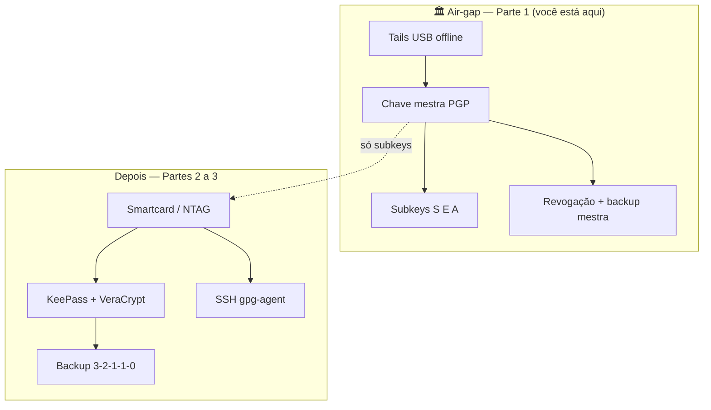

# 🎓 Zero Trust Core Expert – **VERSÃO 1.0 (canônica)**

**Air-Gap + NFC + OpenPGP + KeePassXC + VeraCrypt**

**Autor:** Projeto Colaborativo (VIPs-com)  
**GnuPG:** ~**2.4.x** (Ubuntu 24.04 / `apt`) — alinhado ao [OpenPGP-GPG do Zero ao Expert](https://github.com/VIPs-com/OpenPGP-GPG-do-Zero-ao-Expert)  
**Tails:** confira a última estável em [tails.net/latest](https://tails.net/latest/)  
**Metodologia:** 🔴🟡🟢🔵 + COMANDO A COMANDO + Checkpoints  
**Licença:** [CC BY-SA 4.0](https://creativecommons.org/licenses/by-sa/4.0/)  
**Status:** ✅ **VERSÃO 1.0 — Parte 1 (air-gap) publicada · Partes 2–4 em construção**

> 📌 **Nota editorial:** **`🎓 Zero-Trust-Core-Expert - Versão 1.0.md`** é o curso oficial deste repositório. O nome didático é **Zero Trust Core Expert**; o *filename* usa hífens para compatibilidade com Git e Windows.

> 📎 **Pré-requisito (trilha Expert):** domínio ou conclusão paralela de [OpenPGP-GPG do Zero ao Expert](https://github.com/VIPs-com/OpenPGP-GPG-do-Zero-ao-Expert) — este material **integra** PGP com cofres, NFC, VeraCrypt, backup off-site e operação diária; **não** repete do zero a teoria OpenPGP.

> 📎 **Repositório Git (opcional):** clone ou ZIP deste projeto — estudar só com este `.md` no computador continua válido.

* * *

## 📌 0. ONBOARDING (O QUE VOCÊ VÊ ANTES DE COMEÇAR)

* * *

### 🎓 CARTA DO PROFESSOR

Olá! Seja bem-vindo(a) ao **Zero Trust Core Expert**.

Este curso é para quem quer montar uma **fortaleza digital artesanal**: cofre de senhas local, token físico (NFC ou smartcard), identidade OpenPGP com chave mestra em air-gap, SSH sem expor segredos no disco, e backup **3-2-1-1-0** com disciplina operacional — **sem** depender de duas YubiKeys caras, mas **com** responsabilidade sua sobre cada camada.

**⚠️ AVISO:** tags NFC simples (NTAG) **não** são o mesmo que smartcard OpenPGP. Misturar os dois no mesmo plano sem entender os limites é o erro mais comum deste tipo de projeto.

**Regra de ouro:** pratique em laboratório (VM ou máquina secundária). A chave **mestra** PGP nasce **offline** no Tails — nunca no sistema de uso diário.

**Vamos construir sua soberania digital em camadas.** 🚀

* * *

### 🎯 RESULTADOS ESPERADOS

Ao final deste curso, você será capaz de:

| # | Resultado | Nível |
| --- | --- | :---: |
| 1 | Operar cofre KeePassXC com senha + keyfile e volume VeraCrypt | 🟢 |
| 2 | Diferenciar NTAG (keyfile) de smartcard OpenPGP (subkeys não exportáveis) | 🟢 |
| 3 | Gerar master + subkeys no Tails e transferir subkeys para token | 🔵 |
| 4 | Autenticar SSH via `gpg-agent` e subchave [A] | 🔵 |
| 5 | Implementar backup 3-2-1-1-0 com teste de restauração | 🔵 |
| 6 | Sincronizar blobs criptografados para off-site (VM + túnel) sem vazar segredos | 🔵 |
| 7 | Executar runbook de contingência (perda de cartão, revogação) | ⚫ |
| 8 | Automatizar health-check (UID, `card-status`, integridade de backup) | ⚫ |

> 📎 **Coluna «Nível»:** 🔴/🟡/🟢/🔵 = legenda do curso (abaixo). **⚫** = expert+ / longo prazo.

* * *

### 👤 PERFIL DO ALUNO & PRÉ-REQUISITOS

**Público-alvo:**

* Quem já estuda ou concluiu fundamentos GPG/OpenPGP
* Entusiastas de privacidade, SysAdmins e desenvolvedores
* Quem quer integrar senhas, tokens NFC e servidores próprios

**Pré-requisitos:**

* **Mínimo:** ler a [Carta](#-carta-do-professor) e a [Legenda de cores](#-legenda-de-cores-guia-visual)
* **Recomendado:** curso [OpenPGP-GPG do Zero ao Expert](https://github.com/VIPs-com/OpenPGP-GPG-do-Zero-ao-Expert) (Módulos 0–3 no mínimo)
* **Hardware:** pendrive para Tails; leitor NFC USB ou celular com NFC; smartcard OpenPGP **ou** tags NTAG para keyfile (papéis diferentes)

* * *

### 🛠️ CHECKLIST DE FERRAMENTAS NECESSÁRIAS

| Ferramenta | Onde obter | Para quê |
| --- | --- | --- |
| **KeePassXC** | [keepassxc.org](https://keepassxc.org/) | Cofre de senhas `.kdbx` |
| **VeraCrypt** | [veracrypt.fr](https://www.veracrypt.fr/) | Volume para cofre e backups |
| **GnuPG** (`gnupg2`) | `apt` / [gnupg.org](https://www.gnupg.org/) | OpenPGP + agente SSH |
| **pcscd** + leitor | `apt install pcscd` + USB NFC/CCID | Smartcard OpenPGP |
| **Tails** (última estável) | [tails.net/latest](https://tails.net/latest/) | Master key offline |
| **OpenKeychain** (Android) | F-Droid / APK offline | Backup móvel / NFC |
| **WireGuard** (opc.) | [wireguard.com](https://www.wireguard.com/) | Túnel para backup off-site |

> 📎 **NTAG vs OpenPGP:** tag NTAG = **keyfile** KeePass (clonável com acesso físico). **Smartcard OpenPGP** = subkeys [S][E][A] no token (não exportáveis). Não use o mesmo rótulo “NFC” para os dois.

* * *

### 🎯 ESCOLHA SEU CAMINHO

```
┌─────────────────────────────────────────────────────────────────────────────┐
│                                                                             │
│   🟢 MODO TURBO (2–3 semanas · ~8–12 h)                                     │
│   ─────────────────────────────────────                                     │
│   • KeePassXC + VeraCrypt + keyfile em NTAG (3 cartões)                     │
│   • Backup local + HD externo                                               │
│   • Sem Tails / sem VM off-site / sem PQC                                   │
│   • Ideal para: começar cofre forte antes do token OpenPGP                  │
│                                                                             │
│   🔵 MODO EXPERT (6–8 semanas · ~25–35 h)                                   │
│   ─────────────────────────────────────                                     │
│   • Tudo do Turbo +                                                          │
│   • Master no Tails + subkeys no smartcard                                  │
│   • SSH via gpg-agent · backup 3-2-1-1-0 · VM + túnel                         │
│   • Automação, health-check, contingência, threat modeling                  │
│   • Ideal para: soberania digital completa (este curso na íntegra)          │
│                                                                             │
│   👀 MODO CURIOSO                                                           │
│   ───────────────                                                           │
│   • Onboarding + arquitetura + mapa visual — sem obrigação de checkpoints    │
│                                                                             │
└─────────────────────────────────────────────────────────────────────────────┘
```

* * *

### 🚨 20 MANDAMENTOS DA CRIPTOGRAFIA ARTESANAL FORTE

*(Tabela completa — em construção na v1.0; resumo abaixo.)*

| # | Mandamento | Categoria |
| --- | --- | --- |
| 1 | A chave mestra PGP nunca nasce no sistema online | Air-gap |
| 2 | NTAG ≠ YubiKey ≠ smartcard OpenPGP — não confunda | Hardware |
| 3 | Três cartões idênticos para keyfile; nunca só um NTAG | KeePass |
| 4 | VM off-site guarda só blobs já criptografados | Backup |
| 5 | Backup sem teste de restore mensal = inexistente | Operação |

> 📎 Lista completa (20 itens) será publicada nesta seção antes do release v1.0 final.

* * *

### 📖 GLOSSÁRIO RÁPIDO (1 MINUTO)

| Termo | Significado |
| --- | --- |
| **Zero Trust Core** | Ecossistema pessoal em camadas (cofre + token + PGP + SSH + backup) |
| **NTAG** | Tag NFC simples; boa para keyfile; **clonável** |
| **OpenPGP card** | Smartcard com subkeys não exportáveis |
| **Keyfile** | Arquivo extra exigido pelo KeePassXC além da senha |
| **3-2-1-1-0** | 3 cópias · 2 mídias · 1 off-site · 1 imutável offline · 0 erros (teste) |
| **Air-gap** | Ambiente sem rede (Tails / celular offline) |

* * *

### 🗺️ COMO USAR ESTE CURSO

1. Leia o **Onboarding** (seção 0).
2. Consulte o **Mapa visual** (seção 1) só para orientação — o conteúdo oficial são as seções **2 em diante** com COMANDOs.
3. Siga a ordem: Parte 1 → 2 → 3 → 4; não pule Tails antes de SSH com subkey [A].
4. Marque cada **CHECKPOINT** antes de avançar.

* * *

### ⏳ LINHA DO TEMPO EVOLUTIVA (2023–2035)

| Período | Características | Status |
| --- | --- | --- |
| **2023–2024** | Senhas em nuvem; pouca integração token + cofre | 🟡 Legado |
| **2025–2026** | ECC + cofres locais + NFC caseiro documentado | 🟢 **ATUAL** |
| **2027–2028** | PQC híbrido em OpenPGP; Sequoia em CI | ⚠️ Preparação |
| **2029–2035** | Migração ML-KEM / rotação de identidade | 🔮 Futuro |

* * *

## 🗺️ 1. MAPA DO CURSO (VISÃO GERAL)

> ⚠️ **Somente consulta:** esta árvore é um **índice visual** da jornada. **Não** define o escopo editorial vinculante do projeto — o material oficial está nas seções **2–6** abaixo (títulos `##` / `###` / **COMANDO**). Não crie links de desenvolvimento apontando só para itens deste bloco ASCII.

```
📚 Zero Trust Core Expert – VERSÃO 1.0 (canônica)
│
├── 📌 0. ONBOARDING
│   ├── 🎓 Carta do Professor
│   ├── 🎯 Resultados Esperados
│   ├── 👤 Perfil do Aluno
│   ├── 🛠️ Checklist de Ferramentas
│   ├── 🎯 Escolha seu Caminho (Turbo × Expert × Curioso)
│   ├── 🚨 20 Mandamentos (artesanal forte)
│   ├── 📖 Glossário Rápido
│   ├── 🗺️ Como Usar Este Curso
│   └── ⏳ Linha do tempo (2023–2035)
│
├── 🔴 2. PARTE 1: PRIMEIROS PASSOS (Semana 1 · 2–4 h)
│   ├── 🔴🟡🟢🔵 Legenda de Cores
│   ├── 📋 Módulo 0: Preparação do Ambiente
│   ├── 📋 Módulo 1: Primeira Chave no Air-Gap (Tails)
│   └── 🏁 CHECKPOINT 1
│
├── 🟡 3. PARTE 2: HARDWARE E INTEGRAÇÃO (Semana 2 · 5–7 h)
│   ├── 📋 Módulo 2A: OpenPGP smartcard (keytocard)
│   ├── 📋 Módulo 2B: NTAG + keyfile KeePass
│   ├── 📋 Módulo 3: Cofres + GPG Agent + SSH
│   └── 🏁 CHECKPOINT 2
│
├── 🔵 4. PARTE 3: RESILIÊNCIA E OPERAÇÃO (Semana 3 · 6–8 h)
│   ├── 📋 Módulo 4: Backup 3-2-1-1-0
│   ├── 📋 Módulo 4.2: VM off-site + túnel
│   ├── 📋 Módulo 5: Automação e health-check
│   ├── 📋 Módulo 6: Contingência
│   └── 🏁 CHECKPOINT 3
│
├── ⚫ 5. PARTE 4: EXPERT & FUTURO (Semana 4+)
│   ├── 📋 Módulo 7: Threat modeling
│   ├── 📋 Módulo 8: Pós-quântico
│   ├── 📋 Módulo 9: Manutenção
│   └── 🎓 Exame final
│
└── 📚 6. APÊNDICES
    ├── Checklists · Glossário completo
    ├── Apêndice A–E (erros, scripts, hardware BR, multiplataforma, PQC)
    └── 🏁 Conclusão — Soberania digital
```

> 📌 **Sincronização:** se um COMANDO mudar no corpo do curso, atualize esta árvore **depois** — ou navegue sempre pelos títulos **COMANDO** nas Partes 2–5.

* * *

## 🔴🟡🟢🔵 LEGENDA DE CORES (GUIA VISUAL)

| Cor | Significado | Quando usar |
| :---: | --- | --- |
| 🔴 | **OBSOLETO / PERIGOSO** | Não use (ex.: master key online, keyfile só em nuvem) |
| 🟡 | **FUNCIONA** | Válido, mas verboso ou frágil |
| 🟢 | **PADRÃO ATUAL** | Recomendado no dia a dia |
| 🔵 | **EXPERT** | Air-gap, token, VM off-site, automação |
| ⚫ | **HORIZONTE** | PQC, migração longa — planejamento |

> 💰 **DICA:** guarde esta legenda; ela aparece em todo o curso.

* * *

## 🔴 2. PARTE 1: PRIMEIROS PASSOS (Semana 1)

> ⏱️ **Tempo estimado:** 2–4 horas (trilha **Expert**) · Turbo pode pular esta parte e voltar depois do [OpenPGP-GPG do Zero ao Expert](https://github.com/VIPs-com/OpenPGP-GPG-do-Zero-ao-Expert)  
> 🎯 **Objetivo:** sala-cofre **air-gapped** (Tails), identidade PGP com master offline, subkeys [S][E][A], revogação guardada — **sem** importar a master no PC de uso diário

No [mapa visual](#-1-mapa-do-curso-visão-geral), você está em **Módulo 0 → Módulo 1 → CHECKPOINT 1**. A Parte 2 (tokens, KeePass, SSH) só faz sentido **depois** deste eixo.

* * *

### 🔎 OBSERVAÇÕES IMPORTANTES (leia antes dos COMANDOs)

Este curso monta um ecossistema **artesanal, mas robusto**: você controla cada camada; não compra uma “caixa preta” — assume **disciplina operacional**.

| Pilar | O que é | Dica para o aluno |
| --- | --- | --- |
| **KeePassXC + VeraCrypt** | Cofre de senhas local + volume extra | Base do dia a dia; vem na **Parte 2** (Módulo 3) |
| **Token físico** | Fator “algo que você tem” | **NTAG** = keyfile KeePass (clonável). **Smartcard OpenPGP** = subkeys PGP/SSH (forte) |
| **GnuPG + OpenPGP** | Identidade criptográfica | Ganho real: chave privada de uso no **token**, PIN obrigatório |
| **SSH + gpg-agent** | Login em servidores sem senha no disco | Subchave **[A]**; **Parte 2**, Módulo 3.2 |
| **Backup 3-2-1-1-0** | Resiliência + teste de restore | **Parte 3**; VM só com blobs já criptografados |

👉 Esse plano aproxima a **filosofia** de uma YubiKey (defesa em profundidade, token físico) **sem depender** do firmware dela — em troca, você configura, documenta e testa.

> 📎 **Não confunda com a Parte 2:** scripts que “só abrem KeePass se o NFC estiver presente”, montam VeraCrypt e checam UID do cartão são **automação** (Módulo 5). Aqui você constrói a **raiz de confiança** offline.



* * *

### 📋 MÓDULO 0: PREPARAÇÃO DO AMBIENTE

> 🎯 **Objetivo:** laboratório Linux com GnuPG, `pcscd` e identidade **descartável** — **nunca** gere aqui a master real do seu projeto de produção

> 💡 Se ainda não domina terminal e `apt`, faça os **COMANDO 0.1–0.4** do [OpenPGP-GPG do Zero ao Expert — Módulo 0](https://github.com/VIPs-com/OpenPGP-GPG-do-Zero-ao-Expert). Abaixo está o **mínimo** para seguir o Zero Trust Core.

* * *

#### ▸ COMANDO 0.1: Terminal e pasta de trabalho

```sh
echo "Laboratório Zero Trust Core OK"
mkdir -p ~/zero-trust-lab && cd ~/zero-trust-lab
pwd
```

* * *

#### ▸ COMANDO 0.2–0.3: GnuPG e ferramentas do curso

```sh
sudo apt update
sudo apt install -y gnupg2 pcscd scdaemon libccid rng-tools age wget curl
gpg --version
```

**Saída esperada:** série **2.4.x** no Ubuntu 24.04 LTS (adequado a este curso).

* * *

#### ▸ COMANDO 0.4: Serviço de cartão (para a Parte 2)

```sh
sudo systemctl enable --now pcscd
gpg --card-status 2>/dev/null || echo "Sem cartão ainda — normal no Módulo 0"
```

* * *

#### ▸ COMANDO 0.5: Pré-vôo do Tails (no host, com internet)

1. Abra [tails.net/latest](https://tails.net/latest/) e anote a **versão estável** publicada hoje.  
2. Baixe a **imagem USB** (`.img`) e os arquivos de verificação da [página oficial de download](https://tails.net/install/download/index.en.html).  
3. Tenha um pendrive dedicado (≥ 8 GB) e confirme o dispositivo com `lsblk` **antes** de gravar.

> 🔴 O comando `dd` grava no **disco inteiro** (`/dev/sdX`), não na partição. Errar a letra = destruir o HD errado.

**Detalhamento completo (verificação OpenPGP + `dd`):** [OpenPGP-GPG — COMANDO 6.1](https://github.com/VIPs-com/OpenPGP-GPG-do-Zero-ao-Expert) (mesmo fluxo; ajuste `TAILS_VER` ao site).

* * *

#### ▸ COMANDO 0.6: Identidade de laboratório no PC (não é a master!)

No PC **online**, crie uma chave **só para exercícios** — distinta da identidade que nascerá no Tails:

```sh
gpg --quick-generate-key "Lab Zero Trust <lab@example.invalid>" ed25519 default 30d
gpg --list-secret-keys "Lab Zero Trust"
```

| 🔴 Nunca | 🟢 Sempre |
| --- | --- |
| `gpg --full-generate-key` no PC como “master de produção” | Master de produção **somente** no Tails offline |
| Reutilizar e-mail/nome real da master no lab | UID fictício no laboratório |

* * *

#### ▸ COMANDO 0.7–0.8: Baseline `gpg.conf` e `gpg-agent` (PC lab)

Crie ou edite `~/.gnupg/gpg.conf` (ajuste conforme sua política):

```ini
default-keyring gpg-ring.kbx
keyid-format 0xlong
with-fingerprint
use-agent
```

Em `~/.gnupg/gpg-agent.conf` (SSH será usado na Parte 2):

```ini
default-cache-ttl 600
max-cache-ttl 7200
enable-ssh-support
```

Recarregue o agente:

```sh
gpgconf --kill gpg-agent
gpgconf --launch gpg-agent
export GPG_TTY=$(tty)
```

Documentação oficial: [GnuPG Agent Examples](https://www.gnupg.org/documentation/manuals/gnupg/Agent-Examples.html).

* * *

#### ▸ COMANDO 0.9: Celular antigo offline (opcional · 🟡)

Alternativa **mais barata**, **menos forte** que Tails para a master:

1. Factory reset; **sem** conta Google; SIM removido.  
2. Modo avião permanente; Wi‑Fi e Bluetooth desligados.  
3. Instale **OpenKeychain** via APK copiado por cabo USB ([openkeychain.org](https://www.openkeychain.org/)).  
4. Gere chave com passphrase **muito forte** — sem smartcard, o segredo fica no arquivo do app.

> 🟢 **Trilha Expert:** use Tails no Módulo 1. Celular = cofre de bolso ou backup, não substituto obrigatório.

* * *

### 📋 MÓDULO 1: SUA PRIMEIRA CHAVE NO AIR-GAP (TAILS)

> 🎯 **Objetivo:** você é a **autoridade certificadora raiz** — master [C] offline, subkeys [S][E][A], revogação e backup em mídia separada

#### 🏛️ O papel do air-gap

A **chave mestra** nasce em um ambiente que **nunca** viu a internet e **não** volta ao PC de uso diário. Ela só **certifica** e **revoga** subchaves. As subchaves são as “funcionárias” do dia a dia (assinar, cifrar, SSH).

Isso resolve o drama das “duas YubiKeys”: você pode ter **vários smartcards** com as **mesmas subkeys** (após `keytocard` na Parte 2) e backup da master em cofre offline — sem pagar duas chaves proprietárias.

> 📎 **Correção importante:** `keytocard` exige **smartcard OpenPGP** (Nitrokey, Yubikey OpenPGP, etc.). **Tags NTAG** servem ao KeePass (keyfile), não substituem applet PGP — isso é **Módulo 2B**, não este.

* * *

#### Matriz rápida: Tails em laboratório × produção

| Cenário | Internet na sessão da master | Onde fica a master depois |
| --- | --- | --- |
| **Laboratório** | Desligada ao gerar/exportar | Pendrive criptografado ou persistência Tails **só no lab** |
| **Produção** | **Sempre desligada** | Segundo pendrive / volume LUKS; **nunca** no PC online |

* * *

#### ▸ COMANDO 1.1: Gravar e iniciar o Tails

Siga o [COMANDO 6.1 do OpenPGP-GPG](https://github.com/VIPs-com/OpenPGP-GPG-do-Zero-ao-Expert) no host (download, `gpg --verify`, `dd`).

No boot do Tails:

1. Escolha **Português** (ou seu idioma).  
2. Em *Configuração adicional*, habilite **Armazenamento persistente** (mín. 4 GB) se quiser guardar exports entre reboots no **lab**.  
3. Na persistência, marque **GnuPG** (e só o necessário).

**Antes de gerar a master:** desligue Wi‑Fi (interruptor físico se existir) e confirme que não há cabo de rede.

* * *

#### ▸ COMANDO 1.2: Gerar master + subkeys (OFFLINE)

No terminal do Tails, com **internet desligada**:

```sh
# Ajuste o UID — use identidade real só se este for seu ritual de PRODUÇÃO offline
UID_MASTER="Sua Identidade (MASTER OFFLINE) <voce@dominio.invalid>"
export GNUPGHOME=/home/amnesia/.gnupg

# Master: apenas Certificação (ed25519)
gpg --quick-generate-key "$UID_MASTER" ed25519 cert 3y

# Subchaves (no mesmo Tails, ainda offline)
gpg --quick-add-key "$UID_MASTER" ed25519 sign 2y
gpg --quick-add-key "$UID_MASTER" cv25519 encrypt 2y
gpg --quick-add-key "$UID_MASTER" ed25519 auth 2y

# Confira hierarquia
gpg --list-secret-keys --keyid-format long "$UID_MASTER"
```

**O que você deve ver:** uma linha `sec` (master) e três `ssb` com `[S]`, `[E]`, `[A]`.

> 💡 **Dica:** anote o **fingerprint** da master em **papel**, não em nuvem.

* * *

#### ▸ COMANDO 1.3: Certificado de revogação (no mesmo dia)

```sh
FP_MASTER=$(gpg --list-secret-keys --with-colons "$UID_MASTER" | awk -F: '/^fpr:/ {print $10; exit}')
gpg --output ~/revogacao.asc --gen-revoke "$FP_MASTER"
```

Guarde `revogacao.asc` em:

- Pendrive **criptografado** (recomendado), e  
- Cópia em local físico separado (envelope lacrado / cofre).

* * *

#### ▸ COMANDO 1.4: Backup da master (mídia offline dedicada)

```sh
gpg --export-secret-keys --armor "$FP_MASTER" > ~/backup-master-$(date +%Y%m%d).asc
sync
```

| 🔴 Nunca | 🟢 Faça |
| --- | --- |
| Enviar `backup-master-*.asc` por e-mail, WhatsApp ou nuvem | Criptografar com `age` ou VeraCrypt **antes** de guardar cópia extra |
| Importar a master no notebook de uso diário | Importar **só subkeys** no PC (próximo comando) |

Exemplo com `age` (no Tails, se `age` estiver instalado):

```sh
age -p -o ~/backup-master-$(date +%Y%m%d).asc.age ~/backup-master-$(date +%Y%m%d).asc
shred -u ~/backup-master-$(date +%Y%m%d).asc
```

* * *

#### ▸ COMANDO 1.5: Exportar material para o PC de trabalho (sem a master)

```sh
gpg --export --armor "$FP_MASTER" > ~/public-key.asc
gpg --export-secret-subkeys --armor "$FP_MASTER" > ~/subkeys-for-lab.asc
```

Copie para um pendrive **apenas**:

- `public-key.asc`  
- `subkeys-for-lab.asc` (só para laboratório / até ir para o smartcard)  
- `revogacao.asc` (criptografado)

**Não copie** `backup-master-*.asc` para o mesmo pendrive que você usa no PC online, se puder evitar — use mídia separada.

No PC lab (Módulo 0), importe **sem** a master:

```sh
gpg --import ~/public-key.asc
gpg --import ~/subkeys-for-lab.asc
gpg --list-secret-keys
```

Confirme: aparecem subkeys; a master **não** deve estar disponível para assinar no PC (`sec#` ou ausência de `sec` com capacidade de certificação local).

* * *

#### ▸ COMANDO 1.6: Checklist antes de desligar o Tails

```sh
gpg -K --with-subkey-fingerprints --keyid-format long
ls -lh ~/*.asc 2>/dev/null || true
sync
```

- [ ] Internet esteve **desligada** durante geração e export  
- [ ] Revogação criada e copiada  
- [ ] Backup da master em mídia **separada** do pendrive “diário”  
- [ ] Fingerprint anotado em papel  

Desligue o Tails. A sessão amnésica apaga o RAM; o que importa está nos arquivos que você copiou.

* * *

#### 🔗 Próximo passo no mapa do curso

| Feito na Parte 1 | Vem na Parte 2 |
| --- | --- |
| Master + subkeys + revogação | **Módulo 2A:** `keytocard` → smartcard OpenPGP |
| — | **Módulo 2B:** keyfile em NTAG para KeePassXC |
| — | **Módulo 3:** VeraCrypt + KeePass + SSH |

> 📎 **Automação (UID NFC, mount VeraCrypt, KeePass condicional):** Módulo 5 — não pule para scripts antes de ter token e cofre configurados.

* * *

## 🏁 CHECKPOINT 1: IDENTIDADE AIR-GAPPED

Marque **todos** antes de abrir a Parte 2:

- [ ] Pendrive Tails gravado e verificado ([tails.net/latest](https://tails.net/latest/))
- [ ] Master [C] gerada **somente** no Tails com rede desligada
- [ ] Subkeys [S], [E], [A] existem e foram listadas com `gpg -K`
- [ ] `revogacao.asc` guardado em **dois** contextos (mídia + papel/metal com fingerprint)
- [ ] Backup da master em mídia offline dedicada (idealmente criptografado com `age`/VeraCrypt)
- [ ] PC de uso diário importou **apenas** chave pública + subkeys — **sem** master
- [ ] Você consegue explicar a diferença: **NTAG (keyfile)** × **smartcard (subkeys)** × **master (só air-gap)**

**Rubrica mínima:** se alguém roubar o notebook hoje, não deve obter a capacidade de **revogar ou recertificar** sua identidade — só operar subkeys até você revogar no Tails.

* * *

*Continua em: **Parte 2 — Hardware e integração** (em construção). Consulte o [mapa visual](#-1-mapa-do-curso-visão-geral) para a ordem completa.*
